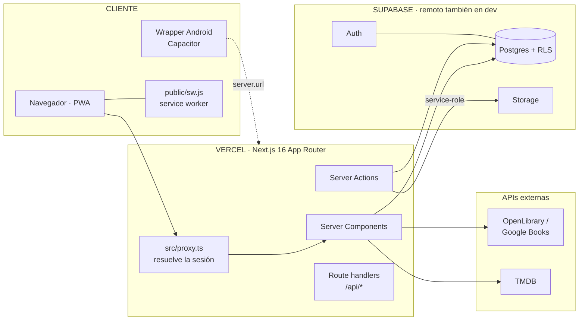
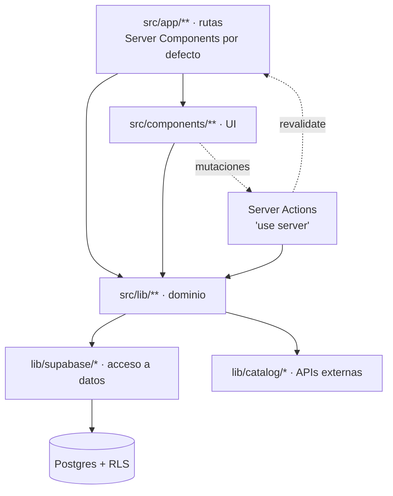
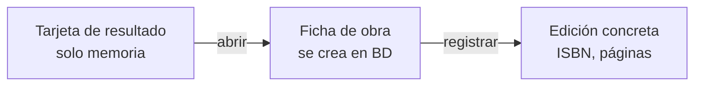

# Arquitectura

> **[Canónico · verificado contra código el 2026-08-19]**

> Cómo encaja Biblioshare. Verificado contra el código el **2026-08-19**
> (1007 ficheros TS/TSX, ~113.000 líneas, 41 rutas, 186 migraciones).
>
> Para el esquema de BD, el canónico es [modelo de datos](./requirements/data-model.md).
> Antes de depurar algo que no cuadra, [Trampas](./TRAMPAS.md).

## 1. Vista de sistema

Cuatro clientes de Supabase, y usar el que no toca es un error habitual:

| Fichero | Contexto | Nota |
|---|---|---|
| `lib/supabase/server.ts` | Server Components y Actions | El normal |
| `lib/supabase/client.ts` | Componentes de cliente | Sujeto a RLS del usuario |
| `lib/supabase/proxy.ts` | `src/proxy.ts` | Solo resuelve la sesión |
| `lib/supabase/service-role.ts` | **Salta RLS** | Solo server. Necesario para Storage: **no valida JWT ES256** |

## 2. Mapa de rutas

```mermaid
graph TD
    root["/"] --> home["(home) · feed + stats"]
    root --> auth["(auth): login · signup · recuperar"]

    root --> col["/coleccion"]
    col --> colc["/coleccion/c/[id]"]
    col -. subpestañas .-> colt["Colecciones · Todo · Sagas · Colas"]

    root --> bus["/buscar"] --> man["/buscar/manual"]

    root --> fichas["Fichas de obra"]
    fichas --> lib["/libro/[id]"]
    fichas --> pel["/pelicula/[id]"]
    fichas --> ser["/serie/[id]"]
    fichas -. pestañas .-> tabs["Info · Comunidad · Registro · Episodios"]

    root --> ses["/sesion/[passId]"]
    root --> per["/persona/[id]"]
    root --> gen["/genero/[slug]"]
    root --> est["/estadisticas"]
    root --> nts["/notas"]
    root --> post["/post/[id]"]

    root --> sg["/sagas"] --> sgn["/sagas/nueva"]
    sg --> sgd["/saga/[id]"]
    sgd --> sge["/saga/[id]/editar"]
    sgd --> sgm["/saga/[id]/mapa"] --> sgme["/mapa/editar"]
    sgd --> sgr["/rutas"] --> sgre["/rutas/[slug]/editar"]

    root --> cl["/clubes"] --> cld["/club/[slug]"]
    cld --> cla["/actividad/[id]"]
    cld --> cle["/evento/[id]"]
    cld --> clc["/calendario"]
    cld --> clm["/miembros"]

    root --> u["/u/[username]"]
    u --> seg["/seguidores · /siguiendo"]
    u -. "pestañas propias" .-> ut["Actividad · Estadísticas · Rincón"]

    root --> imp["/importar"] --> impp["/importar/pendientes"]
    root --> otras["/onboarding · /admin<br/>/cuenta/contrasena · /offline"]
```

Rutas que no se explican solas:

- **`/@modal/(.)sesion/[passId]`** — slot paralelo en el layout raíz: ruta interceptada que
  abre el registro de sesión como modal sobre la página actual; la URL `/sesion/[passId]`
  sigue funcionando en directo (recarga, enlace compartido).
- **`/genero/[slug]`** — listado de obras por género.
- **`/notas`** — todas las notas y citas del usuario, con filtros.
- **`/post/[id]`** — permalink de una publicación del feed (para compartir/notificaciones).
- **`/importar/pendientes`** — filas del CSV que no casaron con el catálogo, para resolver a mano.
- **`/saga/[id]/mapa`** (+ `/mapa/editar`) — mapa visual de la saga y su editor (`collaborator+`).
- **`/saga/[id]/rutas`** (+ `/rutas/[slug]/editar`) — rutas de lectura alternativas de una saga.
- **`/club/[slug]/evento/[id]`** — ficha de un evento del club; **`/calendario`**, su vista mensual.
- **`/persona/[id]`** — ficha de autor/director/reparto.
- **`/estadisticas`** — estadísticas propias (solo-dueño); **`/cuenta/contrasena`**, cambio de
  contraseña; **`/admin`**, panel de administración (`admin`).

**`/estadisticas` existe** (ruta propia, solo-dueño). Algún doc antiguo dice que se eliminó;
es falso.

Route handlers: `/api/export`, `/api/month-calendar`, `/api/og/nota/[id]` (genera la tarjeta
PNG de una cita vía `next/og`), `/api/cron/event-reminders` (cron de Vercel: recordatorios de
eventos de club), `/api/native/session` (puente de sesión para el wrapper Capacitor),
`/auth/confirm`, `/icon-192`, `/badge-96`.

## 3. Capas

Regla de oro del proyecto: **los componentes derivan de props y reconcilian con
`router.refresh()`**; no duplican estado del servidor. Romperla es la causa nº 1 de "no se
actualiza sin recargar" — ver [Trampas §2](./TRAMPAS.md).

### Mapa de módulos (`src/lib`, por tamaño)

| Módulo | Ficheros | Qué resuelve |
|---|---|---|
| `sagas` | 81 | Jerarquía, grafo, orden principal, rutas de lectura, mapa |
| `clubs` | 69 | Clubes, actividades y sus tipos, eventos, calendario, directorio |
| `social` | 67 | Feed, follows, reacciones, notificaciones, posts |
| `catalog` | 50 | Búsqueda, TMDB/OpenLibrary, tipos, acentos por tipo |
| `stats` | 46 | Métricas, rachas, distribuciones, bloque de hoy |
| `people` | 23 | Fichas de persona, créditos |
| `library` | 21 | Biblioteca, estados, hidratación de ítems |
| `push` | 19 | Notificaciones push (web + wrapper) |
| `sessions` | 17 | Sesiones de lectura/visionado |
| `import` | 15 | Importación CSV y pendientes |
| `notes`, `editions`, `passes`, `challenges`, `pace`, `celebrations`, `onboarding`, `series`, `profile`, `reactivity`, `native`, `community`, `auth`, `rating`, `ui`, `image`, `images`, `async`, `rincon`, `pwa`, `storage` | 1–9 | Un dominio cada uno |

El mapa fino de esta sección (nodos por capa, dependencias, flujos end-to-end con el fichero
de cada paso e invariantes) vive en [`docs/architecture/graph.json`](./architecture/graph.json)
— es **derivado** del código; cómo consultarlo y regenerarlo, en
[`docs/architecture/README.md`](./architecture/README.md).

## 4. Los cuatro patrones que hay que conocer

### 4.1 Cache-as-you-go

El catálogo no se precarga: se rellena la primera vez que alguien lo abre. La ficha de una
obra nueva dispara la hidratación desde TMDB/OpenLibrary y la guarda. Aplica a `books`,
`movies`, `series`, `credits`, `series_episodes`.

### 4.2 Escalera de hidratación (3 peldaños)

**La búsqueda NO escribe en BD.** Por eso la tarjeta de resultado no pinta editorial ni
páginas: son de una tirada concreta, no de la obra. Es deliberado — antes se mostraba una
mediana que no correspondía a ningún libro real.

### 4.3 El pase como hub

Toda la actividad del usuario cuelga de `passes`, no de `library_entries` (congelada). Un
pase = una lectura/visionado concreto; releer abre uno nuevo. De él cuelgan sesiones, notas
y episodios vistos. **Cualquier feature nueva que necesite estado del usuario lo deriva de
`passes`.**

### 4.4 Shell instantáneo con Suspense

Las páginas pintan su shell y hacen streaming de cada sección con `<Suspense>`. Los
skeletons son client-safe y el anuncio i18n va aparte.

⚠️ **Un `loading.tsx` mata el 404 real** de esa ruta. Solo va en rutas que **no** llaman a
`notFound()`. Detalle en [Trampas §4](./TRAMPAS.md).

## 5. Transversales

- **i18n**: `next-intl`, un solo locale (`messages/es.json`). Las cadenas se componen en el
  servidor: **una función `t()` no cruza a un componente de cliente**.
- **Tema**: claro/oscuro por clase `.dark` + `theme-script.tsx` (evita el flash).
- **PWA**: `public/sw.js` + manifiesto + `/offline`.
- **Roles**: `user | collaborator | admin`. Contribuir al catálogo (alta manual, editar
  ficha, curar sagas) es `collaborator+`.
- **Acentos por tipo**: `lib/catalog/media-accent.ts` — libro `#a15a34`, película `#3f6b6e`,
  serie `#7a5676`. Las clases se escriben **enteras**, nunca interpoladas, para que el JIT de
  Tailwind las vea.
  `.text` NO apunta a esos tres sino a su par de tinta (`--type-*-ink`): el color puro es de
  gráfico (3:1) y como texto se quedaba en 3,64:1 sobre su propio tinte. Ver `DESIGN.md`.

### Mascota RPG (verificado el 2026-09-09)

`src/app/mascota/page.tsx` lee datos de sesión bajo Suspense y entrega snapshot,
estado compartido de aventuras y la madriguera como slot servidor a `PetGame`.
`game-navigation.ts` valida `?view` y los destinos de retorno; `PetReturnTracker`
recuerda la última ruta ajena al juego por usuario. El cambio de sección usa el
historial nativo y mantiene montados los dos paneles de combate. `active=false`
pausa; `pet:before-leave` guarda o permite advertir de un fallo de almacenamiento.
Los checkpoints están separados por usuario y modo. `resumeAdventure` recupera
una intención existente con autenticación, sin crear otra. El puntero de un
resultado resuelto se retira solo cuando se muestra en un panel y pestaña visibles.
El tema de bosque queda encapsulado en CSS modules. Sin cambios de esquema ni
caché compartida de datos de sesión.

## 6. Verificación

Vitest para lógica pura (183 ficheros de test), Playwright para flujos (83 specs).
Detalle en [TESTING.md](./TESTING.md).

⚠️ En la máquina de desarrollo actual (8 GB) **la suite e2e completa de una tacada no es
señal fiable**: el dev server muere y los workers caen con errores que parecen bugs de
producto. Trocearla en grupos de 2–3 specs. Ver [Trampas §5](./TRAMPAS.md).
