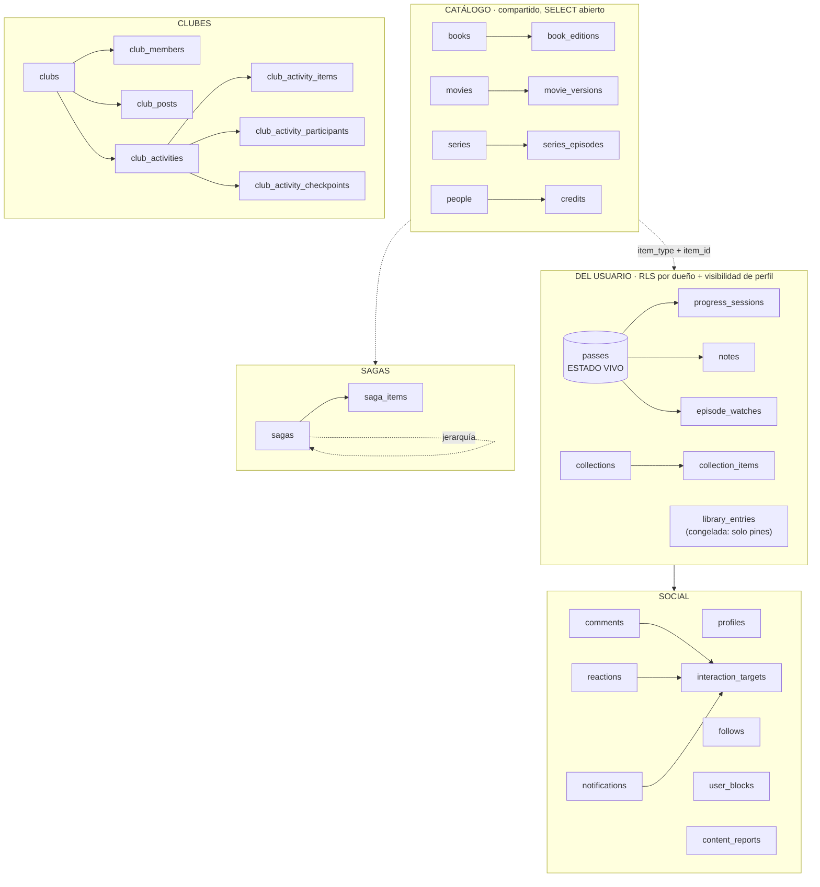

# Modelo de datos

> **[Canónico · verificado contra prod el 2026-07-21; delta de eventos de club verificado el 2026-07-22; itinerarios de sagas (§7.2) verificados en dev y prod el 2026-07-22; rol narrativo de sagas (§7.3) verificado en dev y prod el 2026-07-23; colocación/opcionalidad de sagas (§7.4) verificada en dev y **en prod** el 2026-07-26; editor único de secuencia, fase 2a (§7.5) verificado en prod el 2026-07-26; ventanas de colocación, fase 2b (§7.6) — **corregido aquí, 2026-07-27**: esta cabecera llevaba "solo en dev, prod pendiente", y ya no es cierto — reverificado hoy contra `pg_proc`/`to_regclass` de PROD: `saga_placement_windows` existe y `save_saga_sequence` tiene una única firma (la de cinco argumentos), coherente con el ANEXO 2026-07-27 de `schema-baseline.sql` —; metadatos del tándem, fase 2 del timeline (§7.8), aplicados en dev **y en prod** el 2026-07-28 — incluida la retirada del envoltorio de seis argumentos: `pg_proc` devuelve UNA sola firma en los dos entornos—; motivo de la ventana, fase 3 del timeline (§7.9), aplicado en dev **y en prod** el 2026-07-28; **opcionales saltables, fase 4 del timeline (§7.10), aplicadas en dev **y en prod** el 2026-07-28 — verificadas contra `to_regclass`, `pg_policies` y `information_schema.columns`; ningún RPC cambió y `progress.ts` no se tocó**; **roles, fase 5 del timeline (§7.3), aplicados en dev **y en prod** el 2026-07-28 — las dos migraciones, la segunda DESPUÉS del despliegue a propósito (#237, cerrada); verificado contra `pg_enum`/`pg_attribute`: seis valores, sin `paralela`, sin tipo huérfano y con las 8 filas con rol intactas; ningún RPC cambió y `progress.ts` tampoco** —sin backfill: las 4 ventanas de prod siguen con `motivo IS NULL`, y `save_saga_sequence` NO cambió de firma—; fase 3 del orden unificado —mapa derivado, migración de grafos a itinerarios y retirada de
`saga_nodes`/`saga_edges`/`save_saga_graph` (§7.7)— **corregido aquí, 2026-07-27**: esta cabecera
llevaba "solo en dev, prod pendiente" para las dos primeras migraciones y daba el `DROP` por no
escrito; ya no es cierto — las tres migraciones de la fase están aplicadas y verificadas en dev y en
prod el 2026-07-27, fase cerrada, contra los objetos reales (`pg_type`, `pg_constraint`,
`pg_policies`, `pg_proc`, `to_regclass`), nunca contra `list_migrations`; **fase 4 del orden
unificado —`saga_routes.is_reading_order` (§7.2) y el borrado explícito de ventanas por lista de
sujetos (§7.6)— verificada en dev y **en prod** el 2026-07-28 contra `information_schema.columns`,
`pg_indexes` y `pg_proc`: en los dos entornos existen la columna (`boolean NO false`) y su unique
parcial `saga_routes_reading_order_key` (`(saga_id) WHERE is_reading_order`). El «sin backfill» se
comprobó en el DATO, no solo en el DDL: al migrar, prod tenía 3 itinerarios y **0 con
`is_reading_order`**, y sus 2 ventanas seguían diciendo exactamente lo mismo que antes.
**Fase 4 CERRADA el 2026-07-28**: retirada también la sobrecarga de cinco argumentos
(`20260731_drop_save_saga_sequence_v5.sql`), aplicada DESPUÉS de confirmar que el bundle nuevo
servía en producción; `pg_proc` devuelve **una sola** firma de `save_saga_sequence`, la de seis
argumentos, en dev y en prod; **tanda de seguridad del 2026-07-29 (issues #130, #176, #133)
aplicada y verificada en dev Y EN PROD** — cuatro migraciones (`20260808`…`20260811`), ninguna
toca datos: 55/55 funciones `SECURITY DEFINER` con `pg_temp` en el `search_path` (§8),
`save_saga_route` validando el subárbol en servidor (§7.2) y las RPCs de evento con longitudes,
defaults y errores snake_case (§6). Medido contra `pg_proc` en los dos entornos, no contra
`list_migrations`: mismo digest normalizado de las cinco funciones tocadas y cero ACL con
`anon`; `target_kind` ampliado con `pass`/`progress_session` para el feed agrupado de Inicio
(§5), aplicado y verificado en dev y en prod el 2026-07-29 (migraciones
`20260812_feed_targets_enum.sql` y `20260813_feed_targets_can_view.sql`); **lectura pública
de `notes` para el feed de tarjetas por tipo (§3) — corregido aquí, 2026-07-30**: la política
aditiva `"public notes select"` (`is_public = true and public.can_view_profile(user_id)`,
migración `20260814_notes_public_select.sql`) está aplicada y verificada **SOLO EN DEV**;
prod queda pendiente del merge de `feat/feed-tarjetas-por-tipo`; **normalización de géneros
del catálogo (§2), 2026-07-30**: índices GIN `{books,movies,series}_genres_gin`
(`20260815_genres_gin_indexes.sql`) y backfill de `movies`/`series` a labels canónicas
aplicados y verificados **en DEV y en PROD** el 2026-07-30 (GIN 3/3 contra `pg_indexes`;
backfill prod: movies `Suspense`→`Thriller`, series `Action & Adventure`/`Sci-Fi & Fantasy`
divididos con dedupe+cap5; filas solo-ruido `Kids`/`Reality`/`Talk` conservadas — issue #311);
`books` no necesita backfill (las labels ya coincidían); **fix del writer canónico de
notificaciones aplicado y verificado SOLO EN DEV el 2026-08-01**]**

> Parte de [Requisitos y alcance](../REQUIREMENTS.md). Sección §3.
> **Este es el documento canónico del esquema.** Verificado contra producción el
> **2026-07-29** (delta de `target_kind`/`can_view_target` del feed agrupado de Inicio;
> el resto del esquema sigue verificado el 2026-07-21): 42 tablas, todas con RLS activa.
> **Delta del 2026-07-30 (feed de tarjetas por tipo, §3): la política `"public notes
> select"` de `notes` está verificada solo en DEV**, contra `pg_policies` — prod queda
> pendiente del merge de `feat/feed-tarjetas-por-tipo`.
> **Delta del 2026-07-30 (normalización de géneros, §2): vocabulario canónico, índices
> GIN y backfill aplicados y verificados en DEV **y en PROD** el 2026-07-30 (PR #312).
> **Delta del 2026-07-30 (menciones `@usuario`, E5.K3, §9): valor `mentioned` del enum
> `notification_type` aplicado y verificado en DEV **y en PROD** contra `pg_enum` (sin
> tabla nueva — el texto crudo con `@usuario` es la fuente de verdad, ver
> `decisiones.md`). Al entrar esta mejora, las políticas RLS de `notifications` aún incluían
> `insert as actor` y no referenciaban `type`, por lo que `mentioned` quedó cubierto sin
> cambio específico. **Social fase 0 supersede esa puerta solo en dev**: ya no existe ninguna
> política INSERT y `anon`/`authenticated` no tienen privilegio de inserción; el writer de
> servidor usa `service_role`. Spec:
> `docs/superpowers/specs/2026-07-30-menciones-usuario-design.md`.
> **Delta del 2026-07-30 (Social fase 0, §5/§8/§9): aplicado y verificado SOLO EN DEV.**
> `user_blocks` y `content_reports` elevan dev a 47 tablas públicas, todas con RLS; prod
> conserva las 42 verificadas arriba hasta el despliegue. Son siete migraciones:
> `20260730190602_social_phase0_integrity.sql`,
> `20260730190801_social_phase0_notification_compat.sql`,
> `20260730191652_social_phase0_user_blocks.sql`,
> `20260730191702_social_phase0_moderation_reports.sql`,
> `20260730191708_social_phase0_polymorphic_cleanup.sql`,
> `20260730194407_social_phase0_close_notification_inserts.sql` y
> `20260730200000_social_phase0_report_reviewer_index.sql`. Pasaron la matriz transaccional
> `supabase/tests/social_phase0_rls.sql`; el barrido dejó 0 comentarios, 0 reacciones y 0
> notificaciones huérfanos. En dev, INSERT sobre `notifications` queda permitido solo a
> `service_role` (`anon=false`, `authenticated=false`, 0 políticas INSERT); las cuatro RPC
> públicas nuevas son `SECURITY INVOKER`. Advisors de seguridad: 66 antes y 66 después, sin
> hallazgos nuevos. Producción sigue pendiente en
> [#332](https://github.com/borjar20/Biblioshare/issues/332).
> **Delta del 2026-08-01 (Social fase 1, §5/§8/§9): aplicado y verificado SOLO EN DEV.**
> `interaction_targets` eleva dev a 48 tablas públicas, todas con RLS; la corrección
> `20260801115944_social_interaction_targets_checkpoint_owner_fix.sql` deriva el owner de
> `activity_checkpoint` desde `club_activity_checkpoints.created_by`, repara el registro ya
> materializado y añade el índice `interaction_targets_owner_id_idx`. La matriz transaccional
> `supabase/tests/social_phase1_interaction_targets.sql` pasó completa y los advisors de seguridad
> siguen en 66, sin findings nuevos. Producción y `schema-baseline.sql` siguen intactos y pendientes
> de la tarea de despliegue de la fase.
> **Fix del 2026-08-01 (writer canónico de notificaciones): aplicado y verificado SOLO EN DEV.**
> `20260801135656_social_interaction_targets_notification_writer_fix.sql` conserva en INSERT el
> `interaction_target_id` enviado sin par legacy por el writer confiable (`service_role`); si el
> INSERT incluye `(target_type, target_id)`, ese par sigue siendo la autoridad. En UPDATE el trigger
> nunca acepta metadatos canónicos aislados del cliente: vuelve a derivar desde el par completo o
> limpia el ID si falta alguna parte. La matriz SQL pasó completa; advisors de seguridad 66→66 y de
> rendimiento 53→53, sin delta. Producción y `schema-baseline.sql` siguen intactos.
> Donde otro doc lo contradiga, manda este — y varios docs antiguos aún dicen
> `diary_entries`, que **ya no existe** (ver §0).

## 0. Dos renombres que invalidan la doc antigua

**`diary_entries` se llama `passes` desde julio de 2026** (migración `pass_hub_c_rename`).
Cualquier doc, plan o spec anterior que hable de `diary_entries` se refiere a esta tabla.

**`library_entries` está CONGELADA.** Fue la tabla de progreso original, y buena parte
de la doc vieja aún la presenta así. Ya no lo es: **el estado vivo del usuario vive en
`passes`**. `library_entries` sigue existiendo porque conserva `pinned_order`
(sus columnas de cola se borraron con la retirada de colas, ver más abajo), pero **su
`status` y su `position` no se actualizan** — leerlos
da datos de hace meses. Esto ya ha causado dos bugs reales en producción (avance de sagas
al 0%, PR #96). Regla: **cualquier feature que necesite el estado del usuario lo deriva de
`passes`, nunca de `library_entries`.**

## 1. La forma general

Arquitectura: **"columna vertebral compartida"**. Los metadatos, que varían mucho por tipo,
viven en tablas separadas y tipadas (`books`/`movies`/`series`); todo lo que es del usuario
es polimórfico vía `(item_type, item_id)`. Añadir un hobby nuevo = **1 tabla de metadata +
su integración de API**, reutilizando RLS, queries y UI de progreso.

`item_type` es el enum `book | movie | series`. La referencia polimórfica no tiene FK real
a catálogo (no se puede apuntar a tres tablas), así que **la integridad de `item_id` es
responsabilidad de la app**.



## 2. Catálogo (compartido entre usuarios)

`books`, `movies`, `series` — metadatos por tipo (autoría, portada, sinopsis, año, géneros).
Se rellenan **cache-as-you-go** desde APIs externas (OpenLibrary/Google Books, TMDB).
`SELECT` abierto a cualquiera, incluso anónimo — hace falta para renderizar perfiles
públicos y son metadatos no sensibles. `INSERT`/`UPDATE` autenticado.

Los `genres` de las tres tablas usan un **vocabulario canónico único** definido en código
(`src/lib/catalog/genre-vocab.ts`). Libros mapean subjects de OpenLibrary (`genres.ts`);
pelis/series mapean **ids** de TMDB (`tmdb-genres.ts`), nunca el nombre localizado. Índices
GIN `{books,movies,series}_genres_gin` sirven `genres @> ARRAY[label]` (`/genero/[slug]` y
el filtro de biblioteca). Migración `20260815_genres_gin_indexes.sql`. Verificado en dev
y en prod el 2026-07-30.

Tres tablas de "tirada concreta" cuelgan del catálogo:

| Tabla | De | Para qué |
|---|---|---|
| `book_editions` | `books` | ISBN, editorial, páginas, idioma, portada de **esa** edición. `is_primary` marca la canónica |
| `movie_versions` | `movies` | Montajes/versiones |
| `series_episodes` | `series` | Catálogo por episodio, cache-as-you-go desde TMDB |

**La escalera de hidratación** (spec de 2026-07-14) manda aquí: la búsqueda **no escribe en
BD**. Son tres peldaños — tarjeta de resultado (memoria) → ficha de obra (se crea al abrirla)
→ edición (al registrarla). Por eso la tarjeta de búsqueda no lleva editorial ni páginas:
son de una tirada, no de la obra.

`people` + `credits` guardan autoría/dirección/reparto, también polimórfico por
`(item_type, item_id)`.

## 3. El pase: el hub del estado

**`passes` es la tabla central del usuario.** Una fila por *pase* — una lectura o visionado
concreto de un ítem. Releer un libro es un pase nuevo, no una edición del anterior.

Columnas que importan: `user_id`, `item_type`/`item_id`, `status` (`media_status`:
`planned|in_progress|completed|dropped`), `is_active`, `position` (jsonb), `rating`,
`review`, `is_public`, `started_on`/`finished_on`, `edition_id`, y `pinned_order` (las de
cola se borraron, ver «`queues` ya no existe»).

- **`is_active`** distingue el pase en curso de los cerrados. Solo uno activo por ítem.
- **El pase es dueño de la nota y la reseña**, no la entrada de biblioteca: cada relectura
  puede tener su propia valoración.
- **`position` es jsonb** porque es lo único que varía por tipo: `{"page": 42}` en libros,
  `{"season": 2, "episode": 5}` en series. **No se valida en BD** — es el trade-off aceptado
  a cambio de no replicar la vertical entera por cada tipo nuevo.
- ⚠️ **`rereadCount` NO es el ordinal del pase**: cuenta los pases CERRADOS. El actual es
  +1. La primera lectura siempre sale bien, así que el fallo pasa desapercibido hasta que
  alguien relee.

Cuelgan del pase:

- **`progress_sessions`** — sesiones de lectura/visionado. `position` es el punto
  ALCANZADO. `started_at` (añadido en plan 05) permite saber la franja horaria real;
  `created_at` es cuándo se registró, que no es lo mismo. `note` (texto, legacy, tope
  2000 caracteres) ya no se escribe desde 2026-07-29 — las notas de sesión viven en
  `notes` (varias por sesión, enlazadas por `session_id`, ver abajo); la columna se
  queda con las filas históricas, sin migrar.
- **`episode_watches`** — un episodio visto. **La existencia de la fila = visto**;
  `rating`/`review` son opcionales.
- **`notes`** — notas y citas de «Memorizar». **Varias por sesión** (no hay tope):
  `SessionNotebook` (hoja de sesión) las guarda una a una según se escriben —
  `session_id` queda `null` hasta que se guarda la sesión, momento en que `addSession`
  las enlaza por id. Además de `pass_id`/`session_id` (ambas opcionales), `item_type`/
  `item_id`, `kind` (`note|quote`, con `CHECK`) y `body`: desde
  `20260721_notes_social_columns.sql` suma `meta jsonb not null default '{}'::jsonb`
  (metadata libre por tipo de nota), `is_spoiler boolean not null default false`,
  `is_public boolean not null default false` y `parent_note_id uuid null references
  notes(id) on delete set null` (cita → nota hija; borrar la cita padre no arrastra la
  hija). Índices: `idx_notes_user` (`user_id, created_at desc`, preexistente),
  `idx_notes_item` (`user_id, item_type, item_id`, para la lista de la ficha) e
  `idx_notes_parent` (parcial, `where parent_note_id is not null`). **RLS: dueño (4
  políticas) + lectura pública desde el 2026-07-30** — política aditiva `"public
  notes select"` (`is_public = true and public.can_view_profile(user_id)`, migración
  `20260814_notes_public_select.sql`, **solo en dev**, prod pendiente del merge de
  `feat/feed-tarjetas-por-tipo`): un visitante que puede ver el perfil del autor lee
  sus notas PÚBLICAS; la nota privada sigue oculta a todos menos su dueño. El feed de
  tarjetas por tipo (`getFeed`, tarjeta de avance/`progressed`) se apoya en esta
  política para servir `notes.body` (spoiler-aware) junto a `progress_sessions.position`
  (la página) y un `percent` derivado (`position / books.total_pages`) — el `note` legacy
  de `progress_sessions` (ver arriba) **nunca** se sirve, solo `notes.body` pública. Ver
  `decisiones.md`.

**Las series no tienen `progress_sessions`**: se miden en episodios. Cualquier orden por
"última sesión" las manda al final si no se contempla.

## 4. Organización del usuario

| Tabla | Qué |
|---|---|
| `collections` | Colecciones (v2): nombre, descripción, `visibility`, orden, `is_sorteable` |
| `collection_items` | Ítems de una colección, polimórfico + `position` |
| `challenges` | Retos con ventana y criterio. **Absorbió las metas anuales** (las 3 columnas `annual_goal_*` de `profiles` se migraron aquí y se eliminaron) |

`profiles.daily_goal_minutes` **no** se fusionó: no es un reto, es el objetivo diario.

### `queues` ya no existe (dev 2026-07-20 · prod 2026-07-21)

La tabla `queues`, las columnas `queue_id`/`queue_order` (de **`passes` y `library_entries`**)
y el RPC `reorder_queue` **se borraron** en `20260720_drop_queues.sql`. Al integrar
Colección v2, la pestaña «Colas» dejó de pintarse y quedó inalcanzable: ningún enlace
llevaba a `?tab=colas`. Lo único que seguía aportando —acotar el sorteo a un subconjunto
propio— lo hacen ahora las **colecciones marcadas `is_sorteable`**.

**Aplicada en los dos entornos.** Dev el 2026-07-20; **prod el 2026-07-21** (issue #122),
una vez confirmado que el despliegue de producción (`b491279`) ya no contenía ninguna
referencia a colas y que las 3 colas que quedaban estaban **vacías** (0 pases y 0 entradas
con `queue_id`). Con esto dev y prod vuelven a tener el mismo esquema.

⚠️ **Orden de despliegue, no negociable — la razón por la que estuvo un día a medias:** el
`DROP` va **después** de desplegar el código que deja de leer `queues`. Mientras las tres
fichas llamaban a `getQueues()` en cada carga, borrar la tabla en producción habría roto
`/libro`, `/pelicula` y `/serie` enteras. Por eso se aplicó primero solo en dev y se esperó
al despliegue. **El patrón se generaliza a cualquier `DROP`: código primero, esquema
después** — y anotar el pendiente como issue para que no se quede a medias (`AGENTS.md`).

**`collections.is_sorteable`** (`boolean not null default false`, migración
`20260720_collections_sorteable.sql`) marca qué colecciones se ofrecen en el filtro del
sorteo (§7.28). Es opt-in porque el usuario tiene ~19 colecciones y ofrecerlas todas hacía
el filtro inservible. El pool del sorteo es entonces **colección ∩ pases `planned` activos**.

## 5. Social

`profiles` (username único, `is_public`, `role`, más las dos del onboarding: **`interests`**
`item_type[]` —los tipos que declaró en el paso 1; null = sin responder, y entonces el flujo
asume los tres— y **`onboarded_at`**, que **ES el gate** de `/onboarding`: con valor, el
asistente no se vuelve a mostrar. Ojo, «tener perfil» y «estar onboardeado» son cosas distintas
desde julio de 2026, y confundirlas ya rompió el asistente una vez), `follows` (con `follow_status`
`pending|accepted` — a perfil público es aceptado directo), `reactions` y `comments`
(polimórficos vía `target_kind`), `notifications`, `push_subscriptions`.

`target_kind` conserva el valor histórico **`diary_entry`** aunque la tabla se llame
`passes`: renombrar un valor de enum en uso habría requerido migrar datos por una etiqueta.

**Ampliado con `pass` y `progress_session`** (migraciones `20260812_feed_targets_enum.sql` y
`20260813_feed_targets_can_view.sql`, aplicadas y verificadas en dev y en prod el 2026-07-29):
el feed de Inicio agrupa los eventos `added`/`progressed` solo para PINTARLOS (por actor+día y
actor+obra+día respectivamente, ver `decisiones.md`), pero cada reacción/comentario sigue
apuntando a la fila real — `passes` o `progress_sessions` — nunca a un id sintético del grupo;
de ahí que hicieran falta valores de enum nuevos en vez de reutilizar el `diary_entry` legado.
`can_view_target()` gana dos ramas con el mismo patrón que las demás: `pass` resuelve vía
`exists(select 1 from passes p where p.id = target_id and can_view_profile(p.user_id))`, y
`progress_session` vía `progress_sessions s`/`s.user_id`. Con esto, los eventos `added` (pase
nuevo) y `progressed` (sesión de progreso) del feed pasan a ser reaccionables/comentables —
antes no tenían ningún target.

**Social fase 0 (solo dev, 2026-07-30).** `user_blocks` guarda pares dirigidos
`(blocker_id, blocked_id)`: ambos extremos pueden leer la fila, solo quien bloqueó puede
crearla o retirarla. Crear un bloqueo borra follows y notificaciones entre ambos y el gate
bidireccional se aplica a perfiles, contenido compartido a clubes, follows, comentarios,
reacciones y feed de club. Las RPC públicas `users_are_blocked(other_user_id)` y
`filter_unblocked_user_ids(candidate_ids)` son `SECURITY INVOKER`; la segunda filtra un lote
sin perder el orden de la primera aparición. Retirar el bloqueo no reconstruye follows ni
notificaciones borrados.

Las notificaciones sociales se escriben desde servidor con `service_role`; el cliente ya no
puede hacer INSERT directo (`anon` y `authenticated` sin privilegio, y 0 políticas INSERT).
La migración de compatibilidad mantiene el orden de despliegue seguro hasta que
`20260730194407_social_phase0_close_notification_inserts.sql` cierra definitivamente la puerta.

`content_reports` conserva evidencia de moderación: reporter, usuario responsable derivado,
target polimórfico, razón, detalle, snapshot, estado y revisión. El cliente no decide ni
`reported_user_id` ni `snapshot`: un trigger los deriva del target real antes del INSERT.
Solo el reporter ve su reporte; admins globales y moderadores/owners del club del target
pueden verlo y resolverlo. Ser autor del target, por sí solo, no revela el reporte.
`report_comment(comment_id, reason, details)` es el punto de escritura para comentarios y
`moderatable_target_ids(target_kind, ids[])` permite resolver capacidades por lote. Al borrar
un target, los comentarios/reacciones/notificaciones asociados se eliminan, pero los reportes
se preservan como auditoría y pasan a `actioned` con `target_deleted_at`.

### Registro canónico `interaction_targets` (Social fase 1, solo dev, 2026-08-01)

`interaction_targets` desacopla las interacciones de siete tablas fuente y materializa ocho tipos.
Su contrato vivo es:

| Columna | Contrato |
|---|---|
| `id` | `uuid primary key default gen_random_uuid()` |
| `kind`, `source_id` | `target_kind` + `uuid`, ambos `not null`, con `unique(kind, source_id)` |
| `owner_id` | `uuid not null references auth.users(id) on delete cascade`; índice `interaction_targets_owner_id_idx` |
| `audience_kind`, `audience_id` | `interaction_audience_kind` + `uuid`, ambos `not null`; `audience_id` es polimórfico y no tiene FK |
| `href` | `text not null`, siempre ruta interna (`href like '/%'`) |
| capacidades | `commentable`/`reactable` `not null`; cada booleano equivale exactamente a que su tipo de aviso no sea `null` |
| avisos | `comment_notification_type` y `reaction_notification_type`, ambos `notification_type` nullable |

La matriz materializada por triggers es `diary_entry`, `episode_watch`, `club_post`, `comment`,
`pass`, `progress_session`, `club_activity` y `activity_checkpoint`; `passes` emite dos targets
distintos (`diary_entry` y `pass`). Un comentario hereda audiencia y `href` del padre. En un
`activity_checkpoint`, el owner es **quien creó el checkpoint**
(`club_activity_checkpoints.created_by`), no quien creó la actividad; la migración correctiva del
2026-08-01 también repara con ese valor los targets existentes.

RLS está activa. `anon` y `authenticated` tienen exclusivamente `SELECT`; no hay concesión de
escritura de cliente. La policy de lectura delega en `can_view_interaction_target(id)`, que resuelve
dinámicamente `profile`, `club_member`, `activity_participant` o `checkpoint_reached` y aplica el
bloqueo bidireccional contra `owner_id`. Las policies de `comments` y `reactions` delegan en ese
mismo helper y exigen además `commentable`/`reactable`.

`comments.interaction_target_id`, `reactions.interaction_target_id` y
`notifications.interaction_target_id` son nullable y tienen FK a `interaction_targets(id) on delete
cascade`. Mientras dura la compatibilidad, los pares legacy `(target_type, target_id)` se conservan.
Los triggers `BEFORE INSERT/UPDATE` de comentarios y reacciones siempre vuelven a derivar el ID
canónico. En notificaciones, un INSERT del writer confiable puede usar solo el ID canónico; un INSERT
con par legacy se deriva desde ese par. En UPDATE el par legacy conserva siempre la autoridad y el
ID se deriva de nuevo —o se limpia cuando el par está incompleto—, de modo que el cliente no puede
introducir metadatos canónicos divergentes. Los triggers de limpieza de fuente eliminan el target
canónico; sus tres FKs eliminan
comentarios, reacciones y avisos. `content_reports` **no** tiene FK al registro: conserva snapshot y
queda `actioned` con `target_deleted_at`, incluso cuando desaparece el target.

## 6. Clubes

`clubs` → `club_members` (rol `member|moderator|owner`, estado `invited|active|requested`),
`club_posts` (+ `club_poll_options`/`club_poll_votes`), `club_reads` (contador de novedades).

Actividades: `club_activities` (enum `activity_kind`: `buddy_read | tierlist |
list_challenge | criteria_challenge | evento`; ciclo `proposed → active → finished |
archived`) con sus satélites `club_activity_items`, `_participants`, `_opinions`,
`_placements`, `_checkpoints`, `_checkpoint_reads`.

**`config` (jsonb) es opaco a la BD**: lo interpreta la app según el `kind`. Ahí viven el
criterio del reto, los tiers de la tierlist y el `completionMode` del reto por lista.

### `evento` — actividad no participativa (dev y prod, 2026-07-22)

Quinto `kind` de `club_activities`, distinto de los otros cuatro en que **nace `active`
directamente** (nunca pasa por `proposed`) y no tiene pool de ítems ni participantes: sus
filas dejan sin usar `config`, `ends_on`, `spawned_from_*` y los tres satélites
`club_activity_participants`/`_items`/`_opinions` (kind nuevo en vez de tabla nueva,
aplicando SD-8 — ver `decisiones.md`). Solo usa `title`, `description` y `starts_on`.
"Pasado" se **deriva** de `starts_on < hoy` al leer (`isPastEvent`,
`src/lib/clubs/activities/group-activities.ts`); no hay ninguna transición ni columna que
lo persista. Sin ficha propia (`hasDetailView: false` en su `ActivityKindDefinition`).

Dos RPCs `SECURITY DEFINER`, moderador+ (`has_min_club_role(club_id, 'moderator')`),
migración `supabase/migrations/20260722_club_event_rpcs.sql`:

- **`create_club_event(p_club_id, p_title, p_description default null, p_starts_on default null) returns uuid`** —
  necesaria porque la política de INSERT de `club_activities` fuerza `status = 'proposed'`,
  y un evento nace `active`.
- **`update_club_event(p_activity_id, p_title, p_description default null, p_starts_on default null)`** — el UPDATE
  que la tabla no tiene (SD-8 la dejó sin política UPDATE, transiciones solo por RPC).
  **Restringida a `kind = 'evento'` y a `status = 'active'`**: sin el filtro de `kind`, esta
  RPC (gateada solo por rol) reabriría la edición arbitraria de cualquier
  `buddy_read`/`tierlist`/`list_challenge`/`criteria_challenge` que SD-8 evitó al no crear
  la política UPDATE; el filtro de `status = 'active'` (añadido durante la implementación,
  no estaba en el diseño original) impide reescribir un evento ya archivado. Archivar
  reutiliza `archive_club_activity` sin tocarla.

**Endurecimiento del 2026-07-29 (issue #133, dev y prod, `20260810_club_event_validacion.sql`
y `20260811_spawn_linked_activity_defaults.sql`).** Cuatro huecos de la misma capa:

- **Las dos RPCs validan ahora la LONGITUD** de título (≤ 120) y descripción (≤ 2000) y
  devuelven `title_too_long`/`description_too_long`. Los números NO son nuevos: son los del
  CHECK que la tabla ya tenía desde `20260715_text_length_limits.sql`
  (`club_activities_title_len` 1..120, `club_activities_description_len` ≤ 2000). El hueco
  era que la RPC no lo comprobaba y dejaba salir un `23514` crudo que el cliente no traduce.
  **La issue daba por hipótesis que el CHECK podía no existir; existe, y en los dos entornos.**
- **`p_description` (y `p_from_item_type`/`p_from_item_id` de `spawn_linked_activity`) tienen
  `default null`.** Sin default, el generador de tipos los marcaba no-nulables aunque la
  función aceptara NULL a propósito, y cada call site necesitaba un `as string` mintiendo
  sobre el tipo. Efecto lateral asumido: Postgres exige default en todo parámetro posterior
  a uno con default, así que `p_starts_on` también lo lleva — el guard `starts_on_required`
  de la propia RPC, y la validación de cliente, cubren lo que el tipo dejó de cubrir.
- **Los errores de dominio de estas dos RPCs pasaron a snake_case** (`not_found`,
  `not_an_event`, `event_not_active`, `title_required`, `starts_on_required`), que es la
  convención que ya usaban el cliente y `spawn_linked_activity`. Ningún consumidor los
  mapeaba (la UI los captura en bloque), así que el cambio no rompió nada.
- **`finish_club_activity` rechaza `kind = 'evento'`** (`events cannot be finished`). El
  comentario de `update_club_event` afirmaba como invariante que un evento nunca pasa a
  `finished`, pero **nada lo forzaba**: la RPC solo miraba estado y rol. No era alcanzable
  desde la UI (`finishActivity` solo se llama desde la ficha de actividad, y un evento no
  tiene ficha: `hasDetailView: false`), pero sí por la puerta de atrás. Ahora el invariante
  es del esquema, no del comentario.

El enum se añade en `supabase/migrations/20260722_activity_kind_evento.sql`, sola en su
fichero porque Postgres prohíbe usar un valor de enum en la misma transacción que lo añade.

**Aplicadas en dev (`supabase-dev`) el 2026-07-22; prod queda pendiente** — aplicación
reservada explícitamente al usuario, no ejecutada en la sesión que cerró esta feature.

## 7. Sagas

`sagas` es **jerárquica** (`parent_saga_id`): las subsagas son sagas reales anidadas.
`saga_items` da la pertenencia (multi-membresía, con `is_primary`). El «Mapa de lectura» que ve el
lector se DERIVA de la curación (§7.7): las tablas `saga_nodes`/`saga_edges` y la función
`save_saga_graph` que antes lo guardaban a mano **ya no existen** — retiradas por completo en la
fase 3 (§7.7, `20260729_drop_saga_graph.sql`, aplicada a dev y a producción el 2026-07-27).

**⚠️ El progreso de una saga ya NO depende del orden — regla vigente desde el 2026-07-25/26
(fase 1 del orden unificado, §7.4).** Hasta entonces el denominador *era* el orden principal:
`createMainOrder` (`src/lib/sagas/main-order.ts`) producía una lista y `computeProgress` contaba
sobre ella. Ahora el denominador sale de la **pertenencia**: `countedKeys`
(`src/lib/sagas/progress.ts`) cuenta, deduplicadas por `item_type:item_id`, las obras del
subárbol que **no** estén marcadas `optional` (ver §7.4 para el modelo completo). `main-order.ts`
se queda solo con la **ordenación para pintar** (timeline, expansión de bloques dentro de un
itinerario) — ninguna suma cuelga ya de él.

Acoplar el denominador a la curación produjo cuatro fallos con una sola causa, que este cambio
cierra por construcción en vez de parchear uno a uno: **#91** (la regla estaba duplicada; el
hero decía 2/7 donde la card decía 2/5), **#170** (nodos huérfanos: contaban en el denominador
pero no se pintaban, así que el avance no podía llegar nunca al 100%), **#185** (`main-order.ts`
tenía dos ramas que se contradicen — con grafo, lo no numerado no cuenta; sin grafo, cuenta
todo — y la rama que esta misma sección documentaba aplicaba a 1 saga de 70) y el **0/0 de
Mundodisco** (26 nodos sin `order_no` → orden principal vacío → hero sin progreso y timeline
vacío, con miembros reales de sobra).

La exclusión de nodos huérfanos que introdujo #170 **sigue viva**, pero desde la fase 1 solo
afecta a la **presentación** (qué se pinta en el timeline/grafo), nunca al número: la asimetría
de #185 en la ORDENACIÓN (no en el cómputo) sigue sin resolver y queda abierta como issue — ya no
puede descuadrar el progreso porque el progreso no la mira.

### 7.1 Escritura de `saga_items` (issue #169)

`saga_items` tuvo el INSERT abierto a cualquier `authenticated` **a propósito**, porque el
enriquecimiento automático de colecciones TMDB escribe con el cliente del usuario al abrir
una ficha. Desde `20260722_saga_items_rls_hardening.sql` ese camino pasa por dos funciones
`SECURITY DEFINER` **acotadas a sagas TMDB** (`source = 'tmdb'` y `tmdb_collection_id` no
nulo) y las tres operaciones de escritura exigen ya `collaborator`:

| función | qué hace |
|---|---|
| `link_tmdb_saga_item(p_saga_id, p_item_id)` | alta de una película en su colección; resuelve `is_primary` y el reintento ante carrera |
| `sync_tmdb_saga_items(p_saga_id, p_items)` | rellenado perezoso: **solo inserta lo que falte**; una fila que ya existe no se toca (ni `position` ni `placement`) — ver §7.4b |

**Aplicada en dev y en prod el 2026-07-22**, en ese orden y con el código ya desplegado
(deployment `dpl_3eLcrm…`, commit `76e1bbf`): cerrar el INSERT con el código viejo en pie
habría roto la hidratación TMDB para los usuarios sin rol. Verificado contra `pg_policies` y
`pg_proc` en ambos entornos, no contra `list_migrations` — mismo `md5` del cuerpo normalizado
en dev y prod, `prosecdef`, `search_path` y ACL correctos (sin `anon`).

**El cuerpo de `sync_tmdb_saga_items` se reemplazó — `create or replace` — en
`20260726_saga_items_placement_writers_fix.sql` (§7.4), en dos revisiones sobre el mismo fichero:
la primera (23514) hizo que el `INSERT`/`ON CONFLICT` fijara `placement='fijo'` siempre que
`position` no fuera nulo, tanto en el alta como en la actualización — pero eso todavía dejaba el
`ON CONFLICT ... DO UPDATE` pisando `position`/`placement` de cualquier fila existente sin
condición. `link_tmdb_saga_item` no tenía el mismo problema (nunca escribe `position`) y se dejó
sin tocar. **Este `create or replace` está aplicado en dev y en prod (2026-07-26)** — mismo estado pendiente que el resto de
§7.4, no un despliegue independiente: el `md5` del cuerpo normalizado YA NO coincide entre dev y
prod hasta que el orquestador aplique esta migración.

#### 7.1b La curación manual gana sobre el sync de TMDB (2026-07-26)

**Bug**: `populateTmdbCollection` (`src/lib/sagas/get-saga.ts`) se dispara al abrir la ficha de
CUALQUIER saga TMDB, para cualquier lector (no hace falta ser curador). Si una fila ya existía en
`saga_items`, tanto `planCollectionSync` (`src/lib/sagas/collection-sync.ts`, comparaba solo
`position`) como el `ON CONFLICT ... DO UPDATE` de `sync_tmdb_saga_items` la trataban como
corregible, así que una curación manual (p. ej. marcar una película como `placement='libre'` →
`position=NULL`) se revertía sin avisar en cuanto alguien visitaba la ficha. Reproducido en dev
con «Matrix - Colección»: curar Matrix 1 a `position=null, placement=libre` y abrir la ficha lo
devolvía a `position=1, placement=fijo`.

**Decisión del dueño del producto**: la curación manual gana. **Regla**: el sync SOLO rellena
huecos (altas nuevas); una fila que ya existe en `saga_items` no se toca, ni en `position` ni en
`placement`, la traiga o no `p_items`.

**Dónde se implementó (los dos escritores, por separado y con razón)**:
- **RPC `sync_tmdb_saga_items`** (`20260726_saga_items_placement_writers_fix.sql`, revisión
  2026-07-26): `ON CONFLICT ... DO NOTHING` en vez de `DO UPDATE`. Es la barrera real — función de
  BD, `SECURITY DEFINER`, y la única que protege también a un cliente desplegado con la lógica
  vieja (el arreglo surte efecto sin esperar deploy de código).
- **`planCollectionSync`** (`src/lib/sagas/collection-sync.ts`): ya no calcula `toUpdate` en
  absoluto — el tipo `CollectionSyncPlan` solo tiene `toInsert`. No tiene sentido que el cliente
  pida una corrección que la RPC va a ignorar.

**Consecuencia asumida y deliberada**: si TMDB reordena una colección más adelante, ese reorden ya
NO se propaga a las filas existentes de `saga_items` — ni siquiera a las que nunca tocó un
humano, porque no hay forma fiable de distinguir "nunca curada" de "curada a propósito". Ver
también `docs/requirements/decisiones.md`.

### 7.2 Itinerarios de lectura: `saga_routes` / `saga_route_entries` / `saga_route_choices`

Un **itinerario** es una secuencia curada (opcionalmente parcial) de obras y bloques-subsaga
dentro de una saga. Tres tablas:

- `saga_routes` — metadatos de la ruta curada (`slug`, `name`, `summary`, `position`). Los
  slugs `lectura` y `publicacion` están RESERVADOS (`saga_routes_slug_not_reserved`): esas dos
  son **sintéticas**, se calculan sobre el grafo/orden principal y no tienen fila aquí — una
  fila para ellas sería una segunda fuente de verdad que resincronizar en cada edición del
  grafo (la familia de fallo del issue #91).
  - **`is_reading_order`** (boolean, `not null default false`; fase 4, 2026-07-28) — el curador
    DESIGNA cuál de sus itinerarios ocupa el puesto y la etiqueta de «Orden de lectura» en la
    ficha; con uno designado, la ruta sintética `lectura` deja de ofrecerse. **Uno como mucho por
    saga**, y lo impone el unique parcial `saga_routes_reading_order_key` (`saga_id`
    where `is_reading_order`). La fila **NO se renombra** en BD: la etiqueta la pone
    `buildRouteList` — `saga_routes.name` no tiene unique, así que renombrarla dejaría dos chips
    con el mismo texto en cuanto alguien la desdesignara. Sin backfill a propósito: designar
    cambia la vista POR DEFECTO de esa saga y no se hace en nombre del curador.
- `saga_route_entries` — los pasos: `route_id`, `position` (único por ruta), y **XOR**
  `(item_type, item_id)` / `child_saga_id` (una obra o un bloque-subsaga, nunca los dos).
  Guardado por **full-replace atómico** vía RPC `save_saga_route(p_route_id, p_entries)`
  (`SECURITY DEFINER`, gate `collaborator+` interno) — nunca se escribe fila a fila desde el
  cliente. **Desde el 2026-07-29 (issue #176, `20260809_save_saga_route_valida_subarbol.sql`,
  dev y prod) la RPC valida también la PERTENENCIA**: calcula el subárbol de la saga en
  servidor (recursiva sobre `sagas.parent_saga_id`, partiendo de `saga_routes.saga_id` — la
  saga real de la ruta, no la que diga el cliente) y rechaza con `foreign block` un
  `child_saga_id` que no esté en él (o que sea la propia saga) y con `foreign item` una obra
  que no pertenezca a ninguna saga del subárbol. Antes esa comprobación vivía SOLO en
  `validateRouteDraft`, contra un `descendantIds` que llegaba del cliente: se validaba
  contra un dato que el atacante controla. `validateRouteDraft` sigue existiendo y sigue
  siendo optimista (da mensajes concretos en el editor sin roundtrip), pero ya no es la
  única. Verificado sobre los datos reales antes de endurecer: **cero** entradas fuera del
  subárbol en dev y en prod, así que no rompe ningún itinerario existente.
- `saga_route_choices` — preferencia del LECTOR (qué ruta ha adoptado para esa saga), por
  `slug` no por `route_id` (así una ruta borrada degrada sola al orden por defecto). RLS
  solo-dueño, **sin** gate de rol: es preferencia personal, no curación.

**`saga_route_entries_item_key` / `saga_route_entries_child_key`** (Task 9, 2026-07-22):
uniques **parciales** — `(route_id, item_type, item_id) WHERE item_id IS NOT NULL` y
`(route_id, child_saga_id) WHERE child_saga_id IS NOT NULL` — que impiden repetir la misma obra
o la misma subsaga dentro de un itinerario. Mismo patrón que protegía `saga_nodes` cuando esa tabla
aún existía (`saga_nodes_item_key` / `saga_nodes_child_key`; la tabla se retiró por completo en la
fase 3, §7.7). Sin ellos, dos pasos idénticos colisionaban en
la key de React del editor y el estado de plegado se asociaba al bloque equivocado; la Task 1
omitió este par al crear la tabla. `validateRouteDraft` (`src/lib/sagas/validate-route-draft.ts`)
ya rechaza duplicados en el borrador, así que esta garantía es la del esquema, no la única.

**Aplicadas en dev y en prod el 2026-07-22.** Las dos migraciones de itinerarios
—`20260723_saga_routes.sql` (crea `saga_routes` / `saga_route_entries` / `saga_route_choices` y la
función `save_saga_route`) y `20260723_saga_route_entries_uniques.sql` (los dos uniques parciales
de arriba)— se aplicaron a prod **antes** de mergear la rama. Verificadas contra los objetos
reales en ambos entornos (`pg_tables`, `pg_policies`, `pg_indexes`, `pg_proc`), no contra
`list_migrations`: 3 tablas, 5 políticas, 2 índices únicos parciales, y el mismo `md5` del cuerpo
normalizado de `save_saga_route` en dev y prod, con `prosecdef` correcto.

Ambas son **puramente aditivas**: crean tablas, índices y una función nuevos, sin
`ALTER`/`DROP`/`REVOKE` sobre ningún objeto existente. A diferencia del caso de #169 (§7.1), no
tenían dependencia de orden con el despliegue del código — de hecho, si el código hubiera llegado
antes, `getSagaRoutes`/`getRouteChoice` desestructuran `{ data }` e ignoran `error`, así que las
tablas ausentes habrían degradado a `[]`/`null` y la feature simplemente no habría aparecido.

### 7.3 Rol narrativo: `saga_items.role` (issue #167)

Columna nueva, **ortogonal a `position`**: `position` dice si el ítem tiene hueco fijo en el orden
principal (`NULL` = sin hueco fijo); `role` dice **qué es** dentro de esta saga concreta. Un miembro
puede tener las dos, una sola, o ninguna — son dos ejes independientes, no dos formas de decir lo
mismo.

```sql
-- Enum original (2026-07-23). AMPLIADO Y RECORTADO en la fase 5 del timeline
-- con estados, ver el bloque «Fase 5» al final de esta seccion.
create type public.saga_item_role as enum ('precuela', 'spin_off', 'relato', 'paralela');
alter table public.saga_items add column role public.saga_item_role;
```

- **Nullable, sin default, sin backfill.** `NULL` = "sin clasificar" — no "opcional" ni ningún otro
  valor implícito. Backfillear los `position IS NULL` existentes habría escrito en la BD una decisión
  editorial (qué obra es precuela/spin-off/etc.) que nadie tomó; buena parte de esos nulls son
  descuido de curación, que es literalmente la queja del issue.
- **Por saga, no por ítem**: el unique de `saga_items` sigue siendo `(saga_id, item_type, item_id)`,
  así que un libro puede ser precuela en una saga y obra principal en otra.
- **No toca el denominador del progreso** (hoy `countedKeys` en `src/lib/sagas/progress.ts`, ver
  §7.4 — en el momento de aplicar esta migración era `main-order.ts`, pero el criterio "el rol es
  puramente semántico y no debe entrar en el cómputo" no cambió al mudarse el denominador). Ver
  `decisiones.md` (issue #167) — es la familia de fallo del #91 si algún día se acoplaran.
- Hereda la RLS de `saga_items` sin trabajo adicional (SELECT público, escritura `collaborator+`,
  §7.1); las funciones `SECURITY DEFINER` de TMDB siguen insertando sin mencionar la columna y
  obtienen `NULL`.

**Aplicada en dev y en prod el 2026-07-23** (migración `20260723_saga_item_role.sql`), y anexada a
`supabase/schema-baseline.sql` en la misma pasada que la aplicación a producción — «aplicar» y
«anexar» como dos pasos separados ya desincronizó el baseline dos veces (notas de 2026-07-14 y
2026-07-17).

Verificada **contra los objetos reales, no contra `list_migrations`**: en ambos entornos la columna
sale en `pg_attribute` con tipo `saga_item_role`, `attnotnull = false` y `atthasdef = false`, y el
enum sale en `pg_enum` con los cuatro valores en el orden `precuela, spin_off, relato, paralela`. En
prod: **327 filas en `saga_items`, 0 con `role`** — el «sin backfill» comprobado en el dato, no solo
en la intención del DDL.

#### Fase 5 del timeline con estados (2026-07-28): el vocabulario se amplía y pierde `paralela`

```sql
-- 20260806_saga_item_role_ampliado.sql — aplicada en dev Y EN PROD el 2026-07-28
alter type public.saga_item_role add value if not exists 'novela_corta';
alter type public.saga_item_role add value if not exists 'companero';
alter type public.saga_item_role add value if not exists 'crossover';

-- 20260807_saga_item_role_sin_paralela.sql — aplicada SOLO EN DEV el 2026-07-28
-- (guarda `raise exception` si hubiera filas `paralela`, rename + create + alter
-- column + drop del tipo viejo)
```

**Las dos migraciones están aplicadas en dev y en PROD** (2026-07-28). La segunda entró **después**
del despliegue del bundle de la fase 5, no antes, y ese orden era el punto: retirar un valor es la
dirección peligrosa —el bundle viejo seguía ofreciendo «Paralela» en el `<select>` del editor, y
guardarlo habría reventado el cast de `save_saga_sequence` con un `22P02`—. Mismo baile que la
sobrecarga del RPC en las fases 2b y 4 (#217, #224). Issue #237, cerrada.

Verificado en prod tras aplicar, contra los objetos reales: `pg_enum` da los **seis** valores,
`saga_item_role_viejo` no existe, `saga_items.role` tiene el tipo nuevo, y las **8 filas con rol
siguen ahí** con el mismo reparto (4 `relato`, 3 `precuela`, 1 `spin_off`). Y comprobado también por
el camino real: una ficha de prod con rol curado pinta su barra de filtro y su cinta, o sea que la
lectura de la columna a través de PostgREST sobrevivió a la recreación del tipo.

- **Vocabulario del repo y de dev (6):** `precuela, novela_corta, relato, spin_off, companero,
  crossover`. El orden del enum recreado es el de LECTURA, el mismo que `src/lib/sagas/roles.ts`;
  nada ordena datos por él.
- **`principal` no existe**, y no por olvido: es exactamente lo que hoy es `role = null`, y darle un
  valor propio serían dos formas de decir lo mismo — la familia del #91 en pequeño. Por eso el filtro
  de la ficha ofrece siempre «Todos» en vez de un chip «Principal» como dibuja el mockup.
- **El `nexo` del mockup se llama aquí `crossover`**: «nexo» ya nombra el grupo de miembros directos
  del universo (`groupSagaId is null`, el punto beige de la leyenda), y usarlo como rol dejaría dos
  «nexos» distintos en la misma pantalla.
- **`companero` NO cambia el cómputo.** El mockup dice de él «sin progreso de lectura; se abre, no se
  termina», y se descarta a sabiendas: `progress.ts` sale de la fase como entró. Es una etiqueta, no
  un eje nuevo del denominador.
- **[MEDIDO 2026-07-28, antes de tocar nada]** prod: **367 filas** en `saga_items`, **8 con rol** (4
  `relato`, 3 `precuela`, 1 `spin_off`) y **0 `paralela`** — por eso la retirada no pierde dato
  curado. **`saga_items.role` es la única columna del tipo** en todo el esquema (`pg_attribute`) y
  **`save_saga_sequence/7` su único consumidor** (`pg_proc`).
- **Recrear el tipo no rompe el RPC**: es `plpgsql` con `prosqlbody is null`, o sea cuerpo **sin
  parsear**, así que el cast `(e->>'role')::public.saga_item_role` se resuelve **por nombre en
  ejecución** y no por OID. No hay que recrear la función. Verificado además ejecutando el cast con
  los valores nuevos tras la recreación.

### 7.4 Colocación y opcionalidad: `placement` / `optional` (fase 1 del orden unificado)

Fase 1 de 3 de un spec mayor —
`docs/superpowers/specs/2026-07-25-sagas-orden-unificado-design.md`— que reemplaza los tres
sistemas de orden que hoy coexisten (lista numerada, grafo, itinerarios) por uno solo. Esta fase
**no** toca esa unificación todavía: solo introduce el modelo de dos ejes nuevos y desacopla el
progreso del orden. El arreglo de `assignItemToSaga`/#188 que originalmente se planeó para la fase
2 se adelantó al review final de esta misma rama (commit `e3832ff`, ver más abajo) — lo único que
falta de esa fase es aplicar las migraciones a prod, que ya no depende de ningún arreglo de código.
Fase 2a (el editor único de secuencia, §7.5), fase 2b (`saga_placement_windows`,
la ventana de una entrada `libre`, §7.6) y fase 3 (el mapa se deriva de la curación, y
`saga_nodes`/`saga_edges`/`save_saga_graph` se retiraron por completo, §7.7) **ya están construidas
y desplegadas — la unificación del orden queda cerrada** (ver §7.7 y `backlog.md`).

**Dos ejes ORTOGONALES, y ésa es la distinción que toda la fase existe para establecer:**

| | cuenta en el progreso | no cuenta (`optional`) |
|---|---|---|
| **`fijo`** (hueco numerado) | el caso normal | un spin-off con hueco propio que no se quiere exigir |
| **`libre`** (se lee cuando quieras) | *p. ej. una novela puente que sí se cuenta* | *p. ej. un relato suelto que no se cuenta* |

`placement` dice **dónde** se lee (`fijo` = tiene hueco numerado; `libre` = en cualquier momento;
`null` = sin clasificar). `optional` dice **si cuenta** en el progreso. Una obra puede ser libre y
contar, o fija y no contar — la doc no debe volver a presentarlos como un solo eje, que es
justo la confusión que #167 dejó sin resolver del todo (`role`, §7.3, es un **tercer** eje,
ortogonal a los otros dos: qué *es* la obra).

```sql
create type public.saga_placement as enum ('fijo', 'libre');

alter table public.saga_items
  add column placement public.saga_placement,   -- nullable: null = sin clasificar
  add column optional boolean not null default false,
  add constraint saga_items_placement_position check (
    case when placement = 'fijo' then position is not null else position is null end
  );
```

**El CHECK es un `CASE`, no un `OR` de tres ramas — corregido en el review final de la rama
(2026-07-26).** La primera versión escrita era el `OR` de arriba con las tres ramas comentadas, y con
`placement IS NULL` las dos primeras ramas dan `NULL` (no `FALSE`) y la tercera `FALSE`, así que el
`OR` entero da `NULL` — un CHECK solo rechaza `FALSE`, así que colaba `(placement=NULL,
position=7)`, justo lo que "sin clasificar nunca lleva número" prohíbe. Dev llegó a tener una fila
así. El `CASE` no tiene ese agujero: un `WHEN` que no da `TRUE` (`NULL` incluido) cae al `ELSE` en
vez de propagar el `NULL`. Con esta forma sí vale `placement='fijo' ⇔ position is not null`.

Mismos tres atributos, aplicados al **bloque-subsaga entero** dentro de su padre (tapa el hueco
que deja retirar el editor de grafo en fase 3: hasta la fase 3, la colocación de una subsaga vivía
en `saga_nodes.child_saga_id`+`order_no` si el padre tenía grafo —tabla retirada por completo en
esa misma fase, §7.7—, o se deducía del menor `position` de sus miembros si no):

```sql
alter table public.sagas
  add column position_in_parent integer,
  add column placement_in_parent public.saga_placement,
  add column optional_in_parent boolean not null default false,
  add constraint sagas_placement_position check (
    case when placement_in_parent = 'fijo' then position_in_parent is not null else position_in_parent is null end
  ),
  -- Una saga raíz no está colocada en ningún sitio: sin esto, "sacar del
  -- universo" dejaría restos en las tres columnas.
  add constraint sagas_placement_needs_parent check (
    parent_saga_id is not null or
    (position_in_parent is null and placement_in_parent is null and optional_in_parent = false)
  );
```

**El progreso deja de mirar el orden** (ver también §7, arriba): el denominador sale de
`countedKeys` (`src/lib/sagas/progress.ts`) — las obras del subárbol que **no** estén marcadas
`optional`, deduplicadas por `item_type:item_id`, sin mirar `position` ni itinerarios — ni, mientras
existió, `saga_nodes` (tabla retirada por completo en la fase 3, §7.7). Un bloque
`optional_in_parent` saca a los suyos del denominador de **su padre**, pero
no del suyo propio (abrir la ficha de un spin-off `optional` y ver su propio progreso, no 0/0, es
lo que un lector espera). `libre` no afecta al progreso, solo dice dónde se lee. Lo "sin
clasificar" **cuenta** — la deuda de curación se ve, no se descuenta a escondidas.

**Backfill, medido contra el dato real de cada entorno — dev y prod NO tienen el mismo tamaño de
catálogo, y las dos filas siguientes no son comparables entre sí, cada una describe su propio
entorno:**

- **Dev** (`supabase-dev`, tras aplicar las dos migraciones, 2026-07-26): `saga_items` tiene 22
  filas — 19 pasan a `placement='fijo'` (tenían `position`), 3 quedan `null` (sin clasificar,
  0 marcadas `optional` tras el default). `sagas` tiene 14 filas, 5 con `parent_saga_id`; el
  backfill coloca 2 como `placement_in_parent='fijo'` y deja 3 en `null` — **a propósito**: son
  hijas de un padre que tenía grafo (`saga_nodes`, tabla retirada por completo en la fase 3, §7.7), y
  ahí la app no deducía el orden de `position` sino de `order_no`, así que inventar una colocación
  habría sido una curación que nadie hizo (se migró a mano en la fase 3, §7.7).
  `saga_placement_windows` (tabla de la fase 2b, para la ventana de un
  `libre`, §7.6) **no existía todavía cuando se midió esta cifra** (2026-07-26); existe en dev y en
  prod desde el 2026-07-27 (§7.6).
- **Prod, medido el 2026-07-25 antes de que existieran estas columnas** (spec, sección "Modelo de
  datos"): 342 filas de `saga_items` con `position` (→ habrían pasado a `fijo`), 9 sin `position`
  (→ `null`). **Esta cifra es informativa, no aplicada**: prod no tiene ni el enum ni las columnas
  — ver más abajo.

**Migraciones `20260725_saga_placement.sql`, `20260725_saga_placement_blocks.sql` y
`20260726_saga_items_placement_writers_fix.sql` — SOLO EN DEV, deliberadamente, hasta que el
orquestador aplique esta rama.** El motivo original era que el CHECK
`saga_items_placement_position` **rompía `assignItemToSaga`** (el formulario «Saga» de la ficha,
`manage-saga-actions.ts`), que hacía `upsert` de la membresía escribiendo `position` y lo ponía a
`null` si el campo llegaba vacío — sobre una fila `fijo` eso viola la restricción nueva. Antes esa
pérdida era silenciosa (issue #188); con el CHECK en prod pasaría a ser un `upsert` que falla duro.
**Ese arreglo ya no es trabajo de la fase 2: es el commit `e3832ff` de esta misma rama.**
`assignItemToSaga` deja de escribir `position` — el hueco pasa a ser competencia exclusiva del
editor de secuencia (`updateSagaMember`/`member-actions.ts`) — y cierra #188 eliminando el segundo
escritor en vez de parcheando el síntoma (ver `decisiones.md`, entrada 2026-07-26). El mismo commit
destapó que #188 no era el único escritor roto: la RPC `sync_tmdb_saga_items` insertaba `position`
sin `placement` (arreglada en `20260726_saga_items_placement_writers_fix.sql`, que sustituye el
cuerpo de la función sin tocar el fichero ya aplicado a prod en `20260722_saga_items_rls_hardening.sql`
— ese mismo fichero recibió una segunda revisión, el mismo día, para que dejara de pisar filas
existentes: ver §7.1b)
y `applyMembershipOps` no arrastraba `placement` al mover un ítem entre subsagas (arreglado en
`apply-membership-ops.ts`, sin migración — es solo código de aplicación). Mismo formato que ya usa
§7.1 para el caso de #169, donde el orden de despliegue también importaba: **las tres migraciones se
aplicaron a dev el 2026-07-25/26 y a prod el 2026-07-26**, en una sola pasada y en el orden
`20260725_saga_placement` → `20260725_saga_placement_blocks` →
`20260726_saga_items_placement_writers_fix`.

Verificado contra los objetos reales de prod, no contra `list_migrations`: enum `fijo|libre`; los
tres CHECK en forma `CASE`; backfill **342 `fijo` / 9 sin clasificar / 0 `libre` / 0 `optional`**;
**cero** filas violando cualquiera de los dos invariantes; y `sync_tmdb_saga_items` con
`on conflict do nothing` y su `security definer` intacto.

⚠️ **Las 12 sagas con padre de producción quedaron SIN colocar (`position_in_parent` nulo), y era
correcto**: las 12 colgaban de un padre con grafo (Cosmere, Mundodisco, Maasverse), y hasta la fase 3
la colocación ahí no se deducía de `min(position)` sino de `saga_nodes.order_no` (tabla retirada por
completo en la fase 3, §7.7). Inventarles un hueco
habría sido escribir una curación que nadie deriva. Quien mire prod y vea 12 bloques «sin
clasificar» no está viendo un backfill fallido: está viendo deuda de curación real, que es justo lo
que la feature vino a hacer visible.

**El intento de rescate (fase 2a, `20260726_rescate_colocacion_hijas.sql`, ver §7.5) no rescató
nada.** La premisa de este párrafo — que al menos algunas de las 12 tendrían `order_no` curado en
su nodo-bloque dentro del grafo de su padre — resultó falsa: de los 55 nodos que tenía entonces
`saga_nodes` en prod (tabla retirada por completo en la fase 3, §7.7), **solo uno** tenía
`child_saga_id` no nulo (el de "Trono de Cristal"), y ese tampoco tenía
`order_no`. Las otras 11 hijas no tenían ningún nodo que las representara en el grafo de su padre. El
`UPDATE` de rescate se aplicó a prod el 2026-07-26 y afectó **0 filas** — medido antes y después,
tabla idéntica. Detalle y reproducción en la issue #196. La colocación de estas 12 ya **no** espera
a la fase 3: el editor de secuencia de la fase 2a (§7.5) tiene una zona dedicada a bloques sin
clasificar, así que se curan a mano ahí, por una persona, cuando alguien decida hacerlo — no hay
fecha ni fase que las bloquee.

**El orden importa para desplegar**: el código de esta rama **lee** `placement`/`optional`, y
PostgREST no devuelve datos parciales — sin las columnas, la consulta entera falla y la capa de
datos se traga el error, así que las sagas se verían **vacías** en vez de dar error. Por eso las
migraciones van **antes** que el despliegue del código, nunca al revés.

**UI**: `/saga/[id]/editar` (`saga-members-editor.tsx` + `member-actions.ts`, acción
`updateSagaMember`) cura `placement` y `optional` por miembro, junto al `position`/`role` que ya
curaba desde #167 — un doble gate (RLS `collaborator+` de `saga_items` + comprobación en la server
action) igual que el resto de escrituras de saga. La ficha (`saga-info.tsx`) pinta una sección
**"Cuando quieras"** con las entradas `libre`, un chip **"opcional"** sobre la portada de las
entradas `optional`, y — para `collaborator+` — un aviso de deuda de curación ("N obras sin
clasificar… Clasificarlas") que enlaza a `/editar`. La sección **"Fuera del orden principal"** que
trajo la PR #189 (§7.3) **se fundió en la grid del grupo y ya no existe**: un miembro sin
clasificar (`placement === null`) se distingue ahora solo por un contorno punteado en su portada
(con equivalente accesible) y por el aviso de deuda — la sección dedicada era la tercera señal
para el mismo hecho. El chip de rol narrativo (§7.3) sobrevive, movido dentro de la celda
compartida. La colocación de un **bloque-subsaga** (`position_in_parent`/`placement_in_parent`/
`optional_in_parent`) **ya tiene UI y escritor** desde la fase 2a (§7.5): el mismo editor de
secuencia cura obras propias y bloques-subsaga a la vez, vía `save_saga_sequence`.

### 7.5 Editor único de secuencia y retirada del editor de grafo (fase 2a del orden unificado)

Fase 2a de 3 (spec `docs/superpowers/specs/2026-07-26-sagas-fase-2a-editor-secuencia-design.md`):
sustituye el formulario por fila de `/saga/[id]/editar` y el editor de grafo (`/saga/[id]/mapa/editar`,
React Flow) por **un solo editor** con tres zonas — obras propias, bloques-subsaga (hijas directas)
y "sin clasificar" — y guardado atómico. Dos cáscaras sobre **una capa de estado única**
(`useSequenceDraft`): A en escritorio (grid de zonas), B en móvil (pestañas + hoja por fila). El
gesto de "tándem" (issue #168) deja elegir un hueco compartido entre una obra y un bloque en dos
pasos, sin teclear número — el número se deriva del hueco, nunca se escribe a mano.

**RPC `save_saga_sequence(p_saga_id uuid, p_entries jsonb, p_blocks jsonb, p_removed jsonb)`**
(`SECURITY DEFINER`, gate `collaborator+` interno vía `has_min_role`, `search_path = public`,
`revoke` a `public`/`anon`) — guardado atómico de las tres piezas en una sola transacción:

- `p_entries` — upsert de las filas de `saga_items` de ESTA saga (`position`, `placement`,
  `optional`, `role`); `is_primary` se calcula con el mismo criterio que el resto de escritores
  (`link_tmdb_saga_item`, `sync_tmdb_saga_items`), nunca `false` incondicional — ver
  `decisiones.md`.
- `p_blocks` — `UPDATE` de `position_in_parent`/`placement_in_parent`/`optional_in_parent` de las
  hijas DIRECTAS (`parent_saga_id = p_saga_id`); nunca inserta ni borra, porque anidar/desanidar
  sigue siendo competencia de `editor-actions.ts`.
- `p_removed` — baja **explícita** de membresías de `saga_items`, y solo estas: a diferencia de
  `save_saga_route`/`save_saga_graph` (full-replace por `delete` + reinsert), aquí NO hay borrado
  por omisión, porque `saga_items` tiene un segundo escritor activo (`assignItemToSaga`, el
  formulario «Saga» de la ficha) y un borrador rancio del editor se habría comido, en silencio,
  cualquier alta hecha por otra persona mientras el editor estaba abierto. Ver `decisiones.md`.

**`save_saga_graph` quedó huérfana**: al retirarse el editor de grafo, dejó de tener llamador
en la app (verificado por grep sobre `src/` y `e2e/`). Siguió viva en prod como función `SECURITY
DEFINER` hasta que la fase 3 la borró junto con `saga_nodes`/`saga_edges` y `main-order.ts` (§7.7,
`20260729_drop_saga_graph.sql`, aplicada a dev y a producción el 2026-07-27) — no era trabajo de
esta fase. `apply-membership-ops.ts` queda en la
misma situación (sin llamador real, solo su propio test) — ver issue #197.

**Migraciones `20260726_save_saga_sequence.sql` y `20260726_rescate_colocacion_hijas.sql`,
aplicadas a prod el 2026-07-26, en ese orden.** Ambas son aditivas y de bajo riesgo: la primera crea
una función nueva sin tocar ningún objeto existente; la segunda es un `UPDATE` acotado que resultó
ser un no-op medido (0 filas) — ver el párrafo de arriba (§7.4) y la issue #196 para el porqué.
Verificado contra los objetos reales de prod, no contra `list_migrations`: `save_saga_sequence`
existe con `prosecdef = true`, `search_path=public` y sus cuatro argumentos (`p_saga_id, p_entries,
p_blocks, p_removed`); **cero** filas violando el invariante `placement/position` en `sagas` ni en
`saga_items`; y la tabla de las 12 sagas hijas idéntica antes y después del rescate.

**UI**: `/saga/[id]/editar` es ahora el editor de secuencia único (`SequenceEditor`,
`src/components/saga/sequence/sequence-editor.tsx`, + `src/lib/sagas/sequence-actions.ts`, acción
`saveSequence`, que llama a la RPC `save_saga_sequence`); `/saga/[id]/mapa/editar` redirige a
`/editar` (no 404: hay enlaces vivos y gente con la URL guardada). El gate sigue siendo el mismo
doble (RLS `collaborator+` de `saga_items`/`sagas` + comprobación en la server action) que el resto
de escrituras de saga.

### 7.6 Ventanas de colocación de una entrada `libre` (fase 2b del orden unificado)

Fase 2b de 3 (spec `docs/superpowers/specs/2026-07-26-sagas-fase-2b-ventanas-design.md`): «cuándo se
puede leer» una entrada `libre` (§7.4) — el caso que la motiva, en palabras del curador: «Nacidos Era
2 es opcional, A PARTIR DE Era 1, y recomendable ANTES DE Viento y Verdad». El sujeto de una ventana
puede ser una obra o un **bloque-subsaga entero** (el caso real medido en el Cosmere el 2026-07-26:
las dos únicas entradas `libre` de producción eran bloques, no obras — ver la entrada `backlog.md`
de la fase anterior).

```sql
create table public.saga_placement_windows (
  id uuid primary key default gen_random_uuid(),
  saga_id uuid not null references public.sagas(id) on delete cascade,

  -- SUJETO: la entrada cuya ventana es esta. Obra XOR bloque.
  item_type public.item_type,
  item_id uuid,
  child_saga_id uuid references public.sagas(id) on delete cascade,

  -- ANCLA «a partir de». Obra XOR bloque, opcional.
  after_item_type public.item_type,
  after_item_id uuid,
  after_child_saga_id uuid references public.sagas(id) on delete cascade,

  -- ANCLA «recomendable antes de». Misma forma, opcional.
  before_item_type public.item_type,
  before_item_id uuid,
  before_child_saga_id uuid references public.sagas(id) on delete cascade,

  created_at timestamptz not null default now()
);
```

**Una fila por entrada, dos anclas como máximo.** Cuatro CHECK, los cuatro escritos sobre
`IS [NOT] NULL`, nunca sobre un `OR` de comparaciones — la misma trampa que ya obligó a reescribir
`saga_items_placement_position` como `CASE` (§7.4, arriba): con `x IS NULL`, comparar contra `NULL` da
`NULL`, no `FALSE`, así que un `OR` de ramas así puede dar `NULL` entero y un CHECK solo rechaza
`FALSE` — la fila imposible cuela. `saga_placement_windows_subject` exige sujeto obra XOR bloque
(y una obra necesita siempre su `item_type`: `item_id` es polimórfico, sin tipo no se sabe a qué tabla
apunta); `saga_placement_windows_after`/`_before` exigen cada ancla vacía, obra, o bloque —nunca una
mezcla—; y `saga_placement_windows_needs_anchor` exige al menos una de las dos anclas (una ventana sin
ninguna es un `libre` sin ventana, y entonces no hay fila que crear).

Dos **uniques parciales por saga** —`saga_placement_windows_item_key` (`saga_id, item_type, item_id`
where `item_id is not null`) y `saga_placement_windows_child_key` (`saga_id, child_saga_id`)—, mismo
patrón que ya protege `saga_route_entries` y que protegía `saga_nodes` mientras existió (§7.2;
tabla retirada en la fase 3, §7.7). Son **por saga**, no globales:
nada impide que dos sagas hermanas del mismo subárbol tengan cada una su propia fila de ventana sobre
la MISMA obra compartida (multi-membresía) — `hydrateWindows`/`resolveWindows` (código, más abajo)
desempatan por `created_at` ascendente cuando eso ocurre, mismo criterio en el editor y en la ficha.

RLS: lectura pública (`anon`+`authenticated`), escritura `collaborator+` — forma calcada de
`saga_routes`/`saga_route_entries` (§7.2).

**`save_saga_sequence` crece a CINCO argumentos** (`p_saga_id, p_entries, p_blocks, p_removed,
p_windows`); la de cuatro (§7.5) pasa a ser un **envoltorio** de la de cinco con `p_windows='[]'`, y se
queda viva hasta que el bundle desplegado (que aún llama con cuatro) deje de usarse — ver
`decisiones.md` para el porqué de las tres migraciones y el riesgo conocido de la ventana entre ellas.
`p_windows` es **reemplazo total** de las ventanas de la saga (`delete ... where saga_id = p_saga_id`
seguido de reinsert de lo que traiga el payload), a diferencia de `p_removed` (baja explícita de
`saga_items`, §7.5) — ver `decisiones.md` para el porqué de esa asimetría deliberada.

> **Desde la fase 4 (2026-07-28) esto ya no es así.** `save_saga_sequence` crece a **SEIS**
> argumentos (`…, p_windows, p_window_subjects`) y la baja de ventanas pasa a ser **explícita, por
> lista de sujetos**: se borran exactamente los sujetos que la pantalla declara y se reinserta
> `p_windows`. El reemplazo por saga se justificaba con que «no hay un segundo escritor»; desde que
> el editor del padre puede curar la ventana de una obra de su hija hay dos pantallas escribiendo la
> misma fila, y borrar por saga se llevaría por delante lo que la otra acaba de guardar — la misma
> razón que en la fase 2a obligó a que la baja de `saga_items` fuera explícita.
>
> Y el **`saga_id` viaja EN CADA FILA** de `p_windows`, ya no lo pone el RPC: la ventana pertenece a
> la OBRA, no al contexto desde el que se cura, así que su fila vive bajo la saga **dueña de la
> membresía** (la decide `windowOwnerFor`, `src/lib/sagas/window-owners.ts`: manda `is_primary`;
> sin ninguna principal, la saga que se está curando si está entre las membresías; si tampoco, la de
> id menor). El RPC acota el alcance: solo acepta `saga_id` de `p_saga_id` o de sus **hijas
> directas**, que es lo único que su editor enseña.
>
> Migraciones: `20260730_save_saga_sequence_subjects.sql` (crea la sobrecarga de seis; la de cinco
> se quedó viva hasta que el bundle nuevo estuvo desplegado, porque añadir un parámetro no reemplaza
> la función, la sobrecarga) y `20260731_drop_save_saga_sequence_v5.sql`, que la retiró **después**
> del despliegue. **Las dos están aplicadas en dev y en prod (2026-07-28)** y hoy `pg_proc` devuelve
> UNA sola firma, la de seis argumentos: ya no queda ningún camino que borre ventanas por saga.

**Quién garantiza que solo una entrada `libre` tiene ventana** — ningún CHECK puede imponerlo, porque
cruza dos tablas (`saga_placement_windows` no sabe qué vale `saga_items.placement`/
`sagas.placement_in_parent` para su sujeto). Lo sostienen **dos piezas de código, ninguna la BD**:

1. **El RPC**, por reemplazo total: `validateSequenceDraft` (`src/lib/sagas/validate-sequence-draft.ts`,
   código `windowNotFree`) ya rechaza en el cliente un payload que intente guardar una ventana para
   una entrada que no sea `libre` en ese mismo borrador, así que `p_windows` nunca lleva, de origen,
   la ventana de una entrada `fijo`/sin clasificar. Y como el `DELETE` borra TODAS las filas de la
   saga antes de reinsertar, una entrada que **deja de ser** `libre` en este mismo guardado (se mueve
   a un hueco fijo) simplemente no aparece en `p_windows` — su fila desaparece en la MISMA transacción
   en que cambia de zona, sin ningún paso adicional.
2. **El render**, de forma defensiva y por si acaso quedara una fila huérfana (p. ej. un cambio de
   `placement` que no pasara por este RPC): `hydrateSequenceDraft`/el editor
   (`src/lib/sagas/get-saga-sequence.ts`) y `freeItemWindow`/`freeBlockWindow`
   (`src/lib/sagas/get-saga-detail.ts`) comprueban `placement`/`placement_in_parent` ELLOS MISMOS antes
   de mirar el mapa de ventanas — nunca confían en que la tabla no tenga fila para algo que ya no es
   `libre`.

**Un ancla rota no se limpia — salvo que sea una saga-ancla borrada, que se lleva la fila entera.**
Dos casos, distintos de verdad:

- **Ancla-obra, o ancla-bloque que se desanida o sale de alcance sin borrarse.** La fila de
  `saga_placement_windows` **no se toca**: al hidratar, esa ancla concreta resuelve a `null`
  (`hydrateWindows`/`resolveWindows`, título ausente en `anchorTitles` = ancla rota) y desaparece de lo
  que ve el curador/lector. Se pierde del todo en el siguiente guardado de la saga —**cualquiera**,
  aunque no toque esa fila— por el mismo reemplazo total del punto 1: el borrador que se sirve no
  incluye una ancla que no resolvió, así que `p_windows` la reemplaza por una versión sin ella (o sin
  ventana entera, si esa era su única ancla). Decisión deliberada del responsable de producto, no un
  descuido — ver `decisiones.md`.
- **Ancla-bloque que se BORRA.** `after_child_saga_id`/`before_child_saga_id` llevan `on delete
  cascade` (arriba): borrar la saga-ancla se lleva **la fila entera de `saga_placement_windows` en el
  acto**, no en el siguiente guardado — y con ella la OTRA ancla de esa misma ventana, aunque siguiera
  siendo válida y curada. Verificado en dev: fila con `after_child_saga_id` = saga A y `before_item_id`
  = una obra; al borrar A la fila pasa de 1 a 0. `after_item_id`/`before_item_id` no tienen este
  problema porque no llevan FK (son polimórficos, apuntan a `books`/`movies`/`series` según
  `item_type`): una obra-ancla borrada sigue el camino de arriba. No se ha corregido pasando esas dos
  columnas a `set null`: chocaría con el CHECK `saga_placement_windows_needs_anchor` cuando esa fuera
  la única ancla de la fila. Es un efecto del esquema, no una decisión de producto — no confundir con
  el punto anterior.

Verificado **en dev y en prod** (dev el 2026-07-27; prod reverificado el 2026-07-27 al escribir esta
subtarea, tras el ANEXO 2026-07-27 de `schema-baseline.sql`), contra los objetos reales
(`pg_constraint`, `pg_policies`, `pg_proc`, `to_regclass`), no contra `list_migrations`: los cuatro
CHECK en la forma `IS [NOT] NULL`; los dos uniques parciales; RLS con las dos policies (`select`
pública, `all` collaborator+); y en prod `save_saga_sequence` con **una sola** firma (la de cinco
argumentos, `prosecdef=true`/`search_path=public`) — el envoltorio de cuatro ya se retiró
(`20260728_drop_save_saga_sequence_v4.sql`, ver `schema-baseline.sql`). Cubierto por `e2e/sagas-ventanas.spec.ts` (dos anclas de
una `libre` se guardan y persisten tras recargar; el tope de dos anclas; y —el test que más protege,
porque es justo lo que ningún CHECK puede dar— mover una entrada con ventana a la secuencia borra su
ventana, comprobado contra la BD).

**UI**: `WindowEditor`/`AnchorPicker` (`src/components/saga/sequence/`), bajo cada fila de la zona
«Cuando quieras» del editor de secuencia; nunca se monta fuera de ahí. Las opciones de ancla salen de
`getAnchorOptions` (`src/lib/sagas/get-anchor-options.ts`), a propósito un cargador **aparte** de
`getSagaSequence` y más ancho: recorre el subárbol entero (hasta profundidad 4, mismo cinturón que
`fetchDescendants`), porque un ancla puede apuntar a una obra de un nieto. La ficha
(`saga-info.tsx`) pinta la ventana resuelta bajo la portada de cada entrada `libre` en «Cuando
quieras», con el título de cada ancla en negrita. Deuda menor conocida (rendimiento de
`getAnchorOptions` llamada dos veces por render, congelación de la lista de anclas dentro de la misma
sesión, falta de test unitario de estos dos componentes, locator e2e por XPath, estilo de la línea de
ventana sin mockup): issue #206.

### 7.7 El mapa se deriva; `saga_nodes`/`saga_edges`/`save_saga_graph` retiradas (fase 3 del orden unificado, CERRADA)

Fase 3 de 3 (spec `docs/superpowers/specs/2026-07-27-sagas-fase-3-retirada-del-grafo-design.md`):
cierra la unificación empezada en la fase 1. El «Mapa de lectura» de una saga (la vista 2D de
`@xyflow/react`, el timeline móvil y el mini-preview del CTA) deja de leerse de las tablas
`saga_nodes`/`saga_edges` — dibujadas a mano en un editor propio, ya retirado en la fase 2a — y pasa
a **derivarse** de lo que ya está curado en el resto del producto: la secuencia (`saga_items.position`,
`sagas.position_in_parent`), los bloques-subsaga y las ventanas de una entrada `libre` (§7.6).
`deriveSagaMap` (`src/lib/sagas/derive-map.ts`) produce el **mismo** tipo `SagaGraph` que antes
producía `buildSagaGraph` sobre las tablas viejas, así que la vista no cambió ni una línea de render
— solo cambió de dónde sale el dato.

**Regla de construcción del mapa derivado:**

- **Un nodo es siempre una obra individual**, nunca un bloque-subsaga: un bloque se EXPANDE en las
  obras de su subárbol (hasta profundidad 4, mismo cinturón que `fetchDescendants`). Un bloque nunca
  es un nodo del mapa.
- **La cadena (aristas `principal`) son los huecos consecutivos** de la secuencia curada: cada
  `position` distinto dentro de un bloque es un hueco, y huecos consecutivos del mismo bloque quedan
  unidos por una arista.
- **Un tándem son dos obras en el mismo hueco** (mismo `position`): comparten columna en vez de una
  seguir a la otra.
- **Las ventanas de la fase 2b (§7.6) son las aristas que CRUZAN**: un ancla `after` se traduce en
  una arista entrante de tipo `requisito`; un ancla `before`, en una arista saliente de tipo
  `opcional`. Un ancla que apunte a un bloque se resuelve a la primera/última obra de ese bloque (un
  bloque nunca es nodo, así que no puede ser origen/destino literal de una arista). Una ventana con
  un ancla rota (resuelve a `null`) simplemente no produce esa arista — misma regla que ya aplicaba la
  ficha para una ventana con ancla rota.
- **Una obra sin hueco** (`placement` `libre`, o sin clasificar — `position === null`) **es un nodo
  del mapa, pero no entra en la cadena**: no tiene `orderNo`, ninguna arista `principal` la toca, y
  eso es justo lo que activa el mecanismo de ramas/puentes que `deriveTimeline` ya tenía para un nodo
  huérfano (issue #170). Sí puede llevar una arista de ventana. Es la corrección más importante que
  dejó la revisión de la Task 1 de esta fase: el plan original no distinguía este caso, y sin él una
  obra suelta entraba en la cadena con aristas `principal` como si tuviera hueco — la ficha del
  Cosmere real enseña «Sin hueco asignado en esta lista» en **siete** obras, así que no es un caso
  raro.
- Un itinerario curado (§7.2), si lo hay, se pinta **encima** del mapa: numera los nodos que ya
  dibuja el mapa (`step`), pero nunca añade un nodo ni una arista que el mapa no tuviera — el
  itinerario no gana poder sobre el mapa, solo el mapa sobre lo que el itinerario calla.
- Las coordenadas que devuelve `deriveSagaMap` son **píxeles** (`NODE_STEP_X = 180`, `NODE_STEP_Y =
  220`, medidos contra el tamaño real de la tarjeta de portada), no índices de columna/fila: la vista
  2D pasa `x`/`y` crudos a React Flow, sin normalizar. `orderNo` en cambio se queda como índice
  lógico (0, 1, 2…), sin escalar — es lo que consume `deriveTimeline`, no una coordenada de lienzo.
  Solo `scaleNodes` (`derive-timeline.ts`) normaliza a escala relativa, y únicamente para el
  mini-preview del CTA (`map-cta.tsx`); la vista 2D no pasa por ahí.

**El curador decide si su saga enseña mapa: columna `sagas.show_map`** (`boolean not null default
false`, migración `20260728_sagas_show_map.sql`). Hasta esta fase, tener mapa significaba que alguien
lo había DIBUJADO a mano en el editor de grafo, así que su sola existencia (una fila en `saga_nodes`)
ya era la señal de que merecía enseñarse. Al derivarse de la curación, **toda** saga con miembros
tiene mapa — la señal desaparece, y el de una saga de dos títulos no aporta nada. El aviso que decía
«Orden de lectura disponible · Un moderador configuró el recorrido» **se retiró**: con el mapa
derivándose solo, ese aviso dejó de señalar ninguna intención humana. `resolveSagaGraph(showMap,
derivedGraph)` (`src/lib/sagas/get-saga-detail.ts`) aplica el interruptor **en el origen**: con
`show_map = false`, `SagaDetail.graph` es `null` y por construcción **ningún** consumidor lo enseña
— ni la pestaña Mapa, ni la ruta `/saga/[id]/mapa`, ni el CTA — sin que cada uno tenga que comprobar
el interruptor por su cuenta. El backfill de la migración enciende `show_map = true` para toda saga
que **hoy** tenga alguna fila en `saga_nodes`: las sagas que ya enseñaban mapa lo siguen enseñando;
retirarlo en silencio habría sido una pérdida, no una migración. Medido en dev tras aplicar: de 14
sagas, 1 tenía grafo dibujado a mano y esa 1 quedó con `show_map = true`. En prod, aplicada el
2026-07-27: 4 de las 85 sagas quedaron con `show_map = true`.

**Migración `20260728_migrar_grafos_a_itinerarios.sql`**: antes de poder borrar `saga_nodes`/
`saga_edges`, se rescata a `saga_routes`/`saga_route_entries` (§7.2, slug `orden-recomendado`) lo
**único** que esas tablas sabían y el modelo nuevo no — un orden fino entre obras que la curación de
hoy no expresa. Medido contra producción el 2026-07-27 (detalle completo en
`.superpowers/sdd/task-5-report.md`):

- **Cosmere** (19 pasos): sus 19 nodos ya tenían `order_no` 1..19 — se copian tal cual. El nodo sin
  `order_no` (*Arcanum Ilimitado*, un recopilatorio de relatos) queda fuera: nunca tuvo hueco en el
  orden principal, y darle uno habría sido inventar una curación que nadie hizo.
- **Mundodisco** (26 pasos): ninguno de sus 26 nodos tenía `order_no` — el orden salía solo de sus 28
  `saga_edges`. Se linealiza con `linearizeGraph` (`src/lib/sagas/linearize-graph.ts`, Kahn con
  desempate determinista: hilo que se está leyendo → nombre de hilo → posición dentro del hilo → clave
  como desempate final de un orden total).
- **Trono de Cristal y Maasverse NO se migran.** Trono de Cristal: sus 8 nodos ya tienen `order_no`, y
  coincide 1:1 con `saga_items.position` de su sub-saga curada (empate del hueco 6 incluido) —
  materializar una ruta ahí sería una segunda fuente de verdad idéntica a la que ya existe. Maasverse:
  un único nodo, sin `order_no` — no hay orden que rescatar.

**Estado de despliegue, verificado el 2026-07-27 contra los objetos/filas reales, no contra
`list_migrations`** — ver también el ANEXO 2026-07-27 de `schema-baseline.sql`:

- `20260728_sagas_show_map.sql`: aplicada a **dev y a producción**. `sagas.show_map` existe en los
  dos entornos; en prod, 4 de las 85 sagas quedaron con `show_map = true` tras el backfill.
- `20260728_migrar_grafos_a_itinerarios.sql`: aplicada a **dev y a producción** el 2026-07-27. En
  prod, `saga_routes` tiene las dos rutas `orden-recomendado` migradas (Cosmere, 19 pasos; Mundodisco,
  26 pasos), además de la `rincewind` de Mundodisco (8 pasos, curada a mano, preexistente). En dev la
  migración también está en el historial, pero sin filas resultantes: esa base de fixtures de QA no
  tiene las sagas Cosmere/Mundodisco, así que la Task 5 la verificó sembrando esos dos ids
  TEMPORALMENTE y revirtiendo la siembra al terminar (sus dos rutas/45 pasos se fueron con la
  siembra, cascada de `on delete cascade`).
- La **tercera** migración de la fase — el `DROP` de `save_saga_graph`/`saga_edges`/`saga_nodes`
  (`supabase/migrations/20260729_drop_saga_graph.sql`) — está **aplicada a dev y a producción el
  2026-07-27**, después de comprobar en producción que el mapa derivado funcionaba: borrar esas
  tablas con el bundle desplegado todavía leyéndolas habría roto la ficha entera, así que el `DROP`
  fue posterior al despliegue y a esa comprobación, nunca antes. `saga_nodes`, `saga_edges` y
  `save_saga_graph` **ya no existen** en ningún entorno — verificado con `to_regclass` (`null` para
  las dos tablas, en dev y en prod) y contra `pg_proc` (sin ninguna fila `save_saga_graph`). Los dos
  tipos enum que usaban esas tablas (`saga_edge_type`, `saga_node_level`, §9) **sí siguen
  existiendo**: el `DROP` no incluyó `DROP TYPE` y ninguna columna los usa ya (verificado contra
  `pg_attribute`) — quedan huérfanos, no borrados. La ficha del Cosmere en producción sigue
  funcionando tras el borrado: 7 bloques, sus líneas de ventana y su pestaña de mapa.

**Con esto la fase 3, y con ella la unificación del orden de sagas, queda cerrada del todo.** Ver
`docs/requirements/backlog.md` y `docs/requirements/decisiones.md` (entrada 2026-07-27, fase 3).

**UI**: `SagaMetaEditor` (`/saga/[id]/editar`) gana el checkbox del interruptor, mismo doble gate
`collaborator+` (RLS de `sagas` + comprobación en la server action `updateSagaMeta`,
`curation-actions.ts`) que el resto de escrituras de saga. Un botón «Generar desde la curación» en el
editor de secuencia crea un itinerario a partir de `createCuratedOrder` (§7.7 más abajo lo describe
como consumidor del mismo orden que el mapa) en vez de empezarlo en blanco.

**El orden principal deja de tener dos ramas.** `src/lib/sagas/main-order.ts` —que hasta esta fase
mezclaba dos criterios: si la saga tenía nodos de grafo mandaba el grafo, si no mandaba `position`, la
asimetría de la issue #185— **se borra**. Lo sustituye `src/lib/sagas/curated-order.ts`
(`createCuratedOrder`), con un único criterio para todas las sagas: la curación
(`saga_items`/`sagas.position_in_parent`/`placement_in_parent`). El comparador de bloques que antes
vivía repetido en tres sitios (ficha, orden principal, card de Mi Biblioteca) queda unificado en
`compareBlocksByPlacement` (`src/lib/sagas/group-members.ts`), consumido por los tres. Esto cierra
por construcción las issues **#204** (el fichero que arrastraba la heurística vieja desaparece) y
**#203** (la card y la ficha ya ordenan con el mismo comparador). La asimetría de **#185** en la
secuencia también desaparece con `main-order.ts`; su denominador del progreso ya lo había arreglado la
fase 1 (§7, arriba) — issue cerrada con ese matiz, no confundir las dos partes de su título.

### 7.8 Metadatos del hueco compartido: `saga_tandems` (fase 2 del timeline con estados)

Aplicada **en dev y en prod** el 2026-07-28, verificada contra los objetos reales (`to_regclass`, `pg_enum`,
`pg_policies`, `pg_constraint`, `pg_proc`), nunca `list_migrations`. Sin backfill: la tabla nació vacía en prod.

```sql
create type public.saga_tandem_mode as enum ('simultaneo', 'indistinto');

create table public.saga_tandems (
  saga_id uuid not null references public.sagas(id) on delete cascade,
  position integer not null,
  modo public.saga_tandem_mode,
  nota text,
  created_at timestamptz not null default now(),
  primary key (saga_id, position),
  constraint saga_tandems_says_something check (modo is not null or nota is not null),
  constraint saga_tandems_nota_len check (nota is null or char_length(nota) <= 200)
);
```

**Lo que esta tabla NO hace: decir quién está en el tándem.** La pertenencia sigue siendo lo que era
desde la fase 2a — el **empate de `position`** entre dos o más filas de `saga_items`— y esa es su
única fuente de verdad. Aquí solo se guarda qué CLASE de tándem es ese hueco (`modo`) y por qué
(`nota`). Descartado a sabiendas un `tandem_id` en `saga_items`: daría identidad estable a cambio de
dos fuentes sobre la pertenencia que pueden contradecirse, y ningún CHECK puede atarlas porque cruzan
filas — la familia del #91, el #185 y el #203.

**No hay FK contra `saga_items`**, y no puede haberla: la clave apunta a un hueco, que es un empate
entre N filas, no una fila. Lo que impide que la fila quede huérfana tras renumerar es que
`save_saga_sequence` es, desde la fase 2a, el **único** escritor de `position`, y reescribe la
secuencia entera y estos metadatos en la MISMA transacción.

`saga_tandems_says_something` existe porque una fila que no dice nada es ruido que sobrevive a
renumeraciones; el RPC filtra esos huecos ANTES del insert, porque el CHECK abortaría la transacción
entera y un control que el curador dejó vacío no puede tumbar el guardado de toda la secuencia.

RLS calcada de `saga_placement_windows`: lectura pública (`anon`+`authenticated`), escritura
`collaborator+`.

**`save_saga_sequence` pasa a SIETE argumentos** (`p_tandems`), con reemplazo por saga
(`delete ... where saga_id = p_saga_id` + reinsert). El reemplazo es correcto aquí y no lo era para
las ventanas: desde la fase 4 las ventanas tienen DOS pantallas escritoras (el editor del padre cura
la ventana de una obra de su hija), y por eso necesitan sujetos explícitos; un hueco pertenece a la
secuencia de UNA saga y solo el editor de esa saga lo escribe. La firma de SEIS queda viva como
envoltorio que delega con `p_tandems = '[]'`, y se retira **después** del despliegue
(`20260802_drop_save_saga_sequence_v6.sql`) — mismo baile que las fases 2b y 4.

El envoltorio **ya se retiró** (`20260802_drop_save_saga_sequence_v6.sql`, dev y prod el 2026-07-28), después de
confirmar que producción servía el bundle de siete argumentos. Mientras vivió, el riesgo era real y está medido en
dev: una llamada del bundle viejo manda `p_tandems = '[]'` y **borra** los metadatos recién guardados.

> ⚠️ **Lo que de verdad pasó en el despliegue, y conviene no repetir.** El orden correcto es migrar ANTES de
> desplegar. Aquí fue al revés: el merge desplegó el bundle de siete argumentos a las 08:29:17Z y las migraciones
> llegaron después, así que hubo una ventana en la que un guardado de secuencia en producción habría fallado con
> «function does not exist» — el error opuesto al que documenta el párrafo de arriba. No hubo pérdida de datos
> posible (el RPC es transaccional: o entra entero o no entra), pero el guardado habría rebotado.

Primer dato real: el tándem de **Trono de Cristal** (hueco 5, *Imperio de Tormentas* + *Torre del Alba*) se curó
desde la app desplegada nada más aplicar las migraciones, con `modo = 'simultaneo'` y sin nota — prueba en vivo de
que producción escribe por la firma de siete.

### 7.9 Motivo de la ventana recomendada: `saga_placement_windows.motivo` (fase 3 del timeline con estados)

Aplicada **en dev y en prod** el 2026-07-28, verificada contra los objetos reales (`pg_enum`,
`information_schema.columns`, `pg_proc`), nunca `list_migrations`. **Sin backfill**: las 4 ventanas que
ya existían en prod siguen con `motivo IS NULL`.

```sql
create type public.saga_window_reason as enum ('spoiler', 'contexto');

alter table public.saga_placement_windows
  add column motivo public.saga_window_reason;   -- NULLABLE
```

**Por qué nullable y sin backfill.** Las 4 ventanas de producción se curaron antes de que la columna
existiera, y nadie decidió su motivo. Rellenarlas «por defecto» sería poner en boca del curador una
afirmación que no hizo — el mismo criterio con que la fase 2 dejó `saga_tandems.modo` nullable, y
justo lo que la interfaz hacía mal antes de ella al afirmar «se leen a la vez» de todos los tándems.

**Sin CHECK nuevo**: `saga_placement_windows_needs_anchor` (§7.6) ya impide una fila sin ninguna
ancla, así que un motivo no puede existir sin su tramo. **Sin tocar RLS**: las policies de esta tabla
son de tabla, no de columna.

> **`save_saga_sequence` NO crece de argumentos: sigue en SIETE.** Es la diferencia con las fases 2b,
> 4 y 2, que sí pagaron el baile de la sobrecarga. `motivo` viaja como una clave más dentro de
> `p_windows`, que ya era `jsonb`, así que `create or replace` con la MISMA lista de parámetros
> reemplaza de verdad —verificado: `pg_proc` sigue devolviendo una sola firma en los dos entornos— y
> no hay envoltorio que retirar después. **Regla que queda:** una columna nueva de una tabla que ya
> viaja en un payload `jsonb` nunca justifica un argumento nuevo en el RPC.

El cast va precedido de `nullif(btrim(...), '')`: un `''::public.saga_window_reason` lanza 22P02 y
abortaría la transacción ENTERA. La interfaz manda `null`, pero el RPC no puede confiar en su único
llamante de hoy — mismo criterio que el filtrado de huecos vacíos en `p_tandems` (§7.8).

**Derivación (código, no esquema).** El motivo llega a la ficha por el mismo camino que las anclas y
no por uno nuevo: `resolveWindows` lo pone en `ResolvedWindow.reason`, `deriveSagaMap` lo cuelga del
nodo SUJETO (`SagaGraphNode.windowReason`) y `deriveTimeline` lo lee de ahí. Dos resoluciones del
mismo dato acabarían discrepando (#91/#185/#203). Solo un sujeto **obra** lo recibe: un sujeto bloque
se resuelve a la primera obra del bloque, que es una fila normal de la columna (issue #221).

`windowTrack` (`src/lib/sagas/window-track.ts`) es puro y **no toca el progreso**: LEE lo completado
con el predicado único de `completion.ts` (que gana `isStatusCompleted` sobre el estado desnudo, con
`isMemberCompleted` delegando en él), no cuenta, no divide y no aparece en ningún denominador.

### 7.10 Opcionales saltables: `saga_optional_skips` y `profiles.show_optional_readings` (fase 4 del timeline con estados)

Aplicada **en dev y en prod** el 2026-07-28, verificada contra los objetos reales (`to_regclass`,
`pg_class.relrowsecurity`, `pg_policies`, `information_schema.columns`), nunca `list_migrations`.
Sin backfill que valga: la tabla nace vacía y la columna la rellena su `default`.

```sql
create table public.saga_optional_skips (
  user_id uuid not null references auth.users (id) on delete cascade,
  saga_id uuid not null references public.sagas (id) on delete cascade,
  item_type public.item_type not null,
  item_id uuid not null,
  created_at timestamptz not null default now(),
  primary key (user_id, saga_id, item_type, item_id)
);

alter table public.saga_optional_skips enable row level security;

create policy "saga optional skips own" on public.saga_optional_skips
  for all to authenticated
  using (user_id = (select auth.uid()))
  with check (user_id = (select auth.uid()));

alter table public.profiles
  add column show_optional_readings boolean not null default true;
```

**Lo que esto NO hace: mover el progreso.** Saltar es solo visual — tacha y atenúa la fila. El
denominador lo sigue gobernando `countedKeys` (`src/lib/sagas/progress.ts`) desde
`saga_items.optional`, y ni la tabla ni la columna entran ahí; `progress.ts` sale de la fase
exactamente como entró. El mockup pide lo contrario en dos sitios («desaparece del cómputo», «36 %
contando solo los principales · 31 % si incluyes opcionales») y **se descarta a sabiendas**: reabrir
el denominador es la familia de fallo del #91 y el #185. Hay un e2e dedicado a ello
(`e2e/sagas-opcionales-saltables.spec.ts`, test 4) que lee el porcentaje del hero antes y después de
saltar y exige que sea idéntico.

**`saga_id` es la saga DUEÑA de la fila de `saga_items`** (`DetailMember.ownerSagaId`), no la ficha
desde la que se pulsa ni la de agrupación visual (`groupSagaId`). Los dos divergen a partir de
profundidad 2, y con cualquiera de los otros el mismo salto se vería desde una ficha y no desde otra.
Lo sostiene una sola función pura y probada, `markSkipped` (`get-saga-detail.ts`) — ningún tipo lo
impone, porque los tres candidatos son `string`.

**No hay FK contra `saga_items`**, y es deliberado: su PK es `(saga_id, item_type, item_id)` y una FK
compuesta ataría el salto al ciclo de vida de la curación, de modo que retirar un miembro y volver a
añadirlo borraría en silencio la preferencia del lector. Un salto huérfano es **inerte**:
`deriveSagaMap` solo marca nodos que existen, así que no se pinta en ninguna parte. A cambio, nadie
los limpia — abierto como issue.

**RLS solo-dueño y SIN gate de rol**, calcada de `saga_route_choices` (§7.2): es preferencia
personal, no curación. Un lector cualquiera puede saltarse una opcional en una saga que él no cura.

**`profiles.show_optional_readings` es NOT NULL con `default true`**, mismo patrón que
`daily_goal_minutes`: el estado por defecto es VER las opcionales, y con NOT NULL ningún perfil
existente queda en un `null` que cada lectura tendría que interpretar. Es preferencia **global**, no
por saga (spec §6). Sin sesión se lee `true`: esconderle obras a quien no ha elegido nada sería
decidir por él, y en silencio.

**Ningún RPC cambia.** Las tres acciones (`skipOptional`, `unskipOptional`,
`setShowOptionalReadings`, en `src/lib/sagas/optional-actions.ts`) son escrituras de una fila con RLS,
como `adoptRoute`: no hay atomicidad que defender, así que no hay función nueva ni baile de
sobrecarga.

Consumo: `getSagaDetail` carga los saltos de TODO el subárbol (`.in("saga_id", sagaIds)`, como las
ventanas y los tándems) dentro del `Promise.all` que ya existía, y la preferencia viaja en el mismo
`select` de `profiles` que ya pedía el rol del viewer — cero viajes nuevos. El filtrado lo hace
`deriveTimeline` con su opción `showOptional`, no los componentes: `items` alimenta la columna, las
ramas, los puentes y la colocación de las ventanas, y esconder en el render dejaría secciones vacías
con su cabecera y ventanas ancladas a filas invisibles. **El tramo de la ventana no se mueve** al
esconder (`windowTrack` sigue recibiendo el grafo entero): describe el orden de la SAGA, no lo que
este lector ha elegido ver. Y **los números no se recalculan**: si el hueco 1 desaparece, el 3 sigue
siendo el 3 — la misma regla que ya rige los pasos de un itinerario.

**[MEDIDO en prod, 2026-07-28]** 6 filas con `optional = true` en 5 sagas. Cuatro son `libre` (ramas)
y **dos tienen hueco fijo** (*Saga de los Huesos Verdes*, huecos 1 y 2 de 5): una opcional puede vivir
en la COLUMNA, así que tratar «opcional» como sinónimo de «rama punteada» —que es como la dibuja el
mockup— dejaría esas dos siempre visibles.

## 8. Seguridad

Las 42 tablas de prod tienen **RLS activa**. Dev tiene 48, también todas con RLS; las tres
tablas nuevas de Social fases 0/1 siguen pendientes de producción. Patrones:

- **Catálogo**: SELECT abierto (incl. anónimo), escritura autenticada.
- **Contenido de perfil**: el dueño siempre; los demás según `can_view_profile()`.
- **Clubes**: `clubs.visibility` gobierna **descubrimiento**, nunca quién ve el contenido —
  eso lo decide `is_club_member()`.
- **`SECURITY DEFINER` deliberado** donde la función *es* la política: tableros de
  actividad (un participante de perfil privado debe ser visible a sus compañeros),
  `save_saga_sequence` (§7.5/§7.6), `save_saga_route` (§7.2), `link_tmdb_saga_item`,
  `sync_tmdb_saga_items` (§7.1), `create_club_poll`, `confirm_checkpoint`. Los advisors los marcan
  como WARN y **está aceptado**: llevan gate interno de rol. `save_saga_graph` estuvo en esta lista
  hasta la fase 3: dejó de tener llamador en la app cuando la fase 2a retiró su editor (§7.5), y una
  vez la fase 3 derivó el mapa de la curación (§7.7) tampoco quedaba ya ningún lector del grafo que la
  necesitara — se retiró con `DROP` el 2026-07-27, junto con `saga_nodes`/`saga_edges`.
- **`search_path = public, pg_temp` en TODA función `SECURITY DEFINER`** (issue #130,
  `20260808_secdef_search_path_pg_temp.sql`, dev y prod el 2026-07-29). Postgres busca el
  esquema temporal **antes** que los esquemas listados salvo que `pg_temp` aparezca
  explícitamente en la lista; con `set search_path = public` a secas, quien pueda crear una
  tabla o un tipo temporal con el nombre de algo que la función referencie sin cualificar la
  secuestra. Listarlo AL FINAL lo manda al último lugar de la búsqueda. **Estado medido en
  los dos entornos: 55 funciones `SECURITY DEFINER`, 55 con `pg_temp`.** Tres
  (`approve_club_join_request`, `club_is_private`, `notify_club_join_request`) conservan su
  `search_path` vacío — más estricto — y quedaron como `"", pg_temp`; la migración preserva
  el valor previo en vez de normalizar todo a `public`. Es un **barrido genérico sobre
  `pg_proc`, idempotente**: la plantilla para funciones nuevas es `set search_path = public,
  pg_temp`, pero si alguna se escapa, volver a correr la migración la arregla.
- **Helpers privados de Social fases 0/1**: las funciones `SECURITY DEFINER` nuevas viven en el
  esquema no expuesto `private`, cualifican todas las referencias y fijan `search_path = ''`.
  Las cuatro RPC públicas de bloqueos/moderación son `SECURITY INVOKER` y usan también
  `search_path = ''`; `public.can_view_interaction_target` también es `SECURITY INVOKER` y
  delega en el helper privado de RLS. Ninguna añadió avisos al advisor de seguridad
  (delta 66 → 66 en dev, reverificado el 2026-08-01).
- **Storage no valida JWT ES256**: las subidas de imagen van por service-role en server
  actions, no desde el cliente.

## 9. Enums

| Enum | Valores |
|---|---|
| `item_type` | `book \| movie \| series` |
| `media_status` | `planned \| in_progress \| completed \| dropped` |
| `user_role` | `user \| collaborator \| admin` |
| `activity_kind` | `buddy_read \| tierlist \| list_challenge \| criteria_challenge \| evento` (`evento`: 2026-07-22) |
| `activity_status` | `proposed \| active \| finished \| archived` |
| `club_role` / `club_visibility` | `member \| moderator \| owner` / `public \| private` |
| `club_member_status` | `invited \| active \| requested` |
| `content_report_reason` | `spam \| harassment \| spoiler \| hate \| other` (Social fase 0, solo dev, 2026-07-30) |
| `notification_type` | `follow_request \| new_follower \| follow_accepted \| review_liked \| review_commented \| club_invite \| club_invite_accepted \| club_post \| club_post_liked \| club_post_commented \| comment_liked \| club_activity_proposed \| club_activity_activated \| club_join_request \| club_join_approved \| club_activity_spawned \| club_event_created \| mentioned \| activity_liked \| activity_commented \| checkpoint_commented` (`club_event_created`: 2026-07-22; `mentioned`: 2026-07-30, E5.K3, dev+prod; los tres últimos: Social fase 1, solo dev, 2026-07-30) |
| `interaction_audience_kind` | `profile \| club_member \| activity_participant \| checkpoint_reached` (Social fase 1, solo dev) |
| `follow_status` | `pending \| accepted` |
| `saga_edge_type` / `saga_node_level` | `principal \| opcional \| requisito` / `principal \| menor` (§7.7: `saga_nodes`/`saga_edges`, las tablas que los usaban, se retiraron por completo en la fase 3 — `20260729_drop_saga_graph.sql`, dev y prod, 2026-07-27. Los dos tipos enum **siguen existiendo** en `pg_type`, huérfanos: el `DROP` no incluyó `DROP TYPE` y ninguna columna los usa ya, verificado contra `pg_attribute`) |
| `saga_item_role` | `precuela \| novela_corta \| relato \| spin_off \| companero \| crossover` (§7.3, issue #167; nullable, sin default — dev y **prod** 2026-07-28, fase 5: `paralela` retirada) |
| `saga_placement` | `fijo \| libre` (§7.4, fase 1 del orden unificado; nullable en `saga_items.placement`/`sagas.placement_in_parent` — aplicado en dev y en prod el 2026-07-26) |
| `target_kind` | `diary_entry \| episode_watch \| club_post \| comment \| activity_checkpoint \| club_activity \| pass \| progress_session` |

## 10. Migraciones

128 ficheros en `supabase/migrations/` (recontado el 2026-08-01; incluye los deltas que aún
están solo en dev). `supabase/schema-baseline.sql` es el replay ordenado
para levantar un entorno limpio.

⚠️ **Aplicar a prod y actualizar `schema-baseline.sql` es UN SOLO paso, no dos.** Ese fichero
es un replay de PRODUCCIÓN, no de dev, y registra que ya se desincronizó dos veces (notas
2026-07-14 y 2026-07-17) por olvidar exactamente eso. Las dos migraciones de eventos
(`20260722_activity_kind_evento.sql`, `20260722_club_event_rpcs.sql`) se aplicaron a prod el
2026-07-22 y se anexaron al baseline en la misma pasada («ANEXO 2026-07-22»).
Por esa misma regla, las siete migraciones de Social fase 0 **no se anexan aún**: están
aplicadas solo en dev y el baseline debe seguir describiendo producción. Su despliegue y la
actualización simultánea del baseline se rastrean en
[#332](https://github.com/borjar20/Biblioshare/issues/332).

⚠️ **El orden del baseline es el de aplicación REAL en producción**
(`supabase_migrations.schema_migrations`), **no el alfabético de ficheros** — varias del
pase-hub se redataron y prod las registra en otro orden.

⚠️ **"No aparece en `list_migrations`" ≠ "no está en prod".** `20260716_list_challenge_completion_mode.sql`
está aplicada pero sin registrar en el ledger. Para comprobar si algo existe de verdad,
mirar los **objetos** (`pg_proc`, `pg_class`), no el ledger.
