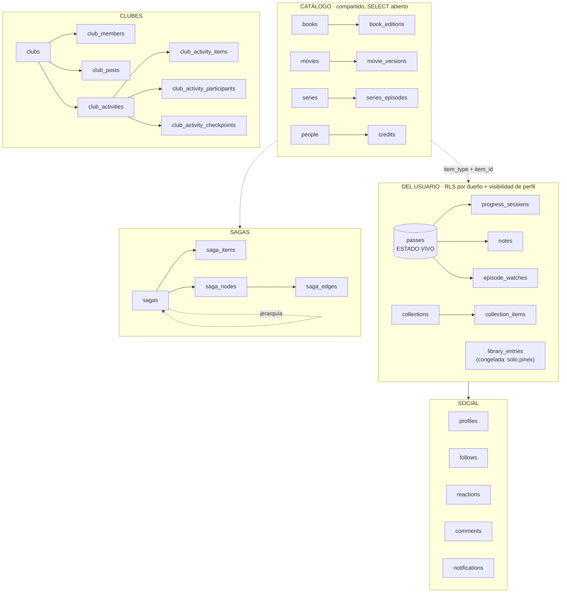

# Modelo de datos

> **[Canónico · verificado contra prod el 2026-07-21; delta de eventos de club verificado el 2026-07-22; itinerarios de sagas (§7.2) verificados en dev y prod el 2026-07-22; rol narrativo de sagas (§7.3) verificado en dev y prod el 2026-07-23; colocación/opcionalidad de sagas (§7.4) verificada en dev y **en prod** el 2026-07-26; editor único de secuencia, fase 2a (§7.5) verificado en prod el 2026-07-26, contra los objetos reales (`pg_type`, `pg_constraint`, `pg_proc`), nunca contra `list_migrations`]**

> Parte de [Requisitos y alcance](../REQUIREMENTS.md). Sección §3.
> **Este es el documento canónico del esquema.** Verificado contra producción el
> **2026-07-21**: 42 tablas, todas con RLS activa. Donde otro doc lo contradiga,
> manda este — y varios docs antiguos aún dicen `diary_entries`, que **ya no existe**
> (ver §0).

## 0. Dos renombres que invalidan la doc antigua

**`diary_entries` se llama `passes` desde julio de 2026** (migración `pass_hub_c_rename`).
Cualquier doc, plan o spec anterior que hable de `diary_entries` se refiere a esta tabla.

**`library_entries` está CONGELADA.** Fue la tabla de progreso original, y buena parte
de la doc vieja aún la presenta así. Ya no lo es: **el estado vivo del usuario vive en
`passes`**. `library_entries` sigue existiendo porque conserva `pinned_order`
(sus columnas de cola se borraron con la retirada de colas, ver más abajo), pero **su
`status` y su `position` no se actualizan** — leerlos
da datos de hace meses. Esto ya ha causado dos bugs reales en producción (avance de sagas
al 0%, PR #96). Regla: **cualquier feature que necesite el estado del usuario lo deriva de
`passes`, nunca de `library_entries`.**

## 1. La forma general

Arquitectura: **"columna vertebral compartida"**. Los metadatos, que varían mucho por tipo,
viven en tablas separadas y tipadas (`books`/`movies`/`series`); todo lo que es del usuario
es polimórfico vía `(item_type, item_id)`. Añadir un hobby nuevo = **1 tabla de metadata +
su integración de API**, reutilizando RLS, queries y UI de progreso.

`item_type` es el enum `book | movie | series`. La referencia polimórfica no tiene FK real
a catálogo (no se puede apuntar a tres tablas), así que **la integridad de `item_id` es
responsabilidad de la app**.



## 2. Catálogo (compartido entre usuarios)

`books`, `movies`, `series` — metadatos por tipo (autoría, portada, sinopsis, año, géneros).
Se rellenan **cache-as-you-go** desde APIs externas (OpenLibrary/Google Books, TMDB).
`SELECT` abierto a cualquiera, incluso anónimo — hace falta para renderizar perfiles
públicos y son metadatos no sensibles. `INSERT`/`UPDATE` autenticado.

Tres tablas de "tirada concreta" cuelgan del catálogo:

| Tabla | De | Para qué |
|---|---|---|
| `book_editions` | `books` | ISBN, editorial, páginas, idioma, portada de **esa** edición. `is_primary` marca la canónica |
| `movie_versions` | `movies` | Montajes/versiones |
| `series_episodes` | `series` | Catálogo por episodio, cache-as-you-go desde TMDB |

**La escalera de hidratación** (spec de 2026-07-14) manda aquí: la búsqueda **no escribe en
BD**. Son tres peldaños — tarjeta de resultado (memoria) → ficha de obra (se crea al abrirla)
→ edición (al registrarla). Por eso la tarjeta de búsqueda no lleva editorial ni páginas:
son de una tirada, no de la obra.

`people` + `credits` guardan autoría/dirección/reparto, también polimórfico por
`(item_type, item_id)`.

## 3. El pase: el hub del estado

**`passes` es la tabla central del usuario.** Una fila por *pase* — una lectura o visionado
concreto de un ítem. Releer un libro es un pase nuevo, no una edición del anterior.

Columnas que importan: `user_id`, `item_type`/`item_id`, `status` (`media_status`:
`planned|in_progress|completed|dropped`), `is_active`, `position` (jsonb), `rating`,
`review`, `is_public`, `started_on`/`finished_on`, `edition_id`, y `pinned_order` (las de
cola se borraron, ver «`queues` ya no existe»).

- **`is_active`** distingue el pase en curso de los cerrados. Solo uno activo por ítem.
- **El pase es dueño de la nota y la reseña**, no la entrada de biblioteca: cada relectura
  puede tener su propia valoración.
- **`position` es jsonb** porque es lo único que varía por tipo: `{"page": 42}` en libros,
  `{"season": 2, "episode": 5}` en series. **No se valida en BD** — es el trade-off aceptado
  a cambio de no replicar la vertical entera por cada tipo nuevo.
- ⚠️ **`rereadCount` NO es el ordinal del pase**: cuenta los pases CERRADOS. El actual es
  +1. La primera lectura siempre sale bien, así que el fallo pasa desapercibido hasta que
  alguien relee.

Cuelgan del pase:

- **`progress_sessions`** — sesiones de lectura/visionado. `position` es el punto
  ALCANZADO. `started_at` (añadido en plan 05) permite saber la franja horaria real;
  `created_at` es cuándo se registró, que no es lo mismo.
- **`episode_watches`** — un episodio visto. **La existencia de la fila = visto**;
  `rating`/`review` son opcionales.
- **`notes`** — notas y citas de «Memorizar». Además de `pass_id`/`session_id` (ambas
  opcionales), `item_type`/`item_id`, `kind` (`note|quote`, con `CHECK`) y `body`: desde
  `20260721_notes_social_columns.sql` suma `meta jsonb not null default '{}'::jsonb`
  (metadata libre por tipo de nota), `is_spoiler boolean not null default false`,
  `is_public boolean not null default false` y `parent_note_id uuid null references
  notes(id) on delete set null` (cita → nota hija; borrar la cita padre no arrastra la
  hija). Índices: `idx_notes_user` (`user_id, created_at desc`, preexistente),
  `idx_notes_item` (`user_id, item_type, item_id`, para la lista de la ficha) e
  `idx_notes_parent` (parcial, `where parent_note_id is not null`). **RLS: solo
  dueño (4 políticas). `is_public` se escribe pero no hay política de lectura pública** —
  ver `decisiones.md`.

**Las series no tienen `progress_sessions`**: se miden en episodios. Cualquier orden por
"última sesión" las manda al final si no se contempla.

## 4. Organización del usuario

| Tabla | Qué |
|---|---|
| `collections` | Colecciones (v2): nombre, descripción, `visibility`, orden, `is_sorteable` |
| `collection_items` | Ítems de una colección, polimórfico + `position` |
| `challenges` | Retos con ventana y criterio. **Absorbió las metas anuales** (las 3 columnas `annual_goal_*` de `profiles` se migraron aquí y se eliminaron) |

`profiles.daily_goal_minutes` **no** se fusionó: no es un reto, es el objetivo diario.

### `queues` ya no existe (dev 2026-07-20 · prod 2026-07-21)

La tabla `queues`, las columnas `queue_id`/`queue_order` (de **`passes` y `library_entries`**)
y el RPC `reorder_queue` **se borraron** en `20260720_drop_queues.sql`. Al integrar
Colección v2, la pestaña «Colas» dejó de pintarse y quedó inalcanzable: ningún enlace
llevaba a `?tab=colas`. Lo único que seguía aportando —acotar el sorteo a un subconjunto
propio— lo hacen ahora las **colecciones marcadas `is_sorteable`**.

**Aplicada en los dos entornos.** Dev el 2026-07-20; **prod el 2026-07-21** (issue #122),
una vez confirmado que el despliegue de producción (`b491279`) ya no contenía ninguna
referencia a colas y que las 3 colas que quedaban estaban **vacías** (0 pases y 0 entradas
con `queue_id`). Con esto dev y prod vuelven a tener el mismo esquema.

⚠️ **Orden de despliegue, no negociable — la razón por la que estuvo un día a medias:** el
`DROP` va **después** de desplegar el código que deja de leer `queues`. Mientras las tres
fichas llamaban a `getQueues()` en cada carga, borrar la tabla en producción habría roto
`/libro`, `/pelicula` y `/serie` enteras. Por eso se aplicó primero solo en dev y se esperó
al despliegue. **El patrón se generaliza a cualquier `DROP`: código primero, esquema
después** — y anotar el pendiente como issue para que no se quede a medias (`AGENTS.md`).

**`collections.is_sorteable`** (`boolean not null default false`, migración
`20260720_collections_sorteable.sql`) marca qué colecciones se ofrecen en el filtro del
sorteo (§7.28). Es opt-in porque el usuario tiene ~19 colecciones y ofrecerlas todas hacía
el filtro inservible. El pool del sorteo es entonces **colección ∩ pases `planned` activos**.

## 5. Social

`profiles` (username único, `is_public`, `role`, más las dos del onboarding: **`interests`**
`item_type[]` —los tipos que declaró en el paso 1; null = sin responder, y entonces el flujo
asume los tres— y **`onboarded_at`**, que **ES el gate** de `/onboarding`: con valor, el
asistente no se vuelve a mostrar. Ojo, «tener perfil» y «estar onboardeado» son cosas distintas
desde julio de 2026, y confundirlas ya rompió el asistente una vez), `follows` (con `follow_status`
`pending|accepted` — a perfil público es aceptado directo), `reactions` y `comments`
(polimórficos vía `target_kind`), `notifications`, `push_subscriptions`.

`target_kind` conserva el valor histórico **`diary_entry`** aunque la tabla se llame
`passes`: renombrar un valor de enum en uso habría requerido migrar datos por una etiqueta.

## 6. Clubes

`clubs` → `club_members` (rol `member|moderator|owner`, estado `invited|active|requested`),
`club_posts` (+ `club_poll_options`/`club_poll_votes`), `club_reads` (contador de novedades).

Actividades: `club_activities` (enum `activity_kind`: `buddy_read | tierlist |
list_challenge | criteria_challenge | evento`; ciclo `proposed → active → finished |
archived`) con sus satélites `club_activity_items`, `_participants`, `_opinions`,
`_placements`, `_checkpoints`, `_checkpoint_reads`.

**`config` (jsonb) es opaco a la BD**: lo interpreta la app según el `kind`. Ahí viven el
criterio del reto, los tiers de la tierlist y el `completionMode` del reto por lista.

### `evento` — actividad no participativa (dev y prod, 2026-07-22)

Quinto `kind` de `club_activities`, distinto de los otros cuatro en que **nace `active`
directamente** (nunca pasa por `proposed`) y no tiene pool de ítems ni participantes: sus
filas dejan sin usar `config`, `ends_on`, `spawned_from_*` y los tres satélites
`club_activity_participants`/`_items`/`_opinions` (kind nuevo en vez de tabla nueva,
aplicando SD-8 — ver `decisiones.md`). Solo usa `title`, `description` y `starts_on`.
"Pasado" se **deriva** de `starts_on < hoy` al leer (`isPastEvent`,
`src/lib/clubs/activities/group-activities.ts`); no hay ninguna transición ni columna que
lo persista. Sin ficha propia (`hasDetailView: false` en su `ActivityKindDefinition`).

Dos RPCs `SECURITY DEFINER`, moderador+ (`has_min_club_role(club_id, 'moderator')`),
migración `supabase/migrations/20260722_club_event_rpcs.sql`:

- **`create_club_event(p_club_id, p_title, p_description, p_starts_on) returns uuid`** —
  necesaria porque la política de INSERT de `club_activities` fuerza `status = 'proposed'`,
  y un evento nace `active`.
- **`update_club_event(p_activity_id, p_title, p_description, p_starts_on)`** — el UPDATE
  que la tabla no tiene (SD-8 la dejó sin política UPDATE, transiciones solo por RPC).
  **Restringida a `kind = 'evento'` y a `status = 'active'`**: sin el filtro de `kind`, esta
  RPC (gateada solo por rol) reabriría la edición arbitraria de cualquier
  `buddy_read`/`tierlist`/`list_challenge`/`criteria_challenge` que SD-8 evitó al no crear
  la política UPDATE; el filtro de `status = 'active'` (añadido durante la implementación,
  no estaba en el diseño original) impide reescribir un evento ya archivado. Archivar
  reutiliza `archive_club_activity` sin tocarla.

El enum se añade en `supabase/migrations/20260722_activity_kind_evento.sql`, sola en su
fichero porque Postgres prohíbe usar un valor de enum en la misma transacción que lo añade.

**Aplicadas en dev (`supabase-dev`) el 2026-07-22; prod queda pendiente** — aplicación
reservada explícitamente al usuario, no ejecutada en la sesión que cerró esta feature.

## 7. Sagas

`sagas` es **jerárquica** (`parent_saga_id`): las subsagas son sagas reales anidadas.
`saga_items` da la pertenencia (multi-membresía, con `is_primary`), y el grafo relacional
son `saga_nodes` (mixtos: apuntan a un ítem **o** a una saga hija) + `saga_edges`
(`principal | opcional | requisito`).

**⚠️ El progreso de una saga ya NO depende del orden — regla vigente desde el 2026-07-25/26
(fase 1 del orden unificado, §7.4).** Hasta entonces el denominador *era* el orden principal:
`createMainOrder` (`src/lib/sagas/main-order.ts`) producía una lista y `computeProgress` contaba
sobre ella. Ahora el denominador sale de la **pertenencia**: `countedKeys`
(`src/lib/sagas/progress.ts`) cuenta, deduplicadas por `item_type:item_id`, las obras del
subárbol que **no** estén marcadas `optional` (ver §7.4 para el modelo completo). `main-order.ts`
se queda solo con la **ordenación para pintar** (timeline, expansión de bloques dentro de un
itinerario) — ninguna suma cuelga ya de él.

Acoplar el denominador a la curación produjo cuatro fallos con una sola causa, que este cambio
cierra por construcción en vez de parchear uno a uno: **#91** (la regla estaba duplicada; el
hero decía 2/7 donde la card decía 2/5), **#170** (nodos huérfanos: contaban en el denominador
pero no se pintaban, así que el avance no podía llegar nunca al 100%), **#185** (`main-order.ts`
tenía dos ramas que se contradicen — con grafo, lo no numerado no cuenta; sin grafo, cuenta
todo — y la rama que esta misma sección documentaba aplicaba a 1 saga de 70) y el **0/0 de
Mundodisco** (26 nodos sin `order_no` → orden principal vacío → hero sin progreso y timeline
vacío, con miembros reales de sobra).

La exclusión de nodos huérfanos que introdujo #170 **sigue viva**, pero desde la fase 1 solo
afecta a la **presentación** (qué se pinta en el timeline/grafo), nunca al número: la asimetría
de #185 en la ORDENACIÓN (no en el cómputo) sigue sin resolver y queda abierta como issue — ya no
puede descuadrar el progreso porque el progreso no la mira.

### 7.1 Escritura de `saga_items` (issue #169)

`saga_items` tuvo el INSERT abierto a cualquier `authenticated` **a propósito**, porque el
enriquecimiento automático de colecciones TMDB escribe con el cliente del usuario al abrir
una ficha. Desde `20260722_saga_items_rls_hardening.sql` ese camino pasa por dos funciones
`SECURITY DEFINER` **acotadas a sagas TMDB** (`source = 'tmdb'` y `tmdb_collection_id` no
nulo) y las tres operaciones de escritura exigen ya `collaborator`:

| función | qué hace |
|---|---|
| `link_tmdb_saga_item(p_saga_id, p_item_id)` | alta de una película en su colección; resuelve `is_primary` y el reintento ante carrera |
| `sync_tmdb_saga_items(p_saga_id, p_items)` | rellenado perezoso: **solo inserta lo que falte**; una fila que ya existe no se toca (ni `position` ni `placement`) — ver §7.4b |

**Aplicada en dev y en prod el 2026-07-22**, en ese orden y con el código ya desplegado
(deployment `dpl_3eLcrm…`, commit `76e1bbf`): cerrar el INSERT con el código viejo en pie
habría roto la hidratación TMDB para los usuarios sin rol. Verificado contra `pg_policies` y
`pg_proc` en ambos entornos, no contra `list_migrations` — mismo `md5` del cuerpo normalizado
en dev y prod, `prosecdef`, `search_path` y ACL correctos (sin `anon`).

**El cuerpo de `sync_tmdb_saga_items` se reemplazó — `create or replace` — en
`20260726_saga_items_placement_writers_fix.sql` (§7.4), en dos revisiones sobre el mismo fichero:
la primera (23514) hizo que el `INSERT`/`ON CONFLICT` fijara `placement='fijo'` siempre que
`position` no fuera nulo, tanto en el alta como en la actualización — pero eso todavía dejaba el
`ON CONFLICT ... DO UPDATE` pisando `position`/`placement` de cualquier fila existente sin
condición. `link_tmdb_saga_item` no tenía el mismo problema (nunca escribe `position`) y se dejó
sin tocar. **Este `create or replace` está aplicado en dev y en prod (2026-07-26)** — mismo estado pendiente que el resto de
§7.4, no un despliegue independiente: el `md5` del cuerpo normalizado YA NO coincide entre dev y
prod hasta que el orquestador aplique esta migración.

#### 7.1b La curación manual gana sobre el sync de TMDB (2026-07-26)

**Bug**: `populateTmdbCollection` (`src/lib/sagas/get-saga.ts`) se dispara al abrir la ficha de
CUALQUIER saga TMDB, para cualquier lector (no hace falta ser curador). Si una fila ya existía en
`saga_items`, tanto `planCollectionSync` (`src/lib/sagas/collection-sync.ts`, comparaba solo
`position`) como el `ON CONFLICT ... DO UPDATE` de `sync_tmdb_saga_items` la trataban como
corregible, así que una curación manual (p. ej. marcar una película como `placement='libre'` →
`position=NULL`) se revertía sin avisar en cuanto alguien visitaba la ficha. Reproducido en dev
con «Matrix - Colección»: curar Matrix 1 a `position=null, placement=libre` y abrir la ficha lo
devolvía a `position=1, placement=fijo`.

**Decisión del dueño del producto**: la curación manual gana. **Regla**: el sync SOLO rellena
huecos (altas nuevas); una fila que ya existe en `saga_items` no se toca, ni en `position` ni en
`placement`, la traiga o no `p_items`.

**Dónde se implementó (los dos escritores, por separado y con razón)**:
- **RPC `sync_tmdb_saga_items`** (`20260726_saga_items_placement_writers_fix.sql`, revisión
  2026-07-26): `ON CONFLICT ... DO NOTHING` en vez de `DO UPDATE`. Es la barrera real — función de
  BD, `SECURITY DEFINER`, y la única que protege también a un cliente desplegado con la lógica
  vieja (el arreglo surte efecto sin esperar deploy de código).
- **`planCollectionSync`** (`src/lib/sagas/collection-sync.ts`): ya no calcula `toUpdate` en
  absoluto — el tipo `CollectionSyncPlan` solo tiene `toInsert`. No tiene sentido que el cliente
  pida una corrección que la RPC va a ignorar.

**Consecuencia asumida y deliberada**: si TMDB reordena una colección más adelante, ese reorden ya
NO se propaga a las filas existentes de `saga_items` — ni siquiera a las que nunca tocó un
humano, porque no hay forma fiable de distinguir "nunca curada" de "curada a propósito". Ver
también `docs/requirements/decisiones.md`.

### 7.2 Itinerarios de lectura: `saga_routes` / `saga_route_entries` / `saga_route_choices`

Un **itinerario** es una secuencia curada (opcionalmente parcial) de obras y bloques-subsaga
dentro de una saga. Tres tablas:

- `saga_routes` — metadatos de la ruta curada (`slug`, `name`, `summary`, `position`). Los
  slugs `lectura` y `publicacion` están RESERVADOS (`saga_routes_slug_not_reserved`): esas dos
  son **sintéticas**, se calculan sobre el grafo/orden principal y no tienen fila aquí — una
  fila para ellas sería una segunda fuente de verdad que resincronizar en cada edición del
  grafo (la familia de fallo del issue #91).
- `saga_route_entries` — los pasos: `route_id`, `position` (único por ruta), y **XOR**
  `(item_type, item_id)` / `child_saga_id` (una obra o un bloque-subsaga, nunca los dos).
  Guardado por **full-replace atómico** vía RPC `save_saga_route(p_route_id, p_entries)`
  (`SECURITY DEFINER`, gate `collaborator+` interno) — nunca se escribe fila a fila desde el
  cliente.
- `saga_route_choices` — preferencia del LECTOR (qué ruta ha adoptado para esa saga), por
  `slug` no por `route_id` (así una ruta borrada degrada sola al orden por defecto). RLS
  solo-dueño, **sin** gate de rol: es preferencia personal, no curación.

**`saga_route_entries_item_key` / `saga_route_entries_child_key`** (Task 9, 2026-07-22):
uniques **parciales** — `(route_id, item_type, item_id) WHERE item_id IS NOT NULL` y
`(route_id, child_saga_id) WHERE child_saga_id IS NOT NULL` — que impiden repetir la misma obra
o la misma subsaga dentro de un itinerario. Mismo patrón que ya protegía `saga_nodes`
(`saga_nodes_item_key` / `saga_nodes_child_key`). Sin ellos, dos pasos idénticos colisionaban en
la key de React del editor y el estado de plegado se asociaba al bloque equivocado; la Task 1
omitió este par al crear la tabla. `validateRouteDraft` (`src/lib/sagas/validate-route-draft.ts`)
ya rechaza duplicados en el borrador, así que esta garantía es la del esquema, no la única.

**Aplicadas en dev y en prod el 2026-07-22.** Las dos migraciones de itinerarios
—`20260723_saga_routes.sql` (crea `saga_routes` / `saga_route_entries` / `saga_route_choices` y la
función `save_saga_route`) y `20260723_saga_route_entries_uniques.sql` (los dos uniques parciales
de arriba)— se aplicaron a prod **antes** de mergear la rama. Verificadas contra los objetos
reales en ambos entornos (`pg_tables`, `pg_policies`, `pg_indexes`, `pg_proc`), no contra
`list_migrations`: 3 tablas, 5 políticas, 2 índices únicos parciales, y el mismo `md5` del cuerpo
normalizado de `save_saga_route` en dev y prod, con `prosecdef` correcto.

Ambas son **puramente aditivas**: crean tablas, índices y una función nuevos, sin
`ALTER`/`DROP`/`REVOKE` sobre ningún objeto existente. A diferencia del caso de #169 (§7.1), no
tenían dependencia de orden con el despliegue del código — de hecho, si el código hubiera llegado
antes, `getSagaRoutes`/`getRouteChoice` desestructuran `{ data }` e ignoran `error`, así que las
tablas ausentes habrían degradado a `[]`/`null` y la feature simplemente no habría aparecido.

### 7.3 Rol narrativo: `saga_items.role` (issue #167)

Columna nueva, **ortogonal a `position`**: `position` dice si el ítem tiene hueco fijo en el orden
principal (`NULL` = sin hueco fijo); `role` dice **qué es** dentro de esta saga concreta. Un miembro
puede tener las dos, una sola, o ninguna — son dos ejes independientes, no dos formas de decir lo
mismo.

```sql
create type public.saga_item_role as enum ('precuela', 'spin_off', 'relato', 'paralela');
alter table public.saga_items add column role public.saga_item_role;
```

- **Nullable, sin default, sin backfill.** `NULL` = "sin clasificar" — no "opcional" ni ningún otro
  valor implícito. Backfillear los `position IS NULL` existentes habría escrito en la BD una decisión
  editorial (qué obra es precuela/spin-off/etc.) que nadie tomó; buena parte de esos nulls son
  descuido de curación, que es literalmente la queja del issue.
- **Por saga, no por ítem**: el unique de `saga_items` sigue siendo `(saga_id, item_type, item_id)`,
  así que un libro puede ser precuela en una saga y obra principal en otra.
- **No toca el denominador del progreso** (hoy `countedKeys` en `src/lib/sagas/progress.ts`, ver
  §7.4 — en el momento de aplicar esta migración era `main-order.ts`, pero el criterio "el rol es
  puramente semántico y no debe entrar en el cómputo" no cambió al mudarse el denominador). Ver
  `decisiones.md` (issue #167) — es la familia de fallo del #91 si algún día se acoplaran.
- Hereda la RLS de `saga_items` sin trabajo adicional (SELECT público, escritura `collaborator+`,
  §7.1); las funciones `SECURITY DEFINER` de TMDB siguen insertando sin mencionar la columna y
  obtienen `NULL`.

**Aplicada en dev y en prod el 2026-07-23** (migración `20260723_saga_item_role.sql`), y anexada a
`supabase/schema-baseline.sql` en la misma pasada que la aplicación a producción — «aplicar» y
«anexar» como dos pasos separados ya desincronizó el baseline dos veces (notas de 2026-07-14 y
2026-07-17).

Verificada **contra los objetos reales, no contra `list_migrations`**: en ambos entornos la columna
sale en `pg_attribute` con tipo `saga_item_role`, `attnotnull = false` y `atthasdef = false`, y el
enum sale en `pg_enum` con los cuatro valores en el orden `precuela, spin_off, relato, paralela`. En
prod: **327 filas en `saga_items`, 0 con `role`** — el «sin backfill» comprobado en el dato, no solo
en la intención del DDL.

### 7.4 Colocación y opcionalidad: `placement` / `optional` (fase 1 del orden unificado)

Fase 1 de 3 de un spec mayor —
`docs/superpowers/specs/2026-07-25-sagas-orden-unificado-design.md`— que reemplaza los tres
sistemas de orden que hoy coexisten (lista numerada, grafo, itinerarios) por uno solo. Esta fase
**no** toca esa unificación todavía: solo introduce el modelo de dos ejes nuevos y desacopla el
progreso del orden. El arreglo de `assignItemToSaga`/#188 que originalmente se planeó para la fase
2 se adelantó al review final de esta misma rama (commit `e3832ff`, ver más abajo) — lo único que
falta de esa fase es aplicar las migraciones a prod, que ya no depende de ningún arreglo de código.
Fase 3 (el editor único de secuencia con `saga_placement_windows`/tándem/retirada del grafo)
**sigue sin construir** — ver `backlog.md`.

**Dos ejes ORTOGONALES, y ésa es la distinción que toda la fase existe para establecer:**

| | cuenta en el progreso | no cuenta (`optional`) |
|---|---|---|
| **`fijo`** (hueco numerado) | el caso normal | un spin-off con hueco propio que no se quiere exigir |
| **`libre`** (se lee cuando quieras) | *p. ej. una novela puente que sí se cuenta* | *p. ej. un relato suelto que no se cuenta* |

`placement` dice **dónde** se lee (`fijo` = tiene hueco numerado; `libre` = en cualquier momento;
`null` = sin clasificar). `optional` dice **si cuenta** en el progreso. Una obra puede ser libre y
contar, o fija y no contar — la doc no debe volver a presentarlos como un solo eje, que es
justo la confusión que #167 dejó sin resolver del todo (`role`, §7.3, es un **tercer** eje,
ortogonal a los otros dos: qué *es* la obra).

```sql
create type public.saga_placement as enum ('fijo', 'libre');

alter table public.saga_items
  add column placement public.saga_placement,   -- nullable: null = sin clasificar
  add column optional boolean not null default false,
  add constraint saga_items_placement_position check (
    case when placement = 'fijo' then position is not null else position is null end
  );
```

**El CHECK es un `CASE`, no un `OR` de tres ramas — corregido en el review final de la rama
(2026-07-26).** La primera versión escrita era el `OR` de arriba con las tres ramas comentadas, y con
`placement IS NULL` las dos primeras ramas dan `NULL` (no `FALSE`) y la tercera `FALSE`, así que el
`OR` entero da `NULL` — un CHECK solo rechaza `FALSE`, así que colaba `(placement=NULL,
position=7)`, justo lo que "sin clasificar nunca lleva número" prohíbe. Dev llegó a tener una fila
así. El `CASE` no tiene ese agujero: un `WHEN` que no da `TRUE` (`NULL` incluido) cae al `ELSE` en
vez de propagar el `NULL`. Con esta forma sí vale `placement='fijo' ⇔ position is not null`.

Mismos tres atributos, aplicados al **bloque-subsaga entero** dentro de su padre (tapa el hueco
que deja retirar el editor de grafo en fase 3: hoy la colocación de una subsaga vive en
`saga_nodes.child_saga_id`+`order_no` si el padre tiene grafo, o se deducía del menor `position`
de sus miembros si no):

```sql
alter table public.sagas
  add column position_in_parent integer,
  add column placement_in_parent public.saga_placement,
  add column optional_in_parent boolean not null default false,
  add constraint sagas_placement_position check (
    case when placement_in_parent = 'fijo' then position_in_parent is not null else position_in_parent is null end
  ),
  -- Una saga raíz no está colocada en ningún sitio: sin esto, "sacar del
  -- universo" dejaría restos en las tres columnas.
  add constraint sagas_placement_needs_parent check (
    parent_saga_id is not null or
    (position_in_parent is null and placement_in_parent is null and optional_in_parent = false)
  );
```

**El progreso deja de mirar el orden** (ver también §7, arriba): el denominador sale de
`countedKeys` (`src/lib/sagas/progress.ts`) — las obras del subárbol que **no** estén marcadas
`optional`, deduplicadas por `item_type:item_id`, sin mirar `position` ni `saga_nodes` ni
itinerarios. Un bloque `optional_in_parent` saca a los suyos del denominador de **su padre**, pero
no del suyo propio (abrir la ficha de un spin-off `optional` y ver su propio progreso, no 0/0, es
lo que un lector espera). `libre` no afecta al progreso, solo dice dónde se lee. Lo "sin
clasificar" **cuenta** — la deuda de curación se ve, no se descuenta a escondidas.

**Backfill, medido contra el dato real de cada entorno — dev y prod NO tienen el mismo tamaño de
catálogo, y las dos filas siguientes no son comparables entre sí, cada una describe su propio
entorno:**

- **Dev** (`supabase-dev`, tras aplicar las dos migraciones, 2026-07-26): `saga_items` tiene 22
  filas — 19 pasan a `placement='fijo'` (tenían `position`), 3 quedan `null` (sin clasificar,
  0 marcadas `optional` tras el default). `sagas` tiene 14 filas, 5 con `parent_saga_id`; el
  backfill coloca 2 como `placement_in_parent='fijo'` y deja 3 en `null` — **a propósito**: son
  hijas de un padre que tiene grafo (`saga_nodes`), y ahí la app no deduce el orden de `position`
  sino de `order_no`, así que inventar una colocación habría sido una curación que nadie hizo (se
  migran a mano en la fase 3). `saga_placement_windows` (tabla de la fase 3, para la ventana de un
  `libre`) **no existe todavía**, ni en dev ni en prod.
- **Prod, medido el 2026-07-25 antes de que existieran estas columnas** (spec, sección "Modelo de
  datos"): 342 filas de `saga_items` con `position` (→ habrían pasado a `fijo`), 9 sin `position`
  (→ `null`). **Esta cifra es informativa, no aplicada**: prod no tiene ni el enum ni las columnas
  — ver más abajo.

**Migraciones `20260725_saga_placement.sql`, `20260725_saga_placement_blocks.sql` y
`20260726_saga_items_placement_writers_fix.sql` — SOLO EN DEV, deliberadamente, hasta que el
orquestador aplique esta rama.** El motivo original era que el CHECK
`saga_items_placement_position` **rompía `assignItemToSaga`** (el formulario «Saga» de la ficha,
`manage-saga-actions.ts`), que hacía `upsert` de la membresía escribiendo `position` y lo ponía a
`null` si el campo llegaba vacío — sobre una fila `fijo` eso viola la restricción nueva. Antes esa
pérdida era silenciosa (issue #188); con el CHECK en prod pasaría a ser un `upsert` que falla duro.
**Ese arreglo ya no es trabajo de la fase 2: es el commit `e3832ff` de esta misma rama.**
`assignItemToSaga` deja de escribir `position` — el hueco pasa a ser competencia exclusiva del
editor de secuencia (`updateSagaMember`/`member-actions.ts`) — y cierra #188 eliminando el segundo
escritor en vez de parcheando el síntoma (ver `decisiones.md`, entrada 2026-07-26). El mismo commit
destapó que #188 no era el único escritor roto: la RPC `sync_tmdb_saga_items` insertaba `position`
sin `placement` (arreglada en `20260726_saga_items_placement_writers_fix.sql`, que sustituye el
cuerpo de la función sin tocar el fichero ya aplicado a prod en `20260722_saga_items_rls_hardening.sql`
— ese mismo fichero recibió una segunda revisión, el mismo día, para que dejara de pisar filas
existentes: ver §7.1b)
y `applyMembershipOps` no arrastraba `placement` al mover un ítem entre subsagas (arreglado en
`apply-membership-ops.ts`, sin migración — es solo código de aplicación). Mismo formato que ya usa
§7.1 para el caso de #169, donde el orden de despliegue también importaba: **las tres migraciones se
aplicaron a dev el 2026-07-25/26 y a prod el 2026-07-26**, en una sola pasada y en el orden
`20260725_saga_placement` → `20260725_saga_placement_blocks` →
`20260726_saga_items_placement_writers_fix`.

Verificado contra los objetos reales de prod, no contra `list_migrations`: enum `fijo|libre`; los
tres CHECK en forma `CASE`; backfill **342 `fijo` / 9 sin clasificar / 0 `libre` / 0 `optional`**;
**cero** filas violando cualquiera de los dos invariantes; y `sync_tmdb_saga_items` con
`on conflict do nothing` y su `security definer` intacto.

⚠️ **Las 12 sagas con padre de producción quedaron SIN colocar (`position_in_parent` nulo), y es
correcto**: las 12 cuelgan de un padre con grafo (Cosmere, Mundodisco, Maasverse), y ahí la
colocación no se deduce de `min(position)` sino de `saga_nodes.order_no`. Inventarles un hueco
habría sido escribir una curación que nadie deriva. Quien mire prod y vea 12 bloques «sin
clasificar» no está viendo un backfill fallido: está viendo deuda de curación real, que es justo lo
que la feature vino a hacer visible.

**El intento de rescate (fase 2a, `20260726_rescate_colocacion_hijas.sql`, ver §7.5) no rescató
nada.** La premisa de este párrafo — que al menos algunas de las 12 tendrían `order_no` curado en
su nodo-bloque dentro del grafo de su padre — resultó falsa: de los 55 nodos de `saga_nodes` en
prod, **solo uno** tiene `child_saga_id` no nulo (el de "Trono de Cristal"), y ese tampoco tiene
`order_no`. Las otras 11 hijas no tienen ningún nodo que las represente en el grafo de su padre. El
`UPDATE` de rescate se aplicó a prod el 2026-07-26 y afectó **0 filas** — medido antes y después,
tabla idéntica. Detalle y reproducción en la issue #196. La colocación de estas 12 ya **no** espera
a la fase 3: el editor de secuencia de la fase 2a (§7.5) tiene una zona dedicada a bloques sin
clasificar, así que se curan a mano ahí, por una persona, cuando alguien decida hacerlo — no hay
fecha ni fase que las bloquee.

**El orden importa para desplegar**: el código de esta rama **lee** `placement`/`optional`, y
PostgREST no devuelve datos parciales — sin las columnas, la consulta entera falla y la capa de
datos se traga el error, así que las sagas se verían **vacías** en vez de dar error. Por eso las
migraciones van **antes** que el despliegue del código, nunca al revés.

**UI**: `/saga/[id]/editar` (`saga-members-editor.tsx` + `member-actions.ts`, acción
`updateSagaMember`) cura `placement` y `optional` por miembro, junto al `position`/`role` que ya
curaba desde #167 — un doble gate (RLS `collaborator+` de `saga_items` + comprobación en la server
action) igual que el resto de escrituras de saga. La ficha (`saga-info.tsx`) pinta una sección
**"Cuando quieras"** con las entradas `libre`, un chip **"opcional"** sobre la portada de las
entradas `optional`, y — para `collaborator+` — un aviso de deuda de curación ("N obras sin
clasificar… Clasificarlas") que enlaza a `/editar`. La sección **"Fuera del orden principal"** que
trajo la PR #189 (§7.3) **se fundió en la grid del grupo y ya no existe**: un miembro sin
clasificar (`placement === null`) se distingue ahora solo por un contorno punteado en su portada
(con equivalente accesible) y por el aviso de deuda — la sección dedicada era la tercera señal
para el mismo hecho. El chip de rol narrativo (§7.3) sobrevive, movido dentro de la celda
compartida. La colocación de un **bloque-subsaga** (`position_in_parent`/`placement_in_parent`/
`optional_in_parent`) **ya tiene UI y escritor** desde la fase 2a (§7.5): el mismo editor de
secuencia cura obras propias y bloques-subsaga a la vez, vía `save_saga_sequence`.

### 7.5 Editor único de secuencia y retirada del editor de grafo (fase 2a del orden unificado)

Fase 2a de 3 (spec `docs/superpowers/specs/2026-07-26-sagas-fase-2a-editor-secuencia-design.md`):
sustituye el formulario por fila de `/saga/[id]/editar` y el editor de grafo (`/saga/[id]/mapa/editar`,
React Flow) por **un solo editor** con tres zonas — obras propias, bloques-subsaga (hijas directas)
y "sin clasificar" — y guardado atómico. Dos cáscaras sobre **una capa de estado única**
(`useSequenceDraft`): A en escritorio (grid de zonas), B en móvil (pestañas + hoja por fila). El
gesto de "tándem" (issue #168) deja elegir un hueco compartido entre una obra y un bloque en dos
pasos, sin teclear número — el número se deriva del hueco, nunca se escribe a mano.

**RPC `save_saga_sequence(p_saga_id uuid, p_entries jsonb, p_blocks jsonb, p_removed jsonb)`**
(`SECURITY DEFINER`, gate `collaborator+` interno vía `has_min_role`, `search_path = public`,
`revoke` a `public`/`anon`) — guardado atómico de las tres piezas en una sola transacción:

- `p_entries` — upsert de las filas de `saga_items` de ESTA saga (`position`, `placement`,
  `optional`, `role`); `is_primary` se calcula con el mismo criterio que el resto de escritores
  (`link_tmdb_saga_item`, `sync_tmdb_saga_items`), nunca `false` incondicional — ver
  `decisiones.md`.
- `p_blocks` — `UPDATE` de `position_in_parent`/`placement_in_parent`/`optional_in_parent` de las
  hijas DIRECTAS (`parent_saga_id = p_saga_id`); nunca inserta ni borra, porque anidar/desanidar
  sigue siendo competencia de `editor-actions.ts`.
- `p_removed` — baja **explícita** de membresías de `saga_items`, y solo estas: a diferencia de
  `save_saga_route`/`save_saga_graph` (full-replace por `delete` + reinsert), aquí NO hay borrado
  por omisión, porque `saga_items` tiene un segundo escritor activo (`assignItemToSaga`, el
  formulario «Saga» de la ficha) y un borrador rancio del editor se habría comido, en silencio,
  cualquier alta hecha por otra persona mientras el editor estaba abierto. Ver `decisiones.md`.

**`save_saga_graph` queda huérfana**: al retirarse el editor de grafo, ya no tiene ningún llamador
en la app (verificado por grep sobre `src/` y `e2e/`). Sigue viva en prod como función `SECURITY
DEFINER` — no se ha hecho `DROP`— porque su retirada es trabajo de la fase 3 (junto con
`saga_nodes`/`saga_edges` y `main-order.ts`), no de esta. `apply-membership-ops.ts` queda en la
misma situación (sin llamador real, solo su propio test) — ver issue #197.

**Migraciones `20260726_save_saga_sequence.sql` y `20260726_rescate_colocacion_hijas.sql`,
aplicadas a prod el 2026-07-26, en ese orden.** Ambas son aditivas y de bajo riesgo: la primera crea
una función nueva sin tocar ningún objeto existente; la segunda es un `UPDATE` acotado que resultó
ser un no-op medido (0 filas) — ver el párrafo de arriba (§7.4) y la issue #196 para el porqué.
Verificado contra los objetos reales de prod, no contra `list_migrations`: `save_saga_sequence`
existe con `prosecdef = true`, `search_path=public` y sus cuatro argumentos (`p_saga_id, p_entries,
p_blocks, p_removed`); **cero** filas violando el invariante `placement/position` en `sagas` ni en
`saga_items`; y la tabla de las 12 sagas hijas idéntica antes y después del rescate.

**UI**: `/saga/[id]/editar` es ahora el editor de secuencia único (`SequenceEditor`,
`src/components/saga/sequence/sequence-editor.tsx`, + `src/lib/sagas/sequence-actions.ts`, acción
`saveSequence`, que llama a la RPC `save_saga_sequence`); `/saga/[id]/mapa/editar` redirige a
`/editar` (no 404: hay enlaces vivos y gente con la URL guardada). El gate sigue siendo el mismo
doble (RLS `collaborator+` de `saga_items`/`sagas` + comprobación en la server action) que el resto
de escrituras de saga.

## 8. Seguridad

Las 42 tablas tienen **RLS activa**. Patrones:

- **Catálogo**: SELECT abierto (incl. anónimo), escritura autenticada.
- **Contenido de perfil**: el dueño siempre; los demás según `can_view_profile()`.
- **Clubes**: `clubs.visibility` gobierna **descubrimiento**, nunca quién ve el contenido —
  eso lo decide `is_club_member()`.
- **`SECURITY DEFINER` deliberado** donde la función *es* la política: tableros de
  actividad (un participante de perfil privado debe ser visible a sus compañeros),
  `save_saga_graph`, `save_saga_sequence` (§7.5), `save_saga_route` (§7.2), `link_tmdb_saga_item`,
  `sync_tmdb_saga_items` (§7.1), `create_club_poll`, `confirm_checkpoint`. Los advisors los marcan
  como WARN y **está aceptado**: llevan gate interno de rol. `save_saga_graph` sigue en esta lista
  aunque ya no tiene llamador en la app (§7.5, fase 2a retiró su editor): sigue viva en prod,
  `DROP`-earla es trabajo de la fase 3.
- **Storage no valida JWT ES256**: las subidas de imagen van por service-role en server
  actions, no desde el cliente.

## 9. Enums

| Enum | Valores |
|---|---|
| `item_type` | `book \| movie \| series` |
| `media_status` | `planned \| in_progress \| completed \| dropped` |
| `user_role` | `user \| collaborator \| admin` |
| `activity_kind` | `buddy_read \| tierlist \| list_challenge \| criteria_challenge \| evento` (`evento`: 2026-07-22) |
| `activity_status` | `proposed \| active \| finished \| archived` |
| `club_role` / `club_visibility` | `member \| moderator \| owner` / `public \| private` |
| `club_member_status` | `invited \| active \| requested` |
| `notification_type` | `follow_request \| new_follower \| follow_accepted \| review_liked \| review_commented \| club_invite \| club_invite_accepted \| club_post \| club_post_liked \| club_post_commented \| comment_liked \| club_activity_proposed \| club_activity_activated \| club_join_request \| club_join_approved \| club_activity_spawned \| club_event_created` (`club_event_created`: 2026-07-22) |
| `follow_status` | `pending \| accepted` |
| `saga_edge_type` / `saga_node_level` | `principal \| opcional \| requisito` / `principal \| menor` |
| `saga_item_role` | `precuela \| spin_off \| relato \| paralela` (§7.3, issue #167; nullable, sin default — dev y prod 2026-07-23) |
| `saga_placement` | `fijo \| libre` (§7.4, fase 1 del orden unificado; nullable en `saga_items.placement`/`sagas.placement_in_parent` — aplicado en dev y en prod el 2026-07-26) |
| `target_kind` | `diary_entry \| episode_watch \| club_post \| comment \| activity_checkpoint \| club_activity` |

## 10. Migraciones

82 ficheros en `supabase/migrations/`. `supabase/schema-baseline.sql` es el replay ordenado
para levantar un entorno limpio.

⚠️ **Aplicar a prod y actualizar `schema-baseline.sql` es UN SOLO paso, no dos.** Ese fichero
es un replay de PRODUCCIÓN, no de dev, y registra que ya se desincronizó dos veces (notas
2026-07-14 y 2026-07-17) por olvidar exactamente eso. Las dos migraciones de eventos
(`20260722_activity_kind_evento.sql`, `20260722_club_event_rpcs.sql`) se aplicaron a prod el
2026-07-22 y se anexaron al baseline en la misma pasada («ANEXO 2026-07-22»).

⚠️ **El orden del baseline es el de aplicación REAL en producción**
(`supabase_migrations.schema_migrations`), **no el alfabético de ficheros** — varias del
pase-hub se redataron y prod las registra en otro orden.

⚠️ **"No aparece en `list_migrations`" ≠ "no está en prod".** `20260716_list_challenge_completion_mode.sql`
está aplicada pero sin registrar en el ledger. Para comprobar si algo existe de verdad,
mirar los **objetos** (`pg_proc`, `pg_class`), no el ledger.
