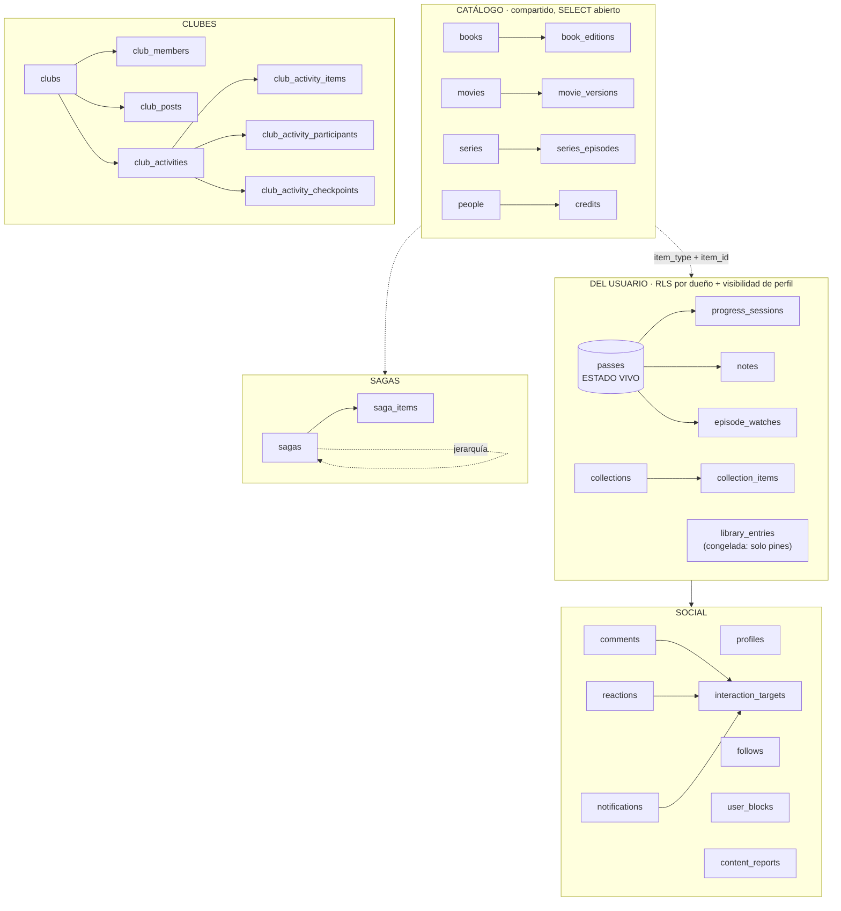

# Modelo de datos

> **[Canónico · verificado contra dev el 2026-08-27 · prod verificado parcialmente — puntos pendientes marcados «prod por reverificar»; notas de voz (`comments`, migración 20260881) verificadas en dev Y prod el 2026-08-26]**
> Parte de [Requisitos y alcance](../REQUIREMENTS.md). Sección §3. **Este es el documento canónico del esquema.**
> El historial de verificaciones anteriores (la antigua cabecera-changelog de deltas por fecha) se movió,
> íntegro y congelado, a la sección «Historial de verificaciones (deltas antiguos, congelados)» al final del documento.

## 0. Dos renombres que invalidan la doc antigua

**`diary_entries` se llama `passes` desde julio de 2026** (migración `pass_hub_c_rename`).
Cualquier doc, plan o spec anterior que hable de `diary_entries` se refiere a esta tabla.

**`library_entries` está CONGELADA.** Fue la tabla de progreso original, y buena parte
de la doc vieja aún la presenta así. Ya no lo es: **el estado vivo del usuario vive en
`passes`**. `library_entries` sigue existiendo porque conserva `pinned_order`
(sus columnas de cola se borraron con la retirada de colas, ver más abajo), pero **su
`status` y su `position` no se actualizan** — leerlos
da datos de hace meses. Esto ya ha causado **cuatro** bugs reales en producción (avance de
sagas al 0%, PR #96; confirmación de hitos de lectura conjunta rechazada, issue #470;
hidratación bloqueada, #674; y el auto-añadir de clubes que no añadía nada, issue #782).
Regla: **cualquier feature que necesite el estado del usuario lo deriva de `passes`, nunca de
`library_entries`.**

**Desde la migración `20260876` no queda NINGÚN escritor de la tabla** (verificado contra
`pg_proc` en dev y prod el 2026-08-24: cero funciones con `insert/update/delete` sobre ella).
Se fueron ahí los dos triggers `autoadd_library_on_activity_*`, que eran el cuarto episodio —
ver el acta en `decisiones.md` (2026-08-24). En la misma migración se revocaron a `anon` los
grants de `INSERT/UPDATE/DELETE` que arrastraba sobre esta tabla: no eran una fuga (la RLS
está activa y no hay policy de escritura para `anon`), pero un grant sin policy es una mina
para el día que alguien añada una permisiva. `anon` conserva `SELECT`, que sí tiene policy
(`library entries select visible`). Las filas que quedan (**153 en prod, de 3 usuarios,
última escritura 2026-08-18**) son historia, no estado: no se migran a `passes`.

**`validate_club_post_ref` sigue mencionando `'library_entries'`** como `sourceTable`
aceptada. NO escribe en la tabla y no es parte de lo anterior — no lo confundas con un
escritor vivo.

## 1. La forma general

Arquitectura: **"columna vertebral compartida"**. Los metadatos, que varían mucho por tipo,
viven en tablas separadas y tipadas (`books`/`movies`/`series`); todo lo que es del usuario
es polimórfico vía `(item_type, item_id)`. Añadir un hobby nuevo = **1 tabla de metadata +
su integración de API**, reutilizando RLS, queries y UI de progreso.

`item_type` es el enum `book | movie | series`. La referencia polimórfica no tiene FK real
a catálogo (no se puede apuntar a tres tablas), así que **la integridad de `item_id` es
responsabilidad de la app**.



## 2. Catálogo (compartido entre usuarios)

`books`, `movies`, `series` — metadatos por tipo (autoría, portada, sinopsis, año, géneros).
Se rellenan **cache-as-you-go** desde APIs externas (OpenLibrary/Google Books, TMDB).
`SELECT` abierto a cualquiera, incluso anónimo — hace falta para renderizar perfiles
públicos y son metadatos no sensibles. `INSERT`/`UPDATE` autenticado.

Los `genres` de las tres tablas usan un **vocabulario canónico único** definido en código
(`src/lib/catalog/genre-vocab.ts`). Libros mapean subjects de OpenLibrary (`genres.ts`);
pelis/series mapean **ids** de TMDB (`tmdb-genres.ts`), nunca el nombre localizado. Índices
GIN `{books,movies,series}_genres_gin` sirven `genres @> ARRAY[label]` (`/genero/[slug]` y
el filtro de biblioteca). Migración `20260815_genres_gin_indexes.sql`. Verificado en dev
y en prod el 2026-07-30.

`movies.original_title` / `series.original_title` (`text`, nullable; migración
`20260802_screen_original_title.sql`, aplicada y verificada en DEV y en PROD el 2026-08-02 —
movies 354/354 y series 26/26 con valor en prod, 0 null). El `title` se cachea traducido a
**es-ES** desde TMDB (`language=es-ES`); `original_title` guarda el del idioma de rodaje. Lo
escribe `find-or-create.ts` en cada alta; las filas previas se rellenaron por un backfill
puntual que consulta TMDB por `tmdb_id` (idioma-independiente).

⚠️ **El motivo que daba esta sección era falso** (corregido el 2026-08-03): Letterboxd NO
exporta el título original, exporta el **internacional en inglés** — su catálogo es TMDB
en-US. Ese tercer título **no está en BD**: el matcher de importación
(`src/lib/import/match-row.ts`) lo pide a TMDB en cada fila (`searchMoviesForImport`), así que
la búsqueda en el catálogo LOCAL sigue sin poder casar «Spirited Away» con la fila cacheada
como «El viaje de Chihiro» — resuelve igualmente, pero gastando la llamada a TMDB. Ver
`decisiones.md` (2026-08-03).

**Columnas de TAMAÑO** (`movies.duration_minutes`, `series.total_episodes` / `total_seasons` /
`episode_runtime_minutes`): alimentan la estimación de tiempo y los tramos de duración del
sorteo. No las trae la búsqueda (TMDB solo da `runtime` en la respuesta de **detalles**), así
que las hidrata `ensureItemEnriched` al abrir la ficha, de la misma llamada que ya pedía para
los créditos. Van fuera del trigger `enforce_catalog_edit_collaborator_only` a propósito: son
de sincronización, no curadas, y las rellena cualquier `authenticated` que visite la ficha.

> **Delta del 2026-08-03 (issue #365): `grant update (episode_runtime_minutes) on series to
> authenticated`, aplicado y verificado en DEV y en PROD** (`information_schema.column_privileges`
> → las 9 columnas, ya con `episode_runtime_minutes`). Migración
> `20260818_grant_series_episode_runtime.sql`. La columna nació en `20260710` **después** del
> grant de tamaños original y se quedó fuera; como la hidratación escribe las tres en un único
> patch, el UPDATE fallaba entero en cuanto faltaba la duración de episodio. Sin cambio de
> esquema: solo el grant. En la misma issue, el punto de captura de los tamaños pasó del sorteo
> a la ficha (eran dato compartido rellenado por un backfill que solo alcanzaba pendientes del
> dueño: 1 de 354 películas y 0 de 26 series en prod). Ver `decisiones.md` (2026-08-03).

Tres tablas de "tirada concreta" cuelgan del catálogo:

| Tabla | De | Para qué |
|---|---|---|
| `book_editions` | `books` | ISBN, editorial, páginas, idioma, portada de **esa** edición. `is_primary` marca la canónica |
| `movie_versions` | `movies` | Montajes/versiones |
| `series_episodes` | `series` | Catálogo por episodio, cache-as-you-go desde TMDB |

**La escalera de hidratación** (spec de 2026-07-14) manda aquí: la búsqueda **no escribe en
BD**. Son tres peldaños — tarjeta de resultado (memoria) → ficha de obra (se crea al abrirla)
→ edición (al registrarla). Por eso la tarjeta de búsqueda no lleva editorial ni páginas:
son de una tirada, no de la obra.

Las escrituras de esos peldaños pasan por RPCs `SECURITY DEFINER`, no por UPDATE directo:
**`hydrate_book`** (`20260715_book_hydration.sql`; `revoke` a `anon` en
`20260715_book_hydration_revoke_anon.sql`; firma ampliada en
`20260871_hydrate_book_title_author.sql`; **reescrita a fondo por la rama de representación —
ver §2.1ter**) escribe **título/autor/año**/sinopsis/géneros/portada, y **`register_book_edition`**
(`20260714_editions_c_register.sql`) registra la tirada concreta en `book_editions`. En dev
existen además **`hydrate_movie` / `hydrate_series` / `hydrate_screens_bulk`** y
**`register_catalog_item` / `register_catalog_items_bulk`** con el mismo patrón, pero **sin
fichero de migración en el repo** (verificadas contra `pg_proc` el 2026-08-19 — solo la de
libros tiene fichero; las de pantalla y registro se rescataron después en
`20260818_catalog_c_hydrate_screen.sql` y `20260818_catalog_e_register.sql`). Las seis
`hydrate_*`/`register_catalog_*` ya llevan `pg_temp` desde el barrido de #726 (§8).

⚠️ **`hydrate_book` ya NO es la de ese párrafo, y lo que decía aquí era exactamente lo
CONTRARIO de lo que hace.** No «rellena solo donde la fila estaba vacía»: es
**fill-or-upgrade** por rango de idioma (`20260883`) — una candidata española PISA un título
inglés. Y no la ejecuta «cualquier `authenticated`»: es **solo `service_role`** desde
`20260884`; con `authenticated` cualquiera reescribía el catálogo COMPARTIDO. Lo mismo vale
para el bloque «FILL-ONLY pura» de §2.1, que quedó superado para libros. **Antes de tocar
nada de hidratación de libros, §2.1ter.**

`people` + `credits` guardan autoría/dirección/reparto, también polimórfico por
`(item_type, item_id)`. `credits` tiene índice **único** sobre
`(item_type, item_id, person_id, role)` (`credits_item_type_item_id_person_id_role_key`): una
persona puede tener VARIOS roles en la misma obra (actúa y dirige) pero no el mismo dos veces.
Ojo al escribir en lote: un `insert` con una sola fila ya presente falla **entero** con 23505 y
no inserta ninguna de las nuevas — por eso `hydratePersonCredits` va por `upsert` con
`ignoreDuplicates`.

🔒 **`people`, `credits` y `series_episodes` son de SOLO LECTURA para `anon` y
`authenticated` desde el 2026-08-20** (`20260875_catalog_people_credits_episodes_readonly.sql`,
#725). Hasta entonces sus tres policies de INSERT eran `with check (true)`: con una sesión
normal y un POST a PostgREST se podía colgar de cualquier persona una filmografía inventada,
crear personas que no existen o inventar episodios — y lo veía todo el mundo, porque el catálogo
es compartido. **#674 cerró esto mismo para `movies`/`series`/`books` y estas tres se quedaron
fuera.**

El arreglo tiene dos mitades y **el orden importa**:

1. **Código primero.** Las cinco funciones que escribían aquí con el cliente de la petición
   pasan a escribir con **`createServiceRoleClient()`**: `ensure-series-episodes.ts`,
   `find-or-create-person.ts` (×2), `get-person.ts`, `hydrate-person-credits.ts` (×2) y
   `enrich-item.ts` (×2). El argumento es el mismo que ya se aplicó a las sagas de TMDB
   (#675): **estas filas las deriva el servidor del proveedor** y ni un campo viene del
   cliente, así que el hecho lo respalda el servidor.
2. **Base después.** Se caen las policies `* insertable` y `people bio enrichable`, y se
   revocan `insert/update/delete` —incluidos los grants POR COLUMNA de `people`— a
   `anon`/`authenticated`. El SELECT no se toca.

**Aplicarlo al revés rompe en SILENCIO**: las cinco escrituras son best-effort, así que ninguna
ficha da 500 — la rejilla de episodios se queda vacía para siempre y el reparto no se escribe
nunca. Es el modo de fallo exacto de #699, invisible con una cuenta admin.

**Cambio de comportamiento buscado:** un visitante **anónimo** pasa a hidratar donde antes su
escritura moría con 42501 — la bio de una persona, el reparto de una ficha, los episodios de una
serie. Verificado en producción el 2026-08-20: abriendo `/persona/<id>` sin sesión, la fila queda
con bio y foto escritas.

⚠️ **Con una excepción que no conviene confundir:** la hidratación de la **filmografía** de una
persona (`hydratePersonCredits`) sigue sin funcionar para el anónimo, y no por estos grants —
antes de llegar a `credits` pasa por `register_catalog_items_bulk` para dar de alta las obras, y
esa RPC exige `auth.uid()`. Ese gate es otro y sigue en pie.

El trigger `enforce_people_enrich_only` (fill-only en UPDATE) **se queda**, aunque ya no haya
ninguna policy de UPDATE que lo alcance: es la red por si alguien vuelve a abrir una.

⚠️ **La referencia de `credits` a la obra es POLIMÓRFICA y por tanto NO hay FK** — el mismo
agujero que tenía `passes` (issue #272), pero `credits` **se quedó fuera** del trigger
`private.forbid_delete_with_passes`. Resultado: hay filas de `credits` apuntando a obras que
ya no existen. **En dev, medido el 2026-08-12: Damien Chazelle tenía 226 créditos y CERO
resolvían contra `movies`.** El síntoma no se parece a la causa: la ficha de persona descarta
el crédito huérfano (con razón) y enseña «Aún no hay obras de esta persona en el catálogo»,
o sea que no revienta, **miente**. Cuantificar con:

```sql
select count(*) from credits c
where c.item_type='movie' and not exists (select 1 from movies m where m.id=c.item_id);
```

Prod está **sin medir**. Ver issue #609.

**`people.credits_hydrated_at`** (`timestamptz`, nullable; migración
`20260823_people_credits_hydrated_at.sql`, aplicada y **verificada en DEV y en PROD el
2026-08-12** contra `information_schema.column_privileges`). Marca que ya se trajo la obra
COMPLETA de la persona desde su API externa —`/person/{id}/combined_credits` de TMDB, o dos
pasadas de `search.json` de Open Library por `author_key` (`lang=es` y `lang=en`, normalizadas
por `normalizeAuthorWorks`)—. Con valor, la ficha de persona no vuelve a
llamar a la API: sirve `credits` y punto.

Lleva **`grant update (credits_hydrated_at) on people to authenticated`** en la misma
migración: el `UPDATE` de `authenticated` sobre `people` está acotado **por columnas**
(`bio, birth_date, death_date, photo_url, place_of_birth` antes de esto), y una columna sin su
grant rompe la escritura ENTERA de la tabla — `enrichTmdbBio` dejaría de guardar biografías,
no solo el campo nuevo. Ver issue #375 y la superficie 6 de `docs/DRIFT-CHECK.md`.

Antes de esto, «Su obra» de una ficha de persona era solo lo que `ensureItemEnriched` hubiera
escrito al abrir la ficha de **una obra concreta**: una persona con una sola película abierta
afirmaba, sin matices, que esa era toda su obra. No era un hueco, era una afirmación falsa.

> **Delta del 2026-08-13 (`people.aliases`, autores de libro por Open Library key): columna +
> grants de SELECT, INSERT y REFERENCES aplicados y verificados en DEV** contra
> `information_schema.column_privileges` (migración `20260859_people_aliases.sql`; **ya en
> PROD también — aplicada el 2026-08-14, verificada contra `information_schema.columns` el
> 2026-08-19; esta nota decía «prod pendiente» y se quedó vieja**). Spec:
> `docs/superpowers/specs/2026-08-13-autores-libro-datos-design.md`.
>
> Dos correcciones del 2026-08-14, al comprobar el estado real de prod antes de mezclar: el
> fichero se renombró de `20260853_` a `20260859_` (compartía prefijo con
> `20260853_activities_progress.sql`, que llegó por `main`), y se le añadió el **grant de
> SELECT**, que faltaba. Sin él, prod habría quedado distinto de dev —donde `aliases` sí lo
> tiene— y un futuro `select *` sobre `people`, o simplemente añadir `aliases` a
> `PERSON_COLUMNS`, habría fallado solo en producción.

| Columna | Tipo | Para qué |
|---|---|---|
| `aliases` | `text[] not null default '{}'` | Otras grafías del nombre (otros idiomas y alfabetos). El visible es `name`. Solo lo escribe el alta de autor y el backfill. |

Open Library da un nombre canónico que puede venir en otro alfabeto (`Фёдор Достоевский`) y una
lista de variantes; se enseña la forma latina y el resto se guarda aquí, que es lo que permite
reconocer "Dostoievski" y "Fyodor Dostoyevsky" como la MISMA fila en vez de crear una por idioma.
Igual que `credits_hydrated_at`, **sin grant de `UPDATE` a propósito**: la app no reescribe
personas, y el backfill que corrige nombres y alias va con `service_role`.

### 2.1 Catálogo server-authoritative (#674, cierre del envenenamiento)

**El cliente ya no puede escribir campos canónicos de `movies`/`series`/`books`.** Antes de
esta pieza, un `authenticated` cualquiera podía insertar directo con el `title`/`synopsis`/
`director`… que quisiera (policies `catalog * insertable with check(true)`): el catálogo
compartido — visible por cualquier usuario y, en las obras públicas, por anónimos — era
escribible por el primero que lo diera de alta. Alta y hidratación se separan en dos pasos:

1. **Alta = shell.** `register_catalog_item(p_item_type, p_external_id) returns uuid` /
   `register_catalog_items_bulk(p_item_type, p_external_ids[]) returns table(external_id, id)`
   — `SECURITY DEFINER`, insertan una fila con **solo el id externo** (`tmdb_id` /
   `openlibrary_work_key`); todo lo demás nace `NULL`, incluido `title`. El cliente nunca
   manda un campo canónico en el alta; `findOrCreateCatalogItem(Bulk)`
   (`src/lib/catalog/find-or-create.ts`) descarta los que trae el `SearchResult` y llama solo
   con el id.
2. **Hidratación = fill-only, server-side, por id.** `ensureMovieHydrated`/
   `ensureSeriesHydrated` (`src/lib/catalog/hydrate-screen.ts`), hermanas de la
   `ensureBookHydrated` ya existente, se lanzan en `after()` al abrir la ficha
   (`src/app/pelicula/[id]/page.tsx`, `src/app/serie/[id]/page.tsx`): re-obtienen los
   canónicos del proveedor por el id externo (`getMovieForHydration`/`getSeriesForHydration`,
   `src/lib/catalog/tmdb.ts`, una llamada con `append_to_response=credits` para
   director/creator) y llaman a `hydrate_movie`/`hydrate_series`/`hydrate_screens_bulk`
   (`SECURITY DEFINER`). **NUNCA lanzan** (try/catch): un fallo de API externa no tumba el
   render de la ficha, solo deja la shell sin hidratar para el siguiente visitante.

**Columnas.** `title` pasa a **nullable** en `movies`/`series`/`books` (el spec original decía
"canónicos NULL" pero `title` era `NOT NULL`, lo que impedía la shell vacía). La UI muestra
`UNTITLED_FALLBACK` ("Sin título", `src/lib/catalog/untitled.ts`) mientras no hay título.
`movies.hydrated_at`/`series.hydrated_at timestamptz` (nullable), hermanas de
`books.hydrated_at` (`20260715_book_hydration`): marca que la ficha ya se hidrató una vez, para
no volver a preguntar al proveedor. **Grant `update (hydrated_at) on movies/series to
authenticated`** en la misma migración — sin él la RPC fill-only fallaría en silencio para
cualquier `user` que abriera la ficha (issue #375, DRIFT-CHECK superficie 6).

**Los dos defectos que la rama de LIBRO arrastró desde #674 (arreglados el 2026-08-20, #730).**
La pieza se probó con películas y a los libros les faltaban las dos mitades:

1. **El alta no funcionaba en absoluto.** `register_catalog_item` hace
   `on conflict (openlibrary_work_key)`, pero esa columna **no tenía ningún índice único**
   detrás — solo `books_openlibrary_work_key_idx`, normal y parcial. `ON CONFLICT (col)` exige
   un índice único para inferir árbitro, así que Postgres devolvía **42P10 siempre**: dar de
   alta un libro nuevo desde `/buscar` era un **500 determinista** en producción, no una
   carrera. Las ramas de película y serie no se veían afectadas porque `movies_tmdb_id_key` y
   `series_tmdb_id_key` **sí** son `UNIQUE`. Arreglo:
   `20260870_books_openlibrary_work_key_unique.sql` crea
   `books_openlibrary_work_key_key` **sin predicado** (con un único parcial habría que repetir
   el `where` en cada `on conflict`; los NULL no chocan entre sí en un índice único, así que
   los libros de alta manual siguen pudiendo ser muchos) y retira el parcial. La misma
   migración fusiona los duplicados que el defecto ya había dejado — prod tenía uno,
   `/works/OL453658W`. Esto cierra también **#682**, que pedía justo esta unicidad.
2. **Y lo que se daba de alta salía sin título.** `hydrate_book` recibía sinopsis, géneros y
   portada, pero **no `p_title`** — al revés que `hydrate_movie`/`hydrate_series`, que sí lo
   reciben. Como la shell nace vacía desde #674 y la RPC **sí marcaba `hydrated_at`**, la ficha
   se quedaba en «Sin título» **de forma permanente**: el curador no reintenta lo que ya está
   marcado hidratado. Medido en dev: `title=NULL author=NULL synopsis=<puesta>
   hydrated_at=<puesto>`. Arreglo: `20260871_hydrate_book_title_author.sql` añade
   `p_title`/`p_author`/`p_published_year` con el mismo criterio fill-only, y `fetchWork`
   (`src/lib/catalog/openlibrary/work-detail.ts`) pasa a leer `title`, las claves de autor y
   `first_publish_date` del JSON del work — campos que ya venían en la respuesta y que nadie
   miraba. **El segundo defecto solo se ve una vez arreglado el primero**: mientras el alta
   reventaba, no había libro nuevo que mirar.

⚠️ **Al ampliar una RPC, `drop function` ANTES del `create or replace`.** Con una firma
distinta, `create or replace` **no reemplaza: crea una sobrecarga**, y PostgREST se queda con
dos `hydrate_book` sin saber cuál llamar.

**Semántica de la hidratación: FILL-ONLY pura, no "autoritativa-si-no-hidratada".**
⚠️ **Este bloque vale para `hydrate_movie`/`hydrate_series`, NO para `hydrate_book`, que
dejó de ser fill-only el 2026-08-26 (§2.1ter).** Se conserva porque explica de dónde venía la
regla. El spec
original (§3c) pedía que una shell sin hidratar (`hydrated_at IS NULL`) aceptara una escritura
AUTORITATIVA (pisando cualquier valor) y que, ya hidratada, pasara a fill-only. Verificado
contra el modelo implementado, esa distinción es innecesaria e incompatible: con alta =
`register_catalog_item` + INSERT revocado, una shell **nace siempre vacía** — no hay ningún
valor "envenenado" que pisar en la primera hidratación — y el trigger de curación
(`enforce_catalog_edit_collaborator_only`) ya impide que una hidratación automática sobrescriba
un valor→valor curado por un colaborador. `hydrate_movie`/`hydrate_series` son,
pues, **fill-only puro** en sus dos tablas: solo rellenan columnas `NULL`/vacías, nunca pisan
un valor existente.

> **Y `hydrate_book` dejó de serlo.** Este párrafo llegó a decir que la RPC de libros era
> «fill-only puro» y que «no cambia de comportamiento observable (ya era fill-only)». Cierto
> cuando se escribió; **falso desde `20260883`**: la v3+ PISA un valor existente cuando la
> candidata trae mejor rango de idioma, y lo que protege la curación ya no es «no pisar
> nunca» sino la marca `source:'manual'` de `repr_meta` (§2.1ter). Esa premisa caducada no es
> teórica: se usó como justificación en dos sitios y rompió los dos — el bypass
> `app.hydrating` de `20260818` (arreglado en `20260884`, C1) y el alta manual, que nacía sin
> protección y perdía título y portada en la primera hidratación (arreglado en `20260885`).

**El bug preexistente que #674 destapó y arregla ([#699](https://github.com/borjar20/Biblioshare/issues/699)).**
El trigger `enforce_catalog_edit_collaborator_only` (preexistente, gate de curación manual)
dispara también en `null → valor`, no solo `valor → valor`. Como `hydrate_book` corre con
`auth.uid()` del visitante (el trigger evalúa el rol de quien invocó la transacción, no el del
owner de la función) y la inmensa mayoría de usuarios tiene rol `user`, **toda hidratación
automática de libros llevaba bloqueada en producción desde que existe `hydrate_book`** — no se
veía en dev porque ahí se prueba con cuentas admin. Arreglo: flag de sesión `app.hydrating`
(`set_config('app.hydrating', 'on', true)`, transaction-scoped) que las RPC de hidratación
activan alrededor del `UPDATE` y el trigger respeta (`current_setting('app.hydrating', true) =
'on'` deja pasar). La curación manual desde `/libro|pelicula|serie/[id]/editar` sigue exigiendo
`collaborator+` exactamente igual — el flag solo lo activan las RPC `SECURITY DEFINER`, nunca
el cliente.

**El trigger cubre además las columnas TÉCNICAS, y las gatea por TRANSICIÓN**
(`20260878_catalog_technical_columns_gate.sql`, hallazgo S2-14 de la auditoría 2026-08). El grant
por columna a `authenticated` incluye tres columnas de fontanería que el gate original no miraba:
`books.openlibrary_work_key`, `books.editions_synced_at` y `hydrated_at` en las tres tablas. Con
una sesión normal y un `PATCH` a PostgREST se podía repuntar un libro a otra obra de Open Library
(la siguiente sincronización trae ediciones y portada equivocadas, y el catálogo es GLOBAL) o poner
`hydrated_at`/`editions_synced_at` a `null` en bucle para forzar llamadas externas sin cota. **No
se gatean a colaborador ni se revoca el UPDATE** —que es lo que proponía el informe—: las escribe
la hidratación perezosa con el cliente de la petición de un usuario cualquiera, así que cerrarlas a
secas repetiría el modo de fallo de #699. Lo que se prohíbe a un no-colaborador es **reescribir o
borrar un valor ya puesto**; `null → valor` sigue abierto, que es lo único que hacen
`hydrate-book.ts`, `hydrate-screen.ts` y `sync-editions.ts`. Reescribir sigue siendo de
`collaborator+` (`resyncEditions`) y de las RPC, que entran por `app.hydrating`. **Aplicada en dev
y verificada allí** (ataque bloqueado en las tres columnas; hidratación `null → valor` intacta);
**prod PENDIENTE de aplicar** — no hay orden de despliegue que respetar, la restricción cae sobre
caminos que el código no usa.

**INSERT directo revocado.** `20260818_catalog_f_revoke_insert.sql`: `drop policy` de las tres
`"catalog books/movies/series insertable"` (`with check(true)`) + `revoke insert on
books/movies/series from authenticated, anon`. No había grants de INSERT por columna (a
diferencia de UPDATE, ver superficie 6 de `docs/DRIFT-CHECK.md`), así que revocar es
`drop policy` + `revoke` de tabla, no un ajuste por columna. `register_catalog_item` sigue
funcionando porque es `SECURITY DEFINER` (escribe como owner, no consume el grant del rol que
invoca). **Regresión de seguridad esperada tras esta migración**: un INSERT directo del cliente
sobre `books`/`movies`/`series` da `42501`.

**Camino de créditos de persona (bulk).** `findOrCreateCatalogItemsBulk` (origen: hidratación
de la filmografía completa de una persona, `hydratePersonCredits`) usa
`register_catalog_items_bulk` + `hydrate_screens_bulk` para no convertir ~6 consultas en
300+ llamadas RPC; sus `SearchResult` vienen de TMDB (origen servidor, no del cliente), así
que hidratarlos directamente no reabre el envenenamiento — la RPC fill-only tampoco podría
pisar una curación existente aunque quisiera.

> **Estado del despliegue: COMPLETO el 2026-08-19.** Las seis migraciones están **aplicadas y
> verificadas en DEV y en PROD** contra objetos reales (`information_schema.columns`,
> `pg_proc`, `pg_policies`, `information_schema.column_privileges`), nunca `list_migrations`;
> las siete funciones del catálogo tienen `md5(prosrc)` normalizado **idéntico** en los dos
> entornos. El orden fue deliberado y no es intercambiable: `a`…`e` (aditivas, el código viejo
> funciona con ellas) ANTES del deploy; `f` (la revocación del INSERT) DESPUÉS de que el deploy
> estuviera en verde — al revés, producción se queda sin poder dar de alta ninguna obra.
> Regresiones comprobadas en PROD tras `f`, con prueba transaccional revertida: un `INSERT`
> directo de `authenticated` sobre `movies` da **`42501 permission denied for table movies`**,
> y `register_catalog_item('movie', …)` sigue devolviendo una shell (`title` NULL,
> `hydrated_at` NULL). También en prod: `hydrate_book` ya funciona para el rol `user` (#699).
> Ver `decisiones.md` (2026-08-19),
> issue [#674](https://github.com/borjar20/Biblioshare/issues/674) y el efecto colateral de
> regenerar tipos desde dev sobre los RPC de club-events, issue
> [#701](https://github.com/borjar20/Biblioshare/issues/701).

### 2.1bis Alta MANUAL de catálogo — `register_manual_catalog_item` (2026-08-26)

**Cabo suelto de #674.** La parte `f` dejó `register_catalog_item` como única puerta de alta,
pero esa RPC solo sabe nacer una shell **a partir de un id externo** (`openlibrary_work_key` /
`tmdb_id`). El alta manual (`/buscar/manual`) no tiene ninguno: su call site
(`src/app/buscar/manual/actions.ts`) se quedó con el `insert` directo y desde `f` moría con
**`42501 permission denied for table books`** en cada intento — error que la server action
traducía a `"generic"` sin registrar nada, así que el fallo era invisible en logs y la pantalla
solo decía «algo ha ido mal». **No había ningún test de este camino**, de ahí que la regresión
sobreviviera al despliegue de #674. Ver issue [#830](https://github.com/borjar20/Biblioshare/issues/830).

`register_manual_catalog_item(p_item_type, p_title, p_creator, p_year, p_cover_url,
p_publisher, p_total_pages, p_isbn) returns uuid` — `SECURITY DEFINER`, `search_path` fijado a
`public, pg_temp`, `revoke all from public` + `grant execute to authenticated`. Migración
`20260880_manual_catalog_item.sql`.

A diferencia de `register_catalog_item`, esta **sí** acepta canónicos: son los que teclea un
colaborador, no los que manda un proveedor. Eso obliga a que valide en servidor, y valida:

1. `auth.uid()` no nulo → si no, `authentication required`.
2. `coalesce(current_user_role(), 'user') not in ('collaborator','admin')` → `forbidden`. El
   `coalesce` no es decorativo: sin él, un perfil con `role` NULL daría comparación NULL y
   **pasaría**. El `hasMinRole()` de la server action y el guard de `page.tsx` siguen ahí, pero
   como defensa en profundidad — la barrera es esta.
3. `title` vacío tras `btrim` → `title required`; `p_total_pages < 0` → `invalid page count`.

`hydrated_at` nace **NULL** a propósito: la fila manual entra en el curador de la ficha como
cualquier otra — `ensureBookHydrated` ya contempla el caso «alta manual» (resuelve
`openlibrary_work_key` por ISBN, y si no hay, la marca hidratada para no reintentarlo cada
visita).

> ⚠️ **La razón que este párrafo daba —«y `hydrate_book` es fill-only, así que nunca pisa lo
> que el colaborador escribió»— dejó de ser cierta con `20260883`,** y la consecuencia se
> midió en dev con la RPC real y una cuenta colaboradora real: el alta manual nacía **sin
> `repr_meta`** (rango 3) y la primera hidratación con una candidata española DESTRUÍA el
> título y la portada tecleados. Desde `20260885` la RPC escribe `repr_meta` con
> `source:'manual'` para `title` y —si viene— `cover` **en el mismo INSERT**, y es esa marca,
> no el «fill-only», lo que protege lo curado. `hydrated_at` sigue naciendo NULL por la
> primera mitad de la razón, que sí se sostiene: la ficha tiene que completar la obra.
> Ver §2.1ter.

> **Estado: aplicada y verificada en DEV y en PROD el 2026-08-26**, contra objetos reales
> (`pg_proc`, `has_function_privilege`) y nunca contra `list_migrations`. `md5(prosrc)`
> **idéntico** en los dos entornos (`40625dcf47cd8902cd662a005fd4bf78`), `prosecdef` true,
> `anon` sin execute y `authenticated` con él en ambos. Prueba de las dos ramas ejecutada en
> los dos entornos y limpiada en el mismo paso (la fila de prueba se borra dentro de la propia
> función de sondeo, cero filas basura en el catálogo de producción): con un perfil
> `collaborator` devuelve el uuid y la fila nace con todos los canónicos; con un perfil `user`
> da `P0001: forbidden`. La migración es aditiva pura (función nueva + grant) y fue **delante**
> del despliegue del código, que es el orden correcto: al revés, el código nuevo llamaría a una
> RPC que no existe.
>
> **Ojo con el `revoke`.** `revoke all ... from public` NO quita el `execute` de `anon`:
> Supabase lo concede a `anon` y `authenticated` por `ALTER DEFAULT PRIVILEGES` al crear la
> función, y ese grant es explícito por rol, no vía `PUBLIC`. Hay que **nombrar a `anon`**. Esta
> función lo hace; `register_catalog_item`/`_bulk` se dejaron el cabo suelto y `anon` conserva
> `execute` sobre ellas en dev y en prod — inofensivo hoy (el `auth.uid() is null` las corta)
> pero es defensa en profundidad que falta sobre dos funciones que se saltan RLS. Issue
> [#831](https://github.com/borjar20/Biblioshare/issues/831).

### 2.1ter Representación de obra: `repr_meta` y la regla de escritura (dev, verificado 2026-08-27)

**Esta subsección MANDA sobre lo que §2 y §2.1 dicen de `hydrate_book`.** Diez migraciones
(`20260882`…`20260891`) cambiaron a fondo cómo se escribe el catálogo de libros, y lo que
quedaba escrito antes no estaba incompleto: decía lo CONTRARIO.

**El problema que resuelve.** OpenLibrary y Google Books devuelven la misma obra en varios
idiomas y no marcan cuál es la buena. Con la regla vieja, la primera hidratación que llegase
congelaba lo que trajera —normalmente inglés— y no había forma de mejorarlo después, porque
«no pisar nunca un valor» también prohíbe mejorarlo. La regla nueva no es «no pisar» sino
**pisar SOLO hacia mejor idioma, y jamás lo curado a mano**. Para eso hay que guardar, junto a
cada valor representable, de dónde salió y en qué idioma está.

#### Las columnas (`20260882_repr_a_columns.sql`)

| Columna | Qué es |
|---|---|
| `books.repr_meta` | `jsonb`. Procedencia por campo: `{"title":{"lang":"es","source":"openlibrary"},"cover":…,"synopsis":…,"pages":{"source":…}}`. `lang`: `es` \| `en` \| `other` \| `unknown`. `source`: `openlibrary` \| `google_books` \| `wikidata` \| `manual` |
| `books.google_books_volume_id` | `text`, índice **único sin predicado** (`books_google_books_volume_id_key`) |
| `books.wikidata_id` | `text`, índice **único sin predicado** (`books_wikidata_id_key`). Ancla de identidad ENTRE idiomas |

Los únicos van **sin predicado**, mismo criterio que `books_openlibrary_work_key_key`: los NULL
no chocan entre sí y `ON CONFLICT` los necesita únicos.

Ninguna de las tres lleva grant de cliente: **`authenticated` no puede hacer UPDATE de
`repr_meta`.** No es un olvido — es lo que obliga a que la marca `manual` la ponga un trigger y
no una server action.

`20260882` hizo además un **backfill**: toda fila con valor quedó en
`{"lang":"unknown","source":"openlibrary"}`, o sea **rango 3, mejorable (= pisable) por
cualquier candidata `es`/`en`/`other`**. Limitación asumida en el spec §7: la curación manual
anterior a esa migración es indistinguible de un valor de proveedor.

⚠️ **`repr_meta is null` NO significa «fila sin procesar».** El marcador de sin procesar sigue
siendo **`hydrated_at is null`**, y eso no ha cambiado. `repr_meta` NULL significa solo que
ningún campo representable tiene procedencia registrada: una shell recién nacida de
`register_catalog_item`/`_bulk` (que no escriben esa columna), o una fila anterior al backfill
que tenía **todos** los campos representables vacíos. Y desde `20260885` un alta manual **nunca**
nace con NULL aquí. En dev, el 2026-08-27, 0 de 397 filas de `books` tienen `repr_meta` NULL.

#### La regla vive en UN sitio: `repr_should_write` (`20260890`)

`repr_should_write(p_current text, p_meta jsonb, p_field text, p_lang text) returns boolean` —
`immutable`, `search_path = public, pg_temp`, **solo `service_role`**. Es la **ÚNICA**
implementación de la regla de escritura, y la llaman las dos RPC: `hydrate_book` y
`hydrate_books_bulk`. Hasta `20260890` vivía copiada dentro de `hydrate_book`; con una segunda
escritora serían dos copias, y dos copias se desincronizan en el primer arreglo.

Se apoya en `repr_lang_rank(p_lang)` (`20260883`, endurecida en `20260884`):
**`es`=0 < `en`=1 < `other`=2 < cualquier otra cosa=3.** NULL, `'fr'`, `'es-ES'` y `'spa'` caen
todos en 3 a propósito: rellenan un hueco vacío, nunca pisan un valor de idioma conocido.
También `immutable`, `public, pg_temp` y **solo `service_role`**.

La tabla de verdad completa, para no tener que reconstruirla leyendo el `case`:

| entrada de `repr_meta` para ese campo | valor actual vacío | valor actual con contenido |
|---|---|---|
| ausente | escribe | escribe si `rank(nuevo) < 3` |
| **malformada** (no es un objeto) | escribe | **NO escribe** |
| objeto con `source = 'manual'` | **NO escribe** | **NO escribe** |
| objeto, cualquier otro `source` | escribe | escribe si `rank(nuevo) < rank(guardado)` |

Dos bordes que costaron un hallazgo cada uno y que **no** son arbitrarios:

- **El empate de rango NO pisa.** Es `<`, no `<=`: dos candidatas españolas no se pelean por la
  fila, gana la primera que llegó.
- **Entrada malformada = PROTEGIDA, no desconocida.** Con `repr_meta = '{"title":"manual"}'` (un
  escalar donde debía haber un objeto), `-> 'source'` daba NULL y el guard fallaba **ABIERTO**.
  Se trata como rango −1, imposible de mejorar: no sabemos de dónde salió ese valor y ante la
  duda no se pisa. El hueco vacío sí se rellena —eso no destruye nada— y de paso reescribe la
  entrada bien formada, así que se auto-cura. **El orden importa: esta comprobación va ANTES
  que la de `manual`.**

#### `hydrate_book` v5 — una obra, desde su ficha

`hydrate_book(p_book_id uuid, p_fields jsonb, p_genres text[], p_published_year integer,
p_total_pages integer, p_pages_source text, p_wikidata_id text, p_author text) returns void`.
`SECURITY DEFINER`, `search_path = public, pg_temp`. Migraciones `20260883` (v3) → `20260884`
(v4) → `20260890` (v5, que solo saca la regla a `repr_should_write`).

🔒 **SOLO `service_role`** (`20260884`, hallazgo C1). Este es el punto que la doc vieja tenía
del revés: no es que «cualquier `authenticated` complete una obra hueca al abrir su ficha» —
es que con `authenticated` **cualquier cuenta reescribía el catálogo COMPARTIDO**, porque
`app.hydrating='on'` hace que `enforce_catalog_edit_collaborator_only` devuelva `new` **antes**
de mirar el rol, y ese bypass (`20260818`) se autorizó con el argumento textual «la RPC es
fill-only y no pisa nada», premisa que v3 rompió. Agravante: con el backfill dejando todo en
rango 3, bastaba declarar `"lang":"es"` para pisar cualquier fila. Reproducido en dev con
`set local role authenticated` y un perfil `role='user'`.

Y por eso **desapareció el `auth.uid() is null → raise`**: con `service_role` no hay
`auth.uid()`, así que ese guard fallaría SIEMPRE para el único invocador legítimo. Lo sustituye
la comprobación del GUC **`role`** —el que fija PostgREST con `set local role`—, porque dentro
de una `SECURITY DEFINER` `current_user`/`session_user` valen el **dueño** (`postgres`), no
quien llama. `role = 'none'`/vacío (conexión directa de mantenimiento, sin `set role`) se
acepta solo si ese `session_user` es miembro de `service_role`, para no dejar la función
inejecutable. El grant es la primera barrera; esto es defensa en profundidad que además deja
el motivo escrito en el error.

Qué escribe, y cómo:

- **`title` / `cover` / `synopsis`** — fill-or-upgrade vía `repr_should_write`. Un `source`
  fuera de `openlibrary|google_books|wikidata` **rechaza** la escritura (la procedencia es un
  hecho verificable); un `lang` ausente o fuera del vocabulario **no** rechaza, se normaliza a
  `unknown` (el idioma es una heurística). Truncados a 300 / 2000 / 5000.
- **`author` / `published_year` / `genres` / `total_pages`** — **fill-only de siempre**: no
  tienen dimensión de idioma. `total_pages` solo entre 1 y 20000, y estampa
  `repr_meta.pages.source`. `author` volvió en `20260884` (I6): v3 lo había perdido, y como la
  RPC marca `hydrated_at` igualmente, un libro hidratado desde la ficha se quedaba con
  `author = NULL` **para siempre** — recaída exacta de #730.
- **`hydrated_at = now()` incondicional**, aunque no haya cambiado nada. Minor conocido y
  asumido: con la RPC restringida a `service_role`, su vector de abuso desapareció.
- **`wikidata_id` solo `null → valor`.** Si el QID ya lo tiene OTRA obra, la `unique_violation`
  se traga y la fila se queda sin QID; lo resuelve la fusión cobarde (§2.2). **La hidratación
  nunca destruye por su cuenta.**

#### `hydrate_books_bulk` — la bibliografía de un autor, en lote

`hydrate_books_bulk(p_rows jsonb) returns void`. `SECURITY DEFINER`, `public, pg_temp`, **solo
`service_role`** con el mismo guard del GUC `role`. Migración `20260890`, endurecida por
`20260891`.

Nace de un dato medido **en prod** el 2026-08-26: abrir la ficha de Brandon Sanderson creó 87
créditos de libro y dejó **61 filas de `books` completamente vacías** —el 23% del catálogo
entero de producción (268 libros), todas de esa única visita—, que la ficha pintaba como «Sin
título». La causa no era falta de datos: `fetchAuthorWorks` los traía y
`findOrCreateCatalogItemsBulk` los tiraba.

Cada elemento de `p_rows` es
`{book_id, title, title_lang, author, cover_url, cover_lang, published_year}`. Escribe **solo
título / autor / año / portada**, fill-or-upgrade vía `repr_should_write`, y **sin UPDATE si no
cambió nada** (una segunda pasada no debe generar 87 versiones nuevas de fila).

⚠️ **NO toca `hydrated_at`, y es deliberado.** El lote no trae sinopsis, géneros, páginas ni
QID. Si marcara la obra como hidratada, la ficha no completaría nunca el resto — y con el
cooldown de `needsRepresentationReview` (`REVIEW_COOLDOWN_DAYS = 30`) tardaría 30 días en
reconsiderarlo. Dejándolo NULL, la ficha hace su trabajo completo en la primera visita y, como
todo es fill-or-upgrade, **MEJORA** lo que el lote escribió en vez de chocar con ello.

**Ninguna fila mala tumba el lote:**

| campo malo | qué pasa |
|---|---|
| `book_id` ausente, vacío o **que no sea un uuid** | se salta **esa fila** (`20260891`) |
| `book_id` que no existe en `books` | se salta esa fila |
| `published_year` que no es número JSON, o fuera de `[-4000, 2200]` | se ignora **ese campo** |
| `title_lang` / `cover_lang` fuera de `es｜en｜other` | se ignora **ese campo** |

`book_id` era el único sin guarda hasta `20260891`: `(r ->> 'book_id')::uuid` reventaba con
`22P02 invalid input syntax for type uuid` y, sin bloque de excepción, abortaba la función
entera — 87 libros perdidos por uno malo, justo lo que la cabecera de `20260890` declaraba que
no podía pasar. No era alcanzable con los llamadores de hoy (ambos mandan ids leídos de
`books.id`), pero el argumento con el que se blindaron los otros campos es el mismo y no
depende del llamador de hoy: **PostgREST no valida NADA de lo que va dentro de un `jsonb`**, a
diferencia de un parámetro `uuid` declarado, que rechazaría la llamada antes de entrar.

⚠️ **Ojo a una asimetría a propósito: en el lote, un `*_lang` fuera del vocabulario RECHAZA el
campo; en `hydrate_book` se normaliza a `unknown`.** No es una incoherencia: en el camino del
lote el valor lo pone código nuestro (`normalizeAuthorWorks`), así que un `lang` inesperado
significa que algo está roto, no que el idioma se desconozca.

#### Quién estampa `source:'manual'`: el trigger `trg_stamp_books_repr_manual`

`BEFORE UPDATE` en `books`, función `stamp_repr_manual_on_curation()` (`20260884`, endurecida
en `20260885`). Si una persona **autenticada** cambia `title`/`cover_url`/`synopsis` **fuera de
`app.hydrating`**, estampa `{"source":"manual"}` en la entrada de ese campo; y si el campo se
**vacía**, BORRA la entrada — la procedencia describe el valor que hay, y estampar `manual`
sobre un hueco lo cerraría para siempre, incluso para el simple relleno.

Por qué un trigger y no las actions de curación: `authenticated` no tiene grant de UPDATE sobre
`repr_meta`, así que **las actions no pueden escribirla** (y de hecho no la tocan nunca);
un `BEFORE` trigger, en cambio, modifica `NEW` sin que Postgres compruebe privilegios de
columna. De regalo, es imposible de olvidar el día que alguien añada un campo curable.

**Falla CERRADO: sin `auth.uid()` no estampa nada** (`20260885`). Las DOS comprobaciones
(`app.hydrating` **y** `auth.uid()`) están a propósito. La señal fiable no es el flag —que se
puede olvidar— sino la sesión: la curación SIEMPRE la hace una persona; un automatismo con
`service_role` no tiene `auth.uid()`. Sin ese cierre, al primer escritor masivo que olvidara el
`set_config` el trigger marcaría `manual` el **catálogo ENTERO**, en silencio y de forma
irreversible para todo automatismo posterior. **Corolario que no es una preferencia de estilo:
todo escritor masivo de `books` va con `service_role`** — el guard es `auth.uid()`, no «es un
automatismo», así que un bulk que corriera con el cliente de la petición SÍ marcaría `manual`.

**No hereda el `lang` viejo** (`20260885`, hallazgo M): sobre un título curado en castellano
quedaba `{"lang":"en","source":"manual"}` — inerte (el guard corta antes de mirar el rango)
pero MENTIRA, y el comentario de la columna dice que ese campo ES el idioma del valor.
`repr_lang_rank(NULL) = 3` deja el comportamiento idéntico.

**Orden de los `BEFORE` triggers, que se ejecutan por orden ALFABÉTICO de nombre:**
`trg_enforce_books_edit_collaborator_only` (`e`) corre PRIMERO,
`trg_stamp_books_repr_manual` (`s`) DESPUÉS. Es el orden que se quiere: si el gate de
colaborador va a rechazar la edición, no se estampa nada. Y el estampado no puede reactivar ese
gate, porque `repr_meta` no está entre las columnas que vigila (`20260878`).

#### El alta manual nace ya protegida (`20260885`)

`register_manual_catalog_item`, **en la rama de libro y en el MISMO INSERT**, escribe
`repr_meta` con `source:'manual'` para `title` y —solo si viene— `cover`. Sin `lang`: nadie ha
declarado en qué idioma tecleó el colaborador, y `repr_lang_rank(NULL)=3` da igual porque
`source='manual'` corta antes de mirar el rango. **No** se hace con un UPDATE posterior dentro
de la función: ese UPDATE sí dispararía el trigger, pero abre una ventana entre INSERT y UPDATE
y hace depender el alta de un trigger en vez del dato. Solo la rama de libro: `repr_meta` existe
únicamente en `books`, y `movies`/`series` quedan exactamente igual.

> El `md5(prosrc)` `40625dcf47cd8902cd662a005fd4bf78` que §2.1bis registra como idéntico en dev
> y prod **ya no vale para dev**: `20260885` redefinió la función entera (dev, 2026-08-27:
> `95ea60c5d6bebc0f72a6d45e1509396e`). Prod no se ha reverificado en esta rama.

#### Estado

> **Aplicadas y verificadas en DEV el 2026-08-27**, contra objetos reales (`pg_proc.proacl`,
> `pg_proc.proconfig`, `col_description`) y nunca contra `list_migrations`. Las cinco funciones
> —`hydrate_book`, `hydrate_books_bulk`, `repr_should_write`, `repr_lang_rank`,
> `stamp_repr_manual_on_curation`— tienen `proacl = {postgres=X/postgres,
> service_role=X/postgres}` (ni `anon` ni `authenticated`, con `anon` **nombrado** en el
> `revoke` por #831) y `proconfig = {"search_path=public, pg_temp"}`.
>
> **PROD: NADA DE ESTO ESTÁ APLICADO** (verificado contra `pg_proc` el 2026-08-27). De las ocho
> funciones de esta cadena, producción solo tiene las dos VIEJAS: `hydrate_book` con su firma v2
> (`p_book_id, p_synopsis, p_genres, p_cover_url, p_title, p_author, p_published_year` — o sea
> fill-only y ejecutable por `authenticated`) y `register_manual_catalog_item` sin la marca de
> curación. No existen allí `hydrate_books_bulk`, `repr_should_write`, `repr_lang_rank`,
> `merge_book_into`, `register_catalog_item_by_volume` ni `stamp_repr_manual_on_curation`.
> La cadena `20260882`–`20260891` se despliega ENTERA y detrás del código, nunca a trozos: el
> código nuevo llama con firmas que prod todavía no tiene.
>
> Antes de aplicar nada de aquí a prod, leer el aviso de la issue
> [#894](https://github.com/borjar20/Biblioshare/issues/894): sobre las filas que dejó el
> backfill de `20260882` en rango 3, el lote **sí pisa** título y portada con candidatas de
> rango 2 (`other`, que puede ser cualquier idioma). Es la semántica decidida, pero el efecto
> pasa de «una ficha» a «87 libros por cada visita a una ficha de autor».

#### Muerte del sync masivo de ediciones (Task 10, código, dev, 2026-08-27)

**La «escalera de hidratación de tres peldaños» de §2 (tarjeta → ficha → edición) pierde su
peldaño automático.** Hasta esta tarea, abrir la ficha de un libro sin `editions_synced_at`
disparaba `ensureBookEditions` (`src/lib/editions/sync-editions.ts`, ya BORRADO): traía hasta
20 ediciones de OpenLibrary (`fetchWorkEditions`) y las registraba una a una vía
`register_book_edition`. Era el origen del ruido de ediciones que motivó el spec de
representación (`docs/superpowers/specs/2026-08-26-obra-edicion-representacion-design.md` §1):
tiradas nunca vistas por nadie, coladas en `book_editions` solo porque alguien abrió la ficha.

**Modelo nuevo: una `book_editions` solo existe si alguien la IDENTIFICÓ de verdad** — la
eligió en el picker, escaneó/tecleó su ISBN, o la creó un colaborador (`register_book_edition`,
`ensureBookEdition` en `find-or-create.ts`, `createEdition` en `src/lib/editions/actions.ts`).
Las candidatas de OpenLibrary para elegir representación (título/portada/sinopsis, §2.1ter) se
siguen consultando EN VIVO —`fetchRepresentationCandidates`, dentro de `ensureBookHydrated`— pero
ya NUNCA se persisten en `book_editions`. `loadBookEditions` (`src/lib/editions/load-editions.ts`)
queda reducido a una lectura pura de `getEditions("book", bookId, true)`, sin escribir nada ni
tomar `supabase`/`canSync` como parámetro.

La acción de colaborador que antes se llamaba `resyncEditions` (ficha → «Volver a buscar
ediciones») se renombra a **`reevaluateRepresentation`** (`src/lib/catalog/edit-actions.ts`):
ya no toca `editions_synced_at` ni vuelve a preguntarle a OpenLibrary por ediciones — pone
`hydrated_at = null` con el cliente de la petición (reescritura valor→null que el trigger
`enforce_catalog_edit_collaborator_only`, §8, permite a partir de `collaborator+` — verificado
en dev el 2026-08-27 contra `pg_proc`, el gate de rol corta ANTES de la comprobación de columna)
y relanza `ensureBookHydrated` con la fila releída, que es quien de verdad decide qué
título/portada/sinopsis mejorar (§2.1ter).

**La columna `books.editions_synced_at` NO se ha dropeado**: sigue en el esquema (fase
destructiva, Task 16, después del despliegue) pero el código de aplicación ya no la lee ni la
escribe en ningún sitio — solo sobrevive en el tipo generado de Supabase
(`src/lib/supabase/database.types.ts`), que refleja el esquema real y se regenerará solo cuando
la columna se borre de verdad.

### 2.2 Fusión de dos obras duplicadas — `merge_book_into` (dev, verificado 2026-08-27)

OpenLibrary cataloga cada traducción como una obra distinta, así que `books` acumula filas que
son la misma obra. `merge_book_into(p_loser uuid, p_winner uuid) returns void` repunta al
ganador todo lo que colgaba del perdedor y borra el perdedor. `SECURITY DEFINER`, `search_path`
fijado a `public, pg_temp`, **solo `service_role`** (`revoke all ... from public, anon,
authenticated`, nombrando los roles — ver #831). Quién gana lo decide el llamador, no la
función. Migración `20260889_repr_h_merge_books_href.sql`, que sustituye a
`20260888_repr_g_merge_books_completo.sql` (y esta a `20260887_repr_f_merge_books_fn.sql`).

**Las referencias a libro son 18, y NO tienen FK.** Este es el punto que hay que
entender antes de tocar nada: la integridad de la fusión no la sostiene ningún constraint. La
única FK real a `books` en todo el esquema es `book_editions.book_id`. Todo lo demás es
`(_type, _id)` sin FK, así que **una tabla que falte en la función deja filas de usuario
apuntando a una obra inexistente y no lo detecta nadie** — la app las esconde en silencio.

| Grupo | Columnas |
|---|---|
| 13 con `item_type`/`item_id` | `credits`, `passes`, `collection_items`, `library_entries`, `notes`, `saga_items`, `saga_optional_skips`, `saga_placement_windows`, `saga_route_entries`, `club_activity_items`, `club_activity_opinions`, `club_activity_placements`, `club_rounds` |
| 4 con OTRO nombre | `posts.anchor_type`/`anchor_id` (enum `post_anchor_type`), `saga_placement_windows.after_item_*`, `saga_placement_windows.before_item_*`, `club_activities.spawned_from_item_*` |
| 1 con el **id incrustado en texto** | `interaction_targets.href` — `text` con la URL `/libro/<uuid>` dentro, escrita por `private.item_interaction_href()` (`20260730212803`). 232 filas en prod. |

Esas 4 son las que faltaban en `20260887`, que copió su lista de `20260870` sin verificarla:
esa lista **no es autoritativa**, solo cubre las columnas llamadas literalmente
`item_type`/`item_id`. Issue [#876](https://github.com/borjar20/Biblioshare/issues/876).

#### El barrido que hay que correr, porque el de tipos se queda corto

La 18ª (`interaction_targets.href`) faltaba **en las dos revisiones anteriores**, y no por
descuido: las dos barrieron **por TIPO de columna** (enums con la etiqueta `'book'`, columnas
`*_type` de texto, columnas jsonb, `pg_constraint` para las FK reales). Ese método tiene un punto
ciego estructural — **un id incrustado dentro de una cadena no tiene tipo que lo delate**. La
revisión de `20260888` llegó a mirar `interaction_targets`, descartó `kind`/`source_id` con razón
(el enum `target_kind` no tiene etiqueta `'book'`) y no volvió a mirar la tabla: la referencia
estaba dos columnas más allá.

El barrido que sí la encuentra está **guiado por DATOS**: no pregunta «¿qué columna *parece* una
referencia a libro?» sino «¿qué columna *contiene* hoy un id de libro?». Serializa la fila entera
con `to_jsonb(t)`, saca por regex todos los uuid de cualquier valor y los cruza con `books.id`, así
que atrapa uuid en texto libre, dentro de URLs y dentro de jsonb. **Córrelo antes de dar por
cerrada cualquier lista de referencias a libro — es la tercera vez que esta lista se queda corta:**

```sql
select c.relname as tabla,
       (xpath('/row/c/text()', y))[1]::text as columna,
       (xpath('/row/f/text()', y))[1]::text::bigint as filas
from pg_class c
join pg_namespace n on n.oid = c.relnamespace and n.nspname = 'public'
cross join lateral unnest(xpath('/table/row', query_to_xml(format($q$
      select kv.key as c, count(distinct t.ctid) as f
        from public.%I t
        cross join lateral jsonb_each_text(to_jsonb(t)) kv
        cross join lateral regexp_matches(kv.value,
             '[0-9a-f]{8}-[0-9a-f]{4}-[0-9a-f]{4}-[0-9a-f]{4}-[0-9a-f]{12}', 'g') m
        join public.books b on b.id::text = m[1]
       group by 1$q$, c.relname), false, false, ''))) as t(y)
where c.relkind = 'r'
order by 1, 2;
```

Contra **producción** (2026-08-27) devuelve 18 filas: `interaction_targets.href` (232),
`books.cover_url` (158, el id del propio libro) y `books.id` (268, la PK), `book_editions.book_id`
(372, la única FK real), y las 14 columnas `_id` polimórficas que hoy tienen datos.

> **Su límite, dicho en voz alta: está guiado por DATOS, así que solo ve lo que tiene filas hoy.**
> Una tabla vacía no aparece (en el barrido de prod no salen `club_rounds`,
> `saga_optional_skips` ni `club_activities.spawned_from_item_id`, que sí son referencias reales).
> **No sustituye al barrido por tipos: lo COMPLETA. Se corren los dos.**

Y hay que fijarse en `books.cover_url`: sale del barrido porque cada libro guarda su propia
portada como `book/<su_id>.webp`. No es una referencia cruzada (`cover_url` nunca apunta al id de
otro libro: 0 filas en prod), pero sí es la pista de la fuga de Storage de la fusión — issue
[#880](https://github.com/borjar20/Biblioshare/issues/880).

#### Por qué solo 74 de las 232 filas de `href` se rompían

`trg_passes_sync_interaction_targets` dispara con `UPDATE OF user_id, item_type, item_id`, así que
al repuntar `passes` los targets que nacen del pase **se regeneran solos** con el href del ganador.
Los otros dos no tienen quien los regenere (medido en prod, 2026-08-27):

| `kind` | Filas | ¿Se cura sola? | Por qué |
|---|---|---|---|
| `pass` | 106 | **Sí** | el trigger de `passes` la reescribe |
| `diary_entry` | 52 | **Sí** | ídem (su href lleva además `?tab=community`) |
| `progress_session` | 67 | **No** | `trg_progress_sessions_sync_interaction_target` es `AFTER INSERT OR UPDATE OF user_id, pass_id`: toma el href del pase al insertar y no reacciona a que cambie el ítem |
| `comment` | 7 | **No** | `trg_comments_sync_interaction_target` es `AFTER INSERT` a secas; hereda el href del padre y nunca lo revisa |

Esas 74 filas quedaban apuntando a `/libro/<id-borrado>`, y `src/app/libro/[id]/page.tsx:140` hace
`notFound()`: la notificación «X comentó tu sesión» llevaba a un 404 permanente. La función lo
parchea con un `replace` sobre `href` **sin guarda** (verificado: los únicos índices únicos de
`interaction_targets` son `(id)` y `(kind, source_id)`; `href` no entra en ninguno), colocado
**después** del repunte de `passes` para que las 158 filas ya auto-curadas no casen el `like`.

> **El modo de fallo de fondo sigue vivo.** Esto arregla el href *desde la fusión*; cualquier otra
> cosa que cambie el ítem de un pase vuelve a dejar los `progress_session` y `comment` apuntando al
> ítem viejo. Issue [#879](https://github.com/borjar20/Biblioshare/issues/879).

**Descartadas tras verificarlas una a una** (para que nadie las re-investigue):
`challenges.item_type` y `pending_import_rows.item_type` NO tienen `item_id` (son un filtro y
una fila cruda de CSV, no referencias); `notifications.target_type` es texto y nunca vale
`'book'`; `content_reports.target_type` e `interaction_targets.kind` son el enum `target_kind`,
que no tiene etiqueta `'book'`; el enum `thought_anchor_type` **sí** contiene `'book'` pero
ninguna columna del esquema lo usa (tipo muerto, resto de §6.2b); `profiles.interests`
(`item_type[]`) **sí** contiene la etiqueta `'book'`, pero es un filtro de intereses del perfil
(«me interesan los libros») sin `item_id` ni columna que lo acompañe — no es una referencia y no
hay nada que repuntar (2 perfiles la usan en prod); `pass_reviews` es una vista de
solo lectura. Queda fuera **a propósito** `club_activities.config->'item'->>'itemId'` (JSONB,
hoy latente: cero eventos de libro en prod) — issue
[#875](https://github.com/borjar20/Biblioshare/issues/875).

**Dos clases de fila, y la fusión es cobarde con una.** Si repuntar un DATO DE USUARIO chocara
con un índice único, la función **aborta nombrando la tabla y sin haber escrito nada**: nadie
decide por el usuario cuál de sus dos pases sobrevive. En cambio el DATO DERIVADO del proveedor
(`credits`, `book_editions`) duplicado se borra — sin ese borrado la fusión normal sería
imposible, porque dos shells de la misma obra llevan ambas su `credits (person_id,
role='author')`. La guarda cubre también «un pase usa una edición del perdedor que habría que
borrar por ISBN duplicado», que antes salía como un `P0001 edition_in_use` crudo desde dentro
del `delete` y ya con escrituras hechas.

**Invariante que la función mantiene:** un libro con ediciones tiene exactamente una primaria.
Si el ganador no tenía ediciones y el perdedor sí, al moverlas quedaría `ediciones=N
primarias=0` (`ensure_primary_book_edition` es BEFORE INSERT y no lo arregla en un UPDATE), así
que la función promociona una con el mismo criterio que
`promote_primary_edition_after_delete`: `published_year desc nulls last, created_at desc`.

> **Aviso para la fase C (Task 16), que elimina `book_editions.is_primary`.** Las ramas que
> tocan `is_primary` van condicionadas y por `execute` dinámico, pero eso **solo protege a esta
> función**. Borrar únicamente la columna rompe la base: `ensure_primary_book_edition` (BEFORE
> INSERT) revienta en **cualquier `INSERT` de edición**, y `promote_primary_edition_after_delete`
> (AFTER DELETE) revienta con `record "old" has no field "is_primary"`. Hay que borrar también
> esos triggers. Issue [#877](https://github.com/borjar20/Biblioshare/issues/877).


## 3. El pase: el hub del estado

**`passes` es la tabla central del usuario.** Una fila por *pase* — una lectura o visionado
concreto de un ítem. Releer un libro es un pase nuevo, no una edición del anterior.

Columnas que importan: `user_id`, `item_type`/`item_id`, `status` (`media_status`:
`planned|in_progress|completed|dropped`), `is_active`, `position` (jsonb), `rating`,
`review`, `is_public`, `planned_on`/`started_on`/`finished_on`, `edition_id`,
`dropped_reason`/`dropped_reason_note`, y `pinned_order` (las de cola se borraron, ver
«`queues` ya no existe»).

- **Fechas hito**: `planned_on` (entró en la pila), `started_on` (se empezó a leer/ver) y
  `finished_on` (se terminó). Las fija `planTransition` (`src/lib/passes/transitions.ts`) en
  cada cambio de estado. ⚠️ `planned_on` es **forward-only** (issue #361): el historial
  importado nace como pases cerrados que nunca pasaron por `planned`, así que ahí es `NULL`.
  Por eso «la pila» ordena por `created_at` (proxy con datos para todos) y no por `planned_on`.

- ⚠️ **`finished_on IS NULL` ⟺ pase abierto, y desde el 2026-08-20 lo garantiza la BASE**, no
  solo TypeScript: constraint `passes_status_dates`
  (`20260868_passes_state_dates_invariant.sql`, **aplicada y verificada en DEV** contra
  `pg_constraint` — probada además insertando un `completed` sin fecha, que sale con
  `check_violation`; **aplicada y verificada también en PROD el 2026-08-20**, con la
  misma prueba: un `completed` sin fecha sale con `check_violation` y la transacción
  aborta sola).

  ```sql
  CHECK ((status in ('completed','dropped')) = (finished_on is not null))
  ```

  Importa porque toda la app aguas abajo define «pase abierto» así (`log-panel.tsx:288`,
  `get-passes.ts:25`). El camino que lo rompía era el importador: un CSV de Goodreads con
  *Date Read* vacía creaba un `completed` sin fechas que la biblioteca pintaba como lectura EN
  CURSO, y al releer la obra quedaban dos pases abiertos de facto (#714). Ahora `commit-row.ts`
  y su gemelo SQL `resolve_pending_import` cierran con la fecha de importación cuando el CSV no
  trae ninguna.

- ⚠️ **Y si están las dos fechas, van en orden**: constraint `passes_started_before_finished`
  (`20260873_passes_started_before_finished.sql`, #729).

  ```sql
  CHECK (started_on is null or finished_on is null or finished_on >= started_on)
  ```

  Este NO entró con el anterior a propósito: **167 de los 407 pases de prod (41 %) lo
  violaban** — empezados después de terminarse. La medida que desbloqueó la decisión fue esta:
  **los 167, sin excepción, tenían `started_on` EXACTAMENTE igual a `created_at::date`**. Esa
  fecha no era «cuándo se empezó a leer» sino el día del alta (casi siempre una importación),
  así que ponerla a NULL no pierde nada: sigue en `created_at`. La migración los limpia así y
  luego pone el CHECK.

  La puerta que los producía era `savePassFields` (`src/lib/passes/actions.ts`): cerrar hoy una
  obra leída hace años. Ahora esa acción pone `started_on` a NULL **en vez de rechazar** —
  cerrar con una fecha anterior al alta es un camino legítimo, no un error del usuario, y
  `started_on` no lo escribe nadie a mano: lo pone la máquina (`apply-transition`) o el
  importador.

  Lo que cambia de lo que se ve, tras limpiar: `get-records.ts:73` («libro más rápido») ya
  hacía `started_on ?? created_at.slice(0,10)`, así que calcula lo mismo; y el feed deja de
  anunciar lecturas de «1 día» que en realidad eran de años (con las fechas invertidas, su
  `Math.max(1, negativo)` daba 1).

  **Lo que el CHECK NO cubre:** el orden de las fechas. Prod tiene 167 de 407 pases (41 %) con
  `started_on` POSTERIOR a `finished_on` —importaciones: inicio = día del import, fin = fecha
  real de lectura—, así que `finished_on >= started_on` exige limpiar datos primero (issue
  #729). `savePassFields` sigue pudiendo escribir `finished_on` sin mirar el estado; hoy lo
  frena el CHECK, con un error genérico (#719).

- **`is_active`** distingue el pase en curso de los cerrados. Solo uno activo por ítem.
- **`dropped_reason`/`dropped_reason_note`** (migración `20260858_pass_dropped_reason.sql`,
  **aplicada y verificada en DEV y en PROD el 2026-08-14** contra
  `information_schema.columns`/`column_privileges` de los dos entornos (en
  prod: `authenticated` solo `UPDATE` en ambas columnas, sin `SELECT`, sin
  `anon` — idéntico a dev): motivo de abandono,
  enum cerrado (`no_enganchado|aburrido|no_es_momento|no_esperado|otro`) +
  nota libre solo con `otro`. **Siempre privado**, con independencia de
  `is_public` — sin `grant select` en `passes` (la RLS de SELECT de la tabla
  es de visibilidad de PERFIL, `can_view_profile`, no de dueño; un grant ahí
  se filtraría a cualquiera que vea el perfil). Se lee solo por
  `pass_reviews`, enmascarado por `d.user_id = auth.uid()` dentro de la
  vista. Solo `grant update`, necesario para `closePass`/`updatePass`. Sin
  backfill: pases `dropped` previos quedan con motivo `NULL`.
- ⚠️ **La vista `public.pass_reviews` es de SOLO LECTURA y su semántica de definer es
  INTENCIONADA** (verificado en DEV y en PROD el 2026-08-19; P0 #690). Es la única vía de
  lectura de `review`/`dropped_reason`/`dropped_reason_note`, columnas que `passes` no
  concede a nadie por `SELECT`; por eso **no puede llevar `security_invoker`** — con él la
  vista leería `passes` con los privilegios del que consulta y revienta con «permission
  denied for table passes» (comprobado), y hacerla funcionar exigiría exponer `review` por
  REST, justo lo que enmascara. Su barrera es no tener permisos de escritura: mientras los
  tuvo (los que Supabase concede POR DEFECTO a toda relación nueva, #691) cualquiera podía
  reescribir la reseña de otro con un `UPDATE` sobre la vista, saltándose la RLS de `passes`.
  Revocados el 2026-08-14 (`20260862`, rescatada al repo el 2026-08-19: aplicada en las dos
  bases **sin fichero**). **Toda migración que recree esta vista debe volver a revocar**
  `insert/update/delete` a `anon` y `authenticated` — un `drop view`+`create view` restaura
  los grants por defecto, y ya se ha recreado seis veces. Superficie 7 de `DRIFT-CHECK.md`.
- **El pase es dueño de la nota y la reseña**, no la entrada de biblioteca: cada relectura
  puede tener su propia valoración.
- **`position` es jsonb** porque es lo único que varía por tipo: `{"page": 42}` en libros,
  `{"season": 2, "episode": 5}` en series. **No se valida en BD** — es el trade-off aceptado
  a cambio de no replicar la vertical entera por cada tipo nuevo.
- ⚠️ **`rereadCount` NO es el ordinal del pase**: cuenta los pases CERRADOS. El actual es
  +1. La primera lectura siempre sale bien, así que el fallo pasa desapercibido hasta que
  alguien relee.
- ⚠️ **La referencia al ítem es POLIMÓRFICA (`item_type` + `item_id`) y por eso NO hay FK.**
  Borrar una obra del catálogo dejaba pases colgando en silencio (issue #272: 4 filas en dev;
  prod estaba limpio). Como el síntoma no se parece a la causa —`getSorteoPool` descarta los
  pases sin obra en catálogo, así que el pool salía vacío y el e2e moría con un timeout que
  no mencionaba ni el sorteo ni los pendientes—, desde el **2026-08-04** lo cierra en la BD
  el trigger `private.forbid_delete_with_passes` (`20260821_catalog_delete_guard_passes.sql`,
  aplicado en **dev y prod**), `BEFORE DELETE` sobre `books`, `movies` y `series`: **rechaza
  el borrado** (`catalog_item_has_passes`, `23503`) si quedan pases apuntando a la obra.
  No cascadea a propósito — un pase guarda nota y reseña del usuario, ver `decisiones.md`.
  La trampa al depurar: `count(*) from passes where is_active and status='planned'` cuenta
  los huérfanos, así que parece que el usuario SÍ tiene pendientes; la cuenta que importa es
  la de pendientes **con obra en catálogo**.

Cuelgan del pase:

- **`progress_sessions`** — sesiones de lectura/visionado. `position` es el punto
  ALCANZADO. `started_at` (añadido en plan 05) permite saber la franja horaria real;
  `created_at` es cuándo se registró, que no es lo mismo. `note` (texto, legacy, tope
  2000 caracteres) ya no se escribe desde 2026-07-29 — las notas de sesión viven en
  `notes` (varias por sesión, enlazadas por `session_id`, ver abajo); la columna se
  queda con las filas históricas, sin migrar.
- **`episode_watches`** — un episodio visto. **La existencia de la fila = visto**;
  `rating`/`review` son opcionales.
- **`notes`** — notas y citas de «Memorizar». **Varias por sesión** (no hay tope):
  `SessionNotebook` (hoja de sesión) las guarda una a una según se escriben —
  `session_id` queda `null` hasta que se guarda la sesión, momento en que `addSession`
  las enlaza por id. Desde #717, ese mismo enlace **repunta también su `pass_id`** al pase
  que queda vivo: si el estado elegido en la hoja archivó el pase y creó otro, la nota se
  quedaría colgando del archivado mientras su sesión cuelga del nuevo. Además de `pass_id`/`session_id` (ambas opcionales), `item_type`/
  `item_id`, `kind` (`note|quote`, con `CHECK`) y `body`: desde
  `20260721_notes_social_columns.sql` suma `meta jsonb not null default '{}'::jsonb`
  (metadata libre por tipo de nota), `is_spoiler boolean not null default false`,
  `is_public boolean not null default false` y `parent_note_id uuid null references
  notes(id) on delete set null` (cita → nota hija; borrar la cita padre no arrastra la
  hija). Índices: `idx_notes_user` (`user_id, created_at desc`, preexistente),
  `idx_notes_item` (`user_id, item_type, item_id`, para la lista de la ficha) e
  `idx_notes_parent` (parcial, `where parent_note_id is not null`). **RLS: dueño (4
  políticas) + lectura pública desde el 2026-07-30** — política aditiva `"public
  notes select"` (`is_public = true and public.can_view_profile(user_id)`, migración
  `20260814_notes_public_select.sql`; el merge de `feat/feed-tarjetas-por-tipo` fue el
  2026-07-30 — desplegado; **prod por reverificar (2026-08-19)**): un visitante que puede ver el perfil del autor lee
  sus notas PÚBLICAS; la nota privada sigue oculta a todos menos su dueño. El feed de
  tarjetas por tipo (`getFeed`, tarjeta de avance/`progressed`) se apoya en esta
  política para servir `notes.body` (spoiler-aware) junto a `progress_sessions.position`
  (la página) y un `percent` derivado (`position / books.total_pages`) — el `note` legacy
  de `progress_sessions` (ver arriba) **nunca** se sirve, solo `notes.body` pública. Ver
  `decisiones.md`.

**Las series no tienen `progress_sessions`**: se miden en episodios. Cualquier orden por
"última sesión" las manda al final si no se contempla.

### RPC `get_widget_snapshot()` — lectura para widgets nativos (dev + prod, 2026-08-06)

Arquitectura híbrida Fase 2 (`20260806_get_widget_snapshot.sql`, epic #497): el widget
Android la llama DIRECTAMENTE por PostgREST con su sesión nativa (Fase 1) y recibe el mismo
JSON v2 que antes construía el TS y empujaba el WebView (`build-widget-snapshot.ts`) — cambia
el transporte, no el contrato. `SECURITY INVOKER` (RLS del que llama; no puede ver a otro),
`STABLE`, sin argumentos (usa `auth.uid()`), `EXECUTE` a `authenticated`. Es un **port fiel**
de `getTodayFocus` + `hydrateItems` + `getProgress` + `getWeeklyActivity` + `getStreaks`; no
cambia el esquema (solo lee). Dos trampas que el port respeta: (1) tres definiciones distintas
de "actividad" —racha/semana por pase = sesiones ∪ episodios; racha global = sesiones ∪
finales de pase; minutos de hoy = solo `duration_minutes` de libros—; (2) "hoy" en
**`Europe/Madrid`** (convención de `club_rounds`), no UTC. **En prod desde 2026-08-06**
(verificada bajo rol `authenticated` con RLS: JSON v2 correcto para un usuario real de 2 pases
en curso). **Fix 2026-08-06 (`20260806_widget_snapshot_edition_pages.sql`, dev+prod):** el total de
páginas del libro sale de la EDICIÓN del pase (`book_editions`, precedencia edición del pase →
primaria → cualquiera con total → y solo si no, `books.total_pages`), réplica en SQL del arreglo
web `e6dec32`/`pickEditionPages`; antes salía «Sin progreso» porque `books.total_pages` casi
siempre es null (la búsqueda ya no lo escribe). Riesgo vivo: como la web sigue usando el TS, widget
y dashboard podrían divergir cerca de medianoche (el server TS calcula "hoy" en UTC) — ver
`decisiones.md` e issue de reconciliación.

### Importación: `pending_import_rows` + `resolve_pending_import`

Las filas de un CSV importado que el matcher no resuelve solo **no se tiran**: quedan en
`pending_import_rows` (`user_id`, `item_type`, `payload` jsonb — la `ImportRow` serializada,
**con los candidatos persistidos dentro del propio `payload`**, issue #390 —, `status`
(enum `pending_import_status`: `pending|resolved|dismissed`), `resolved_at`/`resolved_by`;
migración `20260710_pending_import_rows.sql`), y el usuario las desempata en
`/importar/pendientes`. RLS: el dueño ve, crea y borra las suyas; un `collaborator`
(`has_min_role`) puede verlas y marcarlas resueltas/descartadas (cola de revisión).
La RPC **`resolve_pending_import(p_pending_id, p_catalog_item_id)`** es `SECURITY DEFINER`
a propósito: al resolver, crea la entrada y los pases **para el DUEÑO de la fila**, no para
el revisor — un INSERT con `user_id` ajeno que la RLS de dueño no permitiría.

✅ **El hueco de fechas que compartía con el importador está cerrado** (#714, migración
`20260868_passes_state_dates_invariant.sql`, **aplicada y verificada en DEV y en PROD el
2026-08-20** contra `pg_proc.proconfig` y `pg_constraint`): cuando el CSV no trae fecha y el estado es `completed`/`dropped`, cierra con
`current_date` en vez de dejar `finished_on` a NULL — mismo criterio que `commit-row.ts`. De
paso pasó a `search_path = public, pg_temp`.

## 4. Organización del usuario

| Tabla | Qué |
|---|---|
| `collections` | Colecciones (v2): nombre, descripción, `visibility`, orden, `is_sorteable` |
| `collection_items` | Ítems de una colección, polimórfico + `position` |
| `challenges` | Retos con ventana y criterio. **Absorbió las metas anuales** (las 3 columnas `annual_goal_*` de `profiles` se migraron aquí y se eliminaron) |

`profiles.daily_goal_minutes` **no** se fusionó: no es un reto, es el objetivo diario.

### `queues` ya no existe (dev 2026-07-20 · prod 2026-07-21)

La tabla `queues`, las columnas `queue_id`/`queue_order` (de **`passes` y `library_entries`**)
y el RPC `reorder_queue` **se borraron** en `20260720_drop_queues.sql`. Al integrar
Colección v2, la pestaña «Colas» dejó de pintarse y quedó inalcanzable: ningún enlace
llevaba a `?tab=colas`. Lo único que seguía aportando —acotar el sorteo a un subconjunto
propio— lo hacen ahora las **colecciones marcadas `is_sorteable`**.

**Aplicada en los dos entornos.** Dev el 2026-07-20; **prod el 2026-07-21** (issue #122),
una vez confirmado que el despliegue de producción (`b491279`) ya no contenía ninguna
referencia a colas y que las 3 colas que quedaban estaban **vacías** (0 pases y 0 entradas
con `queue_id`). Con esto dev y prod vuelven a tener el mismo esquema.

⚠️ **Orden de despliegue, no negociable — la razón por la que estuvo un día a medias:** el
`DROP` va **después** de desplegar el código que deja de leer `queues`. Mientras las tres
fichas llamaban a `getQueues()` en cada carga, borrar la tabla en producción habría roto
`/libro`, `/pelicula` y `/serie` enteras. Por eso se aplicó primero solo en dev y se esperó
al despliegue. **El patrón se generaliza a cualquier `DROP`: código primero, esquema
después** — y anotar el pendiente como issue para que no se quede a medias (`AGENTS.md`).

**`collections.is_sorteable`** (`boolean not null default false`, migración
`20260720_collections_sorteable.sql`) marca qué colecciones se ofrecen en el filtro del
sorteo (§7.28). Es opt-in porque el usuario tiene ~19 colecciones y ofrecerlas todas hacía
el filtro inservible. El pool del sorteo es entonces **colección ∩ pases `planned` activos**.

**`profiles.hide_dropped`** (`boolean not null default false`, migración
`20260876_profiles_hide_dropped.sql`, **aplicada y verificada en DEV y en PROD el
2026-08-24** contra `information_schema.columns`) oculta de las rejillas propias —y del
perfil público del dueño— las obras cuyo pase activo está en `dropped`. Mismo patrón que
`profiles.show_optional_readings` (§7.10): preferencia global del usuario, NOT NULL con
default explícito que conserva el comportamiento de hoy. **No** afecta a `/estadisticas`
ni al export CSV: es un filtro opt-in por sitio de llamada, no un cambio en
`getLibraryItems` (que usan también el export, el selector de obras de clubes y los
buscadores de añadir a colección), sino en un envoltorio aparte, `getLibraryView`, que
usan solo las vistas propias (ver `decisiones.md`, 2026-08-24). Sin `grant` propio a
propósito: `profiles` tiene grant de TABLA, no por columna (§DRIFT-CHECK.md, superficie 6).

## 5. Social

`profiles` (username único, `is_public`, `role`, más las dos del onboarding: **`interests`**
`item_type[]` —los tipos que declaró en el paso 1; null = sin responder, y entonces el flujo
asume los tres— y **`onboarded_at`**, que **ES el gate** de `/onboarding`: con valor, el
asistente no se vuelve a mostrar. Ojo, «tener perfil» y «estar onboardeado» son cosas distintas
desde julio de 2026, y confundirlas ya rompió el asistente una vez), `follows` (con `follow_status`
`pending|accepted` — a perfil público es aceptado directo), `reactions` y `comments`
(polimórficos vía `target_kind` **hasta la fase 1 social; desde el 2026-08-02, en dev y en prod,
apuntan ya solo a `interaction_targets` — ver más abajo**), `notifications`, `push_subscriptions`.

> **Delta del 2026-08-19 (`profiles.role` blindado en las DOS operaciones, P0 #689).**
> `role` lo guardan ahora **dos triggers hermanos**, uno por operación, ambos SECURITY
> DEFINER con `search_path` con `pg_temp` y con la misma semántica (`auth.uid() is null` =
> service-role/seed/migración, se permite; con sesión, solo un admin):
> `enforce_role_change_admin_only` (BEFORE **UPDATE**, ya existía) y
> **`enforce_role_insert_user_only`** (BEFORE **INSERT**, migración
> `20260863_profiles_role_insert_trigger.sql`). **Aplicada y verificada en DEV y en PROD el
> 2026-08-19** (`pg_trigger`, más prueba transaccional revertida en los dos entornos: el alta
> con `role='admin'` da `P0001`, el alta normal sigue dando `rol=user`).
> Faltaba el de INSERT y eso era una escalada `user→admin` real: entre el signup y el
> onboarding la cuenta no tiene perfil y podía crearse el suyo con `role='admin'` de un
> `INSERT`. La policy `profiles insert own` ya exige `role='user'` desde el 2026-08-14
> (`20260861`, rescatada al repo el 2026-08-19: estaba aplicada en las dos bases **sin
> fichero**), pero eso dejaba el P0 colgando de una frase de una policy.
> **No se usan grants por columna en `profiles`**: tiene grants de TABLA, y en PostgreSQL
> revocar una columna no revoca el privilegio de tabla que la cubre — `revoke insert (role)`
> aquí es un no-op silencioso (contrasta con el patrón fino de `passes`, §6 de DRIFT-CHECK).

`target_kind` conserva el valor histórico **`diary_entry`** aunque la tabla se llame
`passes`: renombrar un valor de enum en uso habría requerido migrar datos por una etiqueta.

> **Delta del 2026-08-04 (avisos por persona): `follows.notify_events` añadida y verificada
> en DEV Y EN PROD** el 2026-08-04 (`information_schema.columns`: `text[]`, `not null`, default `'{}'::text[]`).
> Migración `20260804000000_follow_notify_events.sql`. Categorías de
> aviso (`finished|session|episode|added`) que el **follower** activó sobre el followee — campana
> apagada = array vacío. **La escribe service-role, no el follower**: la RLS de `follows` solo
> concede UPDATE al followee (evita el auto-accept en perfiles privados si se le abriera al
> follower), así que el interruptor pasa por una server action con service-role
> (`setFollowNotify`) en vez de un UPDATE directo del cliente. Sin tabla nueva. Ver
> `decisiones.md` (2026-08-04).
> **SUPERSEDIDO por el delta del 2026-08-13 (§5.3)**: el dominio pasa de
> `finished|session|episode|added` a `milestone|progress|thought`, y el aviso ya no lo dispara el
> hecho (sesión/pase/episodio) sino `createPost`. El `comment on column` de abajo es el vigente.

> **Delta del 2026-08-05 (notificaciones push unificadas Web+Android): aplicado en DEV;
> el merge fue el 2026-08-05 — desplegado; prod por reverificar (2026-08-19).**
> Migraciones `20260828_push_devices.sql`,
> `20260829_notification_preferences.sql`, `20260830_notifications_dedupe_key.sql`.
> - **`push_devices`** (NUEVA): dispositivos push unificados. Enum `push_platform`
>   (`web_push|fcm_android|apns_ios`). `web_push` usa `endpoint`+`p256dh`+`auth` (VAPID);
>   nativo usa `token`. CHECK `push_devices_credentials_shape` impide mezclar los dos mundos.
>   Salud por dispositivo (`enabled`, `last_success_at`, `last_error`, `last_error_at`,
>   `failure_count`) para apagar tokens muertos sin borrarlos. RLS self-only; el dispatcher
>   lee/escribe salud con service_role. **Sustituye a `push_subscriptions`** (que sigue en
>   pie, con sus filas COPIADAS a `push_devices`; su retirada es un issue aparte tras
>   verificar en prod).
> - **`notification_preferences`** (NUEVA): una fila por usuario, opt-out (sin fila = todo
>   activo). Canales `web_push_enabled`/`android_push_enabled` × categorías
>   `category_social|clubs|progress|system`. El dispatcher las cruza. RLS self-only.
> - **`notifications.dedupe_key`** (COLUMNA NUEVA, nullable): idempotencia opcional; índice
>   único parcial `where dedupe_key is not null`. Hoy la usan las reacciones. **Grants por
>   columna añadidos** (DRIFT-CHECK superficie 6, #375): `dedupe_key` concedida con el mismo
>   patrón que las demás columnas de `notifications`. Ver `decisiones.md` (2026-08-05) y
>   `docs/push-notifications-android.md`.

> **Delta del 2026-08-25 (notificaciones con contexto): aplicado y verificado SOLO EN DEV —
> prod espera autorización humana explícita.** Migración `20260877_notifications_context.sql`.
> - **`notifications.context`** (COLUMNA NUEVA, `jsonb`, nullable) — **foto de lo ocurrido** al
>   notificar, para que la copia diga qué pasó y no solo de qué tipo es:
>   `{ emoji, subject, excerpt, spoiler }`, todos opcionales. Lo escribe `notify()` desde lo que
>   cada punto de llamada ya tiene a mano; nadie añade una consulta para rellenarlo
>   (`src/lib/social/notification-context.ts`).
>   - **El extracto de un comentario spoiler NO se guarda**: se marca `spoiler: true` y el
>     texto no llega a la base de datos, así que no puede escaparse luego por el push ni por un
>     lector nuevo.
>   - **Sin backfill**: las filas anteriores a 2026-08-25 lo tienen a `null` y caen a la copia
>     genérica.
>   - **No se actualiza** si editan el comentario o corrigen el título: es un aviso histórico.
>   - ⚠️ Esta tabla tiene **grants por columna**. Al añadir cualquier columna hay que conceder
>     `select`/`update` a `anon` y `authenticated`, e `insert`/`select`/`update`/`references` a
>     `postgres` y `service_role`. Sin eso se rompe la escritura ENTERA de la tabla — ninguna
>     notificación se emite (issue #375). **Verificado con la superficie 6 de DRIFT-CHECK contra
>     dev el 2026-08-25**: `notifications` sale con `11 | 0 | 11` (antes `9 | 0 | 9`) — las 2
>     columnas nuevas de este delta y del anterior (`dedupe_key`) suben `cols` y `con_update` a
>     la par, sin abrir hueco.
> - **`interaction_targets` no guarda ningún título**: por eso las notificaciones de reacción y
>   comentario dicen «tu reseña» y no «tu reseña de *Dune*» — `subject` solo lo rellena
>   `createPost` (avisos `followed_*`), que sí tiene el título a mano. Queda como issue #797.
> - **Al añadir la columna hubo que regenerar `src/lib/supabase/database.types.ts`**: sin ese
>   paso, `tsc` no compila los `select`/`insert` que referencian `context`. No estaba en el plan
>   original — issue de proceso #798, para que el guion de toda tarea que añade una columna lo
>   incluya.

**Ampliado con `pass` y `progress_session`** (migraciones `20260812_feed_targets_enum.sql` y
`20260813_feed_targets_can_view.sql`, aplicadas y verificadas en dev y en prod el 2026-07-29):
el feed de Inicio agrupa los eventos `added`/`progressed` solo para PINTARLOS (por actor y por
actor+obra respectivamente, con la ventana temporal exacta en `decisiones.md` — ha cambiado ya
más de una vez, no la repitas aquí), pero cada reacción/comentario sigue
apuntando a la fila real — `passes` o `progress_sessions` — nunca a un id sintético del grupo;
de ahí que hicieran falta valores de enum nuevos en vez de reutilizar el `diary_entry` legado.
`can_view_target()` gana dos ramas con el mismo patrón que las demás: `pass` resuelve vía
`exists(select 1 from passes p where p.id = target_id and can_view_profile(p.user_id))`, y
`progress_session` vía `progress_sessions s`/`s.user_id`. Con esto, los eventos `added` (pase
nuevo) y `progressed` (sesión de progreso) del feed pasan a ser reaccionables/comentables —
antes no tenían ningún target.

**Social fase 0 (dev y prod, 2026-07-30).** `user_blocks` guarda pares dirigidos
`(blocker_id, blocked_id)`: ambos extremos pueden leer la fila, solo quien bloqueó puede
crearla o retirarla. Crear un bloqueo borra follows y notificaciones entre ambos y el gate
bidireccional se aplica a perfiles, contenido compartido a clubes, follows, comentarios,
reacciones y feed de club. Las RPC públicas `users_are_blocked(other_user_id)` y
`filter_unblocked_user_ids(candidate_ids)` son `SECURITY INVOKER`; la segunda filtra un lote
sin perder el orden de la primera aparición. Retirar el bloqueo no reconstruye follows ni
notificaciones borrados.

> **Grants a `anon` (dev y prod, 2026-08-02, migración `grant_anon_read_block_helpers`).** Con la
> navegación anónima, un visitante sin sesión llega a perfiles públicos y su feed, cuyas políticas
> SELECT `{anon,authenticated}` (passes, progress_sessions, follows) llaman a estos dos helpers.
> Como son `SECURITY INVOKER` y SQL inlinable, `anon` necesita **EXECUTE** sobre ambas funciones y
> **SELECT** sobre `user_blocks` (el privilegio de tabla se comprueba en planificación aunque el
> guard `auth.uid() is null → false/'{}'` impida tocarla en runtime). Sin ello, la lectura anónima
> lanzaba `permission denied` y devolvía 500. `user_blocks` no tiene política RLS para `anon`, así
> que el grant solo satisface el chequeo de privilegio: un anónimo nunca ve una fila.

Las notificaciones sociales se escriben desde servidor con `service_role`; el cliente ya no
puede hacer INSERT directo (`anon` y `authenticated` sin privilegio, y 0 políticas INSERT).
La migración de compatibilidad mantiene el orden de despliegue seguro hasta que
`20260730194407_social_phase0_close_notification_inserts.sql` cierra definitivamente la puerta.

`content_reports` conserva evidencia de moderación: reporter, usuario responsable derivado,
target polimórfico, razón, detalle, snapshot, estado y revisión. El cliente no decide ni
`reported_user_id` ni `snapshot`: un trigger los deriva del target real antes del INSERT.
Solo el reporter ve su reporte; admins globales y moderadores/owners del club del target
pueden verlo y resolverlo. Ser autor del target, por sí solo, no revela el reporte.
`report_comment(comment_id, reason, details)` es el punto de escritura para comentarios y
`moderatable_target_ids(target_kind, ids[])` permite resolver capacidades por lote. Al borrar
un target, los comentarios/reacciones/notificaciones asociados se eliminan, pero los reportes
se preservan como auditoría y pasan a `actioned` con `target_deleted_at`.

### Registro canónico `interaction_targets` (Social fase 1, contrato cerrado, dev y prod, 2026-08-02)

> **Estado: expand/migrate/contract COMPLETO en dev y en PRODUCCIÓN.** Las ocho migraciones están
> aplicadas en los dos entornos —dev (`tyvzpuhxfwxrnkcpzxyg`) el 2026-08-01, prod
> (`vmutcradmodhiltuohys`) el 2026-08-02— y todo lo que sigue está verificado contra objetos
> reales (`pg_class`, `pg_proc`, `pg_constraint`, `information_schema.columns`), nunca contra
> `list_migrations`. El despliegue a prod fue en el orden expansiva → backfill → bundle → contrato,
> con el merge del bundle canónico en medio; el anexo correspondiente ya está en
> `schema-baseline.sql` («ANEXO 2026-08-02»).

`interaction_targets` desacopla las interacciones de siete tablas fuente y materializa ocho tipos.
Su contrato vivo es:

| Columna | Contrato |
|---|---|
| `id` | `uuid primary key default gen_random_uuid()` |
| `kind`, `source_id` | `target_kind` + `uuid`, ambos `not null`, con `unique(kind, source_id)` |
| `owner_id` | `uuid not null references auth.users(id) on delete cascade`; índice `interaction_targets_owner_id_idx` |
| `audience_kind`, `audience_id` | `interaction_audience_kind` + `uuid`, ambos `not null`; `audience_id` es polimórfico y no tiene FK |
| `href` | `text not null`, siempre ruta interna (`href like '/%'`) |
| capacidades | `commentable`/`reactable` `not null`; cada booleano equivale exactamente a que su tipo de aviso no sea `null` |
| avisos | `comment_notification_type` y `reaction_notification_type`, ambos `notification_type` nullable |

La matriz materializada por triggers es `diary_entry`, `episode_watch`, `club_post`, `comment`,
`pass`, `progress_session`, `club_activity` y `activity_checkpoint`; `passes` emite dos targets
distintos (`diary_entry` y `pass`). Un comentario hereda audiencia y `href` del padre. En un
`activity_checkpoint`, el owner es **quien creó el checkpoint**
(`club_activity_checkpoints.created_by`), no quien creó la actividad; la migración correctiva del
2026-08-01 también repara con ese valor los targets existentes.

RLS está activa. `anon` y `authenticated` tienen exclusivamente `SELECT`; no hay concesión de
escritura de cliente. La policy de lectura delega en `can_view_interaction_target(id)`, que resuelve
dinámicamente `profile`, `club_member`, `activity_participant` o `checkpoint_reached` y aplica el
bloqueo bidireccional contra `owner_id`. Las policies de `comments` y `reactions` delegan en ese
mismo helper y exigen además `commentable`/`reactable`.

> **Corrección `20260802013421_social_interaction_targets_checkpoint_audience_fix.sql` (dev y prod, 2026-08-02).**
> La rama `checkpoint_reached` resolvía sobre `source_id` en vez de sobre `audience_id`, el único
> `case` que no leía la audiencia. Los dos valores solo coinciden en el target **propio** del
> checkpoint: un comentario hereda `audience_id` del padre pero su `source_id` es el del propio
> comentario, así que la comprobación recaía sobre un UUID de comentario y devolvía siempre falso.
> Efecto: el comentario se veía pero su target no, que es justo el estado que los loaders tratan
> como corrupción — un solo comentario en el chat de un checkpoint dejaba la página de la actividad
> en error 500 de forma permanente para todos los participantes. La rama además comprobaba solo la
> fila de lectura, sin exigir participación: salir de la actividad o ser expulsado del club no borra
> `club_activity_checkpoint_reads`, así que un ex-miembro conservaba acceso de lectura al chat.
> Ahora la rama **delega** en `public.can_view_target('activity_checkpoint', t.audience_id)`, que ya
> exigía las dos condiciones (`is_activity_participant` **y** `has_reached_checkpoint`); delegar
> evita que las dos definiciones de «puedo ver este checkpoint» vuelvan a divergir, que es lo que
> produjo el fallo. La matriz SQL cubre ahora la visibilidad del target **heredado** de un comentario
> en las cuatro audiencias, no solo la del target propio del padre.

#### Contrato tras `20260801224621_social_interaction_targets_contract.sql`

Las tres tablas de interacción tienen `interaction_target_id` con FK a `interaction_targets(id) on
delete cascade`, pero **no en las mismas condiciones**:

| Tabla | `interaction_target_id` | Par heredado `(target_type, target_id)` |
|---|---|---|
| `comments` | `not null` | **no existe**: columnas borradas |
| `reactions` | `not null` | **no existe**: columnas borradas |
| `notifications` | nullable | **se conserva**, nullable |

`notifications` mantiene el par a propósito: los avisos de club, invitación y evento nombran fuentes
que **no tienen fila en el registro canónico**, así que no hay id que poner. Conserva también su
trigger resolutor `trg_notifications_resolve_interaction_target` con el reparto de autoridad de
siempre (un INSERT del writer confiable puede traer solo el id canónico; con par legacy manda el
par; en UPDATE el par conserva la autoridad y el id se re-deriva o se limpia, de modo que el cliente
no puede inyectar metadatos canónicos divergentes).

En comentarios y reacciones, en cambio, **el id canónico es la única identidad**:

- **Unicidad de reacción**: `reactions_interaction_target_id_user_id_kind_key
  unique (interaction_target_id, user_id, kind)`, en sustitución de la que iba por el par heredado.
  El índice suelto `reactions_interaction_target_idx` se retira porque el nuevo único ya lo cubre por
  prefijo (un índice duplicado habría levantado el advisor).
  > **Este único es lo que hace correcto el tope de 6 del trigger `reactions_cap_before_insert`**
  > (ver más abajo): el trigger cuenta `count(*)` de filas `(target, user)`, no
  > `count(distinct kind)`. Hoy las dos cuentas coinciden **porque** este único impide que la
  > misma persona repita `kind` sobre el mismo target — si algún día se debilitara este índice
  > (por ejemplo, para permitir reaccionar dos veces con el mismo emoji), el tope se rompería en
  > silencio: seguiría contando filas, no emojis distintos, y dejaría de significar «6 emojis
  > distintos» para significar «6 reacciones». Cualquier cambio a este único tiene que revisar el
  > trigger a la vez.
- **`kind` (`text`, NOT NULL) — el emoji literal** de la reacción (`❤️`, `🔥`, `🐙`). Hasta
  2026-08-24 era una paleta cerrada de cuatro slugs (`like`/`read`/`shock`/`fire`), migrados a
  `❤️`/`📖`/`😱`/`🔥` por `20260876_reactions_emoji_libre.sql` (**aplicada y verificada en dev y
  en prod el 2026-08-25**, contra `pg_constraint`/`pg_trigger` y no contra el ledger). En prod
  las 51 filas existentes se conservaron íntegras y quedaron 21 `❤️`, 13 `🔥`, 13 `😱` y 4 `📖`;
  el dedup no llegó a borrar nada porque no había ninguna fila que ya fuese emoji.
  - CHECK `reactions_kind_emoji`: de **forma**, no lista blanca — 1..16 caracteres, al menos uno
    no ASCII, sin espacios. La lista blanca real es el catálogo
    (`src/lib/social/emoji-catalog.data.ts`), validado en `toggleReaction`.
  - Trigger `reactions_cap_before_insert` → `public.enforce_reaction_cap()`: **máximo 6 emojis
    distintos por persona y target**. `BEFORE INSERT`, así que es grandfathering puro: una fila
    `(target, user)` que ya tuviera más de 6 antes del trigger se queda tal cual, el tope solo
    impide crecer. Rechaza con el mensaje `reaction_cap_reached`.
  - El único `(interaction_target_id, user_id, kind)` de arriba sigue permitiendo varias
    reacciones distintas de la misma persona sobre el mismo target — no se tocó.
- **Fuera la compatibilidad expand/migrate**: se retiran los triggers
  `trg_comments_resolve_interaction_target` y `trg_reactions_resolve_interaction_target` y las
  funciones `private.resolve_comment_interaction_target`,
  `private.resolve_reaction_interaction_target` y `private.resolve_interaction_target`. Ya nadie
  deriva el id canónico de un par que no existe. **`notifications` no pierde el suyo.**
- **Sin respuestas anidadas: de CHECK a TRIGGER.** `comments_no_nesting` desapareció con las
  columnas en las que se apoyaba. El invariante lo sostiene ahora
  `private.enforce_comment_target_commentable()` vía `trg_comments_enforce_commentable`
  (`BEFORE INSERT OR UPDATE OF interaction_target_id ON public.comments`, `FOR EACH ROW`), que
  rechaza todo comentario apuntado a un target con `commentable = false`
  (`target_not_commentable`, `23514` — el mismo `check_violation` que emitía el CHECK) y a un target
  inexistente (`invalid_interaction_target`, `23503`). Es un trigger y **no** una política RLS a
  propósito: así también ata a `service_role`, `postgres`, fixtures e2e y cualquier escritor
  `SECURITY DEFINER`, que una policy de inserción no sujeta. Y generaliza más que el CHECK: cubre
  cualquier target no comentable, no solo los de `kind = 'comment'`. Cubre el UPDATE porque
  reapuntar un comentario ya escrito al target de otro comentario anida exactamente igual que
  insertarlo así. Un `interaction_target_id` nulo lo deja pasar sin tocar, para que el `not null` de
  la columna siga hablando con su propio `23502`. El trigger es `ENABLE ALWAYS` (`tgenabled = 'A'`),
  no el `'O'` por defecto: si no, dejaría de dispararse con `session_replication_role = 'replica'`
  —`pg_restore --disable-triggers`, restauraciones y ramas de Supabase, aplicación de replicación
  lógica—, justo los caminos en los que el CHECK que sustituye **sí** se aplicaba; el invariante
  habría quedado más débil que antes sin que nada lo delatara.
  ⚠️ **Y desde el 2026-08-04 ese mismo trigger PROHÍBE reapuntar un comentario a otro padre**
  (`comment_retarget_forbidden`, `23514` — migración `20260820_comments_forbid_retarget.sql`,
  aplicada en **dev y prod**). Cubrir el UPDATE para impedir el anidamiento dejaba abierto un
  agujero peor: `private.sync_comment_interaction_target` es `AFTER INSERT` y no tiene
  equivalente en UPDATE, así que el reapuntado pasaba el control y dejaba el target del
  comentario con la **audiencia y el `href` del padre anterior** — visibilidad resuelta contra
  un público que ya no le corresponde y deep link a la página equivocada (issue #339). Se
  prohíbe en vez de sincronizar: `addComment` inserta y nunca reapunta, así que el derivado
  no puede quedar obsoleto por construcción. Verificado que ni dev ni prod tenían filas ya
  derivadas. Los UPDATE que no tocan `interaction_target_id` siguen funcionando igual.
- **El flag del que ahora depende el invariante está blindado.** Como el trigger lee
  `interaction_targets.commentable`, un `update … set commentable = true where kind = 'comment'`
  habría reabierto el anidamiento por la puerta de atrás. Lo impide el check
  `interaction_targets_comment_not_commentable` (`kind <> 'comment' or not commentable`), que compone
  con `interaction_targets_commentable_shape` para forzar además
  `comment_notification_type is null` en los targets de comentario — exactamente lo que escribe
  `private.sync_comment_interaction_target`.
- **Cinco funciones `SECURITY DEFINER` reescritas** para resolver el padre de un comentario por el
  registro canónico en vez de por las columnas borradas —plpgsql/SQL no declaran dependencia de
  columna, así que el `drop column` no habría avisado y habrían petado en runtime—:
  `private.cleanup_social_target` (deja de borrar comentarios/reacciones por el par: eso ya lo hace
  la cascada del FK; conserva el snapshot de `content_reports`, el borrado del target canónico y el
  de los avisos legacy), `private.can_moderate_comment` (**está en el camino RLS de `comments`**),
  `private.social_target_club_id`, `private.prepare_content_report` (el snapshot de un reporte de
  comentario sigue guardando `target_type`/`target_id` del padre, leídos ya del registro) y
  `public.can_view_target`. Todas mantienen firma, `security definer`, `search_path` y ACL: no se
  introdujo superficie nueva.

`trg_comments_cleanup_social_target` **se conserva**: no es redundante. `interaction_targets` no
tiene FK a las tablas fuente (`source_id` es polimórfico), así que al borrar un comentario alguien
tiene que borrar su propia fila `kind = 'comment'` — y de ahí, en cascada, sus reacciones.

Los triggers de limpieza de fuente eliminan el target canónico y sus FKs se llevan comentarios,
reacciones y avisos. `content_reports` **no** tiene FK al registro: conserva snapshot y queda
`actioned` con `target_deleted_at`, incluso cuando desaparece el target.

> **Delta del 2026-08-07 (hilos de comentarios, spoiler, fijado y edición — motor tras el «chat»
> de actividad): aplicado y verificado en DEV y en PROD**, migración
> `supabase/migrations/20260838_comments_threads_spoiler_pin_edit.sql`. `comments` gana cuatro
> columnas: `parent_id uuid null references comments(id) on delete cascade` (una respuesta; **cuelga
> del mismo `interaction_target_id` que su raíz** — el post —, nunca del target propio del padre),
> `is_spoiler boolean not null default false`, `pinned boolean not null default false` y
> `edited_at timestamptz null`. Índice `comments_parent_idx (parent_id)` y único parcial
> `comments_one_pinned_per_thread on (interaction_target_id) where pinned` (invariante
> un-fijado-por-hilo).
>
> - **Profundidad libre en datos, aplanada en UI.** El trigger `trg_comments_enforce_parent` →
>   `private.enforce_comment_parent_same_target()` exige que el `parent_id`, si lo hay, exista y
>   comparta `interaction_target_id` con el hijo (si no, `23514`) — pero no limita la profundidad:
>   una respuesta a una respuesta es válida en la base. La pantalla es la que aplana a dos niveles
>   visuales (comentario principal + respuestas), resolviendo la raíz como el ancestro con
>   `parent_id is null`. Decisión de forma en `decisiones.md` (2026-08-07).
> - **RLS**: política nueva `comments update own canonical` (solo el autor, cubre
>   body/spoiler/edición). La política de INSERT `comments insert own canonical` exige ahora además
>   `pinned = false` — nadie puede insertarse ya fijado.
> - **Grants por columna (DRIFT-CHECK superficie 6, #375).** Se revoca primero el UPDATE de tabla
>   completa a `anon`+`authenticated` (los grants por columna no estrechan uno de tabla si no se
>   quita antes) y se concede `grant update (body, is_spoiler, edited_at) to authenticated`. El
>   autor solo puede tocar esas tres columnas por UPDATE directo: `pinned`, `parent_id` y
>   `author_id` **no** son escribibles por `authenticated`.
> - **`pin_comment(p_comment_id uuid, p_pinned boolean)`** (`SECURITY DEFINER`): único camino para
>   fijar/desfijar. Gateada **SOLO al dueño del target** (`interaction_targets.owner_id`), NO a
>   moderador/admin (refinado en `20260839_pin_comment_owner_only.sql`: fijar = curación del dueño;
>   moderar/borrar sí es de admin vía `private.can_moderate_comment`, que aquí ya no se usa). Respeta
>   el un-fijado-por-hilo. `EXECUTE` solo a `authenticated`. `canPin` (capa de datos) = solo
>   `viewerOwnsTarget`.

### 5.1 `posts` — la capa social canónica (dev y **PROD**, 2026-08-09; SUPERSEDE §6.2b `thoughts`)

> Diseño en `docs/superpowers/specs/2026-08-09-posts-capa-social-design.md`. Aplicado y
> **verificado en dev Y EN PRODUCCIÓN el 2026-08-09** contra objetos reales (`to_regclass`,
> `enum_range`, grants por columna DRIFT-CHECK superficie 6 —`posts` 11/8/2, `post_preferences`
> 5/4/3—, `get_advisors(security)` sin hallazgos nuevos). Migraciones `20260843`–`20260847`.
>
> **Orden de despliegue que recibió prod (CORRIGE el orden ingenuo del plan):** el backfill muta
> los targets que el código VIEJO lee, así que **el código va ANTES del backfill**, no después
> (si no, el feed y la ficha de prod se caen en la ventana). Secuencia real: (1) enums `20260843`
> → (2) tabla+trigger+prefs `20260844`/`45` → (3) **merge + deploy del código** (feed lee `posts`)
> → (4) backfill `20260846` (in-place; comentarios/reacciones invariantes 41/33; `posts_sin_target=0`;
> 319 posts) → (5) drop de `thoughts` `20260847` (recrea `social_target_owner_id` sin la rama
> `thought` y hace `drop table`). El código vive en la rama `feat/posts-capa-social` (PR #557 + fixes
> #559/#560). Interacciones huérfanas del backfill (10, sobre `pass`/`progress_session` sin nota) →
> issue #558.
>
> **Delta del 2026-08-10 (posts Spec 2b — superficies de lectura + deep-link, SOLO EN DEV; prod
> pendiente):** dos cambios de esquema, verificados en dev contra objetos reales:
> `20260848_comment_target_anchor.sql` reescribe `private.sync_comment_interaction_target` para que
> el target `kind='comment'` lleve **`#c-<id>` en su href** (heredando la ruta del padre) + backfill
> de los existentes — así una notificación que apunte al target del comentario (una RESPUESTA a tu
> comentario, o un like) deep-linka al subhilo `/post/[id]#c-<cid>` (`listNotifications`/push leen el
> href tal cual). `20260849_notifications_dedupe_unique_index.sql` sustituye el índice único PARCIAL
> `idx_notifications_dedupe_key` (`WHERE dedupe_key IS NOT NULL`) por uno **no parcial**: PostgREST no
> puede usar un índice parcial como árbitro de `ON CONFLICT (dedupe_key)`, así que el upsert de
> `notify()`/`notifyMany()` con `dedupeKey` reventaba y la notificación dedupeada (la de respuesta,
> entre otras) NUNCA se creaba — bug preexistente destapado por el deep-link (misma semántica de
> unicidad; los NULL siguen distintos). El código de lectura (`PostThread`, feed → `PostSummary`) va
> en la rama `feat/posts-spec2-compartir`. Diferidos: 500 anon de `/post/[id]` (#561, preexistente),
> copy del aviso de respuesta (#562). Ver `decisiones.md` (2026-08-10).
>
> **Delta del 2026-08-26 (notas de voz como comentarios — spec
> `docs/superpowers/specs/2026-08-26-respuestas-nota-de-voz-design.md`): aplicado y verificado
> en DEV y PROD el 2026-08-26** (objetos reales + superficie 6 en ambos), migración
> `20260881_comments_voice_notes.sql` (renumerada desde 20260878 al fusionar: main ocupó
> 20260878-80 con el alta manual y afines). `comments` gana tres columnas —`audio_path text null`,
> `audio_duration_ms integer null`, `audio_peaks smallint[] null`— porque **una nota de voz es
> un comentario, no una tabla nueva**: hereda hilos, spoiler, fijado, reacciones,
> notificaciones, RLS de bloqueos y `report_comment` gratis.
>
> - **CHECK texto-XOR-audio.** `comments_body_canonical` se reescribe: o `body` canónico
>   (`btrim`, 1..2000) sin audio, o `audio_path is not null` con `body = ''` — nunca ambos,
>   nunca ninguno. Nuevo constraint `comments_audio_canonical`: con audio, `audio_path` no nulo
>   y `= btrim(audio_path)` (el CHECK no prohíbe el vacío tras el trim — solo exige que sea su
>   propia versión recortada; es la action la que solo escribe paths reales, nunca el CHECK
>   quien lo garantiza), `audio_duration_ms` entre 2000 y 60000 (2 s-60 s) y `audio_peaks` con
>   entre 0 y 64 elementos.
> - **Bucket privado `voice-notes`** (`public=false`, `file_size_limit=2097152` = 2 MB,
>   `allowed_mime_types` `audio/webm`+`audio/mp4`). **Sin policies sobre `storage.objects`** —
>   ni SELECT ni INSERT para `anon`/`authenticated`; solo service-role. La subida
>   (`uploadVoiceNote`) y la lectura en lote (`signVoiceNoteUrls`, TTL 3600 s — primer uso de
>   `createSignedUrls` en el repo) van con el cliente de service-role desde la server action,
>   nunca con el cliente de la petición.
> - **Grants por columna (DRIFT-CHECK superficie 6, #375): las 3 columnas de audio quedan SIN
>   `grant update`, a propósito.** Una nota de voz publicada es inmutable — el MVP no edita
>   audio (spec §9, fuera de alcance). `comments` no tiene grants finos de INSERT (es de tabla
>   completa), así que las 3 columnas nuevas son insertables sin tocar nada.
> - **Snapshot de reporte.** `private.prepare_content_report` se recrea (misma firma, mismo
>   `search_path`) para que la rama `when 'comment'` incluya `audio_path` y
>   `audio_duration_ms` en el `jsonb`: sin esto, reportar una nota de voz llegaría con snapshot
>   vacío y el moderador no podría escuchar el audio si el autor borra el comentario después.
> - **Path de Storage `<user_id>/<uuid>.<ext>`, desviación deliberada de la spec** (que pedía
>   `<comment_id>.<ext>`): el `id` del comentario no existe hasta el INSERT y la secuencia
>   manda subir el objeto ANTES (validar → subir objeto → insertar fila; si el insert falla, se
>   borra el objeto — cero huérfanos). Un `uuid` fresco da la misma garantía de no-colisión sin
>   depender de un id que todavía no existe.
>
> Verificado en dev contra objetos reales: `comments` → 12 columnas, INSERT completo (12),
> UPDATE en 3 (`body`, `is_spoiler`, `edited_at` — las mismas de antes del delta; las columnas
> de audio no suman UPDATE). Detalle de la decisión en `decisiones.md` (2026-08-26).

Cada publicación social es una fila `posts` con `post_id` estable y **ruta propia `/post/[id]`**.
La **acción real** (`passes`/`progress_sessions`/`episode_watches`) sigue siendo la fuente de
verdad; `posts` la **referencia** y representa lo que se muestra socialmente.

`posts`: `id` (pk → ruta `/post/[id]`), `author_id` (FK `auth.users`, `on delete cascade`),
`kind` (`post_kind`: `started|finished|dropped|progressed|watched|thought`), `anchor_type`
(`post_anchor_type`: `book|movie|series|saga|person`, SIEMPRE — «no posts libres», sin FK, ancla
polimórfica como `thoughts`/`saga_items`), `anchor_id`, `source_kind` (`post_source_kind`:
`pass|progress_session|episode_watch`, null en `thought`), `source_id`, `body` (text ≤2000,
null salvo `thought` y el comentario opcional de `progressed`), `is_spoiler`, `created_at`,
`updated_at`. Índices: `unique(source_kind, source_id, kind) where source_id is not null`
(**idempotencia**: un pase puede tener `started` y `finished`, pero no dos `finished`),
`posts_author_created_idx (author_id, created_at desc, id desc)` (clave de orden del feed),
`posts_anchor_idx (anchor_type, anchor_id)`. RLS: select `can_view_profile(author_id)`, insert/
update/delete propios (delete también admin/moderador vía `can_moderate_target('post', id)`).
**Grants por columna** (#375) en la misma migración. `rated`/`reviewed` NO son `kind`: son
atributos del pase que el post `finished` MUESTRA leyendo `pass.rating`/`pass.review` en vivo.

**Enlace con `interaction_targets`**: trigger `private.sync_post_interaction_target()` (`after
insert on posts`, espejo del de `thoughts`) materializa UN target `kind='post'`,
`source_id=post.id`, audiencia `profile`/`author_id`, **`href='/post/'||id`** (la diferencia
clave con `thoughts`, que apuntaba a la ficha del ancla), `commentable=reactable=true`,
avisos `post_commented`/`post_liked`. `posts_cleanup_social_target` en delete. Rama `'post'`
añadida a `private.social_target_owner_id`. Valores de enum nuevos: `'post'` en `target_kind`,
`post_commented`/`post_liked` en `notification_type`.

`post_preferences` (una fila por usuario, **opt-out**, sin fila = defaults): `user_id` (pk →
`auth.users`), `autopost_started` (default **false**), `autopost_finished` (default **true**),
`autopost_dropped` (default **false**), `updated_at`. RLS self-only, grants por columna. La lee
`maybeAutopostMilestone`; su UI de ajustes es Spec 2.

**Backfill / absorción** (`20260846`, in-place, preserva comentarios/reacciones): por cada pase
terminado un post `finished` que **promueve** su target `diary_entry` → `post` (misma fila
`interaction_targets.id`, cambia `kind`/`source_id`/`href`); cada `thought` → post `thought`
(reusa su id, promueve el target); sesiones con **nota pública** → post `progressed`. Los targets
`pass`/`progress_session`(sin nota)/`episode_watch` **NO** se promueven ni se retiran en Spec 1
(ver `decisiones.md` 2026-08-09): `get-episode-reviews` sigue leyendo `episode_watch`, así que su
trigger se conserva; los de `passes`/`progress_sessions` crean residuo inerte, diferido a limpieza.

**Consecuencia verificada (fix incluido)**: como el backfill promovió los `diary_entry` a `post`,
la ficha (`get-community.getReviews`, community tab) resuelve ahora el hilo por el target del post
`finished` (el MISMO que ve el feed y `/post/[id]` — la conversación converge); un pase terminado
sin post se muestra sin hilo (`interactionTargetId` null), no se rompe.

**§6.2b `thoughts` queda SUPERSEDIDA**: la tabla se absorbe en `posts` y se elimina en `20260847`
(POST-merge); los valores de enum muertos (`thought` en `target_kind`, `thought_*` en
`notification_type`) se dejan inertes (recrear el tipo es caro).

### 5.2 `related_posts_by_author()` — ranking del raíl social de `/post/[id]` (dev y **PROD**, 2026-08-10)

RPC de LECTURA que alimenta el bloque «Más de {usuario}» de la columna SOCIAL de `/post/[id]`
(layout de 3 áreas OBRA · CONVERSACIÓN · SOCIAL): en vez de los posts más recientes del autor a
secas, prioriza los suyos sobre obras EMPARENTADAS con la del post actual. Firma
`related_posts_by_author(p_author_id uuid, p_anchor_type post_anchor_type, p_anchor_id uuid,
p_exclude_post_id uuid, p_limit int default 4)`, devuelve `setof posts` (para reusar
`resolvePostDrafts`, que conserva el orden). Migración `20260851_related_posts_by_author.sql`.

- **Puntuación** (deliberadamente simple, NO un recomendador): `3·misma_saga + 2·misma_obra +
  1·géneros_solapan`; orden `score DESC, created_at DESC, id DESC`. Los de score 0 quedan al final
  → el bloque muestra primero lo relacionado y RELLENA con recientes. Relaciones reusadas: `saga_items`
  (+ jerarquía `parent_saga_id` si el ancla ES una saga) y los arrays `genres` de `books/movies/series`
  (solape booleano `&&`, apoyado en los índices GIN de §2). Deuda asumida (creador/subgénero/tema y
  solape ponderado por conteo): issue abierta.
- **`SECURITY INVOKER`** a propósito: corre como quien llama, así que la RLS de `posts`
  (`can_view_profile(author_id)`) sigue filtrando la audiencia. `set search_path = ''`, todo
  cualificado con `public.`; comparaciones ancla↔`saga_items` en TEXTO (`::text`) porque
  `posts.anchor_type` es `post_anchor_type` {…,saga,person} y `saga_items.item_type` es `item_type`
  {book,movie,series}. `grant execute … to authenticated, anon` (la ruta la ve también un anónimo).
- Verificado en dev contra datos reales (gradiente 5/1/0, orden por recencia dentro del score, post
  actual excluido) + e2e `post-layout.spec.ts`. **Aplicada y verificada en PROD el 2026-08-10**
  (`pg_proc`: `prosecdef=false` → INVOKER, grants execute a `authenticated`+`anon`; smoke sobre un
  post real: 4 filas, no incluye el propio). Solo falta mergear el código (PR #570) que la consume —
  regla de despliegue de §5.1: migración primero (hecho), código después.
- **Revisión 2026-08-25 — los AVANCES quedan fuera** (`20260879_related_posts_by_author_sin_avances.sql`,
  `create or replace`, mismo cuerpo salvo `and p.kind <> 'progressed'` en el `where`). Un avance es un
  latido de lectura, no conversación: una misma persona genera decenas sobre la MISMA obra y, como el
  ranking premia «misma obra» (+2), el raíl se llenaba de avances del mismo ítem. La regla gemela para
  «Más sobre la obra» (consulta directa a `posts`, no RPC) vive en `getPostContext`
  (`.neq("kind","progressed")`), que además filtra los drafts en TS por si la base del entorno todavía
  corre la versión previa de la función. **Aplicada y verificada en DEV y en PROD el 2026-08-26**
  (`pg_get_functiondef` contiene el filtro; `prosecdef=false` → sigue INVOKER; grants execute a
  `authenticated`+`anon` intactos). Smoke en prod sobre un autor real con 4 avances entre sus 73
  posts: la función devuelve 6 filas y **0** de `kind='progressed'`.

### 5.3 Los avisos de seguimiento nacen del post, no del hecho (dev y **PROD**, 2026-08-13)

Spec: `docs/superpowers/specs/2026-08-13-avisos-de-seguidores-desde-el-post-design.md`. Dos
migraciones, en este orden: `20260856_notification_type_followed_post_kinds.sql` y
`20260857_follows_notify_events_post_categories.sql`. Verificadas en DEV contra objetos reales
(`enum_range(null::public.notification_type)` trae los tres valores nuevos; `follows.notify_events`
en dev solo tenía filas con array vacío, así que la transformación de la tabla de abajo no tuvo
filas que mover en este entorno, pero corrió sin error contra el `where` de solapamiento).

**Estado de prod: las dos migraciones aplicadas y verificadas el 2026-08-13.**

- **`20260856` (el enum)**, aplicada por delante por ser aditiva pura. Verificada contra `pg_enum`:
  la consulta por `enumlabel like 'followed_%'` devuelve los siete (`followed_added`,
  `followed_dropped`, `followed_episode`, `followed_finished`, `followed_session`,
  `followed_started`, `followed_thought`).
- **`20260857` (la de datos)**, aplicada **después de que el código nuevo estuviera desplegado**
  (merge del PR #629 → deploy de producción de Vercel en verde → migración). Verificada leyendo la
  tabla entera: las **8** filas no vacías quedaron en `{milestone,progress,thought}` y las **4**
  vacías siguen vacías. Cero filas matchean ya el `where` de la migración (reejecutarla es no-op) y
  cero filas contienen un valor fuera de `{milestone,progress,thought}`.

> **Por qué ese orden, y no el contrario** (el análisis que decidió la secuencia; se conserva porque
> el mismo patrón reaparece en cualquier migración que cambie el DOMINIO de una columna que la UI
> escribe). Ambos órdenes dejan una ventana muda de unos minutos, pero solo uno se autocura:
>
> - **Código primero, datos después** (lo que se hizo): `notifyFollowersOfPost` filtra por
>   `.contains("notify_events", ["milestone"])` y no matchea nada hasta que corre `20260857`, así
>   que los avisos quedan mudos durante la ventana. El código nuevo lee un array viejo como `[]`,
>   pero la migración posterior lo arregla: **la ventana se cierra sola**.
> - **Datos primero, código después** (descartado): el `parseNotifyCategories` viejo lee un array ya
>   migrado (`["milestone",…]`) como `[]` porque no reconoce ese vocabulario — la campana se pinta
>   con las tres casillas SIN marcar. Si esa persona toca cualquier casilla en ese momento, el
>   formulario viejo escribe de vuelta vocabulario VIEJO sobre una fila ya migrada, y el `where` de
>   la migración solo matchea vocabulario viejo: reejecutarla **no vuelve a arreglar esa fila**. En
>   cuanto aterriza el código nuevo, esa campana queda vacía de forma permanente. Con 8 suscriptores,
>   un solo toque era un octavo de todos ellos.
>
> Queda un riesgo residual, aceptado: en la dirección elegida la campana también se pinta vacía
> durante la ventana (el `parseNotifyCategories` NUEVO tampoco reconoce el vocabulario viejo), así que
> un toggle hecho ahí dentro escribe vocabulario nuevo sobre una fila vieja y la migración posterior
> ya no la toca. Esa persona pierde las categorías que no volvió a marcar. Es **menos** grave que la
> dirección descartada, no inocuo: la fila queda en vocabulario válido y refleja lo último que esa
> persona pulsó, en vez de quedarse permanentemente vacía y sin arreglo posible. Esa asimetría es la
> que decide el orden.
>
> Comprobado después: las 8 filas salieron en `{milestone,progress,thought}`, es decir, **nadie tocó
> la campana dentro de la ventana** — ninguna quedó con un subconjunto.
>
> Foto de reversión de las 8 filas tomada antes de escribir; ya no hace falta, pero si algo se
> tuerce, el estado previo era `{finished,session,episode}` (+ `added` en 6 de las 8).

(El Paso 1 de la Task 7 del plan instruía aplicar las dos a la vez, antes del merge; el plan es
historia congelada y no se toca, pero su instrucción quedó superada por esta secuencia.)

- **`public.notification_type` gana tres valores**: `followed_started`, `followed_dropped`,
  `followed_thought` (`ALTER TYPE … ADD VALUE`, sin borrar nada). Con los tres que ya existían
  (`followed_finished`, `followed_session`, `followed_episode`) cubren uno por `post.kind`. El
  cuarto histórico, `followed_added`, **se conserva pero deja de emitirse**: hay filas vivas en
  `notifications` con ese tipo y borrar un valor de enum en uso no compensa aquí.
- **`follows.notify_events` cambia de dominio**: de `{finished, session, episode, added}` (una
  entrada por HECHO) a `{milestone, progress, thought}` (una entrada por NATURALEZA del post — ver
  §3 de la spec). La migración transforma cada fila que aún hablara el vocabulario viejo:
  `finished`→`milestone`; `session` o `episode`→`progress`; cualquier array no vacío también
  enciende `thought` (decisión deliberada del dueño, ver `decisiones.md`); `added` se pierde sin
  sustituto. Un array vacío se queda vacío. Es idempotente: una fila ya migrada no vuelve a
  matchear el `where` (que exige solapamiento con el vocabulario viejo), así que reejecutarla es
  un no-op seguro. Sin columna nueva — la superficie 6 de `docs/DRIFT-CHECK.md` (grants por
  columna) no aplica aquí; `notify_events` ya trae su grant desde
  `20260804000000_follow_notify_events.sql`.
  **Precisión sobre lo que "añade" la migración** (corregido tras la revisión final de rama del
  2026-08-13, que encontró esto infrarreportado en cuatro sitios — ver `decisiones.md`):
  `thought` es la única CATEGORÍA que se enciende de la nada, sin análogo en el vocabulario viejo.
  `milestone` y `progress` no son traducciones 1-a-1 de una categoría vieja: ENSANCHAN a `post.kind`
  que el vocabulario de cuatro categorías no podía expresar, porque `CATEGORY_FOR_POST_KIND`
  (`src/lib/social/notify-categories.ts`) agrupa varios `kind` bajo la misma categoría. Una fila que
  solo tenía `finished` sale suscrita también a `started` y `dropped` (los tres caen en
  `milestone`); una fila con `session` pero sin `episode` (o al revés) sale suscrita también al
  otro, porque los dos caen en `progress`. Medido al aplicar en prod: las 8 filas no vacías tenían
  las tres viejas (`finished`+`session`+`episode`, y 6 de ellas además `added`), así que las 8
  salieron suscritas a tres tipos de aviso nuevos (`followed_started`, `followed_dropped`,
  `followed_thought`), no a uno solo. (El comentario de cabecera de la migración decía que esas
  filas «solo tienen `finished`» — premisa falsa, corregida el 2026-08-13 al leer la tabla real; la
  conclusión de los tres tipos nuevos sí se sostiene.)
- **El disparo se mueve del hecho al post.** `notifyFollowersOfEvent`, `notifyAdded` y
  `resolvePostInteractionTargetId` (la heurística que adivinaba el post de una sesión/pase/episodio
  ya publicado) desaparecen enteros de `src/lib/social/notify-followers.ts`. El único punto de
  disparo pasa a ser `notifyFollowersOfPost`, llamado desde `createPost`
  (`src/lib/social/post-actions.ts`) — el único sitio del código que inserta en `posts`. El aviso
  siempre lleva `interaction_target_id` del post recién creado; no hay `target_type`/`target_id` ni
  fallback a la ficha del ítem porque ya no hay nada que adivinar.
- **Dos ejes separados**: `notification_type` decide el TEXTO de la campana (uno por `post.kind`);
  `NotifyCategory` (`milestone|progress|thought`, `src/lib/social/notify-categories.ts`) es solo la
  agrupación de suscripción de `follows.notify_events`. `milestone` la disparan `started`/
  `finished`/`dropped`; `progress` la disparan `progressed`/`watched`; `thought` la dispara
  `thought`.
- **Pérdidas aceptadas por el dueño** (ver `decisiones.md`, 2026-08-13): cerrar un pase sin
  publicar no avisa a nadie (autopost apagado); marcar un episodio no avisa a nadie —
  `watched` es un `post.kind` declarado que hoy no crea ningún flujo, issue
  [#626](https://github.com/borjar20/Biblioshare/issues/626); y «añadió a su biblioteca»
  desaparece del todo, sin sustituto.
- **Gap NO documentado en la spec, encontrado en la revisión final de rama**: `maybeAutopostMilestone`
  (lo único que hoy produce un `followed_*` de hito) solo se llama desde `updateStatus`
  (`src/lib/library/manage-actions.ts:18-47`, el gesto deliberado de la ficha). Pero **tres** rutas de
  `src/lib/sessions/actions.ts` escriben `passes.status` llamando a `applyTransition` DIRECTAMENTE,
  sin pasar por `updateStatus`, y por tanto nunca publican ni avisan aunque `autopost_finished` esté
  ON (el default): la primera sesión de un pase `planned` → `in_progress` (`:104`), el `<Select>` de
  estado de la hoja de sesión (`:246-247`) y el auto-cierre al alcanzar la última página/episodio
  (`:289-291`, la única de las tres que sí nombraba la spec §8.1 y esta entrada). Marcar «completado»
  desde la ficha del ítem sigue publicando y avisando bien — el gap es específico de estas tres rutas.
  Issue [#628](https://github.com/borjar20/Biblioshare/issues/628).

## 6. Clubes

`clubs` → `club_members` (rol `member|moderator|owner`, estado `invited|active|requested`),
`club_posts` (+ `club_poll_options`/`club_poll_votes`), `club_reads` (contador de novedades).

Actividades: `club_activities` (enum `activity_kind`: `buddy_read | tierlist |
list_challenge | criteria_challenge | evento`; ciclo `proposed → active → finished |
archived`) con sus satélites `club_activity_items`, `_participants`, `_opinions`,
`_placements`, `_checkpoints`, `_checkpoint_reads`.

**`config` (jsonb) es opaco a la BD**: lo interpreta la app según el `kind`. Ahí viven el
criterio del reto, los tiers de la tierlist y el `completionMode` del reto por lista.

### Hitos de `buddy_read` autodeclarados (dev y prod, 2026-08-05 — issues #470/#471)

Confirmar un hito (`confirm_checkpoint`, SECURITY DEFINER, único camino de escritura a
`club_activity_checkpoint_reads`) **ya no revalida la posición del lector**: exige ser
participante y cascada idempotente sobre los hitos anteriores, nada más. Dos migraciones
encadenadas (`20260826_confirm_checkpoint_lee_passes.sql` y
`20260827_hitos_autodeclarados.sql`):

- **#470** — la RPC original (20260713) leía `library_entries.position`, tabla CONGELADA
  desde el pase-hub: comparaba contra una posición muerta y rechazaba confirmaciones que la
  UI (que lee `passes`) daba por alcanzables. La 20260826 la pasó al pase activo… 
- **#471** — …y la 20260827 eliminó el gate entero: la página objetivo la fijaba el
  moderador según SU edición y cada participante mide en páginas de la SUYA
  (`book_editions.total_pages` varía), así que el mismo número cae en puntos distintos de
  la historia (bloqueo con ediciones compactas, spoilers con ediciones más paginadas).

`club_activity_checkpoints.position` sigue existiendo (jsonb not null) pero como **pista
visual opcional**: `{}` = hito sin pista, y la app ya no compara posiciones
(`hasReachedPosition` eliminada de `src/lib/library/position.ts`). El spoiler guard del
chat no cambia: `can_view_target('activity_checkpoint', …)` sigue exigiendo
`is_activity_participant` **y** `has_reached_checkpoint`.

### Desmarcar un hito, y el gate de `confirm_checkpoint` reordenado (DEV Y PROD, 2026-08-13)

`unconfirm_checkpoint(uuid)`, nueva RPC, SECURITY DEFINER, único camino de borrado de
`club_activity_checkpoint_reads` (la tabla no tiene política de escritura de cliente, a
propósito — `20260713_activity_checkpoints.sql`). Simétrica a `confirm_checkpoint`: donde
confirmar el hito N auto-confirma 1..N, desmarcar el hito N desmarca N..último —
`delete ... where c."order" >= v_order and r.user_id = auth.uid()`. El invariante que
sostiene la simetría: el progreso de cada participante es siempre un tramo CONTINUO desde
el principio; permitir huecos daría estados sin sentido («llegué al 5 pero no al 2») que
además no cambiarían ningún número, porque el tablero de grupo mide por el hito más alto
alcanzado. Solo borra filas del llamante (`r.user_id = auth.uid()`), nunca las de otro
participante. Idempotente: desmarcar dos veces seguidas no falla, la segunda borra cero
filas.

Gate: ser participante (`is_activity_participant`), comprobado PRIMERO — igual que las
cuatro RPC que corrigió `20260831_club_activity_role_gate_first.sql` (issue #129). **No
mira el estado de la actividad**, igual que su gemela `confirm_checkpoint`: la asimetría
sería peor que la permisividad — si puedes marcar un hito en una actividad ya finalizada,
tienes que poder desmarcarlo. Dos códigos: `forbidden` (no participante, o hito
inexistente — con `p_checkpoint_id` que no existe, `v_activity_id` es null y el gate ya da
`false`) y `not_found` (guarda defensiva, inalcanzable con el gate delante; se conserva por
coherencia con las otras cuatro).

`confirm_checkpoint` cambia de orden, no de efecto: comprobaba `not found` ANTES que el
permiso, así que un uuid de hito ajeno revelaba su existencia a quien no participa en esa
actividad — la misma fuga de INFO que #129 cerró en cuatro RPC de `club_activities`. El
gate de participante pasa a ir primero; la cascada 1..N (el cuerpo) **no cambia**. El
código de error se normaliza: `'not found'` → `'not_found'`, para que las dos gemelas
hablen igual.

Migración `20260855_unconfirm_checkpoint.sql`, **aplicada y verificada en DEV y en
PRODUCCIÓN** (2026-08-13). La misma batería en los dos entornos, sembrando dentro de un
bloque que siempre aborta para no dejar basura —comprobado después con un SELECT que no
quedaba ninguna fila—: confirmar el 5º hito crea 5 filas; desmarcar el 3º deja 2;
desmarcar dos veces no falla; los CUATRO casos de alguien ajeno al club dan `forbidden` —
incluido `confirm_checkpoint` sobre un uuid inexistente, que antes daba `not found`; y con
dos participantes, desmarcar uno deja al otro intacto (0 y 3 filas).

**Antes de reemplazar `confirm_checkpoint` se leyó su cuerpo vivo en cada entorno** y se
confirmó que era el de `20260827` en los dos: prod no iba por detrás del repo, así que el
`create or replace` solo reordenó las comprobaciones y añadió `pg_temp`, sin cambiar qué
escribe. Es la comprobación que evita dejar atrasada una función que ya había avanzado por
otra vía.

### `evento` — actividad no participativa (dev y prod, 2026-07-22)

Quinto `kind` de `club_activities`, distinto de los otros cuatro en que **nace `active`
directamente** (nunca pasa por `proposed`) y no tiene pool de ítems ni participantes: sus
filas dejan sin usar `config`, `ends_on`, `spawned_from_*` y los tres satélites
`club_activity_participants`/`_items`/`_opinions` (kind nuevo en vez de tabla nueva,
aplicando SD-8 — ver `decisiones.md`).
"Pasado" se **deriva** de `starts_on < hoy` al leer (`isPastEvent`,
`src/lib/clubs/activities/group-activities.ts`); no hay ninguna transición ni columna que
lo persista.

> **Ampliado el 2026-08-04 por el seguimiento de eventos (§6.1).** Desde entonces un evento
> usa además `starts_at`/`ends_at`/`event_timezone`/`location`/`modality`/`online_url`/
> `event_state`/`updated_at`, y **sí tiene ficha propia**, en `/club/[slug]/evento/[id]`.
> `hasDetailView` sigue siendo `false` porque describe la ruta *genérica* de actividad, que
> continúa devolviendo 404 para eventos. Lo de arriba («solo usa title, description y
> starts_on») queda como historia de la versión de 2026-07-22.

Dos RPCs `SECURITY DEFINER`, moderador+ (`has_min_club_role(club_id, 'moderator')`),
migración `supabase/migrations/20260722_club_event_rpcs.sql`:

- **`create_club_event(p_club_id, p_title, p_description default null, p_starts_on default null) returns uuid`** —
  necesaria porque la política de INSERT de `club_activities` fuerza `status = 'proposed'`,
  y un evento nace `active`.
- **`update_club_event(p_activity_id, p_title, p_description default null, p_starts_on default null)`** — el UPDATE
  que la tabla no tiene (SD-8 la dejó sin política UPDATE, transiciones solo por RPC).
  **Restringida a `kind = 'evento'` y a `status = 'active'`**: sin el filtro de `kind`, esta
  RPC (gateada solo por rol) reabriría la edición arbitraria de cualquier
  `buddy_read`/`tierlist`/`list_challenge`/`criteria_challenge` que SD-8 evitó al no crear
  la política UPDATE; el filtro de `status = 'active'` (añadido durante la implementación,
  no estaba en el diseño original) impide reescribir un evento ya archivado. Archivar
  reutiliza `archive_club_activity` sin tocarla.

**Endurecimiento del 2026-07-29 (issue #133, dev y prod, `20260810_club_event_validacion.sql`
y `20260811_spawn_linked_activity_defaults.sql`).** Cuatro huecos de la misma capa:

- **Las dos RPCs validan ahora la LONGITUD** de título (≤ 120) y descripción (≤ 2000) y
  devuelven `title_too_long`/`description_too_long`. Los números NO son nuevos: son los del
  CHECK que la tabla ya tenía desde `20260715_text_length_limits.sql`
  (`club_activities_title_len` 1..120, `club_activities_description_len` ≤ 2000). El hueco
  era que la RPC no lo comprobaba y dejaba salir un `23514` crudo que el cliente no traduce.
  **La issue daba por hipótesis que el CHECK podía no existir; existe, y en los dos entornos.**
- **`p_description` (y `p_from_item_type`/`p_from_item_id` de `spawn_linked_activity`) tienen
  `default null`.** Sin default, el generador de tipos los marcaba no-nulables aunque la
  función aceptara NULL a propósito, y cada call site necesitaba un `as string` mintiendo
  sobre el tipo. Efecto lateral asumido: Postgres exige default en todo parámetro posterior
  a uno con default, así que `p_starts_on` también lo lleva — el guard `starts_on_required`
  de la propia RPC, y la validación de cliente, cubren lo que el tipo dejó de cubrir.
- **Los errores de dominio de estas dos RPCs pasaron a snake_case** (`not_found`,
  `not_an_event`, `event_not_active`, `title_required`, `starts_on_required`), que es la
  convención que ya usaban el cliente y `spawn_linked_activity`. Ningún consumidor los
  mapeaba (la UI los captura en bloque), así que el cambio no rompió nada.
- **`finish_club_activity` rechaza `kind = 'evento'`** (`events cannot be finished`). El
  comentario de `update_club_event` afirmaba como invariante que un evento nunca pasa a
  `finished`, pero **nada lo forzaba**: la RPC solo miraba estado y rol. No era alcanzable
  desde la UI (`finishActivity` solo se llama desde la ficha de actividad, y un evento no
  tiene ficha: `hasDetailView: false`), pero sí por la puerta de atrás. Ahora el invariante
  es del esquema, no del comentario.

**Endurecimiento del 2026-08-06 (issue #129, dev y prod, `20260831_club_activity_role_gate_first.sql`).**
El gate de rol (`has_min_club_role`) se evaluaba DESPUÉS de los checks de existencia/kind/estado
en `update_club_event`, `set_club_event_state`, `finish_club_activity` y `archive_club_activity`.
Como son `SECURITY DEFINER`, cualquier `authenticated` (sin ser miembro) distinguía por el mensaje
de error si un uuid existía, si era un evento y si estaba activo — un oráculo sobre lo que la RLS de
SELECT (`club_activities select member`) protege. Ahora el rol va PRIMERO: con la fila inexistente
`has_min_club_role(null, …)` es `false` y el no-autorizado recibe `forbidden` genérico. Solo tras
pasar el gate (= eres moderador del club dueño, que ya puede ver la fila) se revela kind/estado.
`finish_club_activity` usa `coalesce(v_created_by = auth.uid(), false)` para su rama creador-O-mod
(un `null = uuid` daría NULL y dejaría pasar el gate). `create_club_event` ya comprobaba rol primero
desde `20260823`, no se tocó.

El enum se añade en `supabase/migrations/20260722_activity_kind_evento.sql`, sola en su
fichero porque Postgres prohíbe usar un valor de enum en la misma transacción que lo añade.

**Aplicadas en dev (`supabase-dev`) el 2026-07-22.** *Corregido aquí el 2026-08-04*: esta línea
decía «prod queda pendiente» y ya no era cierto — al preparar §6.1 se leyó `pg_proc` de PROD y
las dos RPC estaban allí con su firma de julio (4 argumentos). Desde el 2026-08-04 tienen en los
dos entornos la firma ampliada de 10 (ver §6.1).

### 6.1 Seguimiento de eventos: `club_event_followers` (dev y **prod**, 2026-08-04)

Un miembro **sigue** un evento para declarar interés, ver quién más lo sigue y recibir un
recordatorio antes de que empiece. Spec:
`docs/superpowers/specs/2026-08-04-club-event-following-design.md`.

**El evento gana los datos que su ficha necesita** (columnas nuevas en `club_activities`,
todas con sentido solo cuando `kind='evento'`, SD-8 intacto):

| Columna | Tipo | Nota |
|---|---|---|
| `starts_at` | `timestamptz` | El instante real. Única fuente para programar recordatorios |
| `ends_at` | `timestamptz` | Fin opcional; decide «en curso» vs «finalizado» |
| `event_timezone` | `text` NOT NULL DEFAULT `'Europe/Madrid'` | Nombre IANA, validado contra `pg_timezone_names` en la RPC |
| `location` | `text` | ≤ 200 (`club_activities_location_len`) |
| `modality` | `event_modality` | `presencial` · `online` · `hibrida` |
| `online_url` | `text` | ≤ 500 (`club_activities_online_url_len`), debe ser `http(s)://` |
| `event_state` | `club_event_state` NOT NULL DEFAULT `'programado'` | `programado` · `cancelado` · `pospuesto` |
| `updated_at` | `timestamptz` | Lo pone un trigger, nunca el cliente |

Más el CHECK `club_activities_event_window` (`ends_at >= starts_at`).

**«En curso» y «finalizado» NO se guardan**: se derivan del reloj en `deriveEventState`
(`src/lib/clubs/activities/event-state.ts`). Solo se persisten los tres estados que una
*persona declara*. Un estado guardado es un estado que hay que mantener sincronizado.

**`starts_on` se queda y lo deriva un trigger** (`private.sync_club_event_date`), no una
columna generada: `timezone(text, timestamptz)` es `STABLE`, no `IMMUTABLE`, y Postgres
rechaza una `GENERATED` que la invoque. Así **ninguna** consulta del calendario cambió.
*Backfill:* los eventos anteriores reciben `starts_at = starts_on` a las **19:00
`Europe/Madrid`** — hora inventada y asumida a la vista.

**La tabla:**

```sql
club_event_followers (
  activity_id  uuid → club_activities(id) on delete cascade,
  user_id      uuid → auth.users(id)      on delete cascade,
  followed_at            timestamptz not null default now(),
  remind_minutes_before  integer,      -- null = sin recordatorio (una elección)
  reminder_due_at        timestamptz,  -- DERIVADO por trigger
  reminded_at            timestamptz,  -- sello de entrega = la idempotencia
  primary key (activity_id, user_id)
)
```

La **PK compuesta es** la restricción única de «un usuario sigue una vez» *y* el índice de
«seguidores de este evento». Más `club_event_followers_user_idx (user_id, activity_id)` y el
índice parcial `club_event_followers_due_idx (reminder_due_at) where reminded_at is null`
para el barrido.

`reminder_due_at` es la **única desnormalización**, y está justificada: el barrido corre cada
5 min sobre todos los clubes y con el instante precalculado es una búsqueda por índice.
No puede derivar porque nadie lo escribe a mano — lo recalculan
`private.sync_event_follower_reminder` (en la fila de seguimiento) y
`private.reschedule_event_reminders` (cuando el evento cambia de fecha, zona o estado).
Un cambio de `starts_at` pone `reminded_at = null`: re-arma el aviso, incluso uno ya
entregado, porque quien recibió «mañana a las 18:00» necesita saberlo si pasa al jueves.

**Coherencia (no hay cola ni proceso de reconciliación):** el recordatorio es un *campo* de
la fila de seguimiento, mantenido en la misma transacción. No hay dos escrituras que puedan
quedar desparejadas, así que no puede existir un seguidor sin recordatorio ni al revés.

**Abandonar el club / ser expulsado: se INVALIDA, no se borra.** El barrido y las lecturas
hacen `join club_members` exigiendo `status='active'`, así que un seguimiento sin membresía
activa es inerte — en un solo sitio, sin triggers sobre la membresía. Si vuelve, su interés
sigue ahí.

**RLS y grants.** `select` para miembros activos del club del evento (mismo gate que el
calendario; **la lista de seguidores es de los miembros aunque el club sea público** —
privacidad primero, §12 del encargo). **Sin política de escritura**, a propósito: todo por
RPC. Las 8 columnas nuevas de `club_activities` llevan su `grant` por columna (issue #375;
verificado con la superficie 6 de `DRIFT-CHECK.md`, que sigue dando las mismas 10 tablas).

**RPCs** (`20260823_club_event_following_rpcs.sql`):

- `follow_club_event(p_activity_id, p_remind_minutes_before default 10080)` — `on conflict
  do update`: **idempotente y a prueba de carrera**. El default pasó de 1440 a 10080 (una
  semana) en `20260852_event_reminder_default_1w.sql`, junto con el auto-seguimiento del
  organizador dentro de `create_club_event` — son los DOS sitios que lo codifican en SQL, y
  el segundo no pasa por esta RPC. En la práctica manda `DEFAULT_REMINDER_MINUTES` (TS): la
  capa de acciones siempre envía el valor explícito.
- `unfollow_club_event(p_activity_id)` — idempotente; permitido **siempre**, incluso en un
  evento cancelado o pasado.
- `set_club_event_reminder(p_activity_id, p_remind_minutes_before)` — exige seguirlo ya
  (`not_following`).
- `set_club_event_state(p_activity_id, p_state)` — moderador+.
- `claim_due_event_reminders(p_limit, p_activity_id)` y `release_event_reminders(...)` —
  **solo `service_role`**. La primera reclama y devuelve en la MISMA sentencia (`skip
  locked`): dos barridos solapados no entregan el mismo aviso dos veces. La segunda es la
  compensación si la entrega falla.
- `create_club_event` / `update_club_event` **cambian de firma** (10 argumentos): se hizo con
  `DROP` + `CREATE`, no con overload — una llamada de 4 argumentos con las dos firmas vivas
  quedaría ambigua (42725). Con `DROP` + `CREATE` el bundle anterior sigue resolviendo por
  defaults, que es lo que hace segura la regla «migración primero, merge después».

`private.valid_event_reminder` acota el offset a `{null, 0, 15, 60, 1440, 10080}` — los
mismos seis que ofrece `REMINDER_OPTIONS` en TS, con una prueba que lo fija.

**`notifications.actor_id` pasa a NULLABLE** (`20260825_notifications_system_actor.sql`) y el
CHECK se relaja a `actor_id is null or user_id <> actor_id`. Un recordatorio lo emite el
*sistema*, no una persona. Se intentó evitarlo poniendo al organizador como actor y falló por
dos sitios: el CHECK dejaba **sin aviso justo al organizador** que sigue su propio evento
(23514), y la campana decía «Marta te avisa» cuando Marta no había hecho nada. Tres valores
nuevos de `notification_type`: `club_event_reminder`, `club_event_updated`,
`club_event_cancelled`.

**El planificador** (`20260824_club_event_reminder_scheduler.sql`) — primer trabajo programado
del repo, ver §6.2.

**Aplicado y verificado en dev** el 2026-08-04 (12 checks de impersonación: idempotencia,
extraño rechazado, privacidad de la lista, cancelar/reprogramar/evento pasado, expulsión,
reclamo atómico y compensación) **y en PRODUCCIÓN** el mismo día, comprobando allí las firmas
de las 9 RPC (una sola por nombre, sin ambigüedad), la tabla con su política e índices, el
`actor_id` nullable con su CHECK relajado, el job activo, el backfill de los 2 eventos reales
a las 19:00 `Europe/Madrid`, y la superficie 6 de `DRIFT-CHECK.md` (mismas 10 tablas de
referencia: `club_activities` NO aparece, o sea que sus 8 columnas nuevas tienen su grant).

### 6.2 El planificador: `pg_cron` + `pg_net` (dev y **prod**, 2026-08-04)

El repo **no tenía ningún trabajo programado** y la issue #394 lo dejó escrito como decisión
de plataforma pendiente, prohibiendo expresamente resolverlo «escribiendo al renderizar».

```
pg_cron (cada 5 min) → private.dispatch_event_reminders()   [SQL, lee Vault]
                     → pg_net.http_post con cabecera secreta
                     → POST /api/cron/event-reminders        [Node, en Vercel]
                     → notifyMany() + sendPushToUsers()      [lo que YA existe]
```

**Por qué no Vercel Cron:** la cuenta es Hobby, donde un cron corre una vez al día y a hora
no garantizada — incompatible con «15 minutos antes». **Por qué salta a HTTP:** firmar VAPID
es `web-push`, o sea Node; un job que solo insertara filas llenaría la campana sin enviar
ningún push. Reutiliza `notifyMany`, no duplica el sistema de notificaciones.

**Error de puntualidad, explícito:** un recordatorio se entrega entre 0 y 5 minutos DESPUÉS
de su momento teórico, nunca antes.

**Los dos secretos van en Vault, una vez por entorno** (no están en git, y sin ellos la
función avisa por `raise warning` y no despacha nada):

```sql
select vault.create_secret('https://<host-de-prod>', 'app_base_url');
select vault.create_secret('<mismo valor que CRON_SECRET en Vercel>', 'cron_secret');
```

Y `CRON_SECRET` como variable de entorno en Vercel. La ruta compara en tiempo constante y
responde **503 si la variable falta** (cerrada, no abierta) y 401 sin cabecera válida.

**Dos trampas confirmadas al ponerlo en producción, y las dos cuestan una hora si no se saben:**

1. **La URL tiene que ser el ALIAS DE PRODUCCIÓN, no el de la rama.** La protección de
   despliegue del proyecto está en `all_except_custom_domains` y no hay dominio propio, así
   que `biblioshare-git-main-*.vercel.app` devuelve **302** al muro de SSO de Vercel y la
   petición nunca llega a la ruta. `biblioshare-nine.vercel.app` sí llega. Queda anotado en la
   descripción del propio secreto `app_base_url`.
2. **Cambiar `CRON_SECRET` en Vercel exige REDEPLOY.** Mientras no se redespliega, la ruta
   sigue respondiendo 503 aunque la variable ya esté guardada.

**Verificado funcionando en producción el 2026-08-04** (issue #434, cerrada): `cron.job_run_details`
da `succeeded` cada 5 minutos en punto y `net._http_response` da **200** con
`{"claimed":…}` — incluida una respuesta cuyo `created` coincide al milisegundo con el
`end_time` de una ejecución del cron, o sea disparada por el job y no a mano. Los `claimed: 0`
de las primeras son correctos: todavía no hay eventos seguidos con recordatorio vencido.

Esto **no cierra #394** (el aviso de turno de ronda sigue por construir) pero le retira el
bloqueo: el mecanismo queda montado y §7.17 puede colgarse del mismo job.

### La ronda — latido semanal de club (dev y **prod**, 2026-08-04)

Tabla propia, **no** un `kind` de `club_activities` — a propósito y contra SD-8, con el
argumento completo en `decisiones.md` (2026-08-03) y en la spec
`docs/superpowers/specs/2026-08-03-club-rondas-design.md` §1. Migración
`supabase/migrations/20260803_club_rounds.sql`.

`club_rounds`: `id`, `club_id` (FK a `clubs`, `on delete cascade`), `period_key` (semana ISO
`IYYY-"W"IW` de `timezone('Europe/Madrid', now())`, calculada en SQL — el cliente nunca la
manda), `author_id` (FK a `auth.users`, `on delete set null`; NULL = consigna de la casa),
`prompt` (`char_length` 1..500), `item_type`/`item_id` (par polimórfico sin FK, igual que
`club_activity_items`; `num_nonnulls` fuerza los dos NULL o los dos con valor),
`created_at`. **`unique (club_id, period_key)`**: quien escribe primero define la ronda del
periodo — sin lock, lo resuelve el índice.

Cuatro valores de enum nuevos: `target_kind.club_round`,
`notification_type.club_round_proposed|club_round_commented|club_round_liked`.

RLS activa, **dos políticas, sin INSERT ni UPDATE** — la única puerta de escritura es
`ensure_club_round()` (`SECURITY DEFINER`), y una ronda es inmutable (sus respuestas
contestan a ESA pregunta):
- `club rounds select members` (`select`, `authenticated`) — solo miembros del club, con
  independencia de `clubs.visibility` (SD-4).
- `club rounds delete moderators` (`delete`, `authenticated`) — moderador+
  (`has_min_club_role`), para retirar una consigna abusiva antes de que se quede una semana
  entera arriba.

Dos triggers:
- `club_rounds_sync_interaction_target` (`after insert`) → registra el target canónico
  (`kind = 'club_round'`), owner `coalesce(author_id, clubs.owner_id)` (la casa no es un
  usuario y `owner_id` es `not null`), audiencia `club_member`, href
  `/club/{slug}?ronda={period_key}`, comentable y reaccionable.
- `club_rounds_cleanup_social_target` (`after delete`) → `private.cleanup_social_target`
  genérico: reportes, target, comentarios, reacciones y avisos.

Cuatro funciones, todas con `search_path = ''` y `revoke`/`grant` explícitos (mismo patrón
que el resto de RPC del repo):
- `private.club_now()` — la hora del servidor en `Europe/Madrid`, no UTC (con UTC la semana
  cambiaría a las 02:00 del lunes en verano). Sin costura de inyección para forzar el día en
  test — ver Pendiente más abajo.
- `private.house_prompt(club_id, period_key)` — 10 consignas fijas en SQL, índice
  determinista `hashtext(club_id || period_key)` (casteado a `bigint` antes de `abs()` para
  no desbordar en el valor más negativo de `int4`). `execute` revocado incluso a
  `authenticated`: el cliente nunca la llama directo.
- `public.get_club_round_state(club_id) returns table(period_key, day_index, holder_id,
  round_id, round_author, round_prompt, round_item_type, round_item_id, house_prompt)`
  (`SECURITY DEFINER`) — periodo y día ISO actuales, titular por rotación aritmética sobre
  miembros activos (`(semanas desde clubs.created_at) % nº miembros`), la ronda existente si
  la hay, y `house_prompt` (la consigna de la casa PENDIENTE de materializar, solo si
  `day_index >= 3` y aún no hay ronda). Puerta de membresía a mano (`is_club_member`) porque
  es `SECURITY DEFINER`.
- `public.ensure_club_round(club_id, prompt default null, item_type default null, item_id
  default null) returns uuid` (`SECURITY DEFINER`) — único camino de escritura. Con
  `prompt`: exige ser el titular si el periodo sigue libre; si ya hay ronda devuelve la
  misma solo cuando el autor coincide con quien llama, si no `round_already_open`. Sin
  `prompt`: materializa la consigna de la casa, solo desde el día 3, idempotente sin
  condición — la carrera entre dos respuestas simultáneas la resuelve el `unique`
  (`insert … on conflict do nothing` + relectura de la fila ganadora si perdimos).

**Verificado en dev (`tyvzpuhxfwxrnkcpzxyg`) el 2026-08-04** contra objetos reales
(`information_schema.columns`, `pg_policy`, `pg_trigger`, `pg_proc`, `pg_enum`), nunca
contra `list_migrations`: las 8 columnas, las 2 políticas, los 2 triggers, las 4 funciones
(`get_club_round_state` ya con las 9 columnas de salida, `house_prompt` incluida) y los 4
valores de enum, todos presentes y con la forma exacta del fichero de migración.

**Producción: APLICADA Y VERIFICADA el 2026-08-04** (`vmutcradmodhiltuohys`), en **una sola**
llamada con el fichero consolidado y **antes** de mergear el código — al revés la página de
todos los clubes habría reventado, porque `RoundBlock` llama a `get_club_round_state` en
cada render. Verificado contra objetos reales (`pg_class`, `pg_policy`, `pg_trigger`,
`pg_constraint`, `pg_enum`, `pg_proc`, `pg_proc.proacl`), **nunca contra
`list_migrations`**: tabla con RLS activa, las dos políticas (`select` de miembros y
`delete` de moderador+) y **ninguna** de `insert`/`update`, los dos triggers, las seis
restricciones, los cuatro valores de enum y las cinco funciones con `search_path` fijado —
las dos RPC públicas `security definer`, las dos de `private` no. Privilegios correctos:
`get_club_round_state` y `ensure_club_round` quedan en `{postgres, authenticated,
service_role}`, **sin `anon` ni `PUBLIC`**, y `club_now`/`house_prompt` solo en `postgres`.
Advisors de seguridad **66 → 68**: los dos nuevos son
`authenticated_security_definer_function_executable` para esas dos RPC, la misma categoría
ya aceptada para las otras 41 del proyecto; **ninguno** en la categoría `anon`, lo que
confirma que los `revoke` surtieron efecto.

El `drop function if exists` que precede a `get_club_round_state` fue un no-op en este
apply (prod no tenía la función); está ahí para el próximo cambio de columnas de salida.

Dato histórico de dev: la migración llegó allí en
**cuatro** entradas sucesivas, no tres — corregido aquí tras verificar
`supabase_migrations.schema_migrations` (el dato de partida de esta sesión decía tres):
`club_rounds` (tabla + RLS + triggers + los 4 valores de enum), `club_rounds_functions` (las
cuatro funciones, `get_club_round_state` todavía sin `house_prompt`),
`club_rounds_functions_fixes` (mismo día: corrige `ensure_club_round`, que devolvía la ronda
existente sin comprobar autoría cuando alguien proponía tarde — `round_already_open` no se
lanzaba nunca) y `club_rounds_house_prompt_column` (`drop function` + `create function` de
`get_club_round_state` para añadir la columna, obligado porque `create or replace` no puede
cambiar la lista de columnas de salida de una función `returns table`). El fichero que vive
en `supabase/migrations/20260803_club_rounds.sql` ya está consolidado en una sola pasada con
la forma FINAL: aplicarlo a prod tal cual, como fichero único, es correcto y no necesita
reproducir el `drop`+`create` — prod nunca pasó por la forma intermedia de
`get_club_round_state` que lo obligó en dev. Decisión de despliegue en `decisiones.md`
(2026-08-03).

**Pendiente, con issue:** el camino de la consigna de la casa no tiene cobertura
automática de test (depende del día real de la semana); `resolveTargetHrefs` toma
`targetType` como `string` en vez de una unión de tipos; faltan los avatares del titular y
de quién ya ha respondido. Detalle de cada una en las issues abiertas (ver `backlog.md`).

### 6.1.1 Huecos «Sin ronda» en el histórico — `list_club_round_weeks` (dev y prod, 2026-08-14)

Issue #403. `listRoundHistory` (`src/lib/clubs/rounds/history.ts`) listaba las últimas N
**rondas que existen**, no las últimas N **semanas de calendario**: una semana muerta
(nadie propuso, nadie respondió a la consigna de la casa — §2.4, sin fila hasta que alguien
la responde) desaparecía de la lista en vez de mostrar un hueco «Sin ronda» en su sitio
cronológico.

`public.list_club_round_weeks(p_club_id uuid, p_weeks int default 4) returns
table(period_key, round_id, author_id, prompt)` (`SECURITY DEFINER`, migración
`supabase/migrations/20260814_club_round_history_weeks.sql`) genera la serie de semanas ISO
**en SQL** (`generate_series` sobre `date_trunc('week', private.club_now())`, `left join`
a `club_rounds`) — nunca en TypeScript: es la misma razón por la que el periodo actual
tampoco se calcula ahí (decisión del 2026-08-03). `round_id` (y `author_id`/`prompt`) `NULL`
= esa semana no tiene ronda. Recortada a partir de la semana de nacimiento del club
(`date_trunc('week', timezone('Europe/Madrid', clubs.created_at))`, mismo cálculo que la CTE
`turno` de `get_club_round_state`) para que un club joven no enseñe huecos de semanas
anteriores a su propia creación. `SECURITY DEFINER` porque necesita llamar a
`private.club_now()` (revocada a `authenticated`); el gate de socio se pone a mano con
`is_club_member()`, igual que `get_club_round_state` — sin fila si quien llama no es socio
(silencio, no excepción; la puerta de verdad la pone la página).

`listRoundHistory` llama a esta RPC y traduce cada fila a `RoundHistoryEntry` (`prompt:
null` en los huecos); `getInteractionSummary` solo recibe los `round_id` no nulos, nunca uno
inventado para una semana sin fila real en `club_rounds`. `RoundHistory` pinta
`t("historyEmptyWeek")` («Sin ronda») en vez del prompt cuando es `null`, y omite el
recuento de respuestas en esa fila.

**Verificado en dev y prod contra objetos reales (`pg_proc`, nunca `list_migrations`)**:
función presente en `public`, `SECURITY DEFINER`, `language sql`, `search_path` fijado a
`''`; privilegios `EXECUTE` en `{postgres, authenticated, service_role}`, sin `anon` ni
`PUBLIC`. Comportamiento probado con clubes desechables (creados y borrados en la misma
sesión, sin dejar rastro): club antiguo con hueco a propósito en la semana -3 devuelve
exactamente ese patrón (`round_id` presente en -1/-2/-4, `NULL` en -3); club recién creado
(`created_at` = esta semana) devuelve **cero filas**, no huecos fantasma antes de existir;
llamar como no-socio (o sin sesión) también devuelve cero filas.

### 6.2b «Pensamiento»: tabla `thoughts` — SUPERSEDIDA y RETIRADA (dev y **prod**, 2026-08-09)

> (Antes numerada «6.2», chocando con «6.2 El planificador» de más arriba; renumerada a 6.2b el
> 2026-08-19 sin mover el resto de la numeración.)

> **⚠️ HISTÓRICO.** La tabla `thoughts` se **absorbió en `posts`** (§5.1) y se **eliminó de dev y
> prod el 2026-08-09** (migración `20260847`, `to_regclass('public.thoughts')` = null en ambos).
> Un pensamiento es hoy un `posts` con `kind='thought'`. Los valores de enum muertos (`'thought'`
> en `target_kind`, `thought_commented`/`thought_liked` en `notification_type`) se dejan inertes
> (recrear el tipo es caro). Lo de abajo describe el modelo ORIGINAL, ya no vigente; se conserva
> por el *porqué*.

> Diseño completo en `docs/superpowers/specs/2026-08-06-pensamientos-post-design.md`. Esta
> sección documenta la Fase 2 (esquema); Fases 3-5 (feed como 6ª fuente, compositor
> dedicado, tarjeta/hilo con markdown-lite) y la Fase 6 (e2e + cierre documental) están
> **completas en este branch** — la feature funciona de extremo a extremo en dev. Migraciones
> `20260834_thoughts_enum_values.sql` (los tres valores de enum, en transacción propia —
> `ALTER TYPE … ADD VALUE` no puede usarse en la misma transacción que consume el valor) y
> `20260835_thoughts.sql` (tabla, trigger, RLS, grants). **Aplicada en PROD el 2026-08-07**
> y reverificada contra objetos reales: `to_regclass('public.thoughts')` no nulo,
> `enum_range(null::thought_anchor_type)` con los 5 valores, `'thought'` en `target_kind`,
> `thought_commented`/`thought_liked` en `notification_type`, 3 triggers, 4 policies con RLS
> activo, grants por columna idénticos a dev (5 con `INSERT`, 2 con `UPDATE`, 8 con `SELECT`)
> y `get_advisors(security)` sin ningún hallazgo nuevo sobre `thoughts`. El código que la usa
> se despliega al mergear el PR (migración-primero-luego-merge respetado).

Un **Pensamiento** es el primer contenido **autoral** del feed personal: hasta ahora
`getFeed` es fan-out on-read puro (toda tarjeta se deriva de una acción previa — alta de
pase, sesión, actividad de club…), y un Pensamiento existe solo porque alguien lo escribió.
Copia la forma de `club_activities`/`club_rounds`: tabla autoral que se engancha al feed y
al sistema de interacciones por la vía estándar.

`thoughts`: `id`, `user_id` (FK a `auth.users`, `on delete cascade`), `anchor_type`
(`thought_anchor_type`: `book|movie|series|saga|person`), `anchor_id` (uuid, **sin FK SQL**
— polimórfico sobre cinco tablas distintas, misma renuncia pragmática que `saga_items`; la
integridad la garantiza `createThought` resolviendo el ancla antes del insert, Fase 4),
`body` (`char_length` 1..2000), `is_spoiler` (default `false`), `created_at`, `updated_at`
(trigger `thoughts_set_updated_at` → `set_updated_at()`). Dos índices:
`thoughts_user_id_created_at_idx` (feed por autor) y `thoughts_anchor_idx (anchor_type,
anchor_id)` (para «pensamientos sobre esta entidad», superficie de lectura fuera de v1).

**`interaction_targets` gana la clase `thought`** (`target_kind`, 9→10 valores) vía el
trigger resolutor `private.sync_thought_interaction_target()` (`after insert on thoughts`,
mismo patrón que `sync_club_round_interaction_target`): `owner_id = user_id`, audiencia
`profile`/`user_id` (igual que `pass`/`progress_session` — visible a quien pueda ver el
perfil del autor, sin alcance de club), `commentable`/`reactable` = `true`, y los dos
valores nuevos de `notification_type` (`thought_commented`, `thought_liked` — nombrados
como el resto de pares `<entidad>_commented`/`<entidad>_liked`, no como el borrador inicial
de la spec). El `href` apunta a la ficha del ancla (un pensamiento no tiene página propia,
igual que `progress_session` usa la página del ítem): `/libro/`, `/pelicula/`, `/serie/`,
`/saga/` o `/persona/` + `anchor_id`. `thoughts_cleanup_social_target` (`after delete`) usa
el `private.cleanup_social_target('thought')` genérico: cascada de target, comentarios,
reacciones y avisos; `content_reports` conserva snapshot con `target_deleted_at`.

RLS: `select` con `can_view_profile(user_id)` (mismo criterio que las demás fuentes del
feed); `insert`/`update` solo el dueño (`user_id = auth.uid()`); **`delete` el dueño O un
admin global** (política `thoughts delete own or moderate` → `private.can_moderate_target(
'thought', id)`, que para un pensamiento —audiencia `profile`, sin club— resuelve a
autor+admin; se añadió la rama `'thought'` a `private.social_target_owner_id`, cerrando
#525 — migración `20260836_thoughts_delete_moderate.sql`, **aplicada en dev el 2026-08-07 y
en PROD el 2026-08-07**, verificada contra `pg_policy`/`pg_get_functiondef`). Sin política
de club porque un pensamiento no tiene una. Matriz mínima en
`supabase/tests/thoughts_rls.sql` (patrón de `social_phase1_interaction_targets.sql`):
dueña inserta/ve el suyo, un tercero sin relación de follow no lo ve (ni el target
canónico), un seguidor aceptado lo ve y puede comentarlo por la vía canónica, un no-dueño
no puede escribirlo (RLS filtra la fila, no lanza excepción) y borrarlo se lleva en cascada
el target y sus comentarios. Las cinco aserciones pasaron en dev el 2026-08-06.

**Grants por columna (#375, DRIFT-CHECK superficie 6):** `id`/`created_at`/`updated_at`
generadas (sin grant de escritura); `user_id`/`anchor_type`/`anchor_id` inmutables tras el
insert (grant de `INSERT`, no de `UPDATE`); `body`/`is_spoiler` editables. La superficie 6
corrida en dev el 2026-08-06 confirma `thoughts` con 8 columnas / 5 con `INSERT` / 2 con
`UPDATE` — el mismo patrón intencionado que `passes`/`progress_sessions`, no un hueco.

**Verificado en dev el 2026-08-06** contra objetos reales, nunca contra `list_migrations`:
`to_regclass('public.thoughts')` no nulo, `enum_range(null::thought_anchor_type)` con los
cinco valores, `'thought'` presente en `enum_range(null::target_kind)`, y `get_advisors`
(seguridad) sin ningún hallazgo nuevo sobre `thoughts`.

**Tipos TS:** `database.types.ts` regenerado y acotado a las adiciones de esta fase (el
regen completo arrastraba reformateos y drift preexistente ajeno — comentarios a mano en
RPCs de eventos de club, orden de funciones — que se descartó a propósito). Como
`NotificationType`/`TargetType` en `src/lib/social/` son uniones literales manuales, no
inferidas del esquema, ampliar el enum de la BD sin ampliarlas rompía `tsc` de inmediato
(`interaction-actions.ts`, `interaction-targets.ts`): se añadió `"thought"` a `TargetType` y
`"thought_commented"`/`"thought_liked"` a `NotificationType` (+ sus entradas obligatorias en
`NOTIFICATION_TYPE_KEY` y en `NOTIFICATION_CATEGORY` de `src/lib/push/types.ts`, categoría
`social` — mismo criterio por contenido que `review_commented`/`activity_liked`). Las
claves de copy (`thoughtCommented`/`thoughtLiked`) ya tienen cadena en `messages/es.json`
desde que la Fase 5 (tarjeta e hilo) las dispara de verdad — huérfanas solo mientras no
existía compositor ni hilo de comentarios de Pensamientos.

**Fuera de alcance v1** (documentado en la spec; issues abiertas en Fase 6 — ver
`backlog.md`): «pensamientos sobre esta entidad» en la ficha del ítem/saga/persona (el
índice `thoughts_anchor_idx` ya está listo para esa lectura); edición/borrado desde la
tarjeta más allá de lo que ya permite la RLS; una sola ancla por pensamiento en v1.

**Fase 6 (2026-08-07, SOLO EN DEV):** e2e `e2e/thoughts.spec.ts` — publicar anclado a un
libro de biblioteca con spoiler y `**negrita**`, comentar, reaccionar con 🔥 en post y
comentario, recargar y comprobar que persiste; repite el anclaje (solo el chip) con saga y
persona. Spec escrita y committeada; **no se pudo ejecutar en este entorno** (worktree sin
`.env.local`: faltan `NEXT_PUBLIC_SUPABASE_URL`/`SUPABASE_SERVICE_ROLE_KEY`/`TEST_USER_*`,
y `.claude/launch.json` apunta a un `dev.cmd` en `D:\` que no existe en esta máquina — el
`next dev` de Playwright arranca pero cada ruta revienta al crear el cliente de Supabase).
Queda como entregable ejecutable por quien tenga esas credenciales, no como verificación ya
hecha.

### 6.3 Tipos de evento: `club_event_type` + `config` por tipo (dev y **prod**, 2026-08-09)

> Diseño en `docs/superpowers/specs/2026-08-09-tipos-de-evento-design.md`. Migraciones
> `20260840_club_event_type_enum.sql`, `20260841_club_event_type_column.sql` y
> `20260842_club_event_typed_rpcs.sql`, **aplicadas y verificadas en dev** el 2026-08-09 y
> **en prod**: al aplicar `20260852` el 2026-08-12 se comprobó contra `pg_proc` que el
> `create_club_event` vivo de producción ya era la versión de `20260842`, con
> `p_event_type`/`p_config` (ver el delta 2026-08-12 en el historial).

Un evento (§6, `kind='evento'`) deja de ser un único formato: gana un discriminador
`event_type` y usa el `config` jsonb —ya opaco a la BD para toda actividad, §6— para los
campos propios de cada tipo, sin columnas por subtipo ni actividad nueva. Decisión de forma
en `decisiones.md` (2026-08-09).

**Enum y columna:**

| Qué | Detalle |
|---|---|
| `club_event_type` (enum) | `encuentro \| lanzamiento \| fecha_destacada`, en su propia transacción (`20260840`) — mismo motivo que `activity_kind` en 2026-07-22: Postgres prohíbe usar un valor de enum recién creado en la misma transacción que lo crea. |
| `club_activities.event_type` | `club_event_type NOT NULL DEFAULT 'encuentro'` (`20260841`). El DEFAULT hace el backfill gratis para los eventos existentes (todos eran Encuentro, lo único creable hasta hoy), **pero se aplica a la tabla entera**: un `buddy_read`/`tierlist`/`list_challenge`/`criteria_challenge` también recibe `event_type = 'encuentro'` sin que signifique nada — la app trata `eventType` como significativo SOLO cuando `kind='evento'`; el mapper de `ClubActivity` (`src/lib/clubs/activities/core.ts`) lo devuelve `null` para los demás kinds. |
| Grant | Por columna, idéntico a `modality`: `SELECT`/`INSERT`/`UPDATE`/`REFERENCES` para `anon`, `authenticated` y `service_role` (issue #375, DRIFT-CHECK superficie 6). |

**Forma de `config` por tipo** (opaca a la BD; tipada y validada en TS por
`parseEventConfig`, `src/lib/clubs/activities/event-types.ts` — tolerante a formas viejas o
corruptas para que un jsonb raro no reviente una ficha):

```jsonc
// encuentro → sin config; usa las columnas ya existentes (location/modality/online_url/…)
{}

// lanzamiento
{
  "item":        { "itemType": "book" | "movie" | "series", "itemId": "<uuid catálogo>" },
  "releaseType": "estreno_temporada",   // vocabulario por medio, event-release-types.ts
  "platform":    "netflix",             // opcional, solo movie/series
  "region":      "España",              // opcional, texto libre
  "allDay":      true
}

// fecha_destacada
{
  "relations": [
    { "kind": "item",     "itemType": "book", "itemId": "<uuid>" },
    { "kind": "activity", "activityId": "<uuid de club_activities del MISMO club>" }
  ],
  "allDay": true
}
```

`config.item` y `config.relations[].itemId` son referencias polimórficas **sin FK** al
catálogo (mismo trato que `passes`, §3): `forbid_delete_with_passes` NO las cubre, así que
borrar la obra puede dejar la referencia colgando — el display degrada con gracia (omite la
relación irresoluble), pero el ref queda muerto (issue
[#546](https://github.com/borjar20/Biblioshare/issues/546), `tipo:deuda`).

**«Todo el día» (hora opcional) y el cambio de comportamiento de Encuentro:**
`create_club_event`/`update_club_event` (`20260842`, `DROP`+`CREATE` como ya usaba la firma
de 10 argumentos — no overload, para que el bundle anterior siga resolviendo por defaults)
ganan `p_event_type` (solo en `create`; `update` lee el tipo de la fila y no lo cambia) y
`p_config jsonb`. `p_starts_time` es **opcional en todos los tipos**, pero el default sin hora
DIFIERE por tipo: en **Lanzamiento/Fecha destacada** una hora ausente hace el evento de «todo
el día» — `starts_at` se ancla a `00:00` en `p_timezone` del día `starts_on` y `config.allDay =
true` registra el hecho para el display (no se puede derivar de forma fiable de `starts_at`,
porque medianoche es una hora legítima). Los renderizadores reciben el booleano `allDay` ya
calculado por los loaders, nunca leen `config` crudo.

**Encuentro conserva el comportamiento heredado: la hora es opcional y sin ella se asume las
19:00** (`coalesce(p_starts_time, '19:00')` en `create`; en `update`, la hora vieja de la fila o
19:00). Es el mismo default que usó el backfill de §6.1 al añadir `starts_at`, y **no hay guarda
`starts_time_required`**: un Encuentro sin hora sigue siendo válido, como antes de los tipos de
evento. Encuentro nunca es «todo el día» (siempre tiene una hora, real o asumida).

**Aplicado y verificado en dev** el 2026-08-09 contra objetos reales: `pg_proc` devuelve una
sola firma por nombre de `create_club_event`/`update_club_event` (12 y 11 argumentos), la
firma de 10 argumentos anterior ya no existe, `to_regtype('public.club_event_type')` no es
nulo, y `information_schema.column_privileges` para `event_type` es idéntico al de
`modality`. **En producción desde antes del 2026-08-12**: su `create_club_event` vivo es la
versión con `p_event_type`/`p_config` (verificado contra `pg_proc` al aplicar `20260852`).

### 6.4 Progreso en lote de la pestaña Actividades: `get_activities_progress()` (DEV Y PROD, 2026-08-12)

> Spec: `docs/superpowers/specs/2026-08-12-actividades-club-rediseno-design.md` (D3). Migración
> `20260853_activities_progress.sql`. Decisión de forma en `decisiones.md` (2026-08-12).

RPC `stable security definer` que calcula el progreso de N actividades **en una sola
consulta** — antes la pestaña Actividades no podía enseñar progreso en la lista de tarjetas
porque hubiera hecho falta una llamada por tarjeta. Firma:

```sql
get_activities_progress(p_activity_ids uuid[])
returns table (
  activity_id uuid, kind text,
  collective_done int, collective_total int,
  viewer_done int, viewer_total int,
  participants int
)
```

**Gate: `is_club_member(club_id)`** — deliberadamente MÁS ANCHO que el de
`get_list_challenge_progress` (`is_activity_participant`): la tarjeta de progreso la ve
**todo el club**, no solo quien participa, porque el número colectivo («6 de 9 han
terminado») es justo la señal que ayuda a decidir si unirse. Es el mismo criterio que ya
regía los checkpoints de `buddy_read` (visibles a todo el club, no solo a participantes). Lo
que NO se ensancha es el detalle: la función devuelve exclusivamente **contadores
agregados**, nunca quién ha completado qué, y `viewer_done`/`viewer_total` son siempre del
propio `auth.uid()` del llamante, jamás de un tercero.

Cálculo por `kind` (CTEs `buddy`/`list`/`tier` de la migración):

- **`buddy_read`**: `collective_done` replica el «hito seguro del grupo» que ya calcula
  `getActivityCheckpoints` (`checkpoints.ts:112`) — el MÍNIMO, entre participantes, del
  MÁXIMO `order` alcanzado por cada uno (+1 porque `order` es 0-based; -1/nadie llegado da
  0). Se replica esa definición exacta, no una parecida, para que no aparezcan dos números
  distintos con el mismo nombre en dos pantallas. `viewer_done` cuenta los
  `club_activity_checkpoint_reads` propios.
- **`list_challenge`**: mismo criterio de «completado» que `get_list_challenge_progress` —
  modo `window` exige `finished_on` dentro de `activity_window()`; modo `any` exige el pase
  activo y `completed`, sin mirar fechas.
- **`tierlist`**: «ha votado» = al menos una fila propia en `club_activity_placements`;
  colocar un solo ítem cuenta como haber empezado, no como haber terminado la tierlist.

**`evento` y `criteria_challenge` quedan fuera de la CTE `visibles`, a propósito**
(`kind not in ('evento', 'criteria_challenge')`): `evento` no es participativo y no tiene
progreso (§6); `criteria_challenge` sí lo tiene, pero su conteo depende del criterio
(género/saga) evaluado sobre el catálogo y **no es una consulta** — vive en
`countForChallenge` (`src/lib/challenges/match.ts`). Reescribirlo en SQL sería un segundo
motor de conteo que puede divergir del que ya usa la ficha de la actividad; la capa de app
(`getActivitiesProgress`, `src/lib/clubs/activities/progress.ts`) resuelve esas actividades
con el motor que ya existe, una llamada por actividad, acotado al grupo «En curso». Esa
misma función de app documenta en cabecera que **nada de esta cadena lleva `use cache`**:
`viewer` depende de `auth.uid()`, así que una entrada compartida serviría el progreso de un
miembro a otro (regla #437 de `AGENTS.md`).

**Aplicada y verificada en DEV y en PRODUCCIÓN el 2026-08-12** contra objetos reales
(`pg_proc`: `prosecdef=true`, `provolatile='s'`, `proconfig=search_path=public`; ACL
`authenticated/postgres/service_role`, **sin `anon`**), nunca contra `list_migrations`.

En dev, la aritmética se verificó con datos sintéticos sembrados en una transacción con
`rollback` —incluido el caso que distingue el «mínimo de los máximos» de un `max` mal puesto:
con A en el último hito y B sin leer nada, `collective_done` debe dar **0**, no el total—.

En producción se comprobó con datos reales: sin sesión devuelve **cero filas** (el gate no deja
pasar nada al rol de servicio), y con sesión simulada de un miembro real devuelve solo la
actividad de SU club, con números coherentes contra los conteos crudos (`buddy_read` de 4
hitos: colectivo 2/4, del viewer 4/4, 2 participantes). Las actividades de otro club dan
`is_club_member = false` y no devuelven fila.

El advisor de seguridad la marca con un WARN `authenticated_security_definer_function_executable`.
Es **intencionado**: la función existe justo para dar a un miembro autenticado un agregado que
la RLS no le dejaría calcular, y el WARN lo comparten las demás RPC `security definer` del
proyecto. Lo que sí importaba —no aparecer bajo `anon_security_definer_function_executable`— se
verificó y no aparece.

### 6.5 Editar título, descripción y fechas de una actividad ya creada: `update_activity_details` (DEV Y PROD, 2026-08-12)

> Spec: `docs/superpowers/specs/2026-08-12-editar-actividades-design.md`. Migración
> `supabase/migrations/20260854_update_activity_details.sql`. Issue #596. Decisiones de forma
> en `decisiones.md` (2026-08-12).

RPC `security definer`, firma:

```sql
update_activity_details(
  p_activity_id uuid, p_title text, p_description text,
  p_starts_on date, p_ends_on date
) returns void
```

Edita **`title`, `description`, `starts_on` y `ends_on`** de la cabecera de una actividad de
club. Es la primera escritura de cliente sobre esa cabecera (`club_activities` no tiene
política UPDATE, a propósito, desde `20260713_club_activities.sql:196`).

**Quién:**

- **Moderador+ del club, siempre.**
- **El creador que no modera, SOLO mientras la actividad está en `proposed`.** Mientras nadie
  la ha aprobado, la actividad es de quien la propuso; en cuanto el club la activa hay gente
  apuntada y progreso contándose, así que pasa a ser un compromiso del club y la gobierna la
  moderación — el creador que no modera deja de poder corregir hasta una errata de su propio
  título. Justificación completa en `decisiones.md` (2026-08-12).

**Hasta cuándo:** `proposed` y `active`. **`finished` y `archived` quedan CONGELADAS**
(`dates_frozen`): la ventana `starts_on..ends_on` alimenta `activity_window()`, que decide qué
lecturas cuentan en los retos, y mover esa ventana en algo ya terminado reescribiría el
historial de quién completó qué.

**Los eventos (`kind = 'evento'`) quedan fuera** (`use_update_club_event`): ya tienen
`update_club_event` (§6), que además maneja hora, zona, modalidad y enlace. Dos RPC
escribiendo los mismos campos divergirían en silencio en cuanto una de las dos se olvidara de
actualizar.

Códigos de error, en el orden en que la función los evalúa (el orden es diseño, no casualidad
— ver el fallo de seguridad más abajo):

1. `forbidden` — **el gate de rol, y va PRIMERO** (#129, ver abajo). No eres el creador ni
   moderador+ del club dueño. Con la fila inexistente, `v_club_id` y `v_created_by` son nulos,
   así que también cae aquí: quien no está autorizado recibe `forbidden` y **no aprende nada**,
   ni si el uuid existe ni de qué tipo es.
2. `not_found` — la fila no existe. **Inalcanzable hoy**, precisamente porque el gate va antes:
   se conserva como guarda defensiva, igual que en las cuatro funciones hermanas de
   `20260831`. Si algún día el gate deja de cubrir el caso nulo, esto lo recoge.
3. `forbidden` (segunda vez) — eres el creador pero NO moderador, y la actividad ya no está en
   `proposed`. Va antes que `dates_frozen` a propósito: si no, quien intente editar una
   finalizada sin permiso creería que el problema es el momento, cuando además le falta el
   permiso.
4. `use_update_club_event` — es un evento. Solo se revela **después** de autorizar.
5. `dates_frozen` — estado `finished`/`archived`.
6. `title_required` — título vacío tras `btrim`.
7. `invalid_range` — `p_ends_on < p_starts_on` (solo se rechaza la ventana INVERTIDA; una
   fecha de fin en el pasado es válida — cerrar hoy una lectura con la fecha en que de verdad
   terminó es un uso normal).

**Consecuencia para la interfaz:** quien no puede ver la fila por RLS recibe `forbidden`, NO
`not_found`. Un formulario que traduzca `not_found` como «esta actividad ya no existe» está
escribiendo un mensaje que nadie verá.

**Fallo de seguridad corregido antes de aplicar en ningún sitio real (commit `eec82b0e`):**
la primera versión del código comprobaba el permiso (código 3) DESPUÉS de revelar si la fila
existía (código 1) y de qué `kind` era (código 2). Como es `security definer`, cualquier
`authenticated` que no fuera miembro del club podía distinguir por el código de excepción
devuelto si un uuid existía y si era un evento — fuga de información, no de escritura. **Era
una REGRESIÓN de algo ya arreglado en este repo**: `20260831_club_activity_role_gate_first.sql`
(issue #129) corrigió exactamente este patrón en `update_club_event`, `set_club_event_state`,
`finish_club_activity` y `archive_club_activity`. El plan de esta RPC lo reintrodujo sin
querer. Se corrigió copiando ese mismo patrón: el gate de rol (`v_created_by <> auth.uid() and
not v_is_mod`) va PRIMERO, con `coalesce(...)` para que un creador NULL (fila inexistente) no
cuele por un `null = auth.uid()` que da NULL en vez de `false`. **Regla que queda para
cualquier RPC nueva sobre `club_activities`: el gate de rol va PRIMERO, siempre** — leer
`20260831_club_activity_role_gate_first.sql` antes de escribir la siguiente.

**Aplicada y verificada en DEV y en PRODUCCIÓN el 2026-08-12**, con la versión corregida
(gate de rol primero, commit `eec82b0e`). En prod: `prosecdef=true`,
`proconfig=search_path=public`, ACL `authenticated/postgres/service_role` **sin `anon`**,
verificado contra `pg_proc` y nunca contra `list_migrations`.

Los tres casos que motivaron el arreglo se corrieron **contra producción**, y fue la primera
ejecución real del cuerpo corregido en cualquier entorno. Los tres dan `forbidden`, y los tres
desde el **primer** gate (línea 27 de la función), que es lo que se estaba comprobando:

- extraño al club + actividad normal existente → `forbidden`
- extraño al club + actividad `evento` existente → `forbidden` (aquí estaba la fuga: antes
  daba `use_update_club_event` y le revelaba el `kind` a quien no podía ni ver la fila)
- extraño al club + uuid inexistente → `forbidden`

Si alguno diera un código distinto, la fuga seguiría. En dev se comprobó el tercero, que es el
que distingue la versión corregida de la vieja (antes daba `not_found`).

**Trampa al montar esta prueba, para quien la repita:** el primer intento usó un usuario que
resultó ser **owner** del club dueño del evento, así que recibió `use_update_club_event` — y
eso es correcto, no una fuga. Hay que asegurarse de que el usuario simulado NO tiene membresía
en el club de la actividad; en prod no había ninguno, así que se simuló la sesión con un uuid
que no pertenece a nadie (al gate le da igual quién seas: comprueba la membresía).

## 7. Sagas

`sagas` es **jerárquica** (`parent_saga_id`): las subsagas son sagas reales anidadas.
`saga_items` da la pertenencia (multi-membresía, con `is_primary`). El «Mapa de lectura» que ve el
lector se DERIVA de la curación (§7.7): las tablas `saga_nodes`/`saga_edges` y la función
`save_saga_graph` que antes lo guardaban a mano **ya no existen** — retiradas por completo en la
fase 3 (§7.7, `20260729_drop_saga_graph.sql`, aplicada a dev y a producción el 2026-07-27).

**⚠️ El progreso de una saga ya NO depende del orden — regla vigente desde el 2026-07-25/26
(fase 1 del orden unificado, §7.4).** Hasta entonces el denominador *era* el orden principal:
`createMainOrder` (`src/lib/sagas/main-order.ts`) producía una lista y `computeProgress` contaba
sobre ella. Ahora el denominador sale de la **pertenencia**: `countedKeys`
(`src/lib/sagas/progress.ts`) cuenta, deduplicadas por `item_type:item_id`, las obras del
subárbol que **no** estén marcadas `optional` (ver §7.4 para el modelo completo). `main-order.ts`
se queda solo con la **ordenación para pintar** (timeline, expansión de bloques dentro de un
itinerario) — ninguna suma cuelga ya de él.

Acoplar el denominador a la curación produjo cuatro fallos con una sola causa, que este cambio
cierra por construcción en vez de parchear uno a uno: **#91** (la regla estaba duplicada; el
hero decía 2/7 donde la card decía 2/5), **#170** (nodos huérfanos: contaban en el denominador
pero no se pintaban, así que el avance no podía llegar nunca al 100%), **#185** (`main-order.ts`
tenía dos ramas que se contradicen — con grafo, lo no numerado no cuenta; sin grafo, cuenta
todo — y la rama que esta misma sección documentaba aplicaba a 1 saga de 70) y el **0/0 de
Mundodisco** (26 nodos sin `order_no` → orden principal vacío → hero sin progreso y timeline
vacío, con miembros reales de sobra).

La exclusión de nodos huérfanos que introdujo #170 **sigue viva**, pero desde la fase 1 solo
afecta a la **presentación** (qué se pinta en el timeline/grafo), nunca al número: la asimetría
de #185 en la ORDENACIÓN (no en el cómputo) sigue sin resolver y queda abierta como issue — ya no
puede descuadrar el progreso porque el progreso no la mira.

**Columnas de `saga_items`** (verificado contra `information_schema.columns` de prod el
2026-08-06; el doc solo las tenía en prosa dispersa —`role` en §7.3, `placement` en §7.4,
`optional` en §7.10— y reconstruirlas obligaba a perseguir tres `ALTER`):

| columna | tipo | null | default | notas |
|---|---|---|---|---|
| `id` | `uuid` | NO | `gen_random_uuid()` | |
| `saga_id` | `uuid` | NO | — | |
| `item_type` | `item_type` (enum) | NO | — | |
| `item_id` | `uuid` | NO | — | |
| `position` | `integer` | SÍ | — | hueco en la secuencia curada |
| `created_at` | `timestamptz` | NO | `now()` | |
| `is_primary` | `boolean` | NO | `false` | membresía principal (multi-membresía) |
| `role` | `saga_item_role` (enum) | SÍ | — | §7.3, issue #167 |
| `placement` | `saga_placement` (enum) | SÍ | — | `fijo`/`libre`, §7.4 |
| `optional` | `boolean` | NO | `false` | §7.10, opcionales saltables |

Unique vigente: `(saga_id, item_type, item_id)` (`saga_items_saga_item_key`) — el antiguo
`saga_items_item_key` sobre `(item_type, item_id)` se retiró al abrir la multi-membresía.

### Seguir sagas: `saga_follows` (dev y prod desde julio de 2026)

Seguir una saga es un **follow explícito**, no derivado de tener pases de sus obras:
`saga_follows` (`user_id`, `saga_id`, `created_at`; PK compuesta `(user_id, saga_id)`, FKs
con `on delete cascade`, índice por `saga_id`; migración `20260719_saga_follows.sql`).
RLS solo-dueño: una única política `for all` con `auth.uid() = user_id`, patrón
`collections`. Alimenta el botón «Seguir esta saga» del hero, la pestaña **Sagas de
Colección** y el índice `/sagas`.

### 7.1 Escritura de `saga_items` (issue #169)

`saga_items` tuvo el INSERT abierto a cualquier `authenticated` **a propósito**, porque el
enriquecimiento automático de colecciones TMDB escribe con el cliente del usuario al abrir
una ficha. Desde `20260722_saga_items_rls_hardening.sql` ese camino pasa por dos funciones
`SECURITY DEFINER` **acotadas a sagas TMDB** (`source = 'tmdb'` y `tmdb_collection_id` no
nulo) y las tres operaciones de escritura exigen ya `collaborator`:

| función | qué hace |
|---|---|
| `link_tmdb_saga_item(p_saga_id, p_item_id)` | alta de una película en su colección; resuelve `is_primary` y el reintento ante carrera |
| `sync_tmdb_saga_items(p_saga_id, p_items)` | rellenado perezoso: **solo inserta lo que falte**; una fila que ya existe no se toca (ni `position` ni `placement`) — ver §7.4b |

**Aplicada en dev y en prod el 2026-07-22**, en ese orden y con el código ya desplegado
(deployment `dpl_3eLcrm…`, commit `76e1bbf`): cerrar el INSERT con el código viejo en pie
habría roto la hidratación TMDB para los usuarios sin rol. Verificado contra `pg_policies` y
`pg_proc` en ambos entornos, no contra `list_migrations` — mismo `md5` del cuerpo normalizado
en dev y prod, `prosecdef`, `search_path` y ACL correctos (sin `anon`).

**El cuerpo de `sync_tmdb_saga_items` se reemplazó — `create or replace` — en
`20260726_saga_items_placement_writers_fix.sql` (§7.4), en dos revisiones sobre el mismo fichero:
la primera (23514) hizo que el `INSERT`/`ON CONFLICT` fijara `placement='fijo'` siempre que
`position` no fuera nulo, tanto en el alta como en la actualización — pero eso todavía dejaba el
`ON CONFLICT ... DO UPDATE` pisando `position`/`placement` de cualquier fila existente sin
condición. `link_tmdb_saga_item` no tenía el mismo problema (nunca escribe `position`) y se dejó
sin tocar. **Este `create or replace` está aplicado en dev y en prod (2026-07-26)** — mismo estado pendiente que el resto de
§7.4, no un despliegue independiente: el `md5` del cuerpo normalizado YA NO coincide entre dev y
prod hasta que el orquestador aplique esta migración.

#### 7.1b La curación manual gana sobre el sync de TMDB (2026-07-26)

**Bug**: `populateTmdbCollection` (`src/lib/sagas/get-saga.ts`) se dispara al abrir la ficha de
CUALQUIER saga TMDB, para cualquier lector (no hace falta ser curador). Si una fila ya existía en
`saga_items`, tanto `planCollectionSync` (`src/lib/sagas/collection-sync.ts`, comparaba solo
`position`) como el `ON CONFLICT ... DO UPDATE` de `sync_tmdb_saga_items` la trataban como
corregible, así que una curación manual (p. ej. marcar una película como `placement='libre'` →
`position=NULL`) se revertía sin avisar en cuanto alguien visitaba la ficha. Reproducido en dev
con «Matrix - Colección»: curar Matrix 1 a `position=null, placement=libre` y abrir la ficha lo
devolvía a `position=1, placement=fijo`.

**Decisión del dueño del producto**: la curación manual gana. **Regla**: el sync SOLO rellena
huecos (altas nuevas); una fila que ya existe en `saga_items` no se toca, ni en `position` ni en
`placement`, la traiga o no `p_items`.

**Dónde se implementó (los dos escritores, por separado y con razón)**:
- **RPC `sync_tmdb_saga_items`** (`20260726_saga_items_placement_writers_fix.sql`, revisión
  2026-07-26): `ON CONFLICT ... DO NOTHING` en vez de `DO UPDATE`. Es la barrera real — función de
  BD, `SECURITY DEFINER`, y la única que protege también a un cliente desplegado con la lógica
  vieja (el arreglo surte efecto sin esperar deploy de código).
- **`planCollectionSync`** (`src/lib/sagas/collection-sync.ts`): ya no calcula `toUpdate` en
  absoluto — el tipo `CollectionSyncPlan` solo tiene `toInsert`. No tiene sentido que el cliente
  pida una corrección que la RPC va a ignorar.

**Consecuencia asumida y deliberada**: si TMDB reordena una colección más adelante, ese reorden ya
NO se propaga a las filas existentes de `saga_items` — ni siquiera a las que nunca tocó un
humano, porque no hay forma fiable de distinguir "nunca curada" de "curada a propósito". Ver
también `docs/requirements/decisiones.md`.

### 7.2 Itinerarios de lectura: `saga_routes` / `saga_route_entries` / `saga_route_choices`

Un **itinerario** es una secuencia curada (opcionalmente parcial) de obras y bloques-subsaga
dentro de una saga. Tres tablas:

- `saga_routes` — metadatos de la ruta curada (`slug`, `name`, `summary`, `position`). Los
  slugs `lectura` y `publicacion` están RESERVADOS (`saga_routes_slug_not_reserved`): esas dos
  son **sintéticas**, se calculan sobre el grafo/orden principal y no tienen fila aquí — una
  fila para ellas sería una segunda fuente de verdad que resincronizar en cada edición del
  grafo (la familia de fallo del issue #91).
  - **`is_reading_order`** (boolean, `not null default false`; fase 4, 2026-07-28) — el curador
    DESIGNA cuál de sus itinerarios ocupa el puesto y la etiqueta de «Orden de lectura» en la
    ficha; con uno designado, la ruta sintética `lectura` deja de ofrecerse. **Uno como mucho por
    saga**, y lo impone el unique parcial `saga_routes_reading_order_key` (`saga_id`
    where `is_reading_order`). La fila **NO se renombra** en BD: la etiqueta la pone
    `buildRouteList` — `saga_routes.name` no tiene unique, así que renombrarla dejaría dos chips
    con el mismo texto en cuanto alguien la desdesignara. Sin backfill a propósito: designar
    cambia la vista POR DEFECTO de esa saga y no se hace en nombre del curador.
- `saga_route_entries` — los pasos: `route_id`, `position` (único por ruta), **XOR**
  `(item_type, item_id)` / `child_saga_id` (una obra o un bloque-subsaga, nunca los dos), y
  `note` (`text` nullable, `CHECK (note is null or char_length(note) <= 200)`, la nota del paso;
  una cadena vacía `''` cuenta como sin nota, ver `count-route-entries.ts`). Columnas reales en
  prod: `id`, `route_id`, `position`, `item_type`, `item_id`, `child_saga_id`, `note`, `created_at`.
  Guardado por **full-replace atómico** vía RPC `save_saga_route(p_route_id, p_entries)`
  (`SECURITY DEFINER`, gate `collaborator+` interno) — nunca se escribe fila a fila desde el
  cliente. **Desde el 2026-07-29 (issue #176, `20260809_save_saga_route_valida_subarbol.sql`,
  dev y prod) la RPC valida también la PERTENENCIA**: calcula el subárbol de la saga en
  servidor (recursiva sobre `sagas.parent_saga_id`, partiendo de `saga_routes.saga_id` — la
  saga real de la ruta, no la que diga el cliente) y rechaza con `foreign block` un
  `child_saga_id` que no esté en él (o que sea la propia saga) y con `foreign item` una obra
  que no pertenezca a ninguna saga del subárbol. Antes esa comprobación vivía SOLO en
  `validateRouteDraft`, contra un `descendantIds` que llegaba del cliente: se validaba
  contra un dato que el atacante controla. `validateRouteDraft` sigue existiendo y sigue
  siendo optimista (da mensajes concretos en el editor sin roundtrip), pero ya no es la
  única. Verificado sobre los datos reales antes de endurecer: **cero** entradas fuera del
  subárbol en dev y en prod, así que no rompe ningún itinerario existente.
- `saga_route_choices` — preferencia del LECTOR (qué ruta ha adoptado para esa saga), por
  `slug` no por `route_id` (así una ruta borrada degrada sola al orden por defecto). RLS
  solo-dueño, **sin** gate de rol: es preferencia personal, no curación.

**`saga_route_entries_item_key` / `saga_route_entries_child_key`** (Task 9, 2026-07-22):
uniques **parciales** — `(route_id, item_type, item_id) WHERE item_id IS NOT NULL` y
`(route_id, child_saga_id) WHERE child_saga_id IS NOT NULL` — que impiden repetir la misma obra
o la misma subsaga dentro de un itinerario. Mismo patrón que protegía `saga_nodes` cuando esa tabla
aún existía (`saga_nodes_item_key` / `saga_nodes_child_key`; la tabla se retiró por completo en la
fase 3, §7.7). Sin ellos, dos pasos idénticos colisionaban en
la key de React del editor y el estado de plegado se asociaba al bloque equivocado; la Task 1
omitió este par al crear la tabla. `validateRouteDraft` (`src/lib/sagas/validate-route-draft.ts`)
ya rechaza duplicados en el borrador, así que esta garantía es la del esquema, no la única.

**Aplicadas en dev y en prod el 2026-07-22.** Las dos migraciones de itinerarios
—`20260723_saga_routes.sql` (crea `saga_routes` / `saga_route_entries` / `saga_route_choices` y la
función `save_saga_route`) y `20260723_saga_route_entries_uniques.sql` (los dos uniques parciales
de arriba)— se aplicaron a prod **antes** de mergear la rama. Verificadas contra los objetos
reales en ambos entornos (`pg_tables`, `pg_policies`, `pg_indexes`, `pg_proc`), no contra
`list_migrations`: 3 tablas, 5 políticas, 2 índices únicos parciales, y el mismo `md5` del cuerpo
normalizado de `save_saga_route` en dev y prod, con `prosecdef` correcto.

Ambas son **puramente aditivas**: crean tablas, índices y una función nuevos, sin
`ALTER`/`DROP`/`REVOKE` sobre ningún objeto existente. A diferencia del caso de #169 (§7.1), no
tenían dependencia de orden con el despliegue del código — de hecho, si el código hubiera llegado
antes, `getSagaRoutes`/`getRouteChoice` desestructuran `{ data }` e ignoran `error`, así que las
tablas ausentes habrían degradado a `[]`/`null` y la feature simplemente no habría aparecido.

### 7.3 Rol narrativo: `saga_items.role` (issue #167)

Columna nueva, **ortogonal a `position`**: `position` dice si el ítem tiene hueco fijo en el orden
principal (`NULL` = sin hueco fijo); `role` dice **qué es** dentro de esta saga concreta. Un miembro
puede tener las dos, una sola, o ninguna — son dos ejes independientes, no dos formas de decir lo
mismo.

```sql
-- Enum original (2026-07-23). AMPLIADO Y RECORTADO en la fase 5 del timeline
-- con estados, ver el bloque «Fase 5» al final de esta seccion.
create type public.saga_item_role as enum ('precuela', 'spin_off', 'relato', 'paralela');
alter table public.saga_items add column role public.saga_item_role;
```

- **Nullable, sin default, sin backfill.** `NULL` = "sin clasificar" — no "opcional" ni ningún otro
  valor implícito. Backfillear los `position IS NULL` existentes habría escrito en la BD una decisión
  editorial (qué obra es precuela/spin-off/etc.) que nadie tomó; buena parte de esos nulls son
  descuido de curación, que es literalmente la queja del issue.
- **Por saga, no por ítem**: el unique de `saga_items` sigue siendo `(saga_id, item_type, item_id)`,
  así que un libro puede ser precuela en una saga y obra principal en otra.
- **No toca el denominador del progreso** (hoy `countedKeys` en `src/lib/sagas/progress.ts`, ver
  §7.4 — en el momento de aplicar esta migración era `main-order.ts`, pero el criterio "el rol es
  puramente semántico y no debe entrar en el cómputo" no cambió al mudarse el denominador). Ver
  `decisiones.md` (issue #167) — es la familia de fallo del #91 si algún día se acoplaran.
- Hereda la RLS de `saga_items` sin trabajo adicional (SELECT público, escritura `collaborator+`,
  §7.1); las funciones `SECURITY DEFINER` de TMDB siguen insertando sin mencionar la columna y
  obtienen `NULL`.

**Aplicada en dev y en prod el 2026-07-23** (migración `20260723_saga_item_role.sql`), y anexada a
`supabase/schema-baseline.sql` en la misma pasada que la aplicación a producción — «aplicar» y
«anexar» como dos pasos separados ya desincronizó el baseline dos veces (notas de 2026-07-14 y
2026-07-17).

Verificada **contra los objetos reales, no contra `list_migrations`**: en ambos entornos la columna
sale en `pg_attribute` con tipo `saga_item_role`, `attnotnull = false` y `atthasdef = false`, y el
enum sale en `pg_enum` con los cuatro valores en el orden `precuela, spin_off, relato, paralela`. En
prod: **327 filas en `saga_items`, 0 con `role`** — el «sin backfill» comprobado en el dato, no solo
en la intención del DDL.

#### Fase 5 del timeline con estados (2026-07-28): el vocabulario se amplía y pierde `paralela`

```sql
-- 20260806_saga_item_role_ampliado.sql — aplicada en dev Y EN PROD el 2026-07-28
alter type public.saga_item_role add value if not exists 'novela_corta';
alter type public.saga_item_role add value if not exists 'companero';
alter type public.saga_item_role add value if not exists 'crossover';

-- 20260807_saga_item_role_sin_paralela.sql — aplicada SOLO EN DEV el 2026-07-28
-- (guarda `raise exception` si hubiera filas `paralela`, rename + create + alter
-- column + drop del tipo viejo)
```

**Las dos migraciones están aplicadas en dev y en PROD** (2026-07-28). La segunda entró **después**
del despliegue del bundle de la fase 5, no antes, y ese orden era el punto: retirar un valor es la
dirección peligrosa —el bundle viejo seguía ofreciendo «Paralela» en el `<select>` del editor, y
guardarlo habría reventado el cast de `save_saga_sequence` con un `22P02`—. Mismo baile que la
sobrecarga del RPC en las fases 2b y 4 (#217, #224). Issue #237, cerrada.

Verificado en prod tras aplicar, contra los objetos reales: `pg_enum` da los **seis** valores,
`saga_item_role_viejo` no existe, `saga_items.role` tiene el tipo nuevo, y las **8 filas con rol
siguen ahí** con el mismo reparto (4 `relato`, 3 `precuela`, 1 `spin_off`). Y comprobado también por
el camino real: una ficha de prod con rol curado pinta su barra de filtro y su cinta, o sea que la
lectura de la columna a través de PostgREST sobrevivió a la recreación del tipo.

- **Vocabulario del repo y de dev (6):** `precuela, novela_corta, relato, spin_off, companero,
  crossover`. El orden del enum recreado es el de LECTURA, el mismo que `src/lib/sagas/roles.ts`;
  nada ordena datos por él.
- **`principal` no existe**, y no por olvido: es exactamente lo que hoy es `role = null`, y darle un
  valor propio serían dos formas de decir lo mismo — la familia del #91 en pequeño. Por eso el filtro
  de la ficha ofrece siempre «Todos» en vez de un chip «Principal» como dibuja el mockup.
- **El `nexo` del mockup se llama aquí `crossover`**: «nexo» ya nombra el grupo de miembros directos
  del universo (`groupSagaId is null`, el punto beige de la leyenda), y usarlo como rol dejaría dos
  «nexos» distintos en la misma pantalla.
- **`companero` NO cambia el cómputo.** El mockup dice de él «sin progreso de lectura; se abre, no se
  termina», y se descarta a sabiendas: `progress.ts` sale de la fase como entró. Es una etiqueta, no
  un eje nuevo del denominador.
- **[MEDIDO 2026-07-28, antes de tocar nada]** prod: **367 filas** en `saga_items`, **8 con rol** (4
  `relato`, 3 `precuela`, 1 `spin_off`) y **0 `paralela`** — por eso la retirada no pierde dato
  curado. **`saga_items.role` es la única columna del tipo** en todo el esquema (`pg_attribute`) y
  **`save_saga_sequence/7` su único consumidor** (`pg_proc`).
- **Recrear el tipo no rompe el RPC**: es `plpgsql` con `prosqlbody is null`, o sea cuerpo **sin
  parsear**, así que el cast `(e->>'role')::public.saga_item_role` se resuelve **por nombre en
  ejecución** y no por OID. No hay que recrear la función. Verificado además ejecutando el cast con
  los valores nuevos tras la recreación.

### 7.4 Colocación y opcionalidad: `placement` / `optional` (fase 1 del orden unificado)

Fase 1 de 3 de un spec mayor —
`docs/superpowers/specs/2026-07-25-sagas-orden-unificado-design.md`— que reemplaza los tres
sistemas de orden que hoy coexisten (lista numerada, grafo, itinerarios) por uno solo. Esta fase
**no** toca esa unificación todavía: solo introduce el modelo de dos ejes nuevos y desacopla el
progreso del orden. El arreglo de `assignItemToSaga`/#188 que originalmente se planeó para la fase
2 se adelantó al review final de esta misma rama (commit `e3832ff`, ver más abajo) — lo único que
falta de esa fase es aplicar las migraciones a prod, que ya no depende de ningún arreglo de código.
Fase 2a (el editor único de secuencia, §7.5), fase 2b (`saga_placement_windows`,
la ventana de una entrada `libre`, §7.6) y fase 3 (el mapa se deriva de la curación, y
`saga_nodes`/`saga_edges`/`save_saga_graph` se retiraron por completo, §7.7) **ya están construidas
y desplegadas — la unificación del orden queda cerrada** (ver §7.7 y `backlog.md`).

**Dos ejes ORTOGONALES, y ésa es la distinción que toda la fase existe para establecer:**

| | cuenta en el progreso | no cuenta (`optional`) |
|---|---|---|
| **`fijo`** (hueco numerado) | el caso normal | un spin-off con hueco propio que no se quiere exigir |
| **`libre`** (se lee cuando quieras) | *p. ej. una novela puente que sí se cuenta* | *p. ej. un relato suelto que no se cuenta* |

`placement` dice **dónde** se lee: `fijo` (hueco numerado) · **`anclado`** (posición relativa
por ventana, OBLIGATORIA, `position` null) · `libre` (en cualquier momento) · `null` (sin
clasificar). `optional` dice **si cuenta** en el progreso. Una obra puede ser libre y
contar, o fija y no contar — la doc no debe volver a presentarlos como un solo eje, que es
justo la confusión que #167 dejó sin resolver del todo (`role`, §7.3, es un **tercer** eje,
ortogonal a los otros dos: qué *es* la obra).

```sql
create type public.saga_placement as enum ('fijo', 'libre');

alter table public.saga_items
  add column placement public.saga_placement,   -- nullable: null = sin clasificar
  add column optional boolean not null default false,
  add constraint saga_items_placement_position check (
    case when placement = 'fijo' then position is not null else position is null end
  );
```

**Tercer valor `anclado` (2026-08-15, `20260815_saga_placement_anclado.sql`; en dev — la rama
se mergeó en `main` con #698, prod: aplicar con el despliegue del merge, verificar; ver el
delta 2026-08-15 en el historial del final del documento).** `alter type public.saga_placement add value if not exists
'anclado'` añade el valor al enum sin tocar ninguno de los dos CHECK: `saga_items_placement_position`
y `sagas_placement_position` siguen siendo el mismo `CASE` de arriba, sin cambios, porque solo
`fijo` exige número — `anclado` cae al `ELSE` exactamente igual que `libre` y exige `position`
(o `position_in_parent`) `null`. En el orden, `anclado` se trata como colocable a través del
mismo predicado que `libre` (`esColocable`, `src/lib/sagas/placement.ts`); la diferencia entre
ambos es semántica y de autoría, no de esquema: `anclado` es obligatorio (no "cuando quieras")
y solo se asigna desde la zona "Anclado" del editor de secuencia, que exige una ventana
(`saga_placement_windows`, §7.6) — `libre` no la exige. Motivo y alternativas descartadas en
`decisiones.md` (2026-08-15).

**El CHECK es un `CASE`, no un `OR` de tres ramas — corregido en el review final de la rama
(2026-07-26).** La primera versión escrita era el `OR` de arriba con las tres ramas comentadas, y con
`placement IS NULL` las dos primeras ramas dan `NULL` (no `FALSE`) y la tercera `FALSE`, así que el
`OR` entero da `NULL` — un CHECK solo rechaza `FALSE`, así que colaba `(placement=NULL,
position=7)`, justo lo que "sin clasificar nunca lleva número" prohíbe. Dev llegó a tener una fila
así. El `CASE` no tiene ese agujero: un `WHEN` que no da `TRUE` (`NULL` incluido) cae al `ELSE` en
vez de propagar el `NULL`. Con esta forma sí vale `placement='fijo' ⇔ position is not null`.

Mismos tres atributos, aplicados al **bloque-subsaga entero** dentro de su padre (tapa el hueco
que deja retirar el editor de grafo en fase 3: hasta la fase 3, la colocación de una subsaga vivía
en `saga_nodes.child_saga_id`+`order_no` si el padre tenía grafo —tabla retirada por completo en
esa misma fase, §7.7—, o se deducía del menor `position` de sus miembros si no):

```sql
alter table public.sagas
  add column position_in_parent integer,
  add column placement_in_parent public.saga_placement,
  add column optional_in_parent boolean not null default false,
  add constraint sagas_placement_position check (
    case when placement_in_parent = 'fijo' then position_in_parent is not null else position_in_parent is null end
  ),
  -- Una saga raíz no está colocada en ningún sitio: sin esto, "sacar del
  -- universo" dejaría restos en las tres columnas.
  add constraint sagas_placement_needs_parent check (
    parent_saga_id is not null or
    (position_in_parent is null and placement_in_parent is null and optional_in_parent = false)
  );
```

**El progreso deja de mirar el orden** (ver también §7, arriba): el denominador sale de
`countedKeys` (`src/lib/sagas/progress.ts`) — las obras del subárbol que **no** estén marcadas
`optional`, deduplicadas por `item_type:item_id`, sin mirar `position` ni itinerarios — ni, mientras
existió, `saga_nodes` (tabla retirada por completo en la fase 3, §7.7). Un bloque
`optional_in_parent` saca a los suyos del denominador de **su padre**, pero
no del suyo propio (abrir la ficha de un spin-off `optional` y ver su propio progreso, no 0/0, es
lo que un lector espera). `libre` no afecta al progreso, solo dice dónde se lee. Lo "sin
clasificar" **cuenta** — la deuda de curación se ve, no se descuenta a escondidas.

**Backfill, medido contra el dato real de cada entorno — dev y prod NO tienen el mismo tamaño de
catálogo, y las dos filas siguientes no son comparables entre sí, cada una describe su propio
entorno:**

- **Dev** (`supabase-dev`, tras aplicar las dos migraciones, 2026-07-26): `saga_items` tiene 22
  filas — 19 pasan a `placement='fijo'` (tenían `position`), 3 quedan `null` (sin clasificar,
  0 marcadas `optional` tras el default). `sagas` tiene 14 filas, 5 con `parent_saga_id`; el
  backfill coloca 2 como `placement_in_parent='fijo'` y deja 3 en `null` — **a propósito**: son
  hijas de un padre que tenía grafo (`saga_nodes`, tabla retirada por completo en la fase 3, §7.7), y
  ahí la app no deducía el orden de `position` sino de `order_no`, así que inventar una colocación
  habría sido una curación que nadie hizo (se migró a mano en la fase 3, §7.7).
  `saga_placement_windows` (tabla de la fase 2b, para la ventana de un
  `libre`, §7.6) **no existía todavía cuando se midió esta cifra** (2026-07-26); existe en dev y en
  prod desde el 2026-07-27 (§7.6).
- **Prod, medido el 2026-07-25 antes de que existieran estas columnas** (spec, sección "Modelo de
  datos"): 342 filas de `saga_items` con `position` (→ habrían pasado a `fijo`), 9 sin `position`
  (→ `null`). **Esta cifra es informativa, no aplicada**: prod no tiene ni el enum ni las columnas
  — ver más abajo.

**Migraciones `20260725_saga_placement.sql`, `20260725_saga_placement_blocks.sql` y
`20260726_saga_items_placement_writers_fix.sql` — SOLO EN DEV, deliberadamente, hasta que el
orquestador aplique esta rama.** El motivo original era que el CHECK
`saga_items_placement_position` **rompía `assignItemToSaga`** (el formulario «Saga» de la ficha,
`manage-saga-actions.ts`), que hacía `upsert` de la membresía escribiendo `position` y lo ponía a
`null` si el campo llegaba vacío — sobre una fila `fijo` eso viola la restricción nueva. Antes esa
pérdida era silenciosa (issue #188); con el CHECK en prod pasaría a ser un `upsert` que falla duro.
**Ese arreglo ya no es trabajo de la fase 2: es el commit `e3832ff` de esta misma rama.**
`assignItemToSaga` deja de escribir `position` — el hueco pasa a ser competencia exclusiva del
editor de secuencia (`updateSagaMember`/`member-actions.ts`) — y cierra #188 eliminando el segundo
escritor en vez de parcheando el síntoma (ver `decisiones.md`, entrada 2026-07-26). El mismo commit
destapó que #188 no era el único escritor roto: la RPC `sync_tmdb_saga_items` insertaba `position`
sin `placement` (arreglada en `20260726_saga_items_placement_writers_fix.sql`, que sustituye el
cuerpo de la función sin tocar el fichero ya aplicado a prod en `20260722_saga_items_rls_hardening.sql`
— ese mismo fichero recibió una segunda revisión, el mismo día, para que dejara de pisar filas
existentes: ver §7.1b)
y `applyMembershipOps` no arrastraba `placement` al mover un ítem entre subsagas (arreglado en
`apply-membership-ops.ts`, sin migración — es solo código de aplicación). Mismo formato que ya usa
§7.1 para el caso de #169, donde el orden de despliegue también importaba: **las tres migraciones se
aplicaron a dev el 2026-07-25/26 y a prod el 2026-07-26**, en una sola pasada y en el orden
`20260725_saga_placement` → `20260725_saga_placement_blocks` →
`20260726_saga_items_placement_writers_fix`.

Verificado contra los objetos reales de prod, no contra `list_migrations`: enum `fijo|libre`; los
tres CHECK en forma `CASE`; backfill **342 `fijo` / 9 sin clasificar / 0 `libre` / 0 `optional`**;
**cero** filas violando cualquiera de los dos invariantes; y `sync_tmdb_saga_items` con
`on conflict do nothing` y su `security definer` intacto.

⚠️ **Las 12 sagas con padre de producción quedaron SIN colocar (`position_in_parent` nulo), y era
correcto**: las 12 colgaban de un padre con grafo (Cosmere, Mundodisco, Maasverse), y hasta la fase 3
la colocación ahí no se deducía de `min(position)` sino de `saga_nodes.order_no` (tabla retirada por
completo en la fase 3, §7.7). Inventarles un hueco
habría sido escribir una curación que nadie deriva. Quien mire prod y vea 12 bloques «sin
clasificar» no está viendo un backfill fallido: está viendo deuda de curación real, que es justo lo
que la feature vino a hacer visible.

**El intento de rescate (fase 2a, `20260726_rescate_colocacion_hijas.sql`, ver §7.5) no rescató
nada.** La premisa de este párrafo — que al menos algunas de las 12 tendrían `order_no` curado en
su nodo-bloque dentro del grafo de su padre — resultó falsa: de los 55 nodos que tenía entonces
`saga_nodes` en prod (tabla retirada por completo en la fase 3, §7.7), **solo uno** tenía
`child_saga_id` no nulo (el de "Trono de Cristal"), y ese tampoco tenía
`order_no`. Las otras 11 hijas no tenían ningún nodo que las representara en el grafo de su padre. El
`UPDATE` de rescate se aplicó a prod el 2026-07-26 y afectó **0 filas** — medido antes y después,
tabla idéntica. Detalle y reproducción en la issue #196. La colocación de estas 12 ya **no** espera
a la fase 3: el editor de secuencia de la fase 2a (§7.5) tiene una zona dedicada a bloques sin
clasificar, así que se curan a mano ahí, por una persona, cuando alguien decida hacerlo — no hay
fecha ni fase que las bloquee.

**El orden importa para desplegar**: el código de esta rama **lee** `placement`/`optional`, y
PostgREST no devuelve datos parciales — sin las columnas, la consulta entera falla y la capa de
datos se traga el error, así que las sagas se verían **vacías** en vez de dar error. Por eso las
migraciones van **antes** que el despliegue del código, nunca al revés.

**UI**: `/saga/[id]/editar` (`saga-members-editor.tsx` + `member-actions.ts`, acción
`updateSagaMember`) cura `placement` y `optional` por miembro, junto al `position`/`role` que ya
curaba desde #167 — un doble gate (RLS `collaborator+` de `saga_items` + comprobación en la server
action) igual que el resto de escrituras de saga. La ficha (`saga-info.tsx`) pinta una sección
**"Cuando quieras"** con las entradas `libre`, un chip **"opcional"** sobre la portada de las
entradas `optional`, y — para `collaborator+` — un aviso de deuda de curación ("N obras sin
clasificar… Clasificarlas") que enlaza a `/editar`. La sección **"Fuera del orden principal"** que
trajo la PR #189 (§7.3) **se fundió en la grid del grupo y ya no existe**: un miembro sin
clasificar (`placement === null`) se distingue ahora solo por un contorno punteado en su portada
(con equivalente accesible) y por el aviso de deuda — la sección dedicada era la tercera señal
para el mismo hecho. El chip de rol narrativo (§7.3) sobrevive, movido dentro de la celda
compartida. La colocación de un **bloque-subsaga** (`position_in_parent`/`placement_in_parent`/
`optional_in_parent`) **ya tiene UI y escritor** desde la fase 2a (§7.5): el mismo editor de
secuencia cura obras propias y bloques-subsaga a la vez, vía `save_saga_sequence`.

### 7.5 Editor único de secuencia y retirada del editor de grafo (fase 2a del orden unificado)

Fase 2a de 3 (spec `docs/superpowers/specs/2026-07-26-sagas-fase-2a-editor-secuencia-design.md`):
sustituye el formulario por fila de `/saga/[id]/editar` y el editor de grafo (`/saga/[id]/mapa/editar`,
React Flow) por **un solo editor** con tres zonas — obras propias, bloques-subsaga (hijas directas)
y "sin clasificar" — y guardado atómico. Dos cáscaras sobre **una capa de estado única**
(`useSequenceDraft`): A en escritorio (grid de zonas), B en móvil (pestañas + hoja por fila). El
gesto de "tándem" (issue #168) deja elegir un hueco compartido entre una obra y un bloque en dos
pasos, sin teclear número — el número se deriva del hueco, nunca se escribe a mano.

**RPC `save_saga_sequence(p_saga_id uuid, p_entries jsonb, p_blocks jsonb, p_removed jsonb)`**
(`SECURITY DEFINER`, gate `collaborator+` interno vía `has_min_role`, `search_path = public`,
`revoke` a `public`/`anon`) — guardado atómico de las tres piezas en una sola transacción:

- `p_entries` — upsert de las filas de `saga_items` de ESTA saga (`position`, `placement`,
  `optional`, `role`); `is_primary` se calcula con el mismo criterio que el resto de escritores
  (`link_tmdb_saga_item`, `sync_tmdb_saga_items`), nunca `false` incondicional — ver
  `decisiones.md`.
- `p_blocks` — `UPDATE` de `position_in_parent`/`placement_in_parent`/`optional_in_parent` de las
  hijas DIRECTAS (`parent_saga_id = p_saga_id`); nunca inserta ni borra, porque anidar/desanidar
  sigue siendo competencia de `editor-actions.ts`.
- `p_removed` — baja **explícita** de membresías de `saga_items`, y solo estas: a diferencia de
  `save_saga_route`/`save_saga_graph` (full-replace por `delete` + reinsert), aquí NO hay borrado
  por omisión, porque `saga_items` tiene un segundo escritor activo (`assignItemToSaga`, el
  formulario «Saga» de la ficha) y un borrador rancio del editor se habría comido, en silencio,
  cualquier alta hecha por otra persona mientras el editor estaba abierto. Ver `decisiones.md`.

**`save_saga_graph` quedó huérfana**: al retirarse el editor de grafo, dejó de tener llamador
en la app (verificado por grep sobre `src/` y `e2e/`). Siguió viva en prod como función `SECURITY
DEFINER` hasta que la fase 3 la borró junto con `saga_nodes`/`saga_edges` y `main-order.ts` (§7.7,
`20260729_drop_saga_graph.sql`, aplicada a dev y a producción el 2026-07-27) — no era trabajo de
esta fase. `apply-membership-ops.ts` queda en la
misma situación (sin llamador real, solo su propio test) — ver issue #197.

**Migraciones `20260726_save_saga_sequence.sql` y `20260726_rescate_colocacion_hijas.sql`,
aplicadas a prod el 2026-07-26, en ese orden.** Ambas son aditivas y de bajo riesgo: la primera crea
una función nueva sin tocar ningún objeto existente; la segunda es un `UPDATE` acotado que resultó
ser un no-op medido (0 filas) — ver el párrafo de arriba (§7.4) y la issue #196 para el porqué.
Verificado contra los objetos reales de prod, no contra `list_migrations`: `save_saga_sequence`
existe con `prosecdef = true`, `search_path=public` y sus cuatro argumentos (`p_saga_id, p_entries,
p_blocks, p_removed`); **cero** filas violando el invariante `placement/position` en `sagas` ni en
`saga_items`; y la tabla de las 12 sagas hijas idéntica antes y después del rescate.

**UI**: `/saga/[id]/editar` es ahora el editor de secuencia único (`SequenceEditor`,
`src/components/saga/sequence/sequence-editor.tsx`, + `src/lib/sagas/sequence-actions.ts`, acción
`saveSequence`, que llama a la RPC `save_saga_sequence`); `/saga/[id]/mapa/editar` redirige a
`/editar` (no 404: hay enlaces vivos y gente con la URL guardada). El gate sigue siendo el mismo
doble (RLS `collaborator+` de `saga_items`/`sagas` + comprobación en la server action) que el resto
de escrituras de saga.

### 7.6 Ventanas de colocación de una entrada `libre` (fase 2b del orden unificado)

Fase 2b de 3 (spec `docs/superpowers/specs/2026-07-26-sagas-fase-2b-ventanas-design.md`): «cuándo se
puede leer» una entrada `libre` (§7.4) — el caso que la motiva, en palabras del curador: «Nacidos Era
2 es opcional, A PARTIR DE Era 1, y recomendable ANTES DE Viento y Verdad». El sujeto de una ventana
puede ser una obra o un **bloque-subsaga entero** (el caso real medido en el Cosmere el 2026-07-26:
las dos únicas entradas `libre` de producción eran bloques, no obras — ver la entrada `backlog.md`
de la fase anterior).

```sql
create table public.saga_placement_windows (
  id uuid primary key default gen_random_uuid(),
  saga_id uuid not null references public.sagas(id) on delete cascade,

  -- SUJETO: la entrada cuya ventana es esta. Obra XOR bloque.
  item_type public.item_type,
  item_id uuid,
  child_saga_id uuid references public.sagas(id) on delete cascade,

  -- ANCLA «a partir de». Obra XOR bloque, opcional.
  after_item_type public.item_type,
  after_item_id uuid,
  after_child_saga_id uuid references public.sagas(id) on delete cascade,

  -- ANCLA «recomendable antes de». Misma forma, opcional.
  before_item_type public.item_type,
  before_item_id uuid,
  before_child_saga_id uuid references public.sagas(id) on delete cascade,

  created_at timestamptz not null default now()
);
```

**Una fila por entrada, dos anclas como máximo.** Cuatro CHECK, los cuatro escritos sobre
`IS [NOT] NULL`, nunca sobre un `OR` de comparaciones — la misma trampa que ya obligó a reescribir
`saga_items_placement_position` como `CASE` (§7.4, arriba): con `x IS NULL`, comparar contra `NULL` da
`NULL`, no `FALSE`, así que un `OR` de ramas así puede dar `NULL` entero y un CHECK solo rechaza
`FALSE` — la fila imposible cuela. `saga_placement_windows_subject` exige sujeto obra XOR bloque
(y una obra necesita siempre su `item_type`: `item_id` es polimórfico, sin tipo no se sabe a qué tabla
apunta); `saga_placement_windows_after`/`_before` exigen cada ancla vacía, obra, o bloque —nunca una
mezcla—; y `saga_placement_windows_needs_anchor` exige al menos una de las dos anclas (una ventana sin
ninguna es un `libre` sin ventana, y entonces no hay fila que crear).

Dos **uniques parciales por saga** —`saga_placement_windows_item_key` (`saga_id, item_type, item_id`
where `item_id is not null`) y `saga_placement_windows_child_key` (`saga_id, child_saga_id`)—, mismo
patrón que ya protege `saga_route_entries` y que protegía `saga_nodes` mientras existió (§7.2;
tabla retirada en la fase 3, §7.7). Son **por saga**, no globales:
nada impide que dos sagas hermanas del mismo subárbol tengan cada una su propia fila de ventana sobre
la MISMA obra compartida (multi-membresía) — `hydrateWindows`/`resolveWindows` (código, más abajo)
desempatan por `created_at` ascendente cuando eso ocurre, mismo criterio en el editor y en la ficha.

RLS: lectura pública (`anon`+`authenticated`), escritura `collaborator+` — forma calcada de
`saga_routes`/`saga_route_entries` (§7.2).

**`save_saga_sequence` crece a CINCO argumentos** (`p_saga_id, p_entries, p_blocks, p_removed,
p_windows`); la de cuatro (§7.5) pasa a ser un **envoltorio** de la de cinco con `p_windows='[]'`, y se
queda viva hasta que el bundle desplegado (que aún llama con cuatro) deje de usarse — ver
`decisiones.md` para el porqué de las tres migraciones y el riesgo conocido de la ventana entre ellas.
`p_windows` es **reemplazo total** de las ventanas de la saga (`delete ... where saga_id = p_saga_id`
seguido de reinsert de lo que traiga el payload), a diferencia de `p_removed` (baja explícita de
`saga_items`, §7.5) — ver `decisiones.md` para el porqué de esa asimetría deliberada.

> **Desde la fase 4 (2026-07-28) esto ya no es así.** `save_saga_sequence` crece a **SEIS**
> argumentos (`…, p_windows, p_window_subjects`) y la baja de ventanas pasa a ser **explícita, por
> lista de sujetos**: se borran exactamente los sujetos que la pantalla declara y se reinserta
> `p_windows`. El reemplazo por saga se justificaba con que «no hay un segundo escritor»; desde que
> el editor del padre puede curar la ventana de una obra de su hija hay dos pantallas escribiendo la
> misma fila, y borrar por saga se llevaría por delante lo que la otra acaba de guardar — la misma
> razón que en la fase 2a obligó a que la baja de `saga_items` fuera explícita.
>
> Y el **`saga_id` viaja EN CADA FILA** de `p_windows`, ya no lo pone el RPC: la ventana pertenece a
> la OBRA, no al contexto desde el que se cura, así que su fila vive bajo la saga **dueña de la
> membresía** (la decide `windowOwnerFor`, `src/lib/sagas/window-owners.ts`: manda `is_primary`;
> sin ninguna principal, la saga que se está curando si está entre las membresías; si tampoco, la de
> id menor). El RPC acota el alcance: solo acepta `saga_id` de `p_saga_id` o de sus **hijas
> directas**, que es lo único que su editor enseña.
>
> Migraciones: `20260730_save_saga_sequence_subjects.sql` (crea la sobrecarga de seis; la de cinco
> se quedó viva hasta que el bundle nuevo estuvo desplegado, porque añadir un parámetro no reemplaza
> la función, la sobrecarga) y `20260731_drop_save_saga_sequence_v5.sql`, que la retiró **después**
> del despliegue. **Las dos están aplicadas en dev y en prod (2026-07-28)** y hoy `pg_proc` devuelve
> UNA sola firma, la de seis argumentos: ya no queda ningún camino que borre ventanas por saga.

**Quién garantiza que solo una entrada `libre` tiene ventana** — ningún CHECK puede imponerlo, porque
cruza dos tablas (`saga_placement_windows` no sabe qué vale `saga_items.placement`/
`sagas.placement_in_parent` para su sujeto). Lo sostienen **dos piezas de código, ninguna la BD**:

1. **El RPC**, por reemplazo total: `validateSequenceDraft` (`src/lib/sagas/validate-sequence-draft.ts`,
   código `windowNotFree`) ya rechaza en el cliente un payload que intente guardar una ventana para
   una entrada que no sea `libre` en ese mismo borrador, así que `p_windows` nunca lleva, de origen,
   la ventana de una entrada `fijo`/sin clasificar. Y como el `DELETE` borra TODAS las filas de la
   saga antes de reinsertar, una entrada que **deja de ser** `libre` en este mismo guardado (se mueve
   a un hueco fijo) simplemente no aparece en `p_windows` — su fila desaparece en la MISMA transacción
   en que cambia de zona, sin ningún paso adicional.
2. **El render**, de forma defensiva y por si acaso quedara una fila huérfana (p. ej. un cambio de
   `placement` que no pasara por este RPC): `hydrateSequenceDraft`/el editor
   (`src/lib/sagas/get-saga-sequence.ts`) y `freeItemWindow`/`freeBlockWindow`
   (`src/lib/sagas/get-saga-detail.ts`) comprueban `placement`/`placement_in_parent` ELLOS MISMOS antes
   de mirar el mapa de ventanas — nunca confían en que la tabla no tenga fila para algo que ya no es
   `libre`.

**Un ancla rota no se limpia — salvo que sea una saga-ancla borrada, que se lleva la fila entera.**
Dos casos, distintos de verdad:

- **Ancla-obra, o ancla-bloque que se desanida o sale de alcance sin borrarse.** La fila de
  `saga_placement_windows` **no se toca**: al hidratar, esa ancla concreta resuelve a `null`
  (`hydrateWindows`/`resolveWindows`, título ausente en `anchorTitles` = ancla rota) y desaparece de lo
  que ve el curador/lector. Se pierde del todo en el siguiente guardado de la saga —**cualquiera**,
  aunque no toque esa fila— por el mismo reemplazo total del punto 1: el borrador que se sirve no
  incluye una ancla que no resolvió, así que `p_windows` la reemplaza por una versión sin ella (o sin
  ventana entera, si esa era su única ancla). Decisión deliberada del responsable de producto, no un
  descuido — ver `decisiones.md`.
- **Ancla-bloque que se BORRA.** `after_child_saga_id`/`before_child_saga_id` llevan `on delete
  cascade` (arriba): borrar la saga-ancla se lleva **la fila entera de `saga_placement_windows` en el
  acto**, no en el siguiente guardado — y con ella la OTRA ancla de esa misma ventana, aunque siguiera
  siendo válida y curada. Verificado en dev: fila con `after_child_saga_id` = saga A y `before_item_id`
  = una obra; al borrar A la fila pasa de 1 a 0. `after_item_id`/`before_item_id` no tienen este
  problema porque no llevan FK (son polimórficos, apuntan a `books`/`movies`/`series` según
  `item_type`): una obra-ancla borrada sigue el camino de arriba. No se ha corregido pasando esas dos
  columnas a `set null`: chocaría con el CHECK `saga_placement_windows_needs_anchor` cuando esa fuera
  la única ancla de la fila. Es un efecto del esquema, no una decisión de producto — no confundir con
  el punto anterior.

Verificado **en dev y en prod** (dev el 2026-07-27; prod reverificado el 2026-07-27 al escribir esta
subtarea, tras el ANEXO 2026-07-27 de `schema-baseline.sql`), contra los objetos reales
(`pg_constraint`, `pg_policies`, `pg_proc`, `to_regclass`), no contra `list_migrations`: los cuatro
CHECK en la forma `IS [NOT] NULL`; los dos uniques parciales; RLS con las dos policies (`select`
pública, `all` collaborator+); y en prod `save_saga_sequence` con **una sola** firma (la de cinco
argumentos, `prosecdef=true`/`search_path=public`) — el envoltorio de cuatro ya se retiró
(`20260728_drop_save_saga_sequence_v4.sql`, ver `schema-baseline.sql`). Cubierto por `e2e/sagas-ventanas.spec.ts` (dos anclas de
una `libre` se guardan y persisten tras recargar; el tope de dos anclas; y —el test que más protege,
porque es justo lo que ningún CHECK puede dar— mover una entrada con ventana a la secuencia borra su
ventana, comprobado contra la BD).

**UI**: `WindowEditor`/`AnchorPicker` (`src/components/saga/sequence/`), bajo cada fila de la zona
«Cuando quieras» del editor de secuencia; nunca se monta fuera de ahí. Las opciones de ancla salen de
`getAnchorOptions` (`src/lib/sagas/get-anchor-options.ts`), a propósito un cargador **aparte** de
`getSagaSequence` y más ancho: recorre el subárbol entero (hasta profundidad 4, mismo cinturón que
`fetchDescendants`), porque un ancla puede apuntar a una obra de un nieto. La ficha
(`saga-info.tsx`) pinta la ventana resuelta bajo la portada de cada entrada `libre` en «Cuando
quieras», con el título de cada ancla en negrita. Deuda menor conocida (rendimiento de
`getAnchorOptions` llamada dos veces por render, congelación de la lista de anclas dentro de la misma
sesión, falta de test unitario de estos dos componentes, locator e2e por XPath, estilo de la línea de
ventana sin mockup): issue #206.

### 7.7 El mapa se deriva; `saga_nodes`/`saga_edges`/`save_saga_graph` retiradas (fase 3 del orden unificado, CERRADA)

Fase 3 de 3 (spec `docs/superpowers/specs/2026-07-27-sagas-fase-3-retirada-del-grafo-design.md`):
cierra la unificación empezada en la fase 1. El «Mapa de lectura» de una saga (la vista 2D de
`@xyflow/react`, el timeline móvil y el mini-preview del CTA) deja de leerse de las tablas
`saga_nodes`/`saga_edges` — dibujadas a mano en un editor propio, ya retirado en la fase 2a — y pasa
a **derivarse** de lo que ya está curado en el resto del producto: la secuencia (`saga_items.position`,
`sagas.position_in_parent`), los bloques-subsaga y las ventanas de una entrada `libre` (§7.6).
`deriveSagaMap` (`src/lib/sagas/derive-map.ts`) produce el **mismo** tipo `SagaGraph` que antes
producía `buildSagaGraph` sobre las tablas viejas, así que la vista no cambió ni una línea de render
— solo cambió de dónde sale el dato.

**Regla de construcción del mapa derivado:**

- **Un nodo es siempre una obra individual**, nunca un bloque-subsaga: un bloque se EXPANDE en las
  obras de su subárbol (hasta profundidad 4, mismo cinturón que `fetchDescendants`). Un bloque nunca
  es un nodo del mapa.
- **La cadena (aristas `principal`) son los huecos consecutivos** de la secuencia curada: cada
  `position` distinto dentro de un bloque es un hueco, y huecos consecutivos del mismo bloque quedan
  unidos por una arista.
- **Un tándem son dos obras en el mismo hueco** (mismo `position`): comparten columna en vez de una
  seguir a la otra.
- **Las ventanas de la fase 2b (§7.6) son las aristas que CRUZAN**: un ancla `after` se traduce en
  una arista entrante de tipo `requisito`; un ancla `before`, en una arista saliente de tipo
  `opcional`. Un ancla que apunte a un bloque se resuelve a la primera/última obra de ese bloque (un
  bloque nunca es nodo, así que no puede ser origen/destino literal de una arista). Una ventana con
  un ancla rota (resuelve a `null`) simplemente no produce esa arista — misma regla que ya aplicaba la
  ficha para una ventana con ancla rota.
- **Una obra sin hueco** (`placement` `libre`, o sin clasificar — `position === null`) **es un nodo
  del mapa, pero no entra en la cadena**: no tiene `orderNo`, ninguna arista `principal` la toca, y
  eso es justo lo que activa el mecanismo de ramas/puentes que `deriveTimeline` ya tenía para un nodo
  huérfano (issue #170). Sí puede llevar una arista de ventana. Es la corrección más importante que
  dejó la revisión de la Task 1 de esta fase: el plan original no distinguía este caso, y sin él una
  obra suelta entraba en la cadena con aristas `principal` como si tuviera hueco — la ficha del
  Cosmere real enseña «Sin hueco asignado en esta lista» en **siete** obras, así que no es un caso
  raro.
- Un itinerario curado (§7.2), si lo hay, se pinta **encima** del mapa: numera los nodos que ya
  dibuja el mapa (`step`), pero nunca añade un nodo ni una arista que el mapa no tuviera — el
  itinerario no gana poder sobre el mapa, solo el mapa sobre lo que el itinerario calla.
- Las coordenadas que devuelve `deriveSagaMap` son **píxeles** (`NODE_STEP_X = 180`, `NODE_STEP_Y =
  220`, medidos contra el tamaño real de la tarjeta de portada), no índices de columna/fila: la vista
  2D pasa `x`/`y` crudos a React Flow, sin normalizar. `orderNo` en cambio se queda como índice
  lógico (0, 1, 2…), sin escalar — es lo que consume `deriveTimeline`, no una coordenada de lienzo.
  Solo `scaleNodes` (`derive-timeline.ts`) normaliza a escala relativa, y únicamente para el
  mini-preview del CTA (`map-cta.tsx`); la vista 2D no pasa por ahí.

**El curador decide si su saga enseña mapa: columna `sagas.show_map`** (`boolean not null default
false`, migración `20260728_sagas_show_map.sql`). Hasta esta fase, tener mapa significaba que alguien
lo había DIBUJADO a mano en el editor de grafo, así que su sola existencia (una fila en `saga_nodes`)
ya era la señal de que merecía enseñarse. Al derivarse de la curación, **toda** saga con miembros
tiene mapa — la señal desaparece, y el de una saga de dos títulos no aporta nada. El aviso que decía
«Orden de lectura disponible · Un moderador configuró el recorrido» **se retiró**: con el mapa
derivándose solo, ese aviso dejó de señalar ninguna intención humana. `resolveSagaGraph(showMap,
derivedGraph)` (`src/lib/sagas/get-saga-detail.ts`) aplica el interruptor **en el origen**: con
`show_map = false`, `SagaDetail.graph` es `null` y por construcción **ningún** consumidor lo enseña
— ni la pestaña Mapa, ni la ruta `/saga/[id]/mapa`, ni el CTA — sin que cada uno tenga que comprobar
el interruptor por su cuenta. El backfill de la migración enciende `show_map = true` para toda saga
que **hoy** tenga alguna fila en `saga_nodes`: las sagas que ya enseñaban mapa lo siguen enseñando;
retirarlo en silencio habría sido una pérdida, no una migración. Medido en dev tras aplicar: de 14
sagas, 1 tenía grafo dibujado a mano y esa 1 quedó con `show_map = true`. En prod, aplicada el
2026-07-27: 4 de las 85 sagas quedaron con `show_map = true`.

**Migración `20260728_migrar_grafos_a_itinerarios.sql`**: antes de poder borrar `saga_nodes`/
`saga_edges`, se rescata a `saga_routes`/`saga_route_entries` (§7.2, slug `orden-recomendado`) lo
**único** que esas tablas sabían y el modelo nuevo no — un orden fino entre obras que la curación de
hoy no expresa. Medido contra producción el 2026-07-27 (detalle completo en
`.superpowers/sdd/task-5-report.md`):

- **Cosmere** (19 pasos): sus 19 nodos ya tenían `order_no` 1..19 — se copian tal cual. El nodo sin
  `order_no` (*Arcanum Ilimitado*, un recopilatorio de relatos) queda fuera: nunca tuvo hueco en el
  orden principal, y darle uno habría sido inventar una curación que nadie hizo.
- **Mundodisco** (26 pasos): ninguno de sus 26 nodos tenía `order_no` — el orden salía solo de sus 28
  `saga_edges`. Se linealiza con `linearizeGraph` (`src/lib/sagas/linearize-graph.ts`, Kahn con
  desempate determinista: hilo que se está leyendo → nombre de hilo → posición dentro del hilo → clave
  como desempate final de un orden total).
- **Trono de Cristal y Maasverse NO se migran.** Trono de Cristal: sus 8 nodos ya tienen `order_no`, y
  coincide 1:1 con `saga_items.position` de su sub-saga curada (empate del hueco 6 incluido) —
  materializar una ruta ahí sería una segunda fuente de verdad idéntica a la que ya existe. Maasverse:
  un único nodo, sin `order_no` — no hay orden que rescatar.

**Estado de despliegue, verificado el 2026-07-27 contra los objetos/filas reales, no contra
`list_migrations`** — ver también el ANEXO 2026-07-27 de `schema-baseline.sql`:

- `20260728_sagas_show_map.sql`: aplicada a **dev y a producción**. `sagas.show_map` existe en los
  dos entornos; en prod, 4 de las 85 sagas quedaron con `show_map = true` tras el backfill.
- `20260728_migrar_grafos_a_itinerarios.sql`: aplicada a **dev y a producción** el 2026-07-27. En
  prod, `saga_routes` tiene las dos rutas `orden-recomendado` migradas (Cosmere, 19 pasos; Mundodisco,
  26 pasos), además de la `rincewind` de Mundodisco (8 pasos, curada a mano, preexistente). En dev la
  migración también está en el historial, pero sin filas resultantes: esa base de fixtures de QA no
  tiene las sagas Cosmere/Mundodisco, así que la Task 5 la verificó sembrando esos dos ids
  TEMPORALMENTE y revirtiendo la siembra al terminar (sus dos rutas/45 pasos se fueron con la
  siembra, cascada de `on delete cascade`).
- La **tercera** migración de la fase — el `DROP` de `save_saga_graph`/`saga_edges`/`saga_nodes`
  (`supabase/migrations/20260729_drop_saga_graph.sql`) — está **aplicada a dev y a producción el
  2026-07-27**, después de comprobar en producción que el mapa derivado funcionaba: borrar esas
  tablas con el bundle desplegado todavía leyéndolas habría roto la ficha entera, así que el `DROP`
  fue posterior al despliegue y a esa comprobación, nunca antes. `saga_nodes`, `saga_edges` y
  `save_saga_graph` **ya no existen** en ningún entorno — verificado con `to_regclass` (`null` para
  las dos tablas, en dev y en prod) y contra `pg_proc` (sin ninguna fila `save_saga_graph`). Los dos
  tipos enum que usaban esas tablas (`saga_edge_type`, `saga_node_level`, §9) **sí siguen
  existiendo**: el `DROP` no incluyó `DROP TYPE` y ninguna columna los usa ya (verificado contra
  `pg_attribute`) — quedan huérfanos, no borrados. La ficha del Cosmere en producción sigue
  funcionando tras el borrado: 7 bloques, sus líneas de ventana y su pestaña de mapa.

**Con esto la fase 3, y con ella la unificación del orden de sagas, queda cerrada del todo.** Ver
`docs/requirements/backlog.md` y `docs/requirements/decisiones.md` (entrada 2026-07-27, fase 3).

**UI**: `SagaMetaEditor` (`/saga/[id]/editar`) gana el checkbox del interruptor, mismo doble gate
`collaborator+` (RLS de `sagas` + comprobación en la server action `updateSagaMeta`,
`curation-actions.ts`) que el resto de escrituras de saga. Un botón «Generar desde la curación» en el
editor de secuencia crea un itinerario a partir de `createCuratedOrder` (§7.7 más abajo lo describe
como consumidor del mismo orden que el mapa) en vez de empezarlo en blanco.

**El orden principal deja de tener dos ramas.** `src/lib/sagas/main-order.ts` —que hasta esta fase
mezclaba dos criterios: si la saga tenía nodos de grafo mandaba el grafo, si no mandaba `position`, la
asimetría de la issue #185— **se borra**. Lo sustituye `src/lib/sagas/curated-order.ts`
(`createCuratedOrder`), con un único criterio para todas las sagas: la curación
(`saga_items`/`sagas.position_in_parent`/`placement_in_parent`). El comparador de bloques que antes
vivía repetido en tres sitios (ficha, orden principal, card de Mi Biblioteca) queda unificado en
`compareBlocksByPlacement` (`src/lib/sagas/group-members.ts`), consumido por los tres. Esto cierra
por construcción las issues **#204** (el fichero que arrastraba la heurística vieja desaparece) y
**#203** (la card y la ficha ya ordenan con el mismo comparador). La asimetría de **#185** en la
secuencia también desaparece con `main-order.ts`; su denominador del progreso ya lo había arreglado la
fase 1 (§7, arriba) — issue cerrada con ese matiz, no confundir las dos partes de su título.

### 7.8 Metadatos del hueco compartido: `saga_tandems` (fase 2 del timeline con estados)

Aplicada **en dev y en prod** el 2026-07-28, verificada contra los objetos reales (`to_regclass`, `pg_enum`,
`pg_policies`, `pg_constraint`, `pg_proc`), nunca `list_migrations`. Sin backfill: la tabla nació vacía en prod.

```sql
create type public.saga_tandem_mode as enum ('simultaneo', 'indistinto');

create table public.saga_tandems (
  saga_id uuid not null references public.sagas(id) on delete cascade,
  position integer not null,
  modo public.saga_tandem_mode,
  nota text,
  created_at timestamptz not null default now(),
  primary key (saga_id, position),
  constraint saga_tandems_says_something check (modo is not null or nota is not null),
  constraint saga_tandems_nota_len check (nota is null or char_length(nota) <= 200)
);
```

**Lo que esta tabla NO hace: decir quién está en el tándem.** La pertenencia sigue siendo lo que era
desde la fase 2a — el **empate de `position`** entre dos o más filas de `saga_items`— y esa es su
única fuente de verdad. Aquí solo se guarda qué CLASE de tándem es ese hueco (`modo`) y por qué
(`nota`). Descartado a sabiendas un `tandem_id` en `saga_items`: daría identidad estable a cambio de
dos fuentes sobre la pertenencia que pueden contradecirse, y ningún CHECK puede atarlas porque cruzan
filas — la familia del #91, el #185 y el #203.

**No hay FK contra `saga_items`**, y no puede haberla: la clave apunta a un hueco, que es un empate
entre N filas, no una fila. Lo que impide que la fila quede huérfana tras renumerar es que
`save_saga_sequence` es, desde la fase 2a, el **único** escritor de `position`, y reescribe la
secuencia entera y estos metadatos en la MISMA transacción.

`saga_tandems_says_something` existe porque una fila que no dice nada es ruido que sobrevive a
renumeraciones; el RPC filtra esos huecos ANTES del insert, porque el CHECK abortaría la transacción
entera y un control que el curador dejó vacío no puede tumbar el guardado de toda la secuencia.

RLS calcada de `saga_placement_windows`: lectura pública (`anon`+`authenticated`), escritura
`collaborator+`.

**`save_saga_sequence` pasa a SIETE argumentos** (`p_tandems`), con reemplazo por saga
(`delete ... where saga_id = p_saga_id` + reinsert). El reemplazo es correcto aquí y no lo era para
las ventanas: desde la fase 4 las ventanas tienen DOS pantallas escritoras (el editor del padre cura
la ventana de una obra de su hija), y por eso necesitan sujetos explícitos; un hueco pertenece a la
secuencia de UNA saga y solo el editor de esa saga lo escribe. La firma de SEIS queda viva como
envoltorio que delega con `p_tandems = '[]'`, y se retira **después** del despliegue
(`20260802_drop_save_saga_sequence_v6.sql`) — mismo baile que las fases 2b y 4.

El envoltorio **ya se retiró** (`20260802_drop_save_saga_sequence_v6.sql`, dev y prod el 2026-07-28), después de
confirmar que producción servía el bundle de siete argumentos. Mientras vivió, el riesgo era real y está medido en
dev: una llamada del bundle viejo manda `p_tandems = '[]'` y **borra** los metadatos recién guardados.

> ⚠️ **Lo que de verdad pasó en el despliegue, y conviene no repetir.** El orden correcto es migrar ANTES de
> desplegar. Aquí fue al revés: el merge desplegó el bundle de siete argumentos a las 08:29:17Z y las migraciones
> llegaron después, así que hubo una ventana en la que un guardado de secuencia en producción habría fallado con
> «function does not exist» — el error opuesto al que documenta el párrafo de arriba. No hubo pérdida de datos
> posible (el RPC es transaccional: o entra entero o no entra), pero el guardado habría rebotado.

Primer dato real: el tándem de **Trono de Cristal** (hueco 5, *Imperio de Tormentas* + *Torre del Alba*) se curó
desde la app desplegada nada más aplicar las migraciones, con `modo = 'simultaneo'` y sin nota — prueba en vivo de
que producción escribe por la firma de siete.

### 7.9 Motivo de la ventana recomendada: `saga_placement_windows.motivo` (fase 3 del timeline con estados)

Aplicada **en dev y en prod** el 2026-07-28, verificada contra los objetos reales (`pg_enum`,
`information_schema.columns`, `pg_proc`), nunca `list_migrations`. **Sin backfill**: las 4 ventanas que
ya existían en prod siguen con `motivo IS NULL`.

```sql
create type public.saga_window_reason as enum ('spoiler', 'contexto');

alter table public.saga_placement_windows
  add column motivo public.saga_window_reason;   -- NULLABLE
```

**Por qué nullable y sin backfill.** Las 4 ventanas de producción se curaron antes de que la columna
existiera, y nadie decidió su motivo. Rellenarlas «por defecto» sería poner en boca del curador una
afirmación que no hizo — el mismo criterio con que la fase 2 dejó `saga_tandems.modo` nullable, y
justo lo que la interfaz hacía mal antes de ella al afirmar «se leen a la vez» de todos los tándems.

**Sin CHECK nuevo**: `saga_placement_windows_needs_anchor` (§7.6) ya impide una fila sin ninguna
ancla, así que un motivo no puede existir sin su tramo. **Sin tocar RLS**: las policies de esta tabla
son de tabla, no de columna.

> **`save_saga_sequence` NO crece de argumentos: sigue en SIETE.** Es la diferencia con las fases 2b,
> 4 y 2, que sí pagaron el baile de la sobrecarga. `motivo` viaja como una clave más dentro de
> `p_windows`, que ya era `jsonb`, así que `create or replace` con la MISMA lista de parámetros
> reemplaza de verdad —verificado: `pg_proc` sigue devolviendo una sola firma en los dos entornos— y
> no hay envoltorio que retirar después. **Regla que queda:** una columna nueva de una tabla que ya
> viaja en un payload `jsonb` nunca justifica un argumento nuevo en el RPC.

El cast va precedido de `nullif(btrim(...), '')`: un `''::public.saga_window_reason` lanza 22P02 y
abortaría la transacción ENTERA. La interfaz manda `null`, pero el RPC no puede confiar en su único
llamante de hoy — mismo criterio que el filtrado de huecos vacíos en `p_tandems` (§7.8).

**Derivación (código, no esquema).** El motivo llega a la ficha por el mismo camino que las anclas y
no por uno nuevo: `resolveWindows` lo pone en `ResolvedWindow.reason`, `deriveSagaMap` lo cuelga del
nodo SUJETO (`SagaGraphNode.windowReason`) y `deriveTimeline` lo lee de ahí. Dos resoluciones del
mismo dato acabarían discrepando (#91/#185/#203). Solo un sujeto **obra** lo recibe: un sujeto bloque
se resuelve a la primera obra del bloque, que es una fila normal de la columna (issue #221).

`windowTrack` (`src/lib/sagas/window-track.ts`) es puro y **no toca el progreso**: LEE lo completado
con el predicado único de `completion.ts` (que gana `isStatusCompleted` sobre el estado desnudo, con
`isMemberCompleted` delegando en él), no cuenta, no divide y no aparece en ningún denominador.

### 7.10 Opcionales saltables: `saga_optional_skips` y `profiles.show_optional_readings` (fase 4 del timeline con estados)

Aplicada **en dev y en prod** el 2026-07-28, verificada contra los objetos reales (`to_regclass`,
`pg_class.relrowsecurity`, `pg_policies`, `information_schema.columns`), nunca `list_migrations`.
Sin backfill que valga: la tabla nace vacía y la columna la rellena su `default`.

```sql
create table public.saga_optional_skips (
  user_id uuid not null references auth.users (id) on delete cascade,
  saga_id uuid not null references public.sagas (id) on delete cascade,
  item_type public.item_type not null,
  item_id uuid not null,
  created_at timestamptz not null default now(),
  primary key (user_id, saga_id, item_type, item_id)
);

alter table public.saga_optional_skips enable row level security;

create policy "saga optional skips own" on public.saga_optional_skips
  for all to authenticated
  using (user_id = (select auth.uid()))
  with check (user_id = (select auth.uid()));

alter table public.profiles
  add column show_optional_readings boolean not null default true;
```

**Lo que esto NO hace: mover el progreso.** Saltar es solo visual — tacha y atenúa la fila. El
denominador lo sigue gobernando `countedKeys` (`src/lib/sagas/progress.ts`) desde
`saga_items.optional`, y ni la tabla ni la columna entran ahí; `progress.ts` sale de la fase
exactamente como entró. El mockup pide lo contrario en dos sitios («desaparece del cómputo», «36 %
contando solo los principales · 31 % si incluyes opcionales») y **se descarta a sabiendas**: reabrir
el denominador es la familia de fallo del #91 y el #185. Hay un e2e dedicado a ello
(`e2e/sagas-opcionales-saltables.spec.ts`, test 4) que lee el porcentaje del hero antes y después de
saltar y exige que sea idéntico.

**`saga_id` es la saga DUEÑA de la fila de `saga_items`** (`DetailMember.ownerSagaId`), no la ficha
desde la que se pulsa ni la de agrupación visual (`groupSagaId`). Los dos divergen a partir de
profundidad 2, y con cualquiera de los otros el mismo salto se vería desde una ficha y no desde otra.
Lo sostiene una sola función pura y probada, `markSkipped` (`get-saga-detail.ts`) — ningún tipo lo
impone, porque los tres candidatos son `string`.

**No hay FK contra `saga_items`**, y es deliberado: su PK es `(saga_id, item_type, item_id)` y una FK
compuesta ataría el salto al ciclo de vida de la curación, de modo que retirar un miembro y volver a
añadirlo borraría en silencio la preferencia del lector. Un salto huérfano es **inerte**:
`deriveSagaMap` solo marca nodos que existen, así que no se pinta en ninguna parte. A cambio, nadie
los limpia — abierto como issue.

**RLS solo-dueño y SIN gate de rol**, calcada de `saga_route_choices` (§7.2): es preferencia
personal, no curación. Un lector cualquiera puede saltarse una opcional en una saga que él no cura.

**`profiles.show_optional_readings` es NOT NULL con `default true`**, mismo patrón que
`daily_goal_minutes`: el estado por defecto es VER las opcionales, y con NOT NULL ningún perfil
existente queda en un `null` que cada lectura tendría que interpretar. Es preferencia **global**, no
por saga (spec §6). Sin sesión se lee `true`: esconderle obras a quien no ha elegido nada sería
decidir por él, y en silencio.

**Ningún RPC cambia.** Las tres acciones (`skipOptional`, `unskipOptional`,
`setShowOptionalReadings`, en `src/lib/sagas/optional-actions.ts`) son escrituras de una fila con RLS,
como `adoptRoute`: no hay atomicidad que defender, así que no hay función nueva ni baile de
sobrecarga.

Consumo: `getSagaDetail` carga los saltos de TODO el subárbol (`.in("saga_id", sagaIds)`, como las
ventanas y los tándems) dentro del `Promise.all` que ya existía, y la preferencia viaja en el mismo
`select` de `profiles` que ya pedía el rol del viewer — cero viajes nuevos. El filtrado lo hace
`deriveTimeline` con su opción `showOptional`, no los componentes: `items` alimenta la columna, las
ramas, los puentes y la colocación de las ventanas, y esconder en el render dejaría secciones vacías
con su cabecera y ventanas ancladas a filas invisibles. **El tramo de la ventana no se mueve** al
esconder (`windowTrack` sigue recibiendo el grafo entero): describe el orden de la SAGA, no lo que
este lector ha elegido ver. Y **los números no se recalculan**: si el hueco 1 desaparece, el 3 sigue
siendo el 3 — la misma regla que ya rige los pasos de un itinerario.

**[MEDIDO en prod, 2026-07-28]** 6 filas con `optional = true` en 5 sagas. Cuatro son `libre` (ramas)
y **dos tienen hueco fijo** (*Saga de los Huesos Verdes*, huecos 1 y 2 de 5): una opcional puede vivir
en la COLUMNA, así que tratar «opcional» como sinónimo de «rama punteada» —que es como la dibuja el
mockup— dejaría esas dos siempre visibles.

## 7bis. Celebraciones — `user_celebrations` (dev y **prod**, 2026-08-05)

> (Antes numerada «7.9», chocando con «7.9 Motivo de la ventana recomendada» dentro de Sagas;
> renumerada a 7bis el 2026-08-19 — es sección propia, no una subsección de §7 Sagas.)

Memoria de las microanimaciones ganadas por usuario, para que un hito **no se repita** entre
recargas ni entre dispositivos (localStorage no se comparte). **No es estado de progreso** —
el estado vivo sigue en `passes`; esta tabla es memoria de UI persistida.

**La tabla** `user_celebrations`: `id`, `user_id` (FK `auth.users`, `on delete cascade`),
`event_type text` (no enum: añadir un evento no debe exigir migración de tipo; el registro de
la app en `src/lib/celebrations/registry.ts` es la fuente de verdad), `event_key text`,
`payload jsonb`, `first_triggered_at`, `last_triggered_at`, `displayed_at` (NULL = ganada sin
animar todavía), `created_at`. **`unique (user_id, event_type, event_key)` ES la
deduplicación**: ganar dos veces el mismo hito no crea segunda fila. Índice parcial
`idx_user_celebrations_pending on (user_id) where displayed_at is null` para el drenado.

**RLS**: `select`/`insert`/`update` solo de las propias (`auth.uid() = user_id`) — cada quien
gana SUS celebraciones con su sesión, sin service-role. `grant select, insert, update` a
`authenticated`.

**RPC** `pull_pending_celebrations()` (`security definer`, `search_path` fijado, `revoke` de
`anon`/`public`): reclama y devuelve las no mostradas del usuario en **una** sentencia
(`update … where displayed_at is null returning …`), atómica ante dos pestañas.

Modelo **ganar → drenar**: el dominio gana (idempotente vía upsert `ignoreDuplicates`) desde
`addSession` (eventos «primera actividad», «objetivo diario», «hito de racha») y desde las
acciones de club (join/accept/post/poll/vote → «primera participación»); el cliente drena por
la RPC, anima una vez y sella `displayed_at`. Migración
`supabase/migrations/20260805_user_celebrations.sql`.

**Aplicada a prod el 2026-08-05** (misma pasada que dev): verificado contra objetos reales —
`user_celebrations` con RLS activa y 3 políticas, 3 índices, y `pull_pending_celebrations`
`security definer` con `search_path=public`, ejecutable por `authenticated` y **no** por `anon`.

**Pendiente (issues abiertas):** #459 marcar episodios desde la pestaña Episodios
(`episode-actions.ts`) y publicar/votar en club aún no disparan `checkCelebrations()` en cliente
(la celebración se gana igual y se drena en el siguiente pull/visibilidad, solo se retrasa);
#460 la preferencia vive en localStorage (no cross-device); #461 faltan los eventos
`annual_challenge_completed` y `club_activity_completed`.

## 8. Seguridad

Las **55 tablas públicas** de dev tienen **RLS activa** (recontadas contra `pg_tables` el
2026-08-19; prod por reverificar). Patrones:

- **Catálogo**: SELECT abierto (incl. anónimo), escritura autenticada.
- **Contenido de perfil**: el dueño siempre; los demás según `can_view_profile()`.
- **Clubes**: `clubs.visibility` gobierna **descubrimiento**, nunca quién ve el contenido —
  eso lo decide `is_club_member()`.
- **`SECURITY DEFINER` deliberado** donde la función *es* la política: tableros de
  actividad (un participante de perfil privado debe ser visible a sus compañeros),
  `save_saga_sequence` (§7.5/§7.6), `save_saga_route` (§7.2), `link_tmdb_saga_item`,
  `sync_tmdb_saga_items` (§7.1 — **desde el 2026-08-19 solo `service_role`**, ver §8.1),
  `create_club_poll`, `confirm_checkpoint`,
  `unconfirm_checkpoint`. Los advisors los marcan
  como WARN y **está aceptado**: llevan gate interno de rol. `save_saga_graph` estuvo en esta lista
  hasta la fase 3: dejó de tener llamador en la app cuando la fase 2a retiró su editor (§7.5), y una
  vez la fase 3 derivó el mapa de la curación (§7.7) tampoco quedaba ya ningún lector del grafo que la
  necesitara — se retiró con `DROP` el 2026-07-27, junto con `saga_nodes`/`saga_edges`.
- **`search_path = public, pg_temp` en TODA función `SECURITY DEFINER`** (issue #130,
  `20260808_secdef_search_path_pg_temp.sql`, dev y prod el 2026-07-29). Postgres busca el
  esquema temporal **antes** que los esquemas listados salvo que `pg_temp` aparezca
  explícitamente en la lista; con `set search_path = public` a secas, quien pueda crear una
  tabla o un tipo temporal con el nombre de algo que la función referencie sin cualificar la
  secuestra. Listarlo AL FINAL lo manda al último lugar de la búsqueda.

  **Estado medido en dev el 2026-08-20, tras el barrido de #726
  (`20260869_secdef_search_path_pg_temp.sql`, **aplicado y verificado en DEV y en PROD**
  ese mismo día — en prod la consulta de deriva de abajo devuelve 0):**

  | `search_path` | funciones | ¿correcto? |
  |---|---|---|
  | `public, pg_temp` | 69 | sí, es la plantilla |
  | `""` | 4 | sí, **más** estricto (cualifican todo a mano) |
  | `"", pg_temp` | 3 | sí |
  | `public` a secas | **0** | — |

  Las 4 con `search_path` vacío (`ensure_club_round`, `get_club_round_state`,
  `list_club_round_weeks`, `pin_comment`) **se dejan como están a propósito**: vaciarlo es más
  estricto que la plantilla, y pasarlas a `public, pg_temp` las empeoraría. Por eso el conteo
  anterior de «faltan 15» sobreestimaba: **desviaciones reales eran 11**, y `resolve_pending_import`
  (la 15ª) se arregló de paso en `20260868`.

  Es un **barrido idempotente sobre nombres explícitos**; la plantilla para funciones nuevas
  sigue siendo `set search_path = public, pg_temp`. La comprobación de deriva es una consulta,
  no un ledger:

  ```sql
  select p.proname from pg_proc p join pg_namespace n on n.oid = p.pronamespace
  where n.nspname = 'public' and p.prosecdef
    and coalesce(array_to_string(p.proconfig, ','), '') = 'search_path=public';
  -- debe salir vacío
  ```
- **Helpers privados de Social fases 0/1**: las funciones `SECURITY DEFINER` nuevas viven en el
  esquema no expuesto `private`, cualifican todas las referencias y fijan `search_path = ''`.
  Las cuatro RPC públicas de bloqueos/moderación son `SECURITY INVOKER` y usan también
  `search_path = ''`; `public.can_view_interaction_target` también es `SECURITY INVOKER` y
  delega en el helper privado de RLS. Ninguna añadió avisos al advisor de seguridad
  (66 avisos totales en prod y en dev, sin hallazgos atribuibles a esta fase).
- **Storage no valida JWT ES256**: las subidas de imagen van por service-role en server
  actions, no desde el cliente.

### 8.1 Endurecimiento de la barrida P1 (DEV Y **PROD**, 2026-08-19)

Cuatro cambios de esquema, todos verificados contra objetos reales (`pg_proc`,
`information_schema.column_privileges`, `pg_constraint`, `pg_default_acl`, `pg_class.relacl`),
nunca contra `list_migrations`.

**Aplicados a producción el 2026-08-19, DESPUÉS del deploy del código** (merge de #711,
commit `f7d46b90`, deploy de Vercel en verde antes de tocar la base). Ese orden no es
comodidad: las cuatro son restrictivas sobre caminos que el código viejo SÍ usaba —
`writeSizes` hacía UPDATE directo y el enlace de colecciones llamaba las RPC con el cliente
del usuario—, así que aplicarlas antes deja una ventana con `42501`. Medido en prod al
aplicarlas: `series` con_update 10→7, `movies` 8→7, cero filas fuera de rango, cero créditos
huérfanos (el `delete` de limpieza fue un no-op: 3272 filas antes y después), y el default
privilege de `postgres` en `anon=rxm`/`authenticated=rxm`. Advisors de seguridad tras el
cambio: los 4 `ERROR security_definer_view` de siempre (las vistas de enmascarado, excepción
con nombre en `SEGURIDAD.md`) y **ninguno nuevo**; las dos RPC de sagas desaparecen de
`authenticated_security_definer_function_executable`, que es la señal de que (a) funcionó.

**a) Las RPC de colecciones TMDB pasan a `service_role` (#675, `20260864`).**
`link_tmdb_saga_item(uuid,uuid)` y `sync_tmdb_saga_items(uuid,jsonb)` tenían `EXECUTE` para
`authenticated` y solo comprobaban que la saga *pareciera* TMDB — nunca que la película
perteneciera de verdad a la colección. Cualquier autenticado podía inyectar películas
arbitrarias en una colección que la app enseña como oficial, saltándose la RLS de `saga_items`.
No se arregla validando dentro: el hecho «esta peli pertenece a esta colección» solo existe en
TMDB, y cualquier columna que lo guardara la rellenaría el mismo camino que se quiere validar
(hidratación fill-only llamable por el cliente, §2.1) — sería circular. Ahora las llama el
servidor, con la lista de partes ya obtenida de TMDB.

```sql
-- esperado: {service_role} en las dos
select p.proname, array(select r.rolname from pg_roles r
         where has_function_privilege(r.rolname, p.oid, 'EXECUTE')
           and r.rolname in ('anon','authenticated','service_role'))
from pg_proc p join pg_namespace n on n.oid = p.pronamespace
where n.nspname='public' and p.proname in ('link_tmdb_saga_item','sync_tmdb_saga_items');
```

**b) Las columnas de TAMAÑO del catálogo dejan de ser escribibles por `authenticated` (#676,
`20260865`).** El grant por columna incluía `series.total_seasons`/`total_episodes`/
`episode_runtime_minutes` y `movies.duration_minutes`, con política `using(true)` (el trigger
de curación las excluye a propósito). `total_seasons` decide cuántas peticiones TMDB salen al
abrir la ficha, así que un `UPDATE ... = 100000` convertía una visita en un fan-out. Quien las
escribe ahora es `hydrate_movie`/`hydrate_series` (§2.1, fill-only). Se revocan **solo** las de
tamaño: las de ficha conservan su grant porque la edición de colaborador va por UPDATE directo
y la guarda el trigger — revocar de más rompe la escritura ENTERA de la tabla (#375).
Grant esperado de `authenticated` tras el cambio:

- `series`: `cover_url, creator, genres, hydrated_at, release_year, synopsis, title`
- `movies`: `cover_url, director, genres, hydrated_at, release_year, synopsis, title`

Y CHECK de rango en las cuatro columnas (`series_total_seasons_range` ≤ 200,
`series_total_episodes_range` ≤ 100000, `series_episode_runtime_range` ≤ 1440,
`movies_duration_minutes_range` ≤ 2000). Son pararrayos, no reglas de negocio: se eligieron
tras medir los máximos reales (dev 8 temporadas, prod 11; cero filas fuera de rango en ambas),
así que validan al vuelo sin `not valid`.

**c) Las relaciones NUEVAS de `public` ya no nacen escribibles (#691, `20260866`).** Los default
privileges concedían `arwdDxtm` a `anon` y `authenticated` en cada relación nueva. En una tabla
la RLS lo contiene; en una **vista auto-updatable owner-privileged no hay RLS que valga**:
hereda el grant y propaga la escritura a la tabla base con privilegios del owner. Fue la causa
real de #690, y el `revoke` por objeto de aquel arreglo **se revierte solo** en cuanto alguien
hace `drop view … create view`. Ahora el default de `postgres` es `rxm` (SELECT sí; escritura y
`trigger` no).

> **Consecuencia para toda migración futura:** una tabla nueva que necesite que `authenticated`
> escriba **tiene que conceder el grant a mano** — `grant select, insert, update, delete on
> public.<tabla> to authenticated;`. Si aparece un `permission denied for table` en una feature
> nueva, es esto, y es deliberado.

Las cuatro vistas de `public` (`pass_reviews`, `club_identities`, `club_stats`,
`profile_identities`) quedan además con **SELECT y nada más** para `anon`/`authenticated`:
`pass_reviews` conservaba `rDxtm` (el revoke de #690 solo quitó a/w/d) en dev **y en prod**.
TRUNCATE sobre una vista es inerte, pero `trigger` permite colgarle un `instead of`.
**Límite conocido**: hay dos juegos de default privileges, uno por grantor, y solo se puede
tocar el de `postgres` — `current_user` no es superusuario ni miembro de `supabase_admin`
(issue #710).

**c-bis) El residuo del pasado: TRUNCATE en 49 tablas (#727, `20260872`).** #691 arregló el
**futuro** (las relaciones nuevas ya no nacen con ALL), no lo ya concedido: **49 tablas de
`public` seguían dando `TRUNCATE` a `anon`/`authenticated`**, más `TRIGGER` y `REFERENCES`.
Los dos cinturones de siempre no cubren este caso —PostgREST no expone TRUNCATE, y DELETE lo
filtra la RLS—, pero **TRUNCATE no lo mira la RLS**: cualquier camino que acabe ejecutando SQL
con esos roles vacía la tabla entera sin que ninguna policy diga nada.

```sql
revoke truncate, trigger, references on all tables in schema public from anon, authenticated;
alter default privileges in schema public revoke truncate, trigger, references on tables from anon, authenticated;
```

Medido antes (dev, 2026-08-20): TRUNCATE 49/47, TRIGGER 49/47, REFERENCES 49/47. Después: **0**
en las tres, con `DELETE` (49/50) y `SELECT` (56/56) intactos.

⚠️ **`DELETE` NO se toca, y es deliberado.** Hay tablas donde borrar por RLS es el camino
legítimo (contenido propio del usuario); ahí el grant es correcto y el cinturón es la policy.
Un `revoke delete on all tables` de golpe rompería justo eso.

📌 **Medido de paso y NO arreglado:** `anon` conserva `INSERT` en 45 tablas y `UPDATE` en 43
(dev). Lo contiene la RLS —anon no tiene policies de escritura—, pero es el mismo residuo y
está sin censar. Sigue en #710.

**d) Los `credits` se van con su obra (#609, `20260867`).** `credits` referencia el ítem de
forma polimórfica (`item_type` + `item_id`), así que no admite FK, y el guard de #272 solo
cubría `passes`. Nuevo `private.cascade_delete_credits()` en `books`/`movies`/`series`. Aquí se
CASCADEA, al contrario que con `passes`: un crédito no contiene nada del usuario, es un hecho
derivado del proveedor y se rehidrata solo. Medición previa: **prod 0 huérfanos**, dev 3525 de
4436 filas (79 %), limpiados en la misma migración. Quedan **once tablas más** con referencia
polimórfica sin guard (issue #708).

## 9. Enums

**29 enums en `public`** (recontados contra `pg_type` de dev el 2026-08-19):

| Enum | Valores |
|---|---|
| `item_type` | `book \| movie \| series` |
| `media_status` | `planned \| in_progress \| completed \| dropped` |
| `user_role` | `user \| collaborator \| admin` |
| `activity_kind` | `buddy_read \| tierlist \| list_challenge \| criteria_challenge \| evento` (`evento`: 2026-07-22; sin cambios en 2026-08-04 — el seguimiento de eventos amplió las COLUMNAS de `club_activities`, no este enum) |
| `activity_status` | `proposed \| active \| finished \| archived` |
| `club_role` / `club_visibility` | `member \| moderator \| owner` / `public \| private` |
| `club_member_status` | `invited \| active \| requested` |
| `club_event_state` | `programado \| cancelado \| pospuesto` (§6.1, 2026-08-04, dev y **prod**). Solo los tres estados que una PERSONA declara: «en curso» y «finalizado» se derivan del reloj y NO se guardan |
| `event_modality` | `presencial \| online \| hibrida` (§6.1, 2026-08-04, dev y **prod**) |
| `content_report_reason` | `spam \| harassment \| spoiler \| hate \| other` (Social fase 0, dev y prod, 2026-07-30) |
| `notification_type` | `follow_request \| new_follower \| follow_accepted \| review_liked \| review_commented \| club_invite \| club_invite_accepted \| club_post \| club_post_liked \| club_post_commented \| comment_liked \| club_activity_proposed \| club_activity_activated \| club_join_request \| club_join_approved \| club_activity_spawned \| club_event_created \| mentioned \| activity_liked \| activity_commented \| checkpoint_commented \| followed_finished \| followed_session \| followed_episode \| followed_added` (`club_event_created`: 2026-07-22; `mentioned`: 2026-07-30, E5.K3, dev+prod; los tres siguientes: Social fase 1, dev y **prod** 2026-08-02; los cuatro `followed_*`: avisos por persona, 2026-08-04, migración `20260804000001_notification_type_followed.sql` — **corregido aquí el 2026-08-04**: esta tabla decía «SOLO EN DEV, prod aún no tiene estos valores» y ya no es cierto; verificado contra `pg_enum` de PROD, los cuatro están) · **`club_event_reminder \| club_event_updated \| club_event_cancelled`** (§6.1, seguimiento de eventos, 2026-08-04, `20260823_club_event_following_rpcs.sql`, dev y **prod**). `club_event_reminder` es el primer tipo que **no tiene actor**: lo emite el trabajo programado, y por eso `notifications.actor_id` pasó a nullable · `club_round_proposed \| club_round_commented \| club_round_liked` (§6, la ronda, dev y **prod** 2026-08-04) · **`thought_commented \| thought_liked`** (§6.2b, Fase 2 de «Pensamiento», dev y **prod** desde el 2026-08-07; **inertes** desde la retirada de `thoughts` el 2026-08-09 — hoy esos avisos salen como `post_commented`/`post_liked`) · **`post_commented \| post_liked`** (§5.1 `posts`, dev y **prod**, 2026-08-09) · **`followed_started \| followed_dropped \| followed_thought`** (§5.3, avisos de seguimiento desde el post, 2026-08-13, migración `20260856_notification_type_followed_post_kinds.sql`, **dev y PROD** — verificado contra `pg_enum` de prod el 2026-08-13: `enumlabel like 'followed_%'` devuelve los siete. La migración de datos `20260857` también está en prod desde ese día, aplicada después del despliegue del código — ver §5.3). Junto con los tres `followed_*` que ya existían cubren uno por `post.kind`; `followed_added` queda huérfano desde el mismo delta — el enum lo conserva pero `createPost` ya no lo emite |
| `interaction_audience_kind` | `profile \| club_member \| activity_participant \| checkpoint_reached` (Social fase 1, dev y **prod** 2026-08-02) |
| `follow_status` | `pending \| accepted` |
| `saga_item_role` | `precuela \| novela_corta \| relato \| spin_off \| companero \| crossover` (§7.3, issue #167; nullable, sin default — dev y **prod** 2026-07-28, fase 5: `paralela` retirada) |
| `saga_placement` | `fijo \| libre \| anclado` (§7.4, fase 1 del orden unificado; nullable en `saga_items.placement`/`sagas.placement_in_parent` — `fijo`/`libre` en dev y prod desde el 2026-07-26; **`anclado`** en dev desde el 2026-08-15, `20260815_saga_placement_anclado.sql`, mergeado en `main` con #698 — **prod: aplicar con el despliegue del merge #698, verificar**) |
| `target_kind` | `diary_entry \| episode_watch \| club_post \| comment \| activity_checkpoint \| club_activity \| pass \| progress_session \| club_round \| thought \| post` — 11 valores (los nueve primeros: §6, la ronda, dev y **prod** 2026-08-04 — **corregido aquí, 2026-08-06**: esta fila no los listaba y ya estaban en los dos entornos) · **`thought`** (§6.2b, Fase 2 de «Pensamiento», dev y **prod** desde el 2026-08-07; **inerte** desde la retirada de `thoughts` el 2026-08-09) · **`post`** (§5.1 `posts`, dev y **prod**, 2026-08-09) |
| `thought_anchor_type` | `book \| movie \| series \| saga \| person` (§6.2b, Fase 2 de «Pensamiento», dev y **prod** desde el 2026-08-07; **inerte** desde la retirada de `thoughts` el 2026-08-09 — lo reemplaza `post_anchor_type`, mismos valores; se conserva porque recrear el tipo es caro) |
| `club_post_kind` | `text \| activity_share \| poll` (`20260712_club_posts.sql`, §6 — el `kind` de `club_posts`) |
| `pending_import_status` | `pending \| resolved \| dismissed` (`20260710_pending_import_rows.sql`, §3 — estado de una fila de import sin resolver) |
| `push_channel` | `web` (`20260712_push_subscriptions.sql` — legacy de `push_subscriptions`; el mundo unificado usa `push_platform`) |
| `push_platform` | `web_push \| fcm_android \| apns_ios` (`20260828_push_devices.sql`, §5 — plataforma de `push_devices`) |
| `pass_dropped_reason` | `no_enganchado \| aburrido \| no_es_momento \| no_esperado \| otro` (`20260858_pass_dropped_reason.sql`, §3 — motivo de abandono, dev y **prod** 2026-08-14) |
| `club_event_type` | `encuentro \| lanzamiento \| fecha_destacada` (`20260840_club_event_type_enum.sql`, §6.3 — dev y **prod**, ver §6.3) |
| `post_kind` | `started \| finished \| dropped \| progressed \| watched \| thought` (`20260844_posts.sql`, §5.1 — dev y **prod** 2026-08-09) |
| `post_anchor_type` | `book \| movie \| series \| saga \| person` (`20260844_posts.sql`, §5.1) |
| `post_source_kind` | `pass \| progress_session \| episode_watch` (`20260844_posts.sql`, §5.1 — el hecho del que nace el post) |
| `saga_tandem_mode` | `simultaneo \| indistinto` (`20260801_saga_tandems.sql`, §7.8 — modo del hueco compartido) |
| `saga_window_reason` | `spoiler \| contexto` (`20260803_saga_window_reason.sql`, §7.9 — `saga_placement_windows.motivo`) |

Los tipos `saga_edge_type`/`saga_node_level` **ya no existen**: `20260729_drop_saga_graph.sql`
incluye su `drop type if exists` y `pg_type` de dev no los devuelve (verificado el 2026-08-19).
Una versión anterior de esta tabla los daba por «huérfanos vivos» y era falso.

## 10. Migraciones

186 ficheros en `supabase/migrations/` (recontado con `ls supabase/migrations/*.sql | wc -l` el
2026-08-19).
Este número **envejece en silencio** cada vez que se añade una migración y no hay chequeo que lo
pille (`DRIFT-CHECK.md` compara objetos, no cardinalidades en prosa): recontar, no restar.
`supabase/schema-baseline.sql` es el replay ordenado para levantar un entorno limpio.

⚠️ **Aplicar a prod y actualizar `schema-baseline.sql` es UN SOLO paso, no dos.** Ese fichero
es un replay de PRODUCCIÓN, no de dev, y registra que ya se desincronizó dos veces (notas
2026-07-14 y 2026-07-17) por olvidar exactamente eso. Las dos migraciones de eventos
(`20260722_activity_kind_evento.sql`, `20260722_club_event_rpcs.sql`) se aplicaron a prod el
2026-07-22 y se anexaron al baseline en la misma pasada («ANEXO 2026-07-22»).
Por esa misma regla, las siete migraciones de Social fase 0 están aplicadas en dev y prod y
anexadas al final del baseline como «ANEXO 2026-07-30». En producción, integridad y el puente de
compatibilidad entraron atómicamente antes del bundle `8589601`; la revocación final de INSERT y
el índice de reviewer entraron después de verificar el bundle. [#332](https://github.com/borjar20/Biblioshare/issues/332)
conserva la evidencia operativa.
Las ocho de Social fase 1 están aplicadas en dev y prod y anexadas como «ANEXO 2026-08-02», en la
misma pasada en que se cerró el ciclo en producción. **El anexo va en el orden de PROD, que no es
el de dev**: allí el fix de la audiencia de checkpoint (`20260802013421`) viajó con la cadena
expansiva y la de contrato (`20260801224621`) entró la ÚLTIMA, después del bundle canónico; en dev
el contrato se había aplicado antes que el fix.

⚠️ **El orden del baseline es el de aplicación REAL en producción**
(`supabase_migrations.schema_migrations`), **no el alfabético de ficheros** — varias del
pase-hub se redataron y prod las registra en otro orden.

⚠️ **"No aparece en `list_migrations`" ≠ "no está en prod".** `20260716_list_challenge_completion_mode.sql`
está aplicada pero sin registrar en el ledger. Para comprobar si algo existe de verdad,
mirar los **objetos** (`pg_proc`, `pg_class`), no el ledger.


## Historial de verificaciones (deltas antiguos, congelados)

> **[Histórico · congelado el 2026-08-19]** Este bloque es la antigua cabecera-changelog del doc
> (deltas de verificación acumulados hasta el 2026-08-15), movida aquí tal cual al sustituirla por
> la cabecera corta del 2026-08-19. Explica el *porqué* de cada verificación, no el *hoy*: donde
> contradiga al cuerpo del documento, manda el cuerpo.

> **[Canónico · verificado contra prod el 2026-07-21; delta de eventos de club verificado el 2026-07-22; itinerarios de sagas (§7.2) verificados en dev y prod el 2026-07-22; rol narrativo de sagas (§7.3) verificado en dev y prod el 2026-07-23; colocación/opcionalidad de sagas (§7.4) verificada en dev y **en prod** el 2026-07-26; editor único de secuencia, fase 2a (§7.5) verificado en prod el 2026-07-26; ventanas de colocación, fase 2b (§7.6) — **corregido aquí, 2026-07-27**: esta cabecera llevaba "solo en dev, prod pendiente", y ya no es cierto — reverificado hoy contra `pg_proc`/`to_regclass` de PROD: `saga_placement_windows` existe y `save_saga_sequence` tiene una única firma (la de cinco argumentos), coherente con el ANEXO 2026-07-27 de `schema-baseline.sql` —; metadatos del tándem, fase 2 del timeline (§7.8), aplicados en dev **y en prod** el 2026-07-28 — incluida la retirada del envoltorio de seis argumentos: `pg_proc` devuelve UNA sola firma en los dos entornos—; motivo de la ventana, fase 3 del timeline (§7.9), aplicado en dev **y en prod** el 2026-07-28; **opcionales saltables, fase 4 del timeline (§7.10), aplicadas en dev **y en prod** el 2026-07-28 — verificadas contra `to_regclass`, `pg_policies` y `information_schema.columns`; ningún RPC cambió y `progress.ts` no se tocó**; **roles, fase 5 del timeline (§7.3), aplicados en dev **y en prod** el 2026-07-28 — las dos migraciones, la segunda DESPUÉS del despliegue a propósito (#237, cerrada); verificado contra `pg_enum`/`pg_attribute`: seis valores, sin `paralela`, sin tipo huérfano y con las 8 filas con rol intactas; ningún RPC cambió y `progress.ts` tampoco** —sin backfill: las 4 ventanas de prod siguen con `motivo IS NULL`, y `save_saga_sequence` NO cambió de firma—; fase 3 del orden unificado —mapa derivado, migración de grafos a itinerarios y retirada de
`saga_nodes`/`saga_edges`/`save_saga_graph` (§7.7)— **corregido aquí, 2026-07-27**: esta cabecera
llevaba "solo en dev, prod pendiente" para las dos primeras migraciones y daba el `DROP` por no
escrito; ya no es cierto — las tres migraciones de la fase están aplicadas y verificadas en dev y en
prod el 2026-07-27, fase cerrada, contra los objetos reales (`pg_type`, `pg_constraint`,
`pg_policies`, `pg_proc`, `to_regclass`), nunca contra `list_migrations`; **fase 4 del orden
unificado —`saga_routes.is_reading_order` (§7.2) y el borrado explícito de ventanas por lista de
sujetos (§7.6)— verificada en dev y **en prod** el 2026-07-28 contra `information_schema.columns`,
`pg_indexes` y `pg_proc`: en los dos entornos existen la columna (`boolean NO false`) y su unique
parcial `saga_routes_reading_order_key` (`(saga_id) WHERE is_reading_order`). El «sin backfill» se
comprobó en el DATO, no solo en el DDL: al migrar, prod tenía 3 itinerarios y **0 con
`is_reading_order`**, y sus 2 ventanas seguían diciendo exactamente lo mismo que antes.
**Fase 4 CERRADA el 2026-07-28**: retirada también la sobrecarga de cinco argumentos
(`20260731_drop_save_saga_sequence_v5.sql`), aplicada DESPUÉS de confirmar que el bundle nuevo
servía en producción; `pg_proc` devuelve **una sola** firma de `save_saga_sequence`, la de seis
argumentos, en dev y en prod; **tanda de seguridad del 2026-07-29 (issues #130, #176, #133)
aplicada y verificada en dev Y EN PROD** — cuatro migraciones (`20260808`…`20260811`), ninguna
toca datos: 55/55 funciones `SECURITY DEFINER` con `pg_temp` en el `search_path` en esa tanda (§8; **desactualizado, ver el detalle en §8: a 2026-08-13 son 69 funciones, 62 con `pg_temp`**),
`save_saga_route` validando el subárbol en servidor (§7.2) y las RPCs de evento con longitudes,
defaults y errores snake_case (§6). Medido contra `pg_proc` en los dos entornos, no contra
`list_migrations`: mismo digest normalizado de las cinco funciones tocadas y cero ACL con
`anon`; `target_kind` ampliado con `pass`/`progress_session` para el feed agrupado de Inicio
(§5), aplicado y verificado en dev y en prod el 2026-07-29 (migraciones
`20260812_feed_targets_enum.sql` y `20260813_feed_targets_can_view.sql`); **lectura pública
de `notes` para el feed de tarjetas por tipo (§3) — corregido aquí, 2026-07-30**: la política
aditiva `"public notes select"` (`is_public = true and public.can_view_profile(user_id)`,
migración `20260814_notes_public_select.sql`) está aplicada y verificada **SOLO EN DEV**;
prod queda pendiente del merge de `feat/feed-tarjetas-por-tipo`; **normalización de géneros
del catálogo (§2), 2026-07-30**: índices GIN `{books,movies,series}_genres_gin`
(`20260815_genres_gin_indexes.sql`) y backfill de `movies`/`series` a labels canónicas
aplicados y verificados **en DEV y en PROD** el 2026-07-30 (GIN 3/3 contra `pg_indexes`;
backfill prod: movies `Suspense`→`Thriller`, series `Action & Adventure`/`Sci-Fi & Fantasy`
divididos con dedupe+cap5; filas solo-ruido `Kids`/`Reality`/`Talk` conservadas — issue #311);
`books` no necesita backfill (las labels ya coincidían); **Social fase 1 — corregido aquí,
2026-08-02**: esta cabecera llevaba «fix del writer canónico y migración de CONTRATO SOLO EN
DEV» y «PRODUCCIÓN NO TIENE `interaction_targets` EN ABSOLUTO», y ya no es cierto — **la fase 1
ENTERA está aplicada y verificada en DEV y en PROD** (`vmutcradmodhiltuohys`) el 2026-08-02: las
siete migraciones de la cadena expansiva (`20260730212803` → `20260730213248` → `20260730214405`
→ `20260730214621` → `20260801115944` → `20260801135656` → `20260802013421`) y, DESPUÉS de que
el bundle canónico estuviera vivo, la de contrato
(`20260801224621_social_interaction_targets_contract.sql`). Verificado contra los objetos reales
—`pg_class`, `pg_proc`, `pg_constraint`, `information_schema.columns`—, nunca contra
`list_migrations`: `interaction_target_id` es `NOT NULL` en `comments` y `reactions`, el par
heredado `target_type`/`target_id` ya NO es columna de ninguna de las dos, `notifications`
conserva sus tres columnas nullable, la unicidad de reacción es `(interaction_target_id,
user_id, kind)` y `comments_no_nesting` ha desaparecido. Cero pérdida de datos en todo el
recorrido: 8 comentarios, 13 reacciones, 6 avisos y 647 targets, iguales paso a paso.
`schema-baseline.sql` **ya no está sin anexar**: lleva el «ANEXO 2026-08-02» con las ocho
migraciones en el orden en que las recibió producción; **grants de lectura anónima a los helpers de
bloqueo (EXECUTE en `users_are_blocked`/`filter_unblocked_user_ids` + SELECT en `user_blocks` para
`anon`) aplicados y verificados en dev y prod el 2026-08-02** (migración `grant_anon_read_block_helpers`;
ver «Social fase 0»); **sincronización documental de sagas (#183) el 2026-08-06**: corregidas dos contradicciones del backlog (itinerarios «solo en dev» y `queues` «sigue en pie», ambas en prod desde julio-2026), recontadas migraciones (155 ficheros) y tablas públicas (53, todas con RLS, verificado contra `pg_tables` de prod), y documentadas `saga_route_entries.note` y la tabla de columnas de `saga_items` (10); sin cambio de esquema; **Fase 2 de «Pensamiento» (§6.2), 2026-08-06 — SOLO EN DEV**: tabla `thoughts` (ancla polimórfica `book|movie|series|saga|person` sin FK, contenido autoral personal) + clase `thought` de `interaction_targets` con su trigger resolutor y dos valores nuevos de `notification_type` (`thought_commented`/`thought_liked`); verificado en dev contra objetos reales (`to_regclass`, `enum_range`, DRIFT-CHECK superficie 6 de grants por columna, advisors de seguridad sin hallazgos nuevos) — migraciones `20260834_thoughts_enum_values.sql` y `20260835_thoughts.sql`, 158 ficheros en el repo tras las dos; prod pendiente de una fase de despliegue posterior; **Fases 3-6 de «Pensamiento» (§6.2), 2026-08-07 — feed 6ª fuente, compositor, tarjeta/hilo con markdown-lite y e2e (`e2e/thoughts.spec.ts`, escrito y committeado, no ejecutable en este worktree por falta de `.env.local`/credenciales) — feature completa de extremo a extremo en dev; **migración aplicada y verificada en PROD el 2026-08-07** (`to_regclass`, `enum_range` con los 5 valores de ancla, `'thought'` en `target_kind`, `thought_commented`/`thought_liked` en `notification_type`, 3 triggers, 4 policies con RLS, grants por columna 5-INSERT/2-UPDATE idénticos a dev, `get_advisors` sin hallazgos nuevos sobre `thoughts`); el código se despliega al mergear el PR**; **los avisos de seguimiento nacen del post, no del hecho (§5.3), 2026-08-13**: `notification_type` gana `followed_started`/`followed_dropped`/`followed_thought` y `follows.notify_events` cambia de dominio a `milestone|progress|thought`; verificado en dev contra `enum_range` y `follows` reales el 2026-08-13; **las dos migraciones aplicadas y verificadas en PROD el 2026-08-13**: `20260856` (el enum, aditiva pura, verificada contra `pg_enum`) por delante, y `20260857` (la de datos) **después de desplegar el código** (merge de #629 y deploy de producción en verde) — 8 filas a `{milestone,progress,thought}`, 4 vacías intactas, cero filas con vocabulario viejo; el orden importa y está razonado en §5.3; **motivo de abandono (§3), 2026-08-14 — corregido aquí el mismo día: aplicado y verificado en DEV y en PROD**, no solo dev — `passes.dropped_reason`/`dropped_reason_note`, enmascarados por dueño en `pass_reviews`, sin `grant select` en la tabla, verificado contra `information_schema.column_privileges` de prod antes de mergear el código (la migración va delante del despliegue, no detrás, para no vaciar el diario de nadie)]**

> Parte de [Requisitos y alcance](../REQUIREMENTS.md). Sección §3.
> **Este es el documento canónico del esquema.** Verificado contra producción el
> **2026-07-30** para el delta de Social fase 0 (el resto conserva sus fechas de
> verificación específicas): 47 tablas públicas, todas con RLS activa.
> **Delta del 2026-07-30 (feed de tarjetas por tipo, §3): la política `"public notes
> select"` de `notes` está verificada solo en DEV**, contra `pg_policies` — prod queda
> pendiente del merge de `feat/feed-tarjetas-por-tipo`.
> **Delta del 2026-07-30 (normalización de géneros, §2): vocabulario canónico, índices
> GIN y backfill aplicados y verificados en DEV **y en PROD** el 2026-07-30 (PR #312).
> **Delta del 2026-07-30 (menciones `@usuario`, E5.K3, §9): valor `mentioned` del enum
> `notification_type` aplicado y verificado en DEV **y en PROD** contra `pg_enum` (sin
> tabla nueva — el texto crudo con `@usuario` es la fuente de verdad, ver
> `decisiones.md`). Al entrar esta mejora, las políticas RLS de `notifications` aún incluían
> `insert as actor` y no referenciaban `type`, por lo que `mentioned` quedó cubierto sin
> cambio específico. **Social fase 0 supersede esa puerta en dev y prod**: ya no existe ninguna
> política INSERT y `anon`/`authenticated` no tienen privilegio de inserción; el writer de
> servidor usa `service_role`. Spec:
> `docs/superpowers/specs/2026-07-30-menciones-usuario-design.md`.
> **Delta del 2026-08-14 (menciones `@usuario`, issue #320): `create_club_poll()` pasa de
> `returns void` a `returns uuid`** (el id del post creado), para que `createPoll` pueda
> notificar `@menciones` en la pregunta de la encuesta igual que `createTextPost`/
> `createShareActivityPost`. Migración `20260860_create_club_poll_returns_id.sql`
> (DROP + CREATE, `CREATE OR REPLACE` no permite cambiar el tipo de retorno), aplicada y
> verificada en DEV **y en PROD** contra `pg_proc.prorettype` (no solo el ledger) — grants y
> `search_path = public, pg_temp` intactos en ambos entornos.
> **Delta del 2026-07-30 (Social fase 0, §5/§8/§9): aplicado y verificado en DEV y PROD.**
> `user_blocks` y `content_reports` dejan ambos entornos con 47 tablas públicas, todas con RLS.
> Son siete migraciones:
> `20260730190602_social_phase0_integrity.sql`,
> `20260730190801_social_phase0_notification_compat.sql`,
> `20260730191652_social_phase0_user_blocks.sql`,
> `20260730191702_social_phase0_moderation_reports.sql`,
> `20260730191708_social_phase0_polymorphic_cleanup.sql`,
> `20260730194407_social_phase0_close_notification_inserts.sql` y
> `20260730200000_social_phase0_report_reviewer_index.sql`. Pasaron la matriz transaccional
> `supabase/tests/social_phase0_rls.sql` en prod dentro de una transacción con rollback; el
> barrido dejó 0 comentarios, 0 reacciones y 0 notificaciones huérfanos. En ambos entornos,
> INSERT sobre `notifications` queda permitido solo a
> `service_role` (`anon=false`, `authenticated=false`, 0 políticas INSERT); las cuatro RPC
> públicas nuevas son `SECURITY INVOKER`. En prod hay 66 avisos de seguridad, sin hallazgos
> atribuibles a las tablas o RPC de esta fase. El rollout aplicó integridad+compatibilidad de
> forma atómica, desplegó el bundle `8589601` y solo entonces cerró el INSERT heredado y añadió
> el índice de reviewer; [#332](https://github.com/borjar20/Biblioshare/issues/332) conserva la
> evidencia operativa.
> **Delta del 2026-08-01 (Social fase 1, §5/§8/§9): aplicado y verificado en DEV, y desde el
> 2026-08-02 también en PROD (ver el corte de producción más abajo).**
> `interaction_targets` eleva dev a 48 tablas públicas, todas con RLS; la corrección
> `20260801115944_social_interaction_targets_checkpoint_owner_fix.sql` deriva el owner de
> `activity_checkpoint` desde `club_activity_checkpoints.created_by`, repara el registro ya
> materializado y añade el índice `interaction_targets_owner_id_idx`. La matriz transaccional
> `supabase/tests/social_phase1_interaction_targets.sql` pasó completa y los advisors de seguridad
> siguen en 66, sin findings nuevos.
> **Fix del 2026-08-01 (writer canónico de notificaciones): aplicado y verificado en DEV, y en
> PROD el 2026-08-02 dentro de la cadena expansiva.**
> `20260801135656_social_interaction_targets_notification_writer_fix.sql` conserva en INSERT el
> `interaction_target_id` enviado sin par legacy por el writer confiable (`service_role`); si el
> INSERT incluye `(target_type, target_id)`, ese par sigue siendo la autoridad. En UPDATE el trigger
> nunca acepta metadatos canónicos aislados del cliente: vuelve a derivar desde el par completo o
> limpia el ID si falta alguna parte. La matriz SQL pasó completa; advisors de seguridad 66→66 y de
> rendimiento 53→53, sin delta.
> **Delta del 2026-08-01 (Social fase 1, migración de CONTRATO, §5): aplicado y verificado en DEV
> el 2026-08-01 y en PROD el 2026-08-02, la última de las ocho.**
> `20260801224621_social_interaction_targets_contract.sql` cierra el ciclo
> expand/migrate/contract: `interaction_target_id` pasa a `NOT NULL` en `comments` y
> `reactions`, la unicidad de reacción se apoya en él, desaparecen de esas dos tablas el par
> heredado `(target_type, target_id)`, sus triggers de resolución, sus índices y el CHECK
> `comments_no_nesting`, y cinco funciones `SECURITY DEFINER` pasan a resolver el padre de un
> comentario por el registro canónico. `notifications` conserva intacto su par heredado
> nullable y su trigger resolutor. La matriz `supabase/tests/social_phase1_interaction_targets.sql`
> pasó completa (`ALL ASSERTIONS PASSED`) y los advisors siguen en 66 de seguridad, sin
> hallazgos nuevos.
> **Corte de producción del 2026-08-02: la fase 1 ENTERA está aplicada y verificada en PROD.**
> Ocho migraciones contra `vmutcradmodhiltuohys`, verificadas contra objetos reales —`pg_class`,
> `pg_proc`, `pg_constraint`, `information_schema.columns`—, nunca contra `list_migrations`: el
> ledger de prod ya venía sin la fila de `social_phase0_notification_compat` pese a tener su
> efecto (`comments_body_canonical`), que es justo la trampa que advierte `AGENTS.md`. Primero la
> cadena EXPANSIVA de siete (`20260730212803` … `20260802013421`, esta última el fix de la
> audiencia de checkpoint): el backfill no borró NADA — las 21 filas de comentarios/reacciones
> tenían fuente viva y los conteos salieron idénticos (8 comentarios, 13 reacciones, 6 avisos),
> con 647 targets y cero `interaction_target_id` nulos. Después el merge del bundle canónico
> (`a4dcc0b` en `main`, despliegue de producción de Vercel correcto, el sitio responde 200) y
> **solo entonces** la migración de CONTRATO
> (`20260801224621_social_interaction_targets_contract.sql`), que borra columnas que el bundle
> anterior todavía leía. Los conteos siguieron idénticos tras ella. Prod y dev quedan en 48 tablas
> públicas, todas con RLS, y sin advisors nuevos en ninguno de los dos entornos.
> **Ojo al orden, que difiere entre entornos**: en dev el contrato se aplicó ANTES que el fix de
> la audiencia de checkpoint; en prod el fix viajó con la cadena expansiva y el contrato entró
> después. Se verificó tras aplicarlo que el contrato NO revierte el fix —
> `private.can_view_interaction_target` sigue delegando en
> `can_view_target('activity_checkpoint', …)`. El baseline replica el orden de PROD, que es el que
> reproduce producción desde cero.
> El orden de despliegue fue expansiva → backfill → bundle → contrato. `schema-baseline.sql`
> **ya está anexado** («ANEXO 2026-08-02»), en la misma pasada en que se cerró el ciclo en prod.
> Donde otro doc lo contradiga, manda este — y varios docs antiguos aún dicen
> `diary_entries`, que **ya no existe** (ver §0).
>
> **Delta del 2026-08-03 (issue #361): `passes.planned_on date` añadida y verificada en DEV y
> en PROD** (`information_schema.columns` → `date`, nullable). Migración
> `20260817_passes_planned_on.sql`. Es forward-only (la fija `planTransition` al entrar en
> `planned`); el historial importado se queda en `NULL`. Ningún RPC cambió; sin backfill. Ver §3.
>
> **Delta del 2026-08-03 (bis): la columna anterior salió SIN su grant y rompió «Seguir» en
> producción.** `passes` tiene grants **por columna**, y Postgres exige privilegio sobre toda
> columna nombrada en el INSERT/UPDATE aunque su valor sea `NULL`: al desplegar #366, el insert de
> `applyTransition` (que siempre nombra `planned_on`) empezó a dar `42501 permission denied for
> table passes` y toda alta de pase caía en el error boundary. Migración
> `20260819_grant_passes_planned_on.sql`, **aplicada y verificada en DEV y en PROD el 2026-08-03**
> (`information_schema.column_privileges` → `anon: SELECT`; `authenticated: INSERT, SELECT,
> UPDATE`, idéntico a `started_on`). Se le dieron los tres privilegios de sus hermanas, no solo
> los dos rotos, para que el SELECT no vuelva a faltar cuando `/estadisticas` lea la columna.
> **Es el MISMO fallo que `episode_runtime_minutes` un día antes** (`20260818`): columna nueva sin
> grant compila, pasa los tests y solo revienta contra la BD real (issue #375).
>
> Auditada de paso **toda** la tabla en prod: no queda ninguna otra columna con hueco. Sin
> INSERT/UPDATE para `authenticated` solo están `id`, `created_at` y `updated_at` (default y
> trigger, correcto), y `review` sigue **sin SELECT** a propósito — se lee por la vista
> `pass_reviews`, que es la que aplica la privacidad.
>
> **Delta del 2026-08-04 (avisos por persona, §5): `follows.notify_events` y los cuatro valores
> `followed_*` de `notification_type` añadidos y verificados en DEV Y EN PROD** el 2026-08-04
> (`information_schema.columns` y `pg_enum`: prod devuelve `has_column=1`, `followed_enum_values=4`). Migraciones
> `20260804000000_follow_notify_events.sql` y `20260804000001_notification_type_followed.sql`. Sin
> tabla nueva: el interruptor de aviso por persona vive en `follows.notify_events`
> (`finished|session|episode|added`), escrito por **service-role** porque la RLS de `follows` solo
> concede UPDATE al followee. Ver §5 y `decisiones.md` (2026-08-04).
> **SUPERSEDIDO por el delta del 2026-08-13 (§5.3): el dominio de `notify_events` cambió a
> `milestone|progress|thought` y el disparo se movió del hecho al post — ver más abajo.**
>
> **Delta del 2026-08-04 (barrido de P0), aplicado y verificado en DEV Y EN PROD** — ninguna
> columna ni tabla nueva, solo dos guardas: `private.enforce_comment_target_commentable` pasa a
> rechazar el reapuntado de un comentario (§5, issue #339) y nace
> `private.forbid_delete_with_passes` con sus tres triggers `BEFORE DELETE` sobre
> `books`/`movies`/`series` (§3, issue #272). Migraciones `20260820_comments_forbid_retarget.sql`
> y `20260821_catalog_delete_guard_passes.sql`. Verificado además que **no había datos ya
> derivados**: cero comentarios con audiencia/href distintos de los de su padre en los dos
> entornos, y cero pases huérfanos en prod (en dev había 4, borrados). El control preventivo de
> los grants por columna vive ahora en `docs/DRIFT-CHECK.md` §6 (issue #375), con la referencia
> de las 10 tablas con hueco intencionado — idéntica en dev y prod.

> **Delta del 2026-08-04 — seguimiento de eventos de club (§6.1) y el primer trabajo
> programado del repo (§6.2): aplicado y verificado en dev Y EN PRODUCCIÓN** el mismo día.
> Verificado contra los objetos reales de los dos entornos (`information_schema.columns`,
> `pg_constraint`, `pg_policies`, `pg_proc`, `cron.job`, `cron.job_run_details`,
> `net._http_response`), nunca contra `list_migrations`, y con 12 checks de impersonación en
> dev. Incluye un cambio en una tabla del núcleo: `notifications.actor_id` pasa a
> **nullable**. El trabajo programado está **entregando de verdad** en producción (200 desde
> el propio cron, ver §6.2).

> **Delta del 2026-08-05 — hitos de `buddy_read` autodeclarados (§6, issues #470/#471):
> aplicado y verificado en DEV y EN PROD** contra `pg_proc` (nunca contra `list_migrations`).
> `confirm_checkpoint` deja de revalidar la posición del lector: la comparaba contra
> `library_entries` (CONGELADA — tercer bug real de esa tabla) y, aunque leyera `passes`, la
> página objetivo depende de la edición de cada participante. Dos migraciones,
> `20260826_confirm_checkpoint_lee_passes.sql` y `20260827_hitos_autodeclarados.sql`; sin
> columnas nuevas ni cambios de grants (ACL de la función preservada por `create or replace`
> y verificada: `authenticated=X`, sin `anon`).
>
> **Delta del 2026-08-06 — la vista `public.pass_reviews` proyecta ahora `d.updated_at` (Bloque 3
> del triage #496, issue #345), aplicado y verificado en DEV y EN PROD** (`pg_get_viewdef`).
> `updated_at` se añadió AL FINAL (`create or replace view` solo admite columnas nuevas al final;
> el WHERE de RLS no cambió, grants a `anon, authenticated` preservados). Motivo: es la hora REAL
> del terminado —un pase se CREA al añadir la obra y el «terminado» llega después como UPDATE, así
> que `created_at` puede ir semanas por delante—. `recent-reviews.ts` y `shared-activity.ts` ya
> leían de esta vista y seguían con `created_at` porque la vista no lo exponía; ahora usan
> `updated_at` como `sortDate`, igual que `getFeed`. Trade-off asumido (mismo que el feed):
> `updated_at` lo mueve cualquier update del pase. Migración `20260833_pass_reviews_updated_at.sql`.
>
> **Delta del 2026-08-09 — tipos de evento de club (§6.3), SOLO EN DEV.** Nuevo enum
> `club_event_type` (`encuentro | lanzamiento | fecha_destacada`, migración `20260840`) y
> columna `club_activities.event_type NOT NULL DEFAULT 'encuentro'` con grant por columna
> idéntico a `modality` (migración `20260841`, verificado contra
> `information_schema.column_privileges`). `create_club_event`/`update_club_event` ganan
> `p_event_type` (solo en create) y `p_config jsonb` (migración `20260842`), y la hora de
> inicio pasa a OPCIONAL para Lanzamiento/Fecha destacada (ancla `starts_at` a 00:00 en
> `event_timezone`); **Encuentro conserva la hora OPCIONAL con default 19:00** — comportamiento
> heredado, sin guarda `starts_time_required` (§6.3, `decisiones.md` 2026-08-09).
> **[CORREGIDO 2026-08-19, issue #582: este delta decía «Encuentro pasa a EXIGIR hora», que es
> falso. Se sopesó y se descartó a decisión del dueño; el commit `c22e307` revirtió la
> exigencia. Manda §6.3 y el código.]**
> Verificado contra `pg_proc`/`information_schema.column_privileges`/`to_regtype`, nunca
> contra `list_migrations`. **[CORREGIDO 2026-08-19: este delta seguía diciendo «Producción
> pendiente del merge» y llevaba tiempo sin ser cierto — §6.3 está en dev Y PROD desde
> 2026-08-09, y el delta del 2026-08-12 de más abajo da por sentado que `create_club_event`
> vivo en prod ya era la versión de `20260842`.]**
>
> **Delta del 2026-08-12 (recordatorio predeterminado a una semana): aplicado y verificado
> en DEV y en PROD.** Migración `20260852_event_reminder_default_1w.sql`. Reemplaza DOS funciones
> para mover el predeterminado de 1440 a 10080: el default del parámetro de
> `follow_club_event` y el literal del auto-seguimiento del organizador dentro de
> `create_club_event` (el segundo no pasa por la primera, y es el que se olvida). **Ninguna
> tabla, columna, política ni grant cambia**, y **ninguna fila existente se toca**: quien ya
> sigue un evento conserva el offset que eligió. El conjunto de valores válidos no se amplía
> — `private.valid_event_reminder` ya aceptaba 10080. Verificado contra `pg_proc`
> (`pg_get_function_arguments` devuelve `DEFAULT 10080`, y `pg_get_functiondef` de las dos
> funciones ya no contiene ningún 1440), nunca contra `list_migrations`. **Aplicada a PROD el
> 2026-08-12** tras comprobar antes que su `create_club_event` vivo era la versión de
> `20260842` (con `p_event_type`/`p_config`) y que su cuerpo solo difería en esa constante:
> reemplazar la función sobre una prod más atrasada habría roto la creación de eventos.
> `schema-baseline.sql` —que replica PROD— pasa a 10080 en sus dos sitios. Comprobado
> además que **no se movió ninguna fila**: en prod quedan 23 seguimientos con 1440 (los que
> ya existían) y 3 con 10080. Ver `event-state.ts:DEFAULT_REMINDER_MINUTES`, que es quien
> manda en la práctica.
>
> **Delta del 2026-08-12 (progreso en lote de la pestaña Actividades, §6.4): aplicado y
> verificado en DEV y en PRODUCCIÓN.** Migración `20260853_activities_progress.sql`, nueva RPC
> `get_activities_progress(uuid[])` (`stable security definer`, gate `is_club_member`, más
> ancho que `is_activity_participant` a propósito — ver §6.4 y `decisiones.md`). Sin columnas
> ni tablas nuevas ni cambios de grants en tablas existentes. Verificado contra `pg_proc`
> (`prosecdef=true`, `provolatile='s'`, `proconfig=search_path=public`, ACL
> `authenticated/postgres/service_role` **sin `anon`**), nunca contra `list_migrations`.
>
> En producción se comprobó además con datos reales, no solo la existencia del objeto: sin
> sesión devuelve **cero filas** (el gate no deja pasar nada al rol de servicio), y con sesión
> simulada de un miembro real devuelve la actividad de SU club con números coherentes
> (`buddy_read` de 4 hitos: colectivo 2/4, del viewer 4/4, 2 participantes) mientras las de
> otro club quedan fuera — `is_club_member` da `false` para ellas y no sale su fila.
>
> El advisor de seguridad la marca con un WARN
> (`authenticated_security_definer_function_executable`), que es **intencionado y compartido
> con el resto de RPC del proyecto**: la función existe precisamente para dar a un miembro
> autenticado un agregado que la RLS no le dejaría calcular. Lo que importaba era no aparecer
> bajo `anon_security_definer_function_executable`, y no aparece.
>
> **Delta del 2026-08-12 (editar título/descripción/fechas de una actividad, §6.5): estado
> MIXTO, léase con cuidado.** Migración `supabase/migrations/20260854_update_activity_details.sql`,
> nueva RPC `update_activity_details(uuid, text, text, date, date)`, **aplicada y verificada en
> DEV y en PRODUCCIÓN** con la versión corregida (gate de rol primero, commit `eec82b0e`).
>
> Hubo un tramo en que dev tuvo la primera versión, con un fallo de seguridad: el gate de rol
> se comprobaba DESPUÉS de revelar si la fila existía y de qué `kind` era, así que alguien
> ajeno al club podía sondear uuids por el código de excepción. Era una **regresión** de lo que
> `20260831_club_activity_role_gate_first.sql` (issue #129) ya había corregido en otras cuatro
> RPC de esta misma tabla. Corregido y verificado en los dos entornos: los tres casos del
> sondeo dan `forbidden` desde el primer gate. Detalle en §6.5.

> **Delta del 2026-08-13 (desmarcar un hito, y el gate de `confirm_checkpoint`
> reordenado, §6): aplicado y verificado en DEV y en PRODUCCIÓN**, contra `pg_proc`, nunca
> contra `list_migrations`. Migración `20260855_unconfirm_checkpoint.sql`: nueva RPC
> `unconfirm_checkpoint(uuid)`, simétrica a `confirm_checkpoint` (desmarca el hito N y los
> posteriores, donde confirmar auto-confirma 1..N), gate de participante comprobado
> PRIMERO, no mira el estado de la actividad a propósito. Y `confirm_checkpoint` cambia de
> ORDEN, no de efecto: su gate de participante pasa también a ir primero (issue #129, misma
> fuga de INFO que corrigió `20260831_club_activity_role_gate_first.sql` en otras cuatro
> RPC) y su código `'not found'` se normaliza a `'not_found'`; la cascada 1..N no varía. Sin
> columnas, tablas ni cambios de grants. Las dos con `search_path = public, pg_temp`, como
> manda la plantilla. Detalle en §6.
>
> **Delta del 2026-08-15 (tercer valor `anclado` del eje `placement`, §7.4): SOLO EN DEV.**
> Migración `20260815_saga_placement_anclado.sql` — `alter type public.saga_placement add
> value if not exists 'anclado'` (aditiva pura, sin tocar los CHECK). Aplicada y verificada
> en dev contra el objeto real (`pg_enum`/`pg_type`, no `list_migrations`):
> `enumlabel` devuelve `fijo`, `libre`, `anclado`, en ese orden. **Producción queda
> pendiente a propósito**: la aplicación está reservada al controlador de la rama en el
> momento del merge, no a esta tarea de cierre. Ver §7.4 para la semántica del valor nuevo y
> `decisiones.md` (2026-08-15).
