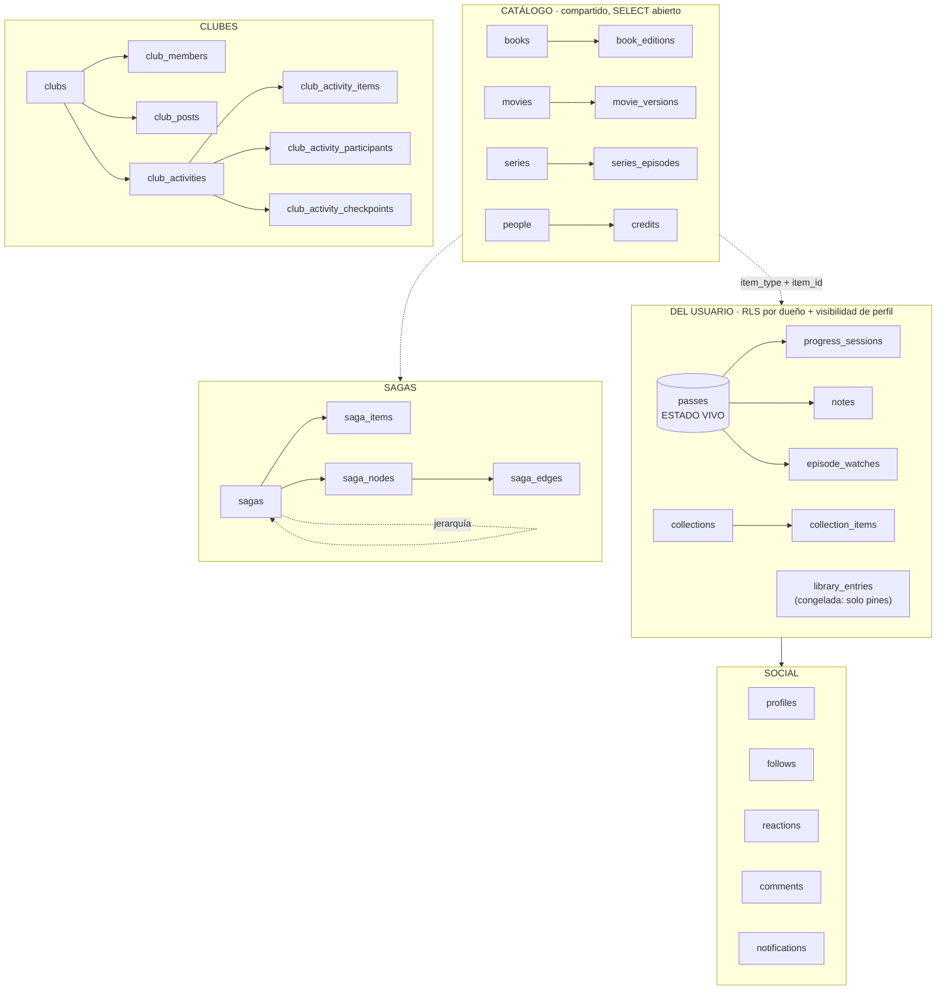

# Modelo de datos

> **[Canónico · verificado contra prod el 2026-07-21; delta de eventos de club verificado el 2026-07-22]**

> Parte de [Requisitos y alcance](../REQUIREMENTS.md). Sección §3.
> **Este es el documento canónico del esquema.** Verificado contra producción el
> **2026-07-21**: 42 tablas, todas con RLS activa. Donde otro doc lo contradiga,
> manda este — y varios docs antiguos aún dicen `diary_entries`, que **ya no existe**
> (ver §0).

## 0. Dos renombres que invalidan la doc antigua

**`diary_entries` se llama `passes` desde julio de 2026** (migración `pass_hub_c_rename`).
Cualquier doc, plan o spec anterior que hable de `diary_entries` se refiere a esta tabla.

**`library_entries` está CONGELADA.** Fue la tabla de progreso original, y buena parte
de la doc vieja aún la presenta así. Ya no lo es: **el estado vivo del usuario vive en
`passes`**. `library_entries` sigue existiendo porque conserva `pinned_order`
(sus columnas de cola se borraron con la retirada de colas, ver más abajo), pero **su
`status` y su `position` no se actualizan** — leerlos
da datos de hace meses. Esto ya ha causado dos bugs reales en producción (avance de sagas
al 0%, PR #96). Regla: **cualquier feature que necesite el estado del usuario lo deriva de
`passes`, nunca de `library_entries`.**

## 1. La forma general

Arquitectura: **"columna vertebral compartida"**. Los metadatos, que varían mucho por tipo,
viven en tablas separadas y tipadas (`books`/`movies`/`series`); todo lo que es del usuario
es polimórfico vía `(item_type, item_id)`. Añadir un hobby nuevo = **1 tabla de metadata +
su integración de API**, reutilizando RLS, queries y UI de progreso.

`item_type` es el enum `book | movie | series`. La referencia polimórfica no tiene FK real
a catálogo (no se puede apuntar a tres tablas), así que **la integridad de `item_id` es
responsabilidad de la app**.

## 2. Catálogo (compartido entre usuarios)

`books`, `movies`, `series` — metadatos por tipo (autoría, portada, sinopsis, año, géneros).
Se rellenan **cache-as-you-go** desde APIs externas (OpenLibrary/Google Books, TMDB).
`SELECT` abierto a cualquiera, incluso anónimo — hace falta para renderizar perfiles
públicos y son metadatos no sensibles. `INSERT`/`UPDATE` autenticado.

Tres tablas de "tirada concreta" cuelgan del catálogo:

| Tabla | De | Para qué |
|---|---|---|
| `book_editions` | `books` | ISBN, editorial, páginas, idioma, portada de **esa** edición. `is_primary` marca la canónica |
| `movie_versions` | `movies` | Montajes/versiones |
| `series_episodes` | `series` | Catálogo por episodio, cache-as-you-go desde TMDB |

**La escalera de hidratación** (spec de 2026-07-14) manda aquí: la búsqueda **no escribe en
BD**. Son tres peldaños — tarjeta de resultado (memoria) → ficha de obra (se crea al abrirla)
→ edición (al registrarla). Por eso la tarjeta de búsqueda no lleva editorial ni páginas:
son de una tirada, no de la obra.

`people` + `credits` guardan autoría/dirección/reparto, también polimórfico por
`(item_type, item_id)`.

## 3. El pase: el hub del estado

**`passes` es la tabla central del usuario.** Una fila por *pase* — una lectura o visionado
concreto de un ítem. Releer un libro es un pase nuevo, no una edición del anterior.

Columnas que importan: `user_id`, `item_type`/`item_id`, `status` (`media_status`:
`planned|in_progress|completed|dropped`), `is_active`, `position` (jsonb), `rating`,
`review`, `is_public`, `started_on`/`finished_on`, `edition_id`, y `pinned_order` (las de
cola se borraron, ver «`queues` ya no existe»).

- **`is_active`** distingue el pase en curso de los cerrados. Solo uno activo por ítem.
- **El pase es dueño de la nota y la reseña**, no la entrada de biblioteca: cada relectura
  puede tener su propia valoración.
- **`position` es jsonb** porque es lo único que varía por tipo: `{"page": 42}` en libros,
  `{"season": 2, "episode": 5}` en series. **No se valida en BD** — es el trade-off aceptado
  a cambio de no replicar la vertical entera por cada tipo nuevo.
- ⚠️ **`rereadCount` NO es el ordinal del pase**: cuenta los pases CERRADOS. El actual es
  +1. La primera lectura siempre sale bien, así que el fallo pasa desapercibido hasta que
  alguien relee.

Cuelgan del pase:

- **`progress_sessions`** — sesiones de lectura/visionado. `position` es el punto
  ALCANZADO. `started_at` (añadido en plan 05) permite saber la franja horaria real;
  `created_at` es cuándo se registró, que no es lo mismo.
- **`episode_watches`** — un episodio visto. **La existencia de la fila = visto**;
  `rating`/`review` son opcionales.
- **`notes`** — notas y citas de «Memorizar». Además de `pass_id`/`session_id` (ambas
  opcionales), `item_type`/`item_id`, `kind` (`note|quote`, con `CHECK`) y `body`: desde
  `20260721_notes_social_columns.sql` suma `meta jsonb not null default '{}'::jsonb`
  (metadata libre por tipo de nota), `is_spoiler boolean not null default false`,
  `is_public boolean not null default false` y `parent_note_id uuid null references
  notes(id) on delete set null` (cita → nota hija; borrar la cita padre no arrastra la
  hija). Índices: `idx_notes_user` (`user_id, created_at desc`, preexistente),
  `idx_notes_item` (`user_id, item_type, item_id`, para la lista de la ficha) e
  `idx_notes_parent` (parcial, `where parent_note_id is not null`). **RLS: solo
  dueño (4 políticas). `is_public` se escribe pero no hay política de lectura pública** —
  ver `decisiones.md`.

**Las series no tienen `progress_sessions`**: se miden en episodios. Cualquier orden por
"última sesión" las manda al final si no se contempla.

## 4. Organización del usuario

| Tabla | Qué |
|---|---|
| `collections` | Colecciones (v2): nombre, descripción, `visibility`, orden, `is_sorteable` |
| `collection_items` | Ítems de una colección, polimórfico + `position` |
| `challenges` | Retos con ventana y criterio. **Absorbió las metas anuales** (las 3 columnas `annual_goal_*` de `profiles` se migraron aquí y se eliminaron) |

`profiles.daily_goal_minutes` **no** se fusionó: no es un reto, es el objetivo diario.

### `queues` ya no existe (dev 2026-07-20 · prod 2026-07-21)

La tabla `queues`, las columnas `queue_id`/`queue_order` (de **`passes` y `library_entries`**)
y el RPC `reorder_queue` **se borraron** en `20260720_drop_queues.sql`. Al integrar
Colección v2, la pestaña «Colas» dejó de pintarse y quedó inalcanzable: ningún enlace
llevaba a `?tab=colas`. Lo único que seguía aportando —acotar el sorteo a un subconjunto
propio— lo hacen ahora las **colecciones marcadas `is_sorteable`**.

**Aplicada en los dos entornos.** Dev el 2026-07-20; **prod el 2026-07-21** (issue #122),
una vez confirmado que el despliegue de producción (`b491279`) ya no contenía ninguna
referencia a colas y que las 3 colas que quedaban estaban **vacías** (0 pases y 0 entradas
con `queue_id`). Con esto dev y prod vuelven a tener el mismo esquema.

⚠️ **Orden de despliegue, no negociable — la razón por la que estuvo un día a medias:** el
`DROP` va **después** de desplegar el código que deja de leer `queues`. Mientras las tres
fichas llamaban a `getQueues()` en cada carga, borrar la tabla en producción habría roto
`/libro`, `/pelicula` y `/serie` enteras. Por eso se aplicó primero solo en dev y se esperó
al despliegue. **El patrón se generaliza a cualquier `DROP`: código primero, esquema
después** — y anotar el pendiente como issue para que no se quede a medias (`AGENTS.md`).

**`collections.is_sorteable`** (`boolean not null default false`, migración
`20260720_collections_sorteable.sql`) marca qué colecciones se ofrecen en el filtro del
sorteo (§7.28). Es opt-in porque el usuario tiene ~19 colecciones y ofrecerlas todas hacía
el filtro inservible. El pool del sorteo es entonces **colección ∩ pases `planned` activos**.

## 5. Social

`profiles` (username único, `is_public`, `role`, más las dos del onboarding: **`interests`**
`item_type[]` —los tipos que declaró en el paso 1; null = sin responder, y entonces el flujo
asume los tres— y **`onboarded_at`**, que **ES el gate** de `/onboarding`: con valor, el
asistente no se vuelve a mostrar. Ojo, «tener perfil» y «estar onboardeado» son cosas distintas
desde julio de 2026, y confundirlas ya rompió el asistente una vez), `follows` (con `follow_status`
`pending|accepted` — a perfil público es aceptado directo), `reactions` y `comments`
(polimórficos vía `target_kind`), `notifications`, `push_subscriptions`.

`target_kind` conserva el valor histórico **`diary_entry`** aunque la tabla se llame
`passes`: renombrar un valor de enum en uso habría requerido migrar datos por una etiqueta.

## 6. Clubes

`clubs` → `club_members` (rol `member|moderator|owner`, estado `invited|active|requested`),
`club_posts` (+ `club_poll_options`/`club_poll_votes`), `club_reads` (contador de novedades).

Actividades: `club_activities` (enum `activity_kind`: `buddy_read | tierlist |
list_challenge | criteria_challenge | evento`; ciclo `proposed → active → finished |
archived`) con sus satélites `club_activity_items`, `_participants`, `_opinions`,
`_placements`, `_checkpoints`, `_checkpoint_reads`.

**`config` (jsonb) es opaco a la BD**: lo interpreta la app según el `kind`. Ahí viven el
criterio del reto, los tiers de la tierlist y el `completionMode` del reto por lista.

### `evento` — actividad no participativa (dev y prod, 2026-07-22)

Quinto `kind` de `club_activities`, distinto de los otros cuatro en que **nace `active`
directamente** (nunca pasa por `proposed`) y no tiene pool de ítems ni participantes: sus
filas dejan sin usar `config`, `ends_on`, `spawned_from_*` y los tres satélites
`club_activity_participants`/`_items`/`_opinions` (kind nuevo en vez de tabla nueva,
aplicando SD-8 — ver `decisiones.md`). Solo usa `title`, `description` y `starts_on`.
"Pasado" se **deriva** de `starts_on < hoy` al leer (`isPastEvent`,
`src/lib/clubs/activities/group-activities.ts`); no hay ninguna transición ni columna que
lo persista. Sin ficha propia (`hasDetailView: false` en su `ActivityKindDefinition`).

Dos RPCs `SECURITY DEFINER`, moderador+ (`has_min_club_role(club_id, 'moderator')`),
migración `supabase/migrations/20260722_club_event_rpcs.sql`:

- **`create_club_event(p_club_id, p_title, p_description, p_starts_on) returns uuid`** —
  necesaria porque la política de INSERT de `club_activities` fuerza `status = 'proposed'`,
  y un evento nace `active`.
- **`update_club_event(p_activity_id, p_title, p_description, p_starts_on)`** — el UPDATE
  que la tabla no tiene (SD-8 la dejó sin política UPDATE, transiciones solo por RPC).
  **Restringida a `kind = 'evento'` y a `status = 'active'`**: sin el filtro de `kind`, esta
  RPC (gateada solo por rol) reabriría la edición arbitraria de cualquier
  `buddy_read`/`tierlist`/`list_challenge`/`criteria_challenge` que SD-8 evitó al no crear
  la política UPDATE; el filtro de `status = 'active'` (añadido durante la implementación,
  no estaba en el diseño original) impide reescribir un evento ya archivado. Archivar
  reutiliza `archive_club_activity` sin tocarla.

El enum se añade en `supabase/migrations/20260722_activity_kind_evento.sql`, sola en su
fichero porque Postgres prohíbe usar un valor de enum en la misma transacción que lo añade.

**Aplicadas en dev (`supabase-dev`) el 2026-07-22; prod queda pendiente** — aplicación
reservada explícitamente al usuario, no ejecutada en la sesión que cerró esta feature.

## 7. Sagas

`sagas` es **jerárquica** (`parent_saga_id`): las subsagas son sagas reales anidadas.
`saga_items` da la pertenencia (multi-membresía, con `is_primary`), y el grafo relacional
son `saga_nodes` (mixtos: apuntan a un ítem **o** a una saga hija) + `saga_edges`
(`principal | opcional | requisito`).

**La regla de cómputo del progreso (§1.5 del spec) es una sola** y vive en
`src/lib/sagas/main-order.ts`: el denominador es el **orden principal** — con grafo, los
nodos con `order_no`, expandiendo recursivamente los nodos-saga; sin grafo, los miembros por
`position`. Los opcionales no penalizan. Tenerla duplicada ya causó el issue #91 (el hero
decía 2/7 donde la card decía 2/5).

Desde el issue #170, esa regla **descarta los nodos huérfanos** (nodo-ítem que apunta a algo
que no es miembro: `saga_nodes.item_id` no tiene FK y `save_saga_graph` no valida la
membresía). Antes contaban en el denominador pero `buildSagaGraph` no los pintaba, así que
ese avance no podía llegar nunca al 100%.

### 7.1 Escritura de `saga_items` (issue #169)

`saga_items` tuvo el INSERT abierto a cualquier `authenticated` **a propósito**, porque el
enriquecimiento automático de colecciones TMDB escribe con el cliente del usuario al abrir
una ficha. Desde `20260722_saga_items_rls_hardening.sql` ese camino pasa por dos funciones
`SECURITY DEFINER` **acotadas a sagas TMDB** (`source = 'tmdb'` y `tmdb_collection_id` no
nulo) y las tres operaciones de escritura exigen ya `collaborator`:

| función | qué hace |
|---|---|
| `link_tmdb_saga_item(p_saga_id, p_item_id)` | alta de una película en su colección; resuelve `is_primary` y el reintento ante carrera |
| `sync_tmdb_saga_items(p_saga_id, p_items)` | rellenado perezoso: inserta lo que falte y corrige posiciones, sin borrar nada |

**Aplicadas en dev (`supabase-dev`) el 2026-07-22; prod pendiente.** Ojo al orden: en prod la
migración debe aplicarse **después** de desplegar el código, no antes — cerrar el INSERT con
el código viejo en pie rompería la hidratación TMDB para los usuarios sin rol.

## 8. Seguridad

Las 42 tablas tienen **RLS activa**. Patrones:

- **Catálogo**: SELECT abierto (incl. anónimo), escritura autenticada.
- **Contenido de perfil**: el dueño siempre; los demás según `can_view_profile()`.
- **Clubes**: `clubs.visibility` gobierna **descubrimiento**, nunca quién ve el contenido —
  eso lo decide `is_club_member()`.
- **`SECURITY DEFINER` deliberado** donde la función *es* la política: tableros de
  actividad (un participante de perfil privado debe ser visible a sus compañeros),
  `save_saga_graph`, `link_tmdb_saga_item`, `sync_tmdb_saga_items` (§7.1),
  `create_club_poll`, `confirm_checkpoint`. Los advisors los marcan como
  WARN y **está aceptado**: llevan gate interno de rol.
- **Storage no valida JWT ES256**: las subidas de imagen van por service-role en server
  actions, no desde el cliente.

## 9. Enums

| Enum | Valores |
|---|---|
| `item_type` | `book \| movie \| series` |
| `media_status` | `planned \| in_progress \| completed \| dropped` |
| `user_role` | `user \| collaborator \| admin` |
| `activity_kind` | `buddy_read \| tierlist \| list_challenge \| criteria_challenge \| evento` (`evento`: 2026-07-22) |
| `activity_status` | `proposed \| active \| finished \| archived` |
| `club_role` / `club_visibility` | `member \| moderator \| owner` / `public \| private` |
| `club_member_status` | `invited \| active \| requested` |
| `notification_type` | `follow_request \| new_follower \| follow_accepted \| review_liked \| review_commented \| club_invite \| club_invite_accepted \| club_post \| club_post_liked \| club_post_commented \| comment_liked \| club_activity_proposed \| club_activity_activated \| club_join_request \| club_join_approved \| club_activity_spawned \| club_event_created` (`club_event_created`: 2026-07-22) |
| `follow_status` | `pending \| accepted` |
| `saga_edge_type` / `saga_node_level` | `principal \| opcional \| requisito` / `principal \| menor` |
| `target_kind` | `diary_entry \| episode_watch \| club_post \| comment \| activity_checkpoint \| club_activity` |

## 10. Migraciones

82 ficheros en `supabase/migrations/`. `supabase/schema-baseline.sql` es el replay ordenado
para levantar un entorno limpio.

⚠️ **Aplicar a prod y actualizar `schema-baseline.sql` es UN SOLO paso, no dos.** Ese fichero
es un replay de PRODUCCIÓN, no de dev, y registra que ya se desincronizó dos veces (notas
2026-07-14 y 2026-07-17) por olvidar exactamente eso. Las dos migraciones de eventos
(`20260722_activity_kind_evento.sql`, `20260722_club_event_rpcs.sql`) se aplicaron a prod el
2026-07-22 y se anexaron al baseline en la misma pasada («ANEXO 2026-07-22»).

⚠️ **El orden del baseline es el de aplicación REAL en producción**
(`supabase_migrations.schema_migrations`), **no el alfabético de ficheros** — varias del
pase-hub se redataron y prod las registra en otro orden.

⚠️ **"No aparece en `list_migrations`" ≠ "no está en prod".** `20260716_list_challenge_completion_mode.sql`
está aplicada pero sin registrar en el ledger. Para comprobar si algo existe de verdad,
mirar los **objetos** (`pg_proc`, `pg_class`), no el ledger.
