# Análisis de features — app de referencia (Bookmory)

> **[Histórico · congelado el 2026-08-19]** Análisis competitivo puntual (2026-07). Parte de su top ya se construyó; valor residual como referencia para features pendientes (etiquetas, método de adquisición).

> Fuente: vídeo de pantalla (3:49) de una app de registro de lecturas y estadísticas — es **Bookmory**, la misma de la que ya importamos bibliotecas (7.7). Todas las capturas de este documento están extraídas del vídeo y viven en [`img/`](./img).
>
> Objetivo: inventariar lo que hace bien, cruzarlo con el estado real de Biblioshare y dejar una lista priorizada con referencias visuales para los mockups posteriores.

---

## 0. Resumen ejecutivo

Bookmory es un tracker **solo-libros, sin capa social**, y toda su fuerza está en dos sitios:

1. **Registro por sesión con tiempo** (no solo páginas): de ahí salen métricas que nosotros no tenemos — minutos leídos, páginas/minuto, tiempo total de lectura, objetivo diario en minutos.
2. **Estadísticas exhaustivas y muy visuales**: donuts por autor/editorial/tipo, histograma de estrellas, calendario con portadas, "Rebobinado" anual, estadísticas por etiqueta.

Biblioshare ya tiene la infraestructura para casi todo (sesiones 7.14, rachas, calendario, objetivos, retos, sagas, importación). Lo que falta es sobre todo **explotación de esos datos** (dashboards) y tres o cuatro piezas de datos nuevas (minutos, precio/ejemplar, etiquetas, notas ancladas).

**Top 6 a robar**, por relación valor/esfuerzo:

| # | Feature | Estado en Biblioshare | Captura |
|---|---|---|---|
| 1 | Panel de estadísticas "profundo" (donuts + histogramas) | Nuevo (existe la data) | [12](./img/12-stats-paginas-tipo.jpg) [13](./img/13-stats-autor-editorial.jpg) [14](./img/14-stats-rating-tiempo.jpg) |
| 2 | Tiempo de lectura en la sesión (min, pág/min, objetivo en minutos) | Parcial (7.14 tiene minutos, no se explota) | [09](./img/09-stats-diarias.jpg) [10](./img/10-stats-diarias-detalle.jpg) |
| 3 | Calendario mensual con portadas | Existe versión simple → mejorar | [07](./img/07-calendario-mes.jpg) |
| 4 | Etiquetas privadas + stats por etiqueta | Backlog 7.5 (pendiente) | [17](./img/17-stats-etiquetas.jpg) [18](./img/18-etiqueta-detalle.jpg) |
| 5 | Random picker con animación de cartas | Backlog 7.28 (pendiente, "aplazado") | [03](./img/03-sorteo-cartas.jpg) [04](./img/04-sorteo-resultado.jpg) |
| 6 | "Rebobinado" / año en resumen | Backlog 7.15 (idea suelta) | [20](./img/20-rebobinado.jpg) |

---

## 1. Home — "¿Qué libro has leído hoy?"

La home es un **hub de tarjetas**, no una lista. Elementos:

- **Tarjeta de lectura activa** con: portada, **"Día N"** desde que empezó, **"Pág. X (00,00%)"** con barra de progreso editable inline, "Desde 14/7/2026", "Primera lectura" (nº de pase), contador de notas, y **dos botones de acción**: ⏱ *cronómetro de sesión* y 📝 *registro manual*.
- Estantería horizontal "Estás leyendo un libro" (multi-lectura simultánea).
- Sección **"Libros para leer más tarde"** (TBR) como carrusel de portadas + botón `+`.

**Para Biblioshare**: ya tenemos `now-consuming` y `progress-panel`. Lo que copiaría es el **"Día N" + primera/segunda lectura + acceso al cronómetro desde la propia tarjeta** (hoy hay que entrar a `/sesion/[entryId]`). Un botón de "empezar sesión" en la tarjeta reduce la fricción del registro diario, que es lo que alimenta todas las estadísticas.

## 2. Home — resto de tarjetas

 

Debajo del TBR: **Lista de deseos** · **Libros comprados** · **Calendario de libros** · **Racha** · **Estadísticas** · **Colecciones** · **Series y sagas** · **Mi biblioteca**. Cada una es una tarjeta con subtítulo y contador ("Hay 32 libros", "19 libros").

La **racha** muestra días + una tira semanal (lun–dom) con check por día leído — nosotros ya tenemos `streak-card` + `weekly-strip`, prácticamente idéntico. ✅

**Para Biblioshare**: nuestra home ya muestra stats. Merece la pena revisar la **jerarquía de tarjetas** (subtítulo + contador + icono grande) porque hace la home navegable sin scroll infinito.

## 3. Sorteo aleatorio ("no sé qué leer") 🎴

 

Tarjeta *"Sorteo aleatorio de libros — ¿Tienes problemas para elegir tu próximo libro?"* → abanico de cartas de tarot → *"Toca una carta para sacar"* → animación dorada y sale un libro del TBR.

Esto es exactamente el **7.28 Random picker**, que en el backlog está marcado como *"barato y autocontenido, aplazado a propósito para el final"*. El vídeo demuestra que el valor no está en la query aleatoria (trivial) sino en **la ceremonia**: es la única parte "divertida" de toda la app. Es un candidato perfecto para un mockup vistoso y para diferenciar Biblioshare.

**Sugerencia**: mantener la mecánica, cambiar la metáfora (cartas de tarot → *lomos de una estantería* de los que sacas uno al azar), y añadir filtros ("tengo 2 horas" ya previsto en 7.28 usando `total_pages` + ritmo personal).

## 4. Dinero: lista de deseos y libros comprados

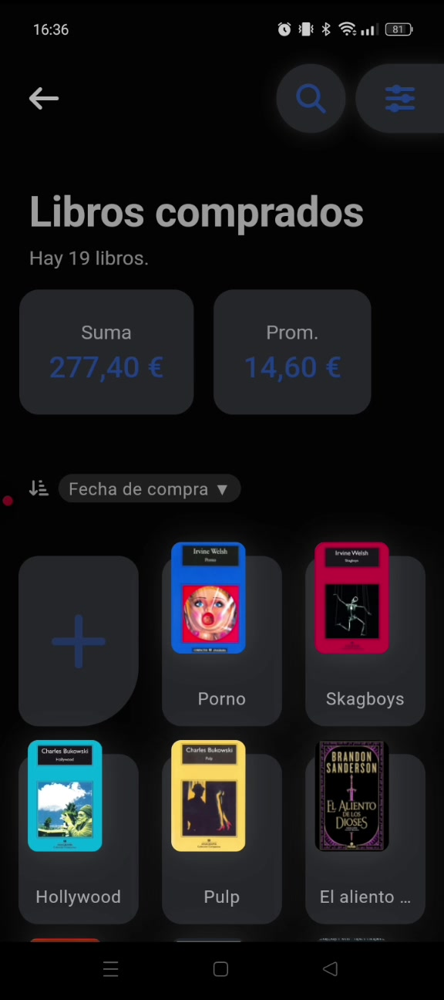 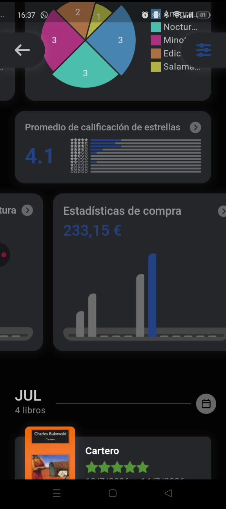

- **Lista de deseos** (wishlist, separada del TBR).
- **Libros comprados**: rejilla de portadas + **Suma 277,40 €** y **Promedio 14,60 €**, ordenable por fecha de compra.
- En estadísticas: **"Estadísticas de compra — 233,15 €"** con barras por mes.

Cruza directo con **7.29 (Método de adquisición y "dinero ahorrado")**, ya decidido para `library_entries.copy_details`. Bookmory se queda corto: solo trackea gasto. Nuestra vuelta de tuerca (comprado / biblioteca / prestado / regalo → **"has ahorrado X €"**) es mejor idea; el vídeo aporta el **cómo mostrarlo** (suma + promedio + barras mensuales).

## 5. Calendario de libros

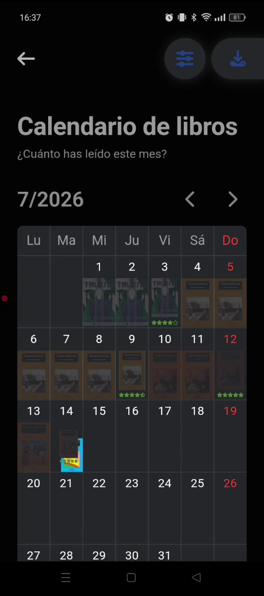

Rejilla mensual donde cada día leído muestra **la portada en miniatura** y una **barra de color** que indica cuánto se leyó ese día. Los días con varias lecturas apilan varias barras. Navegación mes a mes.

Ya tenemos `month-calendar.tsx` + `/api/month-calendar`. La mejora es puramente visual: **portadas dentro de la celda** en vez de un punto/heatmap. Es el componente más "instagrameable" de la app y el que mejor comunica el hábito.

## 6. Ficha de libro

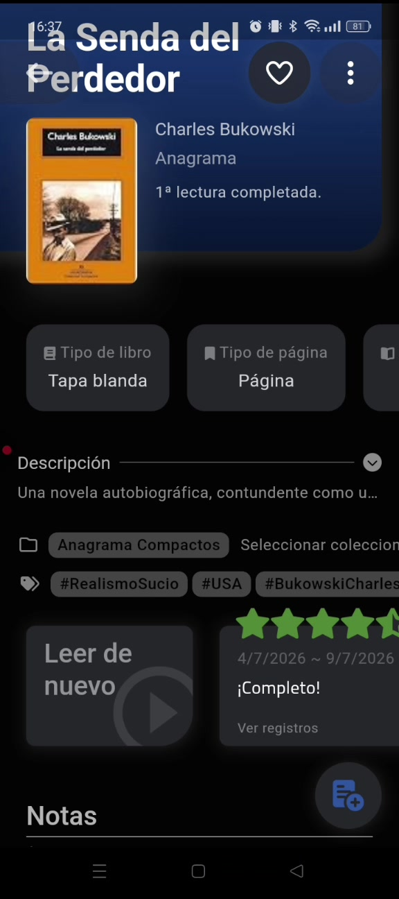

Contiene: portada, autor, **editorial**, ❤️ favorito, *"1ª lectura completada"*, **Tipo de libro** (tapa blanda/dura/digital) y **Tipo de página**, descripción colapsable, **colección** asignada, **etiquetas** (#RealismoSucio #USA #BukowskiCharles), estrellas (media estrella soportada), rango de fechas del pase, botón **"Leer de nuevo"** (relectura), estado **"¡Completo!"**, **"Ver registros"** (historial de sesiones) y bloque de **Notas**.

Casi todo existe ya (7.1 metadatos, 7.13 relecturas, 7.8 ficha). Lo que **no** tenemos: **etiquetas** (7.5), **colección** (7.4, parte pendiente) y el **rating con medias estrellas** (usamos 1–10, equivalente).

## 7. Estadísticas diarias ⭐

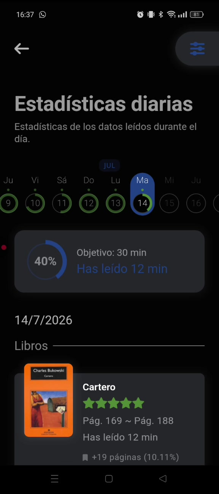 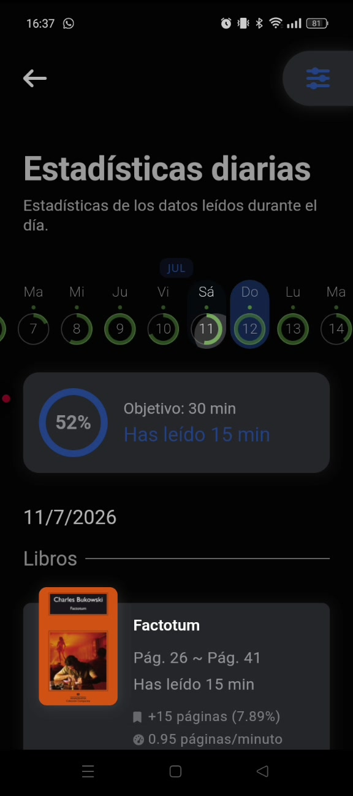

La pieza más valiosa. Por día:

- Anillo de progreso contra un **objetivo diario en minutos** ("Objetivo: 30 min · Has leído 12 min · 40%"). Cuando se supera, marca 412 % sin romperse.
- Selector horizontal de días (círculos con el %).
- Lista de libros leídos ese día con **rango de páginas ("Pág. 169 ~ Pág. 188")**, **páginas leídas (+19, 10,11 % del libro)**, **minutos** y **páginas/minuto (0,95)**.

**Para Biblioshare**: `session-form` ya guarda minutos. Falta (a) **objetivo diario en minutos/páginas** junto a los objetivos anuales que ya tenemos (`goals-form`), y (b) esta **vista diaria**. El dato de **páginas/minuto** (ritmo personal) además desbloquea el "tiempo estimado" de 7.22 y el filtro "tengo 2 horas" de 7.28 con datos reales en vez de una media global.

## 8. Estadísticas anuales

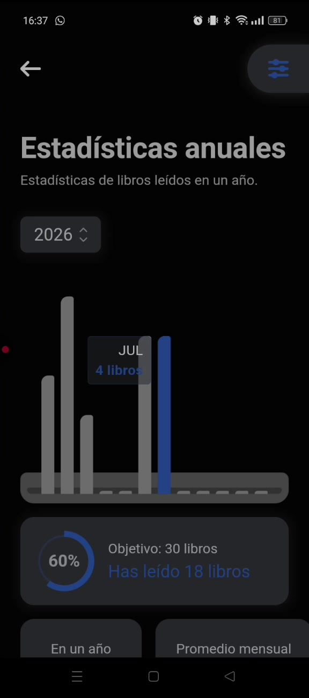 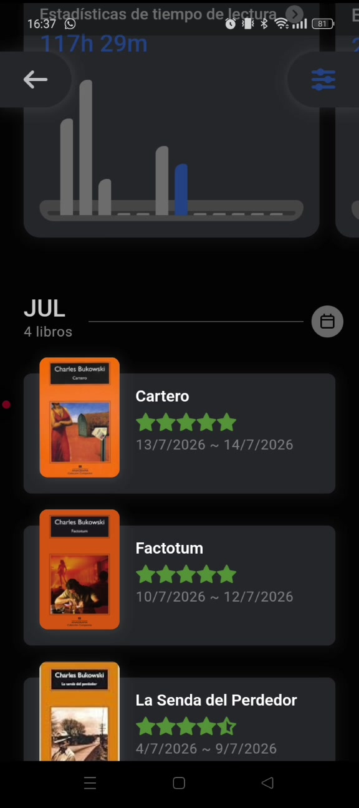

- Selector de año, **barras por mes** (con tooltip "JUL · 4 libros"), anillo de objetivo anual ("30 libros · 60 % · 18 leídos"), y contadores **"En un año / Promedio mensual"** (18 libros / 2,6 libros).
- Debajo, **timeline agrupada por mes** ("JUL · 4 libros") con portada, estrellas y rango de fechas de cada lectura. Es, de hecho, el **diario** — nuestro `diary-panel` con otro formato.

Tenemos `book-goal-card` y `activity-chart`. La diferencia es la **densidad**: todo en una sola pantalla scrolleable, no en pestañas.

## 9. El "muro" de estadísticas: donuts e histogramas ⭐

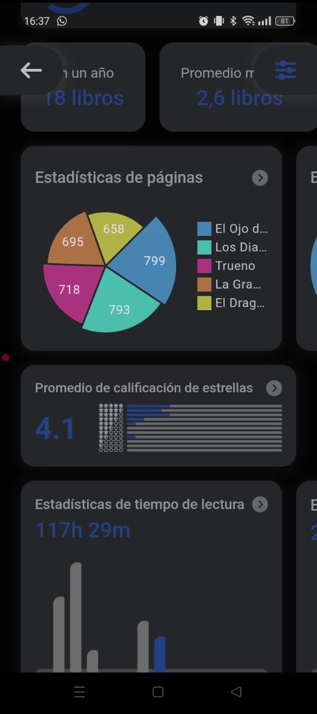 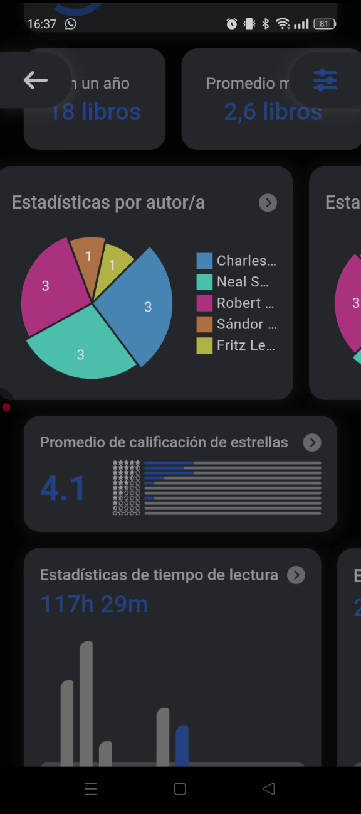 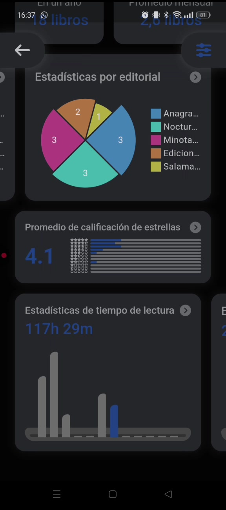

Una rejilla de tarjetas, cada una expandible:

| Tarjeta | Contenido |
|---|---|
| Estadísticas de páginas | Donut de reparto de páginas por libro |
| Estadísticas por tipo de libro | Donut tapa blanda / tapa dura / digital |
| Estadísticas por autor/a | Donut de nº de libros por autor |
| Estadísticas por editorial | Donut por editorial |
| Promedio de calificación | **4.1** + histograma horizontal de estrellas |
| Estadísticas de tiempo de lectura | **117 h 29 m** + barras por mes |
| Estadísticas de compra | **233,15 €** + barras por mes |

Todo esto es **derivable de datos que Biblioshare ya guarda** (autor y editorial vía 7.1/7.34, rating, sesiones, páginas). Es la mejor relación valor/esfuerzo del vídeo: cero migraciones, solo queries + un componente `StatCard` reutilizable.

**Extensión natural nuestra**: como somos multi-hobby, los mismos donuts aplican a **director / plataforma / género** para pelis y series, y podemos añadir un donut **por tipo de ítem** (libros vs pelis vs series) que Bookmory nunca podrá tener.

## 10. Estadísticas por estrellas

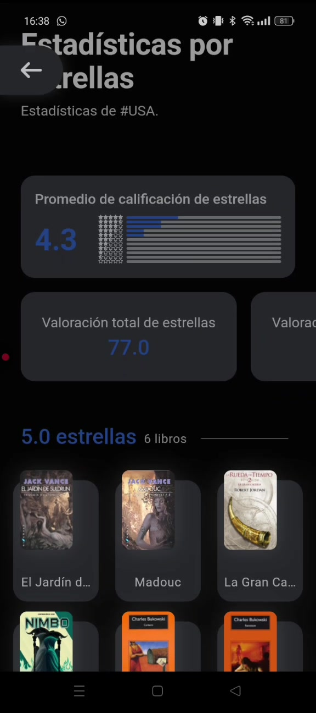

Vista dedicada: promedio (4.3), **valoración total acumulada (77.0)**, estrella más alta/baja/más usada, y **rejilla de portadas agrupada por nota** ("5.0 estrellas · 6 libros"). Muy fácil de portar; es una vista más de "Mi biblioteca" con `group by rating`.

## 11. Etiquetas (#hashtags) ⭐

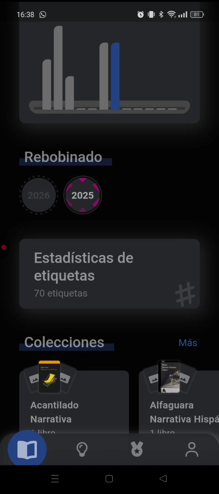 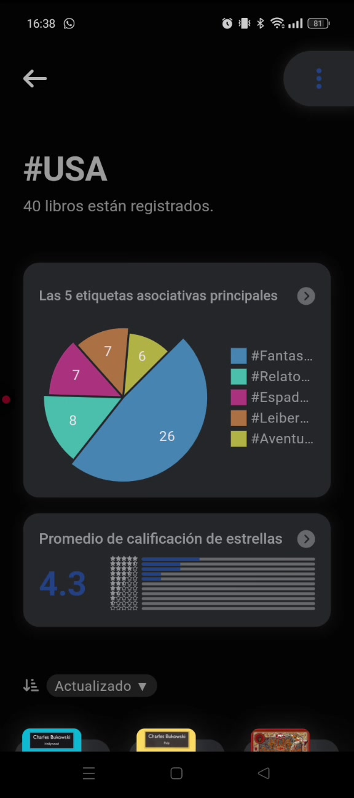

- Vista global: **70 etiquetas**, promedio 4,0 por libro, **donut de las 5 etiquetas principales**, ranking ("1 · #USA · 40 libros, incluyendo *Las Extrañas Aventuras de Solomon Kane*").
- Vista por etiqueta (`#USA`, `#Fantasía`): nº de libros, **donut de etiquetas asociadas** (co-ocurrencia), rating medio de la etiqueta y rejilla de portadas.

Es la implementación completa de **7.5 (etiquetas privadas + stats por etiqueta)**, que en nuestra tabla de priorización ya está en el puesto 3. El **donut de etiquetas asociadas** es el detalle no obvio que merece la pena copiar: convierte las etiquetas en un mapa de gustos.

## 12. Rebobinado (año en resumen)

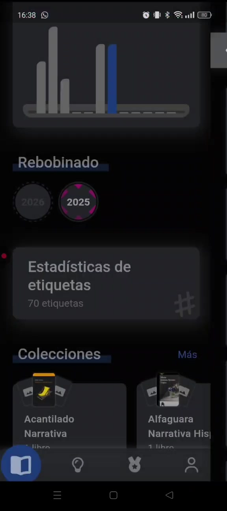

Selector de año (2025/2026) que rebobina toda la app a ese año. Es la semilla de **"Tu año en Biblioshare" (7.15)**. Bookmory lo resuelve como *filtro temporal global*, no como una retrospectiva narrativa tipo Spotify Wrapped — nosotros podemos hacer **las dos cosas**: el filtro (barato) ahora, la retrospectiva compartible después.

## 13. Colecciones

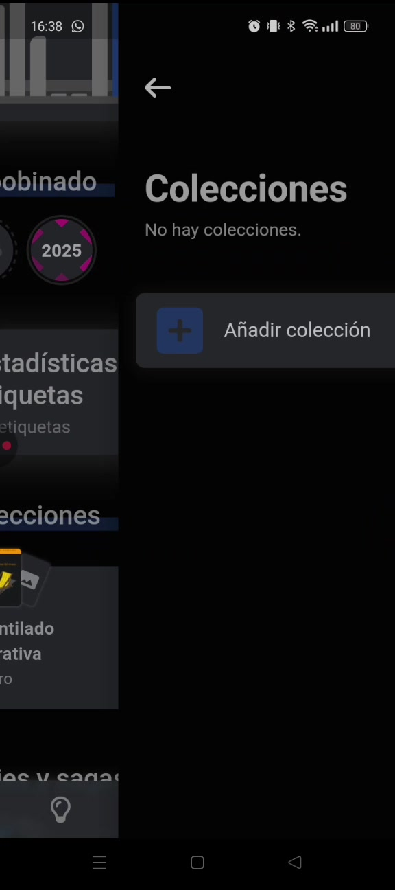 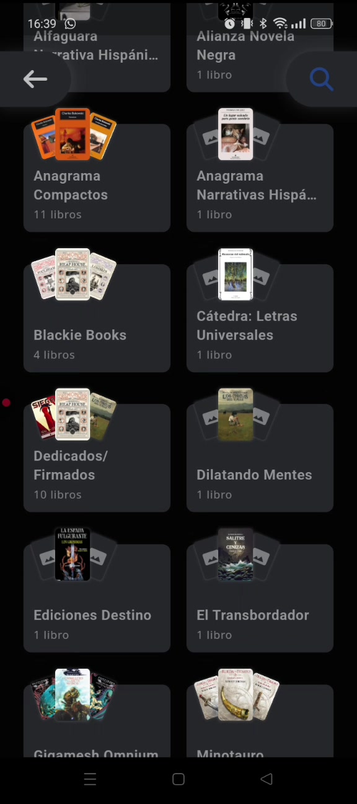

22 colecciones / 63 libros. Cada colección es una tarjeta con **portadas apiladas en abanico** y contador. Ordenables por nombre/valoración. Aquí las usa como *editoriales/sellos* ("Anagrama Compactos", "Biblioteca Ray Bradbury", "Dedicados/Firmados"), lo que demuestra que la colección libre cubre casos que una taxonomía cerrada no.

Es exactamente la parte **pendiente de 7.4** (colección/lista privada del usuario). Nota de UX: para borrar una colección obliga a **teclear un número de confirmación** — fricción excesiva, no copiar eso.

## 14. Series y sagas

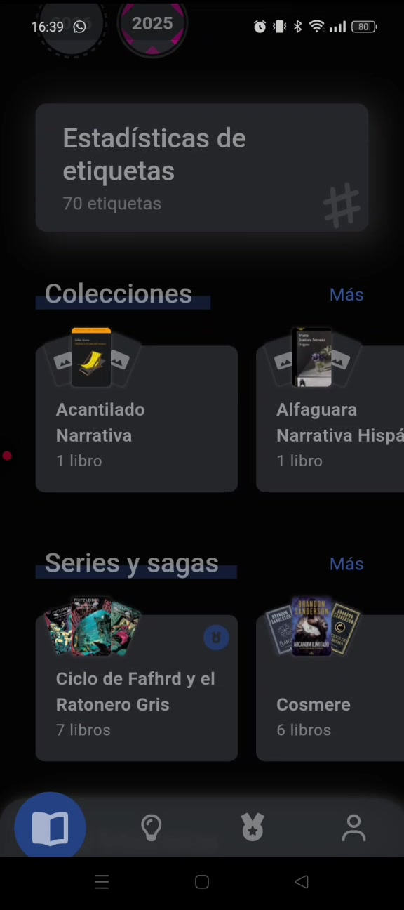 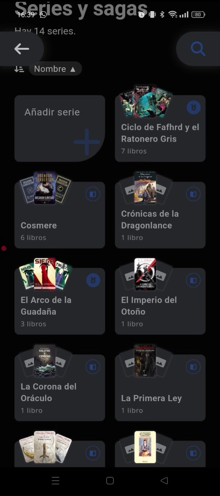

14 series. Badge **"En curso"**, orden por **número dentro de la saga** (#0, #1, #2…), contador de libros, y los huecos de la saga que no tienes se ven igualmente. Ya lo tenemos (7.34, `/saga/[id]`) — sirve como validación de diseño, no como feature nueva. La ordenación explícita por `número de serie` y el badge "En curso" sí son detalles a incorporar.

## 15. Mi biblioteca

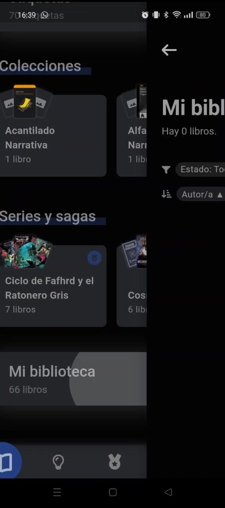 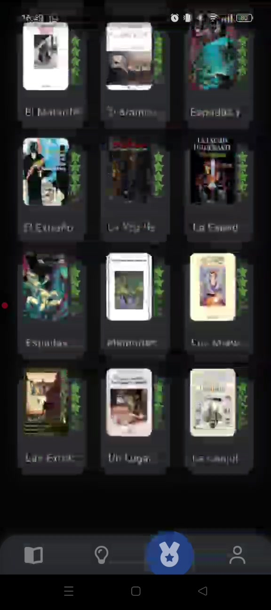

66 libros, filtros por **Estado / Tipo / Autor** y orden configurable, rejilla densa de portadas con estrellas superpuestas. Equivale a nuestro 7.12 (ya hecho). El **muro de portadas a pantalla completa** es un buen recurso visual para el perfil público (7.9) y para la OG image.

## 16. Notas / "Memorizar" ⭐

 

Sección propia en la navegación inferior (icono 💡):

- Cabecera *"Memorizar — ¡Has escrito 69 notas!"* con dos accesos: **Notas aleatorias** ("¡Lee tus notas!") y **Notas favoritas**.
- Cada nota: portada + libro + autor, **página a la que está anclada (Pág. 188)**, fecha, cuerpo del texto, chip **"Contenido del libro"** (cita literal vs pensamiento propio), y acciones: ✔️ · ❤️ favorito · 📋 copiar · 💬 comentar · 🖼️ **exportar como tarjeta** · ⋮.

Esto une **7.24 (notas ancladas al punto de progreso)** y **7.27 (citas y frases destacadas, exportables como tarjeta)**. La idea más fuerte y más barata: **"Notas aleatorias"**, que resucita lo que subrayaste hace meses. Convierte las notas de un cajón de escritura en algo que se *consume*.

---

## 17. Mapeo contra el backlog de Biblioshare

| Feature del vídeo | Biblioshare | Acción |
|---|---|---|
| Racha + tira semanal | ✅ hecho (`streak-card`, `weekly-strip`) | — |
| Calendario mensual | ✅ hecho (versión simple) | Mejorar: portadas en celda |
| Sesiones de lectura | ✅ hecho (7.14, con minutos) | Explotar: vista diaria + pág/min |
| Objetivo anual de libros | ✅ hecho (7.10, `goals-form`) | Añadir **objetivo diario en minutos** |
| Diario / timeline por mes | ✅ hecho (`diary-panel`) | Reformatear como timeline con portadas |
| Sagas numeradas | ✅ hecho (7.34) | Añadir badge "En curso" |
| Filtros en mi biblioteca | ✅ hecho (7.12) | — |
| Relecturas ("Leer de nuevo") | ✅ hecho (7.13) | — |
| **Panel de stats profundo (donuts)** | ❌ nuevo (data ya existe) | **Prioridad 1 — sin migraciones** |
| **Stats diarias (min, pág/min)** | 🟡 parcial | **Prioridad 2** |
| **Etiquetas + stats por etiqueta** | 🟡 backlog 7.5 | **Prioridad 3** — añadir donut de co-ocurrencia |
| **Colecciones libres** | 🟡 backlog 7.4 (mitad hecha) | Prioridad 4 |
| **Notas ancladas + aleatorias + export** | 🟡 backlog 7.24 + 7.27 | Prioridad 5 — "notas aleatorias" es el gancho |
| **Random picker con ceremonia** | 🟡 backlog 7.28 (aplazado) | Reconsiderar: es el momento "divertido" de la app |
| **Precio / libros comprados** | 🟡 backlog 7.29 | Reutilizar formato: suma + promedio + barras/mes |
| **Rebobinado anual** | 🟡 backlog 7.15 | Empezar por el filtro por año (barato) |
| Lista de deseos separada del TBR | ❌ nuevo | Dudoso: `planned` ya cubre el 80 % |
| Tipo de libro (tapa dura/blanda/digital) | ✅ 7.1 (encuadernación) | — |
| Confirmación por código al borrar | ❌ | **No copiar** (antipatrón) |

## 18. Lo que Bookmory NO tiene (y nosotros sí)

Útil para no perder el norte al copiar: nada de **social** (perfiles públicos, clubes, seguidores), nada **multi-hobby** (solo libros) y nada de **web/PWA** (solo móvil). Las estadísticas de Bookmory son un *solitario*; las nuestras pueden ser **comparables entre perfiles y agregables por club** — ese es el añadido que ninguna de estas pantallas contempla.

## 19. Siguiente paso

Mockups de, por este orden:

1. `/estadisticas` — el muro de tarjetas (donuts + histogramas + tiempo + compra), con la variante multi-hobby.
2. Vista de **estadísticas diarias** con objetivo en minutos y páginas/minuto.
3. **Calendario con portadas**.
4. **Notas / citas** con "notas aleatorias" y exportación como tarjeta.
5. **Sorteo aleatorio** con su ceremonia.

Las capturas de referencia de cada uno están enlazadas en las secciones correspondientes.
