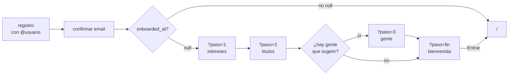

# Onboarding — diseño

Fecha: 2026-07-20 · Plan 07 (transversal) §2.4 · Maqueta `Biblioshare - Onboarding.html` (13/07/2026)

## 1. Problema

**Hoy no hay onboarding.** `src/app/onboarding/` son 132 líneas y la página **redirige de
largo**: el `@usuario` se elige en el registro, así que `createProfileFromMetadata()` crea el
perfil y manda a `/`. El formulario que queda es solo red de seguridad para cuentas antiguas
o para el caso raro de que el nombre se lo quedara otro mientras confirmabas el email.

El recorrido real de alguien que se registra hoy es: **confirmar email → home vacía**. Sin
biblioteca, sin gente a la que seguir y sin ninguna indicación de por dónde empezar.

La maqueta propone 3 pasos + bienvenida: intereses → primeros títulos → gente y clubes.

### Contexto que condiciona el diseño (medido en prod, 2026-07-20)

| Dato | Valor | Consecuencia |
|---|---|---|
| Perfiles | 6 (tú + cuentas de prueba) | El paso 3 saldría casi vacío |
| Clubes públicos | 2 | Ídem |
| Obras en catálogo | 165, casi todas sembradas por nosotros | «Populares» no significa mucho todavía |
| `profiles.interests` | **no existe** | El paso 1 no tenía dónde aterrizar |

## 2. Decisiones

| # | Decisión | Por qué |
|---|---|---|
| **D1** | **Los intereses SE PERSISTEN y se consumen de verdad** (§5). | Preguntar algo que no cambia nada es decoración. Es el mismo criterio que tumbó «Gasto» en el plan 05. |
| **D2** | **El paso 3 se construye, pero se omite solo** cuando no hay nada que sugerir (§4.3). | Una pantalla vacía en el onboarding es peor que no tener el paso. El umbral es una constante, para subirlo cuando haya masa social. |
| **D3** | **El paso 2 usa una rejilla del catálogo**, no un buscador. | Cero fricción; no obliga a pensar un título. Riesgo aceptado: con 165 obras las sugerencias son poco representativas — se mitiga con el orden de §4.2 y mejora solo al crecer el catálogo. |
| **D4** | **Una ruta con `?paso=N`**, no subrutas ni estado de cliente. | Cada paso es una URL real (atrás y reanudar funcionan) con un **único gate**. Encaja con `?tab=`, `?filtro=` y `?periodo=`, que el proyecto ya usa. Deja los pasos como Server Components. |
| **D5** | **`onboarded_at` se escribe al llegar a la bienvenida**, no antes. | Si se marcara al primer vistazo, cerrar la pestaña sin querer te dejaría sin onboarding para siempre. Coste asumido: quien abandona a mitad lo vuelve a ver — terminar cuesta **3 clics en «Saltar»**. |
| **D6** | **Los 6 perfiles existentes se marcan como ya-onboardeados.** | Que a nadie le salte el flujo retroactivamente. Para probarlo, poner `onboarded_at` a `null` en dev. |
| **D7** | **Reutilizar `addExistingItemToLibrary`**, no escribir alta nueva. | Ya crea el pase en `planned` vía `applyTransition` y **es idempotente**. Los ítems de la rejilla ya tienen fila de catálogo, así que no hace falta el `findOrCreate` de `addToLibrary`. |

## 3. Flujo

El gate vive en `page.tsx` y cubre los cuatro pasos. Cada paso tiene **«Saltar»**, que avanza
sin escribir nada.

## 4. Los pasos

### 4.1 Paso 1 — «¿Qué te gusta seguir?»

Tres tarjetas (Libros / Películas / Series) con el dot del color del tipo
(`MEDIA_ACCENT[type].bg`). **Selección múltiple, mínimo una** para continuar.

Saltar no escribe nada, y a partir de ahí el flujo se comporta **como si estuvieran marcados
los tres** — nunca como si no hubiera ninguno.

### 4.2 Paso 2 — «Añade algo para empezar»

Rejilla de portadas del catálogo, **filtrada por los intereses**.

Orden: **nº de usuarios distintos con un pase de esa obra** ↓, desempate por **tener
portada**. Se **descarta** lo que no tenga portada ni año — con 165 obras eso es lo que
separa una rejilla digna de un muro de placeholders.

Tocar una portada la añade en `planned` (D7) y la marca como seleccionada; volver a tocarla
la quita. El botón cuenta, como la maqueta: «Continuar · 3 añadidos».

### 4.3 Paso 3 — «Encuentra a tu gente»

Perfiles públicos (distintos del propio) y clubes públicos a los que unirse, con las acciones
de seguir y unirse que ya existen.

**Se omite entero** si no hay **al menos 3 perfiles públicos ajenos o 1 club público**. Al
omitirse, el paso 2 lleva directo a la bienvenida y el indicador dice «Paso 2 de 2» en vez de
«de 3». El umbral es una constante exportada, para subirlo sin tocar la lógica.

### 4.4 Bienvenida

«Todo listo, {display_name o username}» + un solo botón, «Entrar a Biblioshare», que escribe
`onboarded_at` y redirige a `/`.

Si se añadieron títulos, una línea de refuerzo con cuántos. Si no, **texto neutro: no se
regaña a quien saltó**.

## 5. Datos

Una migración. Dos columnas en `profiles`:

| Columna | Tipo | Notas |
|---|---|---|
| `interests` | `item_type[]` nullable | Respuesta del paso 1. Null = sin responder |
| `onboarded_at` | `timestamptz` nullable | Marca de completado; **es el gate** |

Backfill en la misma migración: `update profiles set onboarded_at = now() where onboarded_at is null` (D6).

### Dónde se consumen los intereses

Lo que evita que el paso 1 sea decorativo:

1. **`/buscar`** abre en el primer tipo de `interests` en vez de en `book` fijo.
2. **`/coleccion`, pestaña «Todo»**: si no hay `?type=` explícito y el usuario marcó **exactamente un** interés, el filtro de tipo arranca en ese.
3. El propio paso 2, que filtra la rejilla.

> **Corregido durante la revisión del plan.** La versión anterior de este punto
> decía «abre en la pestaña de ese tipo», y eso es **imposible**: Colección v2
> reorganizó las subpestañas a `colecciones | todo | sagas | colas` — **no hay
> pestaña por tipo**. Lo que sí existe es el filtro `?type=` dentro de «Todo»,
> que es donde se aplica. La pestaña de entrada **no se toca**: cambiarla sería
> un efecto mayor del pretendido para quien solo quería declarar un interés.

Los tres son **lecturas opcionales**: con `interests` null, todo se comporta exactamente como
hoy. Ninguna es un cambio de comportamiento observable para los usuarios actuales, que quedan
con `interests` null tras el backfill.

## 6. Casos límite

| Caso | Comportamiento |
|---|---|
| `?paso=` ausente, inválido o fuera de rango | Se normaliza al paso 1. **Sin 404** |
| `?paso=3` con el paso 3 omitido | Redirige a la bienvenida |
| Sin sesión | `redirect("/login")`, como el resto de rutas privadas |
| Un tipo sin obras suficientes | La rejilla no deja huecos; si queda vacía del todo, texto y dejar continuar |
| Perfil aún sin crear (metadatos) | Se conserva `createProfileFromMetadata()` antes del gate |
| Volver atrás desde la bienvenida | Permitido; `onboarded_at` ya escrito ⇒ el gate manda a `/` |

**Nada de `loading.tsx` en esta ruta.** No llama a `notFound()`, pero el gate hace
`redirect()` y no merece la pena acercarse a la regla del 404 (ver `docs/TRAMPAS.md` §4).

## 7. Verificación

**Unidad** — sobre lo puro, sin BD:
- normalizar `?paso=` (ausente, `0`, `9`, `"abc"`, `"fin"`);
- decidir si el paso 3 se omite, según los umbrales;
- ordenar y filtrar la rejilla (descarta sin portada; ordena por nº de usuarios; desempata).

**E2E** — registro nuevo de punta a punta:
- recorrido completo (intereses → 2 títulos → bienvenida) y que los títulos aparecen luego en
  la colección;
- recorrido saltándolo todo;
- **al volver a entrar ya no aparece** (el gate funciona).

**Navegador** — 400px y 940px, claro y oscuro.

⚠️ La suite e2e completa **no se corre de una tacada** en esta máquina: se trocea en grupos
de 2–3 specs (`docs/TRAMPAS.md` §5).

## 8. Fuera de alcance

Avatar y bio (se editan en el perfil), objetivo diario (vive en Estadísticas), tutorial o
tooltips de la interfaz, e importar desde otro servicio (ya existe `/importar` como ruta
propia).
