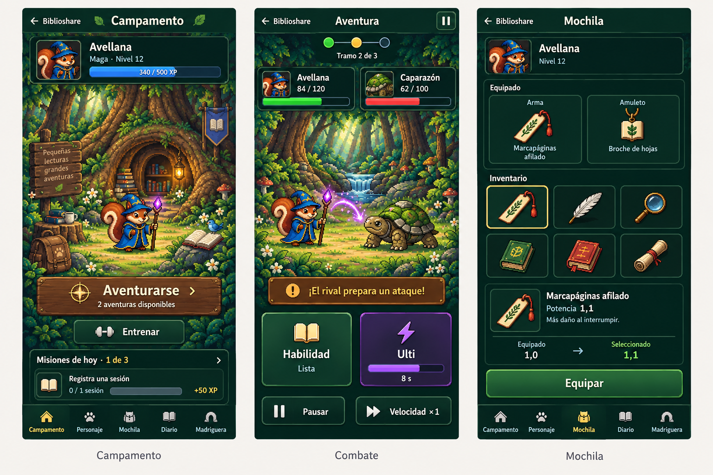
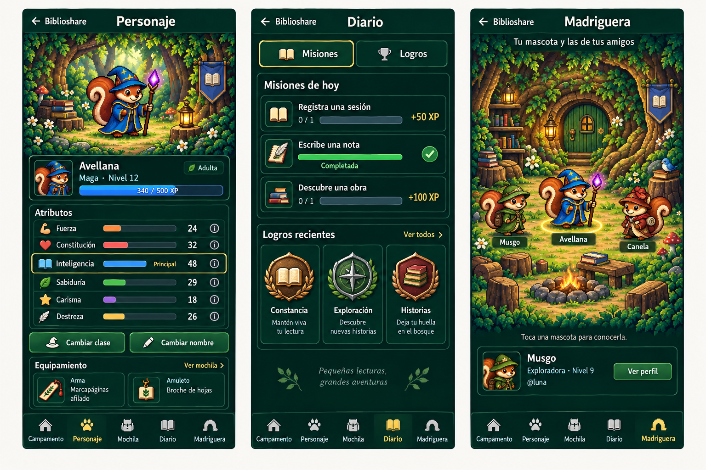

# Mascota: interfaz de RPG de bosque

> [Histórico · congelado el 2026-09-09 · diseño aprobado e implementación local
> verificada; publicación pendiente, issue #1165]
>
> Este documento conserva el contrato aprobado. Estado actual en los documentos
> canónicos; evidencia en `docs/testing/2026-09-09-mascota-rpg-ui.md`.

## 1. Resultado acordado

Convertir `/mascota` en una experiencia de videojuego coherente, conectada a
Biblioshare. El usuario ha aprobado el bosque pixel, la distribución de las seis
pantallas y una revisión con marcos más ligeros. El verde bosque se mantiene igual
en ambos temas de la app. El acceso **«← Biblioshare»** permanece visible en todas
las pantallas, también en combate.

La revisión del código local encontró la ficha, madriguera, atributos, misiones,
logros y ajustes en una columna; aventuras y entrenamiento aparecen después.
Los contenedores editoriales se repiten incluso alrededor de la arena. El inventario
vive dentro de aventuras como listas desplegables. El rediseño cambia esa jerarquía.

No añade sistemas de juego: conserva reglas, premios, disponibilidad de aventuras,
clases, atributos, etapas, objetos, efectos, autoridad del servidor y versiones del motor.

## 2. Referencias elegidas

Generadas con la herramienta integrada `image_gen`, tomando las láminas anteriores
y el sheet real `public/pet/sheets/adult/wizard.png` como referencias. Son mockups,
no capturas de software implementado ni assets listos para publicar.

**Qué manda en ellas:** composición, jerarquía, bosque, paneles verdes, marcos finos,
controles táctiles y navegación. **Qué manda en el código:** nombres de clases y
objetos, estadísticas, disponibilidad, recompensas y comportamiento de acciones.
Las cifras, insignias y algunos objetos dibujados son ilustrativos. No introducir
«Broche de hojas», una clase «Exploradora» u objetos adicionales por aparecer en
la imagen. Usar catálogo y traducciones existentes.

Correcciones acordadas respecto a los mockups:

- La selección de Madriguera debe señalar a la mascota cuya ficha aparece debajo.
- Quitar lemas decorativos y textos inventados que no ayudan a actuar.
- No duplicar pausa en la cabecera y el pie; mantener un control claro y accesible.
- Las misiones completas conservan sus datos coherentes: ningún resumen «1 de 3»
  puede coexistir con tres misiones incompletas.
- No usar emojis como sustituto de la iconografía del proyecto.

## 3. Navegación y conexión con Biblioshare

Cinco destinos permanentes: **Campamento, Personaje, Mochila, Diario, Madriguera**.
Combate es un estado enfocado al que se llega desde Campamento, tanto para aventura
como para entrenamiento. Durante el combate se oculta la navegación del juego,
pero no el regreso a Biblioshare. La pantalla de resultado permite volver al
campamento, continuar/reintentar cuando corresponda, repetir y consultar el botín.

La raíz sigue siendo `/mascota`. La sección se representa mediante un parámetro
de URL validado; entradas desconocidas caen en Campamento. La navegación interna
no debe desmontar la sesión de combate ni iniciar solicitudes de combate por
seleccionar una pestaña. Atrás/adelante deben restaurar la sección, con foco en su
encabezado y sin reproducir celebraciones ya consumidas.

El marco de la app se oculta solo para `/mascota` y sus descendientes reales;
no para `/admin/mascota` ni rutas de nombre parecido. Se reutiliza la frontera
`ChromeGate` bajo `Suspense`. La compañera flotante no se superpone al propio juego.
No se añade un segundo elemento `main`: lo aporta `AppShell`.

**Regreso:** registrar la última ubicación interna ajena al juego al entrar desde
Biblioshare. El enlace vuelve a esa ubicación, conservando su consulta; si no hay
origen válido, vuelve a `/` (Inicio). Validar mismo origen y rechazar login, onboarding,
logout, rutas de acciones y el propio juego. No usar `history.back()` como único
mecanismo ni aceptar destinos externos desde parámetros.

La última sección del juego se recuerda por usuario y pestaña del navegador.
La URL explícita prevalece sobre esa preferencia. Una entrada directa sin historial
funciona y muestra Campamento. Cambiar de cuenta no recupera navegación privada,
inventario ni combates de la cuenta anterior.

## 4. Las pantallas

### Campamento

Escena de raíces y madriguera con el sprite real de la mascota. Identidad, clase,
nivel y XP en un HUD compacto; bellota y todas las etapas son estados válidos.
Acción principal contextual: aventurarse, continuar el intento abierto o reintentar
según el estado real. Sin oportunidades se ofrece «Ver aventura» para poder recuperar
un resultado confirmado mientras el usuario estaba fuera; entrar no inicia un intento.
Explicar la falta de oportunidades si no puede empezar;
entrenamiento sigue accesible como acción secundaria. Resumen de misiones con
avance real y enlace a Diario. El CTA no debe exigir recorrer atributos o ajustes.

En escritorio, escena central y panel lateral de misiones dentro del ancho útil.
En móvil, identidad, escena y acción principal preceden a los detalles secundarios.

### Personaje

Sprite, identidad, etapa y barra de XP. Seis atributos con valores reales y atributo
principal señalado. La procedencia de cada atributo se consulta con un control
desplegable accesible; se conserva toda la explicación actual sin exhibirla a la vez.
Cambiar clase y nombre son acciones secundarias, con cancelación, estado de envío
y errores visibles. Dos ranuras resumen el equipo actual y enlazan a Mochila.

Eclosión y selección inicial de clase adoptan el mismo lenguaje visual. Mantener
nombre obligatorio, sugerencia de clase, validación y feedback de bellota preparados
en `HatchForm`/`ClassPicker`. No es preciso tener una mascota para ver el estado
social permitido por el comportamiento actual.

### Mochila

Dos ranuras, `weapon` y `amulet`, y cuadrícula de las copias poseídas. Agrupar por
objeto de forma compacta, pero permitir seleccionar cada copia y comparar su
potencia; no perder copias por agrupar iconos. El panel de comparación conserva
efecto exacto, valores y fecha de obtención disponibles hoy.

Seleccionar no equipa. **Equipar** hace la escritura existente, muestra pending,
error o confirmación; permite quitar equipo. Marcar por separado seleccionado y
equipado. El botín recién ganado aparece una vez y puede sugerirse para comparación.
Equipo vacío y colección vacía ofrecen indicación útil. Las restricciones y efectos
sobre aventuras abiertas se explican según el contrato actual de snapshots.

### Diario

Dos vistas: Misiones y Logros. Las tres misiones del día muestran avance y premio
reales, con completadas distinguibles sin depender solo de color. La recompensa
es automática: no inventar botones de reclamar ni misiones nuevas.

Logros conserva todas las familias existentes, nivel ganado, siguiente umbral,
fecha y estados vacío/completo. Presentación como colección de insignias; no
reemplazar la lógica por las tres insignias decorativas de la referencia. Cualquier
resumen deriva de la misma colección que la vista completa.

### Madriguera

Escena de reunión donde seleccionar las mascotas reales ya autorizadas por los
datos actuales. Mantener límites de vecinos, expansión, nombres largos, ausencia
de seguidos/mascotas y enlace al perfil. La ficha seleccionada y la marca visual
deben coincidir; al desaparecer un vecino también desaparece su selección.

El estilo inmersivo se limita al juego. Las madrigueras embebidas en clubes y las
mascotas de perfiles deben conservar su composición apropiada a Biblioshare.

### Combate, ulti y resultado

Arena principal; vida, barrera, rival y tramo visibles; técnica y ulti accesibles
con el pulgar. La fase del rival y sus avisos tienen prioridad sobre el registro.
Mantener cooldowns, velocidad, pausa, feedback de efectos, puzle de ulti, interludio,
resolución pendiente, error/reintento, repetición y resultado del servidor.

El entrenamiento selecciona los rivales disponibles con un selector visual de
juego, sin convertirlo en una aventura con premios. La ulti conserva su mecánica,
cancelación sin consumo y restauración de foco. El resultado con botín permanece
visible tras `router.refresh()` y no desaparece al agotarse los días disponibles.

## 5. Salir y recuperar un combate

La conservación al volver forma parte de la propuesta aceptada. El código actual
aporta log local de inputs/tick para aventura; entrenamiento instancia la sesión
sin almacenamiento. Por tanto no basta con añadir un enlace de salida.

- Al salir explícitamente, pausar y persistir tick e inputs antes de navegar.
- Guardar también el identificador de intención necesario para recuperar el
  entrenamiento existente. Separar aventura/entrenamiento y cuenta en las claves.
- Reanudar en el mismo navegador reconstruye desde la versión/seed/snapshot que
  devuelve el servidor y el log local. Nunca confiar en un resultado guardado por
  el navegador ni conceder botín desde él.
- El regreso ofrece **Continuar**; no avanza ticks hasta la acción del usuario.
  Conservar interludios. Un puzle de ulti no confirmado se cancela sin consumo.
- Recuperar no crea otro intento, no gasta otra oportunidad ni duplica equipo.
- Una resolución en curso se reconcilia con el resultado del servidor al regresar.
  Una sesión terminada no se restaura como combate abierto.
- Si almacenamiento está bloqueado/lleno o el log es inválido, no anunciar guardado
  correcto. En la salida explícita, mantener pausa y ofrecer permanecer o salir
  indicando el límite de recuperación. Se respeta la degradación existente para
  recarga/cierre inesperado, sin prometer recuperación entre dispositivos.
- Probar cambio de cuenta y limpieza de punteros obsoletos. No guardar credenciales
  ni snapshots completos como autoridad local.

## 6. Sistema visual y arte

Tokens locales al contenedor del juego, idénticos en claro y oscuro: bosque oscuro,
texto crema legible, bordes musgo finos y acentos de estado con contraste. La app
fuera del juego conserva sus tokens. Documentar esta excepción en `DESIGN.md` y
`docs/UI-GUIA.md` cuando se implemente.

Tipografía legible; el carácter RPG procede del escenario, sprites, disposición,
barras e interacción. Relieves suaves y madera moderada en la acción principal.
No marcos gruesos ni esquinas doradas en todas las cajas. El arte no debe hacer
ilegibles los números o desplazar los controles fuera de la pantalla.

Reutilizar `PetSprite`, `CombatSprite`, iconos de botín y badges existentes.
Los fondos se producen por separado, sin personajes, texto, botones o datos
horneados. Los mockups no se recortan para convertirlos en una interfaz plana.
Crear candidatos en `.superpowers/brainstorm/2026-09-09/`; publicar solo los fondos
elegidos con nombres explícitos y peso optimizado. Para sprites nuevos o sustituidos
en `public/pet/`, seguir PixelLab y el agente `pet-artist`, conforme a AGENTS.md.
La aprobación de los mockups no autoriza sustituir los sprites por sus ilustraciones.

## 7. Límites técnicos y arquitectura propuesta

`src/app/mascota/page.tsx` mantiene identidad y lecturas de sesión bajo `Suspense`.
No introducir `use cache` sobre datos personales. Los paneles reciben snapshots
serializables; los slots de servidor, incluida Madriguera, conservan la frontera
actual. Una lectura de aventura alimenta disponibilidad, equipo y mochila.

Separar el contenedor/navegación del juego de la presentación de personaje y de la
sesión de combate. Mantener una sesión estable durante navegación interna; evitar
duplicar `TrainingPanel` para móvil/escritorio. El layout cambia mediante CSS.
Extraer presentación de arena/controles/resultado solo donde facilite esta separación;
no reescribir el motor ni sus versiones congeladas.

Puntos de entrada confirmados en código:

| Responsabilidad | Ficheros actuales |
|---|---|
| Página y lecturas | `src/app/mascota/page.tsx`, `src/components/pet/adventure/adventure-section.tsx` |
| Marco de aplicación | `src/components/nav/app-shell.tsx`, `chrome-gate.tsx`, `fullscreen-routes.ts` |
| Personaje/eclosión | `src/components/pet/pet-detail.tsx`, `hatch-form.tsx`, `class-picker.tsx`, `rename-form.tsx` |
| Misiones/logros/social | `src/components/pet/mission-board.tsx`, `achievement-grid.tsx`, `burrow.tsx` |
| Aventura/equipo | `src/components/pet/adventure/adventure-panel.tsx`, `src/components/pet/loot/equipment-panel.tsx` |
| Combate y persistencia | `src/components/pet/training/training-panel.tsx`, `training-session.ts`, `training.module.css`, `ulti-puzzle.tsx` |

Antes de escribir código Next.js, leer las guías relevantes del paquete instalado
en `node_modules/next/dist/docs/`. Traducciones mediante `next-intl`, con revisión
de todas las locales existentes y del glosario. Sin dependencias nuevas para dibujar
paneles ni migración de datos prevista.

## 8. Criterios de aceptación y verificación

1. Comparar capturas reales de las seis pantallas contra las referencias elegidas,
   en móvil de 390 px y escritorio de 1440 px; comprobar además 320 px y zoom 200 %.
   No exigir encajar todo a costa de texto diminuto: permitir scroll en detalle.
2. En temas claro y oscuro, el juego conserva su identidad; al salir, Biblioshare
   recupera el tema y la navegación normales. Un solo `main` y ningún control fijo
   tapa contenido o safe areas.
3. Teclado, foco visible, nombres accesibles, lectores de pantalla, contraste y
   `prefers-reduced-motion`. Reducir movimiento decorativo sin quitar feedback.
4. Eclosión, cambio de nombre/clase, explicaciones de atributos, misiones, colección
   completa de logros y selección/expansión social mantienen su comportamiento.
5. Dos copias del mismo objeto siguen siendo seleccionables; equipar/quitar y
   comparar funcionan; un error no muestra éxito; botín nuevo aparece una sola vez.
6. Aventura y entrenamiento: iniciar, pausar, salir a Biblioshare, regresar y continuar
   preservan intención/tick/inputs sin premios duplicados. Incluir ulti cancelada,
   interludio, resolución pendiente, storage denegado y cambio de usuario.
7. Victoria, derrota, reintento y replay conservan autoridad/versiones del servidor.
   La victoria sigue visible después del refresco y de consumir la última aventura.
8. Ejecutar unitarios afectados y e2e de mascota por lotes pequeños, siguiendo
   `docs/TESTING.md`; usar los specs existentes de entrenamiento, aventuras, equipo,
   madriguera y misiones como base. Añadir cobertura de navegación/recuperación.
9. Build de producción y comprobación en `next start`, no solo dev; credenciales
   persistentes de prueba no se imprimen ni se borran. Limpiar datos de pruebas y
   procesos creados por la sesión.
10. Actualizar `DESIGN.md`, `docs/UI-GUIA.md`, `docs/REFERENCIA-VISUAL.md`, arquitectura
    y backlog canónicos según los cambios realmente implementados. Registrar decisiones
    al final de `docs/requirements/decisiones.md`; cerrar seguimiento solo con evidencia.

## 9. Orden de ejecución previsto

1. Preparar fondos independientes y tokens; armazón, navegación y regreso seguro.
2. Campamento, personaje y eclosión con lecturas compartidas.
3. Separar mochila de aventura; diario y madriguera con todos sus estados actuales.
4. Arena, ulti, resultado y contrato de pausa/recuperación de ambos tipos de combate.
5. Verificación de comportamiento y fidelidad visual; documentación y cierre.

Esta secuencia se desarrolla en un plan de implementación tras revisar este contrato.
La implementación no se da por terminada con tarjetas recoloreadas: exige la
composición del escenario y la navegación aprobadas, conectadas a los datos reales.

## 10. Seguimiento

Seguimiento: https://github.com/borjar20/Biblioshare/issues/1165. El usuario aprobó
expresamente publicar el borrador después de revisar el contrato escrito.
