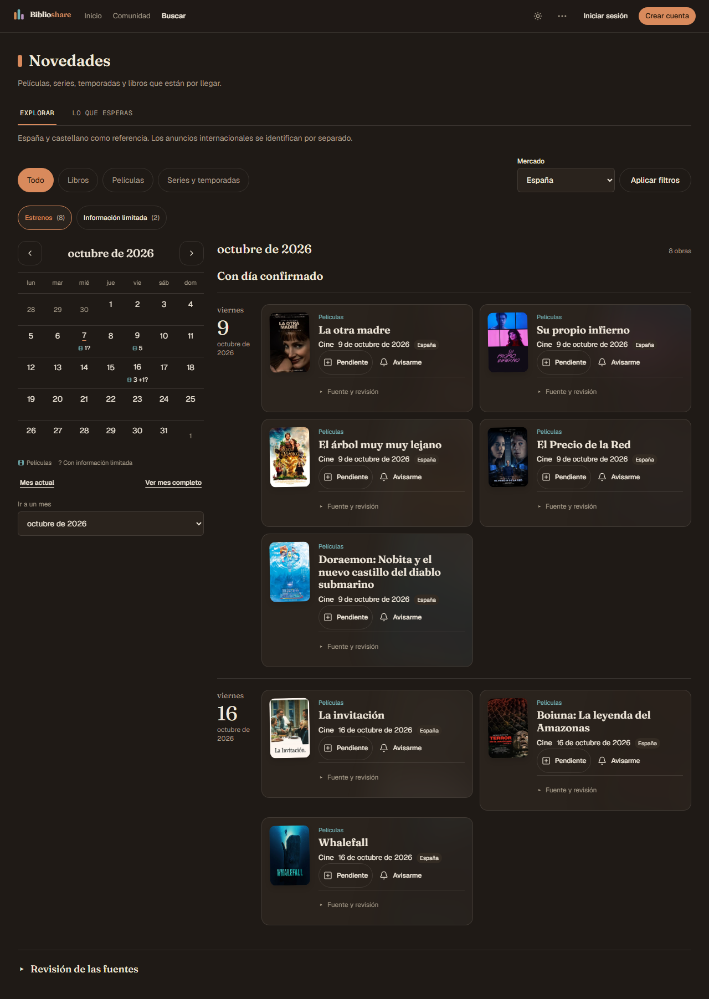
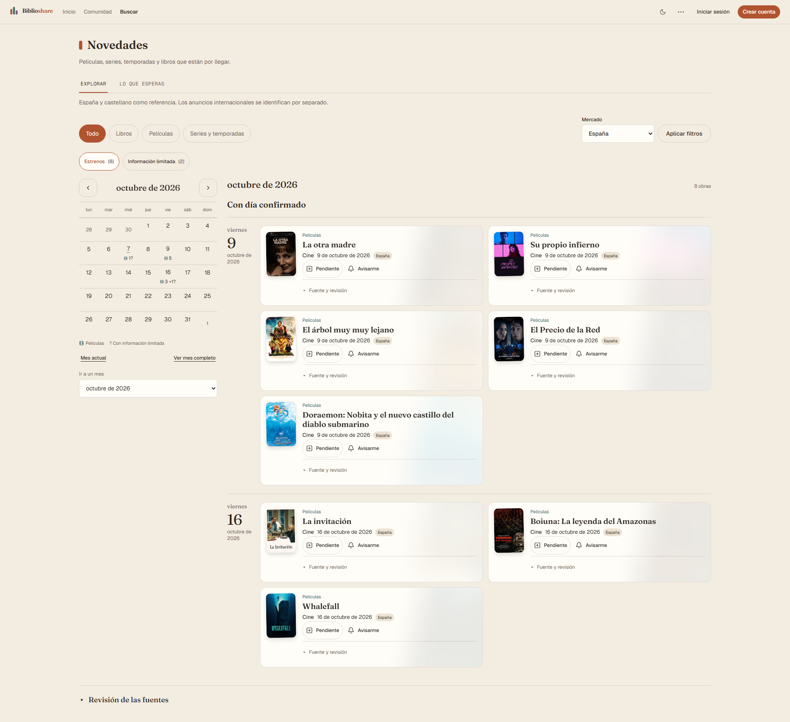
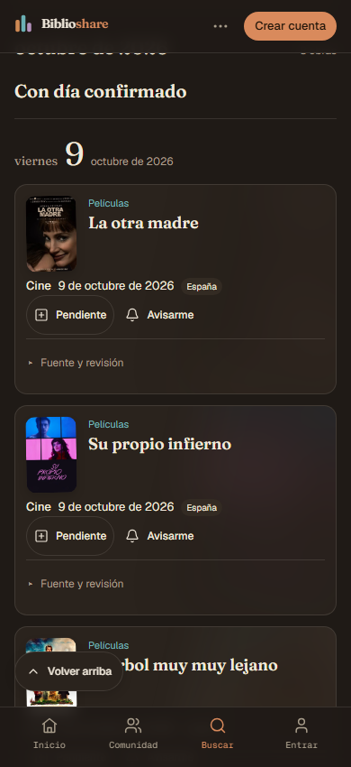
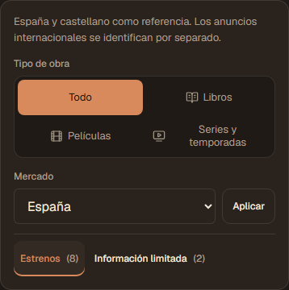
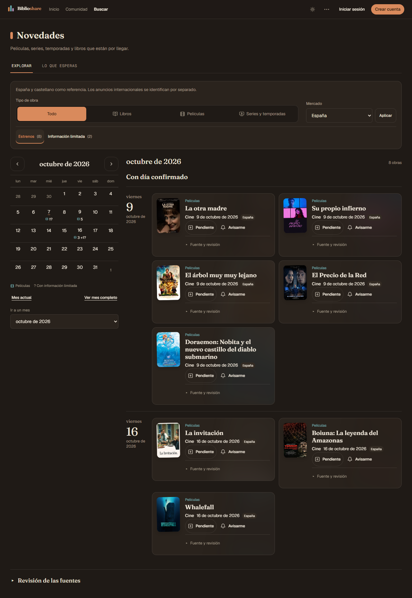
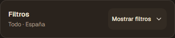
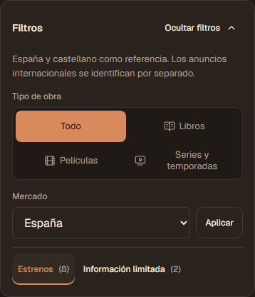

# Novedades — calendario lateral sin cambiar las tarjetas Paper

> **[Verificado localmente · 2026-10-07]** Candidato en codex/novedades-paper,
> PR #1455, sobre el diseño Paper aprobado (65426407). Integración y publicación
> pendientes en #1450. Sin migraciones ni escrituras productivas.

## Resultado

El calendario se añade a un lado de la agenda desde 1024 px y encima en móvil.
La agenda muestra el mes elegido o un día. Estrenos e Información limitada están
accesibles arriba; Sin mes confirmado conserva los anuncios con año o sin fecha.

Las marcas cuentan obras distintas por fecha exacta, incluso si una película tiene
cine y digital en meses diferentes. En la agenda del período la obra aparece una
sola vez y conserva todas sus modalidades y acciones. Los anuncios con mes aparecen
en ese mes sin una marca diaria; año/unknown nunca se sitúa en un día artificial.

Los archivos de Inicio público, ReleaseWorkCard y releases.module.css permanecen
idénticos a 65426407. Se conservan las portadas 72/56 px, títulos 19/18 px, ambiente
de color de la portada, controles de 44 px y fuentes plegables. El calendario tiene
su propia hoja de estilos.

mes/dia/vista usan el History API integrado con useSearchParams. Mes, día y vistas
derivan de los datos recibidos por la petición; no hay otra consulta de Novedades
al navegar el calendario. URL/historial, filtros y login conservan el período.
La ficha enfocada se cuenta en el calendario, se muestra una vez arriba y conserva
su mes implícito al cerrarse mediante un filtro. No se añade caché compartida.

## Evidencia

| Gate | Resultado |
|---|---|
| Modelo, agenda, página y tarjeta/acciones | 65/65 unitarios focales PASS |
| Next 16.3.8 build de producción | PASS; 88 rutas |
| Chromium con next start + Supabase local propio | 22/22 PASS |
| Suite general | 548 archivos / 5438 pruebas PASS; 297,97 s |
| TypeScript global sin incremental y ESLint final | PASS |
| Mapa derivado + whitespace | PASS |
| Revisión independiente de código y tres capturas finales | Sin hallazgos accionables tras las correcciones |

Los 19 recorridos anteriores se conservan, incluidos acciones personales, dos cuentas,
edición/publicación/cancelación editorial, revisión obsoleta, cron/campana y
320/390/768/1280/1920 px claro/oscuro. Los tres nuevos comprueban cine/digital en dos
meses, selección diaria, fechas parciales, historial atrás/adelante, filtro de mercado
que conserva el mes, ausencia de GET RSC adicionales de Novedades, día mixto con
información limitada, ficha enfocada/login y teclado en cuadrícula a 320 px.
Un único día tiene tabIndex=0; flechas mueven foco, Enter elige y Tab sale a Mes actual.

La muestra anterior de diez anuncios públicos reales se sembró sólo en la instancia
local: ocho obras completas y dos limitadas, nueve URLs de portadas reales. Las URLs
se cargaron normalmente en Chromium, sin descargar originales ni alterar producción.
Se tomaron 14 capturas: Inicio/Novedades en 1280 y 1920 px claro/oscuro, 390 px oscuro,
320 px claro, y dos vistas de información limitada. Todas las portadas cargaron;
cero pageerror en esa captura, sin acreditar ausencia global de errores de red/servidor.
Se abrieron seis detalles públicos de la muestra.

| Muestra real | 1280 px | 1920 px | 390 px | 320 px |
|---|---:|---:|---:|---:|
| Novedad sencilla | 195 px | 195 px | 233 px | 233 px |
| Doraemon, título largo | 241 px | 218 px | 233 px | 239 px |
| Ancho de celda del calendario | 48 px | 48 px | 51,14 px | 44 px |

Estas alturas corresponden a la muestra, no son límites del componente. La columna
lateral reduce el espacio de las tarjetas a 1280 px; el texto largo crece sin recorte.
Las portadas conservan su ancho CSS de 72 px (56 px en móvil) y su leve inclinación aprobada.

## Regresiones y ajustes conservados

El modelo inicial falló 12 casos antes de implementarse. La revisión independiente
añadió tres P2 reproducidas en RED: conservar vista limitada en días mixtos, contar
la obra enfocada sin duplicarla y preservar la URL viva de login desde la ficha.
Las tres pasaron tras corregirse. Dos casos más fallaron antes del arreglo: una
modalidad cancelada coexistiendo con otra publicada el mismo día y cerrar un foco
con filtro sin perder su mes implícito.

La primera tanda nativa tuvo 19 PASS/3 FAIL: getByLabel exacto incluía los textos de
las opciones del selector. Se usa su nombre accesible de combobox. La segunda tuvo
21 PASS/1 FAIL porque el observador de red incluía precargas de otras rutas; se
acotó a Novedades. Otra pasada tuvo 21 PASS/1 FAIL por un locator de fecha que vio
también HTML oculto de streaming; ahora se ubica dentro de la cuadrícula accesible.

La inspección de las capturas encontró flechas de mes encogidas: el padding horizontal
de Button prevalecía sobre p-0 y dejaba un SVG de 2 px. La nueva aserción nativa falló
(esperado >=16, real 2). El calendario utiliza px-0 y py-0; no se cambia Button global.
La corrección se recompila y queda incluida en la prueba nativa final.

La comprobación final de tipos detectó exact en ByRoleOptions de Testing Library;
se retiró ese parámetro porque el nombre string ya compara de forma exacta.
Los receipts finales sustituyen estas pasadas fallidas, que se conservan en scratch.

## Alcance de entorno, límites y limpieza

Otra sesión tenía su propia instancia local en 54321. La de esta sesión,
biblioshare-local-3e9edd4c, usó API 55421/DB 55422. El primer arranque falló por el
nombre antiguo inbucket en --exclude; el CLI instalado usa mailpit. La preparación
y activación local posterior pasan. No se detuvo ni escribió en la instancia ajena.

El primer build falló porque cuatro providers de e2e/support fijan 54321. Un wrapper
local los adaptó temporalmente a 55421, con restauración byte a byte en finally.
No se incorporan esas modificaciones a la PR. El límite vive en
[#1458](https://github.com/borjar20/Biblioshare/issues/1458).
El spec admite exactamente loopback 127.0.0.1 en 54321 o 55421.

Next start sigue registrando The destination stream closed early en los recorridos;
las verificaciones de UI/persistencia pasan. La observación previa continúa en
[#1263](https://github.com/borjar20/Biblioshare/issues/1263), sin atribuir aquí su causa.
Esto no acredita una auditoría global limpia de servidor/red.

La muestra se borra por REST antes y después de las capturas. Los E2E limpian actores,
anuncios/pases propios y restauran las fuentes. Se detienen el servidor de captura
y la instancia local propia sin backup. No se gestionan los proyectos ajenos;
Docker sigue activo con otro proyecto local al terminar.
Puerto 3000 libre y sin watchers propios al terminar. El worktree se conserva para la PR.

Recibos locales: calendar-focal-green.log, calendar-review-red.log,
calendar-boundaries-red.log, calendar-label-red.log (PASS del nombre accesible),
calendar-e2e-locator-red.log, calendar-e2e-prefetch-red.log,
calendar-e2e-streaming-red.log, calendar-icons-red.log, calendar-build-final.log,
calendar-e2e-final.log, calendar-unit-full.log, calendar-typecheck-final.log,
calendar-lint-final.log, calendar-preview-result.json y calendar-preview-server.log,
bajo .scratch/novedades-quality/.

Integración/publicación: #1450 y PR #1455. Enriquecimiento diario: #1451.
Curación editorial: #1423. Ninguna se cierra por añadir el calendario.

## Extensión móvil inicial — Volver arriba (2026-10-07)

El usuario pide volver al principio desde la lista móvil. El botón Paper aparece al
superar 480 px de scroll, sólo bajo 768 px, a la izquierda y por encima de la barra
inferior. Regresa a scroll 0 y al foco del título; respeta movimiento reducido y
conserva mes, día, vista y filtros. Funciona también si la consulta de datos falla.

| Comprobación del añadido | Resultado |
|---|---|
| Tres regresiones de aparición, foco/URL y movimiento reducido | RED antes del botón; GREEN después |
| Página y calendario | 26/26 unitarios focales PASS |
| Build Next 16.3.8, TypeScript sin incremental y ESLint | PASS |
| Suite general final | 548 archivos / 5441 pruebas PASS, 280,20 s |
| Recorridos Novedades/Inicio, incluidos dos nuevos móviles | 24/24 PASS, 1,1 min |
| Refuerzo de ocultación desktop con scroll >480 px real | 2/2 móviles PASS, 9,2 s |
| Revisión independiente | Sin hallazgos de código |
| Captura móvil con la muestra real | PASS, 390 px oscuro, vuelta al título y cero pageerror |

Los casos nuevos cubren 320 px sin movimiento reducido, 390 px con movimiento reducido
y sesión, objetivo de 44 px, separación de la navegación inferior, activación con Enter,
scroll 0, foco en h1 y URL intacta. La comprobación desktop aumenta sólo la altura del
body en el navegador de prueba para garantizar scroll >480 px y distinguir ocultación
por CSS de ausencia de scroll suficiente.

La muestra real mide botón 121×44 px, x=16/y=722 en 390×850 px; termina en y=766,
17 px antes de la barra inferior (y=783). La captura conserva las mismas tarjetas.
Es una comprobación de la posición en esa muestra, no ausencia de toda oclusión posible.

La primera suite general coincidió con bootstrap/build local y registró dos timeouts
de 5000 ms: contraste-tokens (11.006 ms de escaneo) y revalidate-guard (14.204 ms).
Resultado inicial: 2 FAIL/5439 PASS. Ambos archivos permanecen intactos; su repetición
aislada pasó 81/81 en 1,64 s (tests 833 ms). La suite final sin bootstrap/build simultáneo
pasa 5441/5441, sin aumentar límites ni omitir casos. La causa de la lentitud sigue
sin confirmar en [#1459](https://github.com/borjar20/Biblioshare/issues/1459).

Una sesión ajena ocupó transitoriamente 3000: no se detuvo su servidor, se esperó a
que quedara libre. La QA siguió usando sólo la base propia en 55421 y los providers
temporales descritos arriba, restaurados sin diff. La muestra se borra por REST y
el servidor/base propios se detienen después de capturar. No hay migraciones nuevas
ni acceso a datos productivos. Los errores de streaming conservan el seguimiento #1263.

Recibos del añadido en .scratch/novedades-quality/: mobile-top-red.log,
mobile-top-green.log, mobile-top-build.log, mobile-top-lint-final.log,
mobile-top-typecheck.log, mobile-top-e2e.log, mobile-top-desktop-proof.log,
mobile-top-unit-overlap-red.log, mobile-top-scans-recheck.log,
mobile-top-unit-final.log y mobile-top-preview-result.json.

## Ajuste posterior — botón a la derecha (2026-10-07)

Por petición del usuario, el control se ancla al borde derecho con margen de 16 px y
safe-area. La captura y las medidas anteriores documentan la colocación inicial.
Si está la compañera, se eleva para que los dos controles sigan accesibles.

Comprobación aislada en Chromium con el CSS real: ocho combinaciones de
320/390/767/1280 px, con/sin una caja representativa de la compañera (93 px,
altura máxima sobre su base obtenida del manifiesto actual). Se verifica margen
derecho, altura táctil de 44 px, separación de barra/mascota, recepción del puntero
por el botón y ocultación desktop. PASS 8/8. No es una nueva prueba del flujo de datos;
los recibos del ajuste son mobile-top-right-layout.log y mobile-top-right-layout.json.

## Ajuste posterior — filtros agrupados Paper (2026-10-07)

Tipo de obra, Mercado/Aplicar y las vistas con sus contadores se agrupan en una sola
superficie Paper. La segmentación es 2×2 en móvil y de cuatro columnas desde 640 px;
Mercado y Aplicar comparten fila. Las vistas quedan al pie con separación visual.
El componente de vistas se extrae de la agenda para componerlo en el panel, conservando
mes/día/vista, conteos y navegación sin nuevas consultas. Las tarjetas e Inicio
aprobados permanecen intactos.

| Comprobación del ajuste | Resultado |
|---|---|
| Regresión del panel agrupado y estado de URL/formulario | RED antes del cambio; GREEN después |
| Página, calendario, modelo, presentación y tarjetas | 69/69 unitarios focales PASS, cinco archivos |
| Build Next 16.3.8, TypeScript sin incremental y ESLint final | PASS |
| Suite general final | 548 archivos / 5442 pruebas PASS, 286,09 s |
| Recorridos nativos completos contra build/start local | 27/27 PASS, 1,1 min |
| Tres casos del panel, con encuadre final de captura | 3/3 PASS, 11,0 s |
| Revisión independiente de código y visual | Sin hallazgos accionables |
| Capturas con metadatos públicos reales | Panel a 320/390 px oscuro, 390 px claro y página a 1280 px oscuro |

Los tres casos nuevos comprueban región agrupada, tipos con objetivo mínimo de 44 px,
Mercado/Aplicar alineados, cambio de vista con teclado, contadores de meses vacíos,
aplicación de mercado conservando el mes y ausencia de overflow horizontal. La primera
tanda fue 26 PASS/1 FAIL: un anuncio de libro cancelado creado por el caso administrativo
entraba legítimamente en el mes consultado. El test se acota a películas y avanza dos
meses para independizarse de ese fixture y del día de ejecución. No se cambia el
producto para ocultarlo; la tanda completa posterior pasa 27/27.

La muestra visual utiliza diez anuncios públicos (ocho completos, dos limitados,
nueve portadas reales), insertados sólo en la base local propia y borrados al terminar.
Diez capturas: cuatro páginas, cuatro paneles y dos vistas limitadas. Portadas cargadas,
cero pageerror y ausencia de overflow en los cuatro contextos. No acredita ausencia
global de errores de consola/servidor: el streaming conocido conserva #1263.
Los providers temporales de QA para 55421 se restauran sin diff. Sin cambios de esquema,
escrituras productivas ni datos privados. Integración/publicación siguen en #1450.

Recibos en .scratch/novedades-quality/: filters-group-red.log,
filters-group-green.log, filters-group-build.log, filters-group-types-final.log,
filters-group-lint-final.log, filters-group-e2e-fixture-red.log,
filters-group-e2e-final.log, filters-group-screens-final.log,
filters-group-unit-full.log y filters-preview-result.json.

## Ajuste posterior — panel ocultable (2026-10-07)

El panel aprobado está abierto inicialmente. Ocultar filtros/Mostrar filtros cambia
sólo su visibilidad: cerrado resume el tipo y mercado aplicados; el cuerpo permanece
montado para conservar cambios pendientes de aplicar. El botón mantiene el foco y
expone aria-expanded/aria-controls. Los controles ocultos no participan en la
navegación accesible. No cambia URL, período ni vista.

| Comprobación del plegado | Resultado |
|---|---|
| Regresión de visibilidad, borrador de mercado, vista y URL | RED antes del control; GREEN después |
| Página, calendario, modelo, presentación y tarjetas | 70/70 focales PASS, cinco archivos |
| Build Next 16.3.8, TypeScript sin incremental y ESLint | PASS |
| Tres casos durables del panel en 320/390/1280 px | 3/3 PASS, 10,1 s, build/start local |
| Revisión independiente de código y visual | Sin hallazgos accionables |
| Capturas con muestra pública real | 18 capturas PASS, cuatro contextos; cero pageerror/overflow |

Los casos nativos añaden Enter/Espacio, foco retenido, objetivo de 44 px, cuerpo
oculto, mercado sin aplicar conservado y altura plegada menor de 140 px. La muestra
real cubre 320/390 px oscuro, 390 px claro y 1280 px oscuro, en abierto y cerrado.
La primera expectativa de vista del unitario usó limited; se corrige al parámetro
público limitadas. No se modifica el resolver ni el comportamiento de vistas.

La tanda completa de 27 casos del apartado anterior precede a este ajuste. Su
intento de repetición se detuvo antes de ejecutar tests porque 3000 está ocupado
por un next dev de otra sesión, en el checkout d7df. No se detiene ese servidor.
La comprobación actual de los tres casos públicos usa un único next start temporal
en 3030 con la build propia y la base desechable propia 55421. No hay segundo next dev
ni cambios de configuración versionada/providers; no se repiten aquí los recorridos
autenticados con retorno de login. La CI de publicación sigue en PR #1455/#1450.
Los errores de streaming conocidos conservan #1263; cero pageerror no acredita
limpieza global de consola/servidor. Se borran los fixtures por REST y se detienen
servidor/base propios. Sin migraciones ni escrituras productivas.

Recibos en .scratch/novedades-quality/: filters-fold-red.log,
filters-fold-green.log, filters-fold-build.log, filters-fold-types.log,
filters-fold-lint.log, filters-fold-e2e.log (puerto ocupado),
filters-fold-e2e-isolated.log y filters-fold-preview-result.json.
