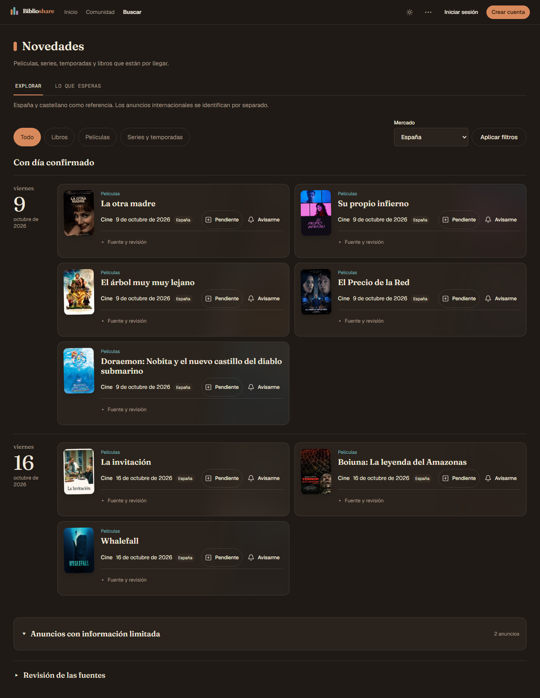

# Novedades e Inicio público — candidato Paper

> Extensión posterior del mismo candidato: calendario lateral por mes/día que conserva
> estas tarjetas e Inicio; evidencia final en [el informe del calendario](2026-10-07-novedades-calendar.md).

> **[Verificado localmente · 2026-10-07]** Rama codex/novedades-paper, base main
> 9e3d45b5. UI implementada y verificada; integración/publicación pendientes en #1450.
> La mejora anterior de datos/enlaces sí está publicada mediante PR #1452.
> No se aplican migraciones ni se escriben datos productivos en esta revisión.

## Resultado y alcance

Inicio público conserva la composición aprobada por el usuario: mensaje de producto,
abanico de hasta tres portadas reales y cuatro tarjetas horizontales semanales en
dos columnas (una en móvil). La columna del Inicio personal mantiene tres obras.
La consulta pública filtra por calidad antes del límite y usa Madrid para la semana
civil; React.cache deduplica sólo dentro del render actual, con cliente sin sesión.

Novedades usa portadas de 72/56 px y títulos serif de 19/18 px, sin altura mínima.
Las modalidades permanecen dentro de la misma obra. La agenda prioriza su próximo día
publicado, conservando los avisos históricos/cancelados, y mantiene por separado fechas
parciales y obras limitadas. Los filtros rápidos preservan selección y mercado.
Pendiente se sitúa en la fila del ID que ejecuta; cada modalidad conserva su Avisarme.
Fuente y revisión son desplegables nativos; la revisión global pasa al pie.

## Evidencia

| Gate | Resultado |
|---|---|
| Unitarios focales de página, tarjeta/acciones, semana y agrupación | 44/44 PASS |
| TypeScript global, sin incremental | PASS |
| ESLint de las superficies modificadas | PASS |
| Next 16.3.8, build local con 88 rutas | PASS |
| Playwright contra next start y Supabase desechable | 19/19 PASS, 44,6 s |
| Batería general de unitarios | 546 archivos / 5414 pruebas PASS, 227,10 s |
| Mapa derivado y whitespace | PASS |
| Revisión independiente final | Sin hallazgos accionables restantes |

Los nueve casos funcionales conservan promoción de anuncios incompletos, selección
personal, dos cuentas, independencia Pendiente/aviso, edición/publicación/cancelación
sin ISBN, revisión obsoleta y deduplicación/retirada de recordatorios. Los diez casos
visuales cruzan 320/390/768/1280/1920 px con claro/oscuro: abanico con tres enlaces,
cuatro tarjetas, dos columnas/una columna según ancho, ausencia de desbordamiento,
controles de 44 px y apertura de fuentes por teclado.

Se hizo además una captura local con diez anuncios públicos actuales obtenidos por
SELECT de producción: nueve URLs de portadas reales, sin descargar los originales ni
cambiar producción. El navegador cargó normalmente las imágenes y verificó que todas
tenían dimensiones naturales. Ocho capturas cubren Inicio/Novedades a 1280 px claro/oscuro,
390 px oscuro y 320 px claro; cuatro aperturas de detalle público sin catálogo PASS.
La muestra conserva títulos, mercados, fechas y ausencias reales.

| Muestra con portadas reales | 1280 px | 390 px | 320 px |
|---|---:|---:|---:|
| Tarjeta semanal | 138 px | 110 px | 115–136 px |
| Novedad sencilla | 175 px | 233 px | 233 px |
| Título largo de Doraemon | 198 px | 233 px | 239 px |

Las alturas corresponden a esta muestra, no a un máximo para obras con múltiples
modalidades, errores o sinopsis desplegada. No se recorta el texto para alcanzar una cifra.

## Fallos iniciales y correcciones

La primera pasada visual ejecutó 19 casos: 17 PASS y dos FAIL a 320 px (claro/oscuro).
La tarjeta sencilla medía 281 px, por el apilamiento de acciones en la columna junto a
la portada. Las fechas y acciones usan ahora todo el ancho móvil; la prueba conserva
el umbral original de 250 px, sin reducir controles táctiles ni ocultar texto.

La revisión independiente reprodujo dos P2: un aviso histórico podía anclar una obra
futura al pasado; Pendiente podía aparecer en una fila cancelada aunque ejecutase
otro lanzamiento publicado. Las dos regresiones fallaron antes de la corrección
(2 FAIL / 26 PASS) y pasaron después. La segunda revisión confirmó ambos arreglos
y revisó también las capturas reales, sin bloqueos adicionales.

## Límites y limpieza

Los E2E usan metadatos sintéticos con portadas SVG controladas para que el layout no
dependa de TMDB. Las capturas anteriores acreditan aspecto con una muestra pública
real; ninguna de las dos pruebas acredita despliegue del candidato.

La salida de next start conserva errores «The destination stream closed early»
durante la navegación/acciones del caso administrativo. Los recorridos y las
comprobaciones de persistencia pasan. La observación sigue en #1263: no se ha aislado
la causa ni se afirma que coincida con las observaciones anteriores. Esto no acredita
ausencia global de errores de servidor/consola/red.

Recibos locales en .scratch/novedades-quality/: paper-review-red.log,
paper-review-green.log, paper-build-fixed.log, paper-e2e.log (FAIL inicial),
paper-e2e-fixed.log (PASS final), paper-unit-full.log, paper-preview-result.json
y paper-preview-server.log. La muestra local se elimina por REST al terminar, junto
con el servidor de captura. Playwright limpia actores/fixtures y restaura el estado
de las fuentes. La instancia biblioshare-local-3e9edd4c se elimina sin backup; se detiene
Docker Desktop porque no había otros contenedores activos. El worktree se conserva
para revisar la PR. Enriquecimiento diario pendiente en #1451; curación editorial en
#1423. Ninguna de esas pendientes se cierra por cambiar la presentación.
