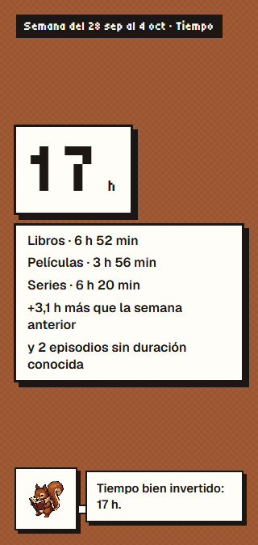
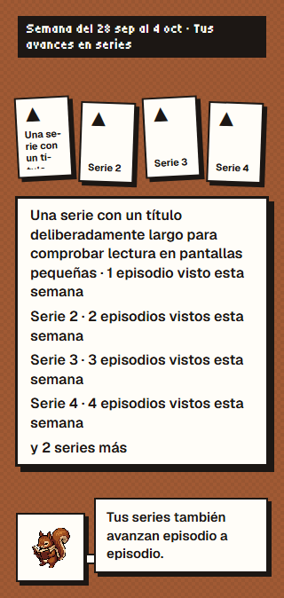

# Claridad del tiempo y avances semanales en series

> [Canónico · verificado en candidato local el 2026-10-07]

Petición: aclarar el reparto de tiempo por categoría y añadir hitos de series semanales, con avances como alternativa autorizada si los hitos son complejos.

Resultado: filas Libros/Películas/Series con horas y minutos exactos; story semanal de título, portada y episodios vistos en la ventana. Hasta cuatro series y resto explícito. No depende de pases abiertos ni de runtime. No afirma temporada completada ni transición a estar al día: seguimiento #1444. No cambia el resumen público ni el esquema. Payloads previos compatibles, sin reescritura automática; para tener avances en una semanal previa hace falta Actualizar si su política lo permite, o la siguiente generación.

Verificación:

- RED: faltaban etiquetas, story y agrupación; tres regresiones fallaron antes del cambio.
- 195 pruebas focales en 19 archivos PASS. Regresión del loader: otra cuenta y episodios fuera de la ventana excluidos; serie sin pase y sin runtime incluida.
- Build/start Next 16.3.8 local PASS, build uHKl29lZiD5vPDHyxCAlo. Primera compilación falló por tipos del traductor de pruebas; corregidos, nueva compilación PASS.
- ESLint de todos los archivos de código y pruebas tocados PASS.
- QA visual: 12 vistas (dos stories × 320/390/1440 px × claro/oscuro); títulos largos, singular/plural y resto de series. Sin desbordamiento horizontal ni cortes de texto, contraste mínimo 17,48:1, cero errores de consola/página. Cuenta desechable y crónicas eliminadas por REST al terminar.
- Revisión independiente: sin hallazgos accionables.

Seis E2E contra el build/start local PASS en 36,3 s, cero reintentos: nueva semanal tranquila en móvil, navegación/publicación, privacidad/seguimiento/bloqueo del PNG publicado, Web Share con activación, PNG 1080×1920 y rechazo sin sesión. CI e integración se siguen en la PR de esta rama.

[Recibo visual](wrap-clarity/report.json).

Límite conservado: el log de start contiene cierres de stream y ECONNRESET al navegar/cerrar contextos (digests 3764368987/2313178152), sin errores en la consola de estas 12 vistas. No se atribuyen a una causa nueva; clasificación pendiente en [#1434](https://github.com/borjar20/Biblioshare/issues/1434).
