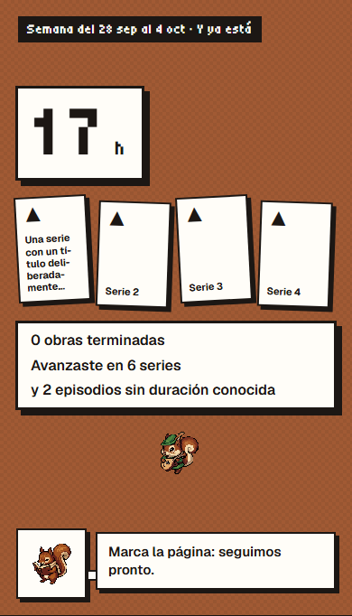
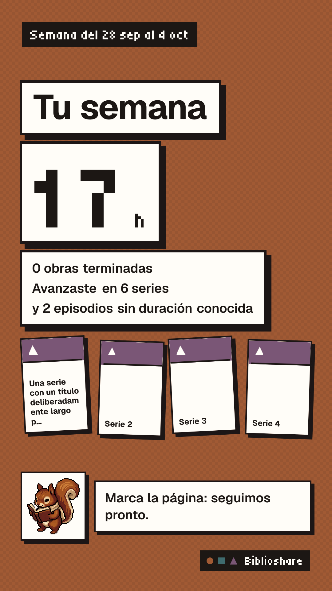
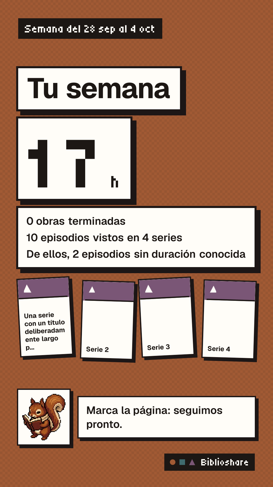

# Series en el resumen final de crónicas (#1446)

> [Canónico · verificado en candidato local el 2026-10-07]

El usuario veía avances en su story pero no en el cierre. shareSummary sólo trasladaba terminadas; además parseShareSummary del feed descartaba el nuevo campo.

La corrección incluye seriesProgress opcional (count, episodes), portadas deduplicadas y tope cuatro. Los nuevos resúmenes cuentan todas las series y episodios de inputs. El cierre y PNG propio adaptan semanales ya generadas desde sus stories sin recalcular. Si una story previa está truncada, episodes es null: el texto sólo afirma el número de series. Los shares existentes permanecen congelados. Antes de una nueva publicación legacy, la adaptación se persiste con CAS por dueño, kind, periodo, generated_at, refreshed_at y published_post_id null. No se modifica el cooldown ni se recalcula actividad. Sin cambios de esquema/RPC/RLS/grants.

Evidencia:

- RED confirmado: cinco regresiones de resumen/cierre/PNG, dos de publicación/CAS y una de feed fallaron antes de sus correcciones.
- 238 unitarios focales en 22 archivos PASS. Incluyen límites/deduplicación de portadas, metadata privada excluida, legacy truncado, publicación concurrente y contrato de getFeed.
- Build Next 16.3.8 final DayQrsh81-fofPPc8HEeq PASS; errores de estrechamiento de tipos en pruebas corregidos antes del build final. Lint de todos los archivos tocados PASS sin avisos nuevos.
- QA de cierre: seis vistas 320/390/1440 px × claro/oscuro, cuatro portadas y legacy de seis series. Cero errores de consola/página, sin desbordamiento horizontal, contraste mínimo 17,48:1. A 320 px necesita scroll vertical y el bocadillo sigue accesible. PNG real 1080×1920 generado y revisado visualmente.
- Revisión independiente: detectó y verificó la corrección del parser del feed; sin otros hallazgos.
- Seis E2E finales PASS en 41,3 s, cero reintentos: el primero recorre story → cierre → snapshot real → tarjeta de Inicio, con el mismo contador. También pasan navegación/publicación, RLS del PNG, Web Share con activación, tamaño PNG y rechazo sin sesión. Publicación seguida en la PR.

[Recibo visual](wrap-closing-series/report.json).

Ajuste final de texto: 59 pruebas de copy/imagen/feed PASS y caso adicional a 390 px PASS con PNG real de 10 episodios en cuatro series. «De ellos, 2 episodios sin duración conocida» los presenta como subconjunto, sin aparentar suma extra; sin cortes, scroll ni errores. La comprobación adicional y su actor quedaron limpios.

La cuenta desechable y sus crónicas de QA se borraron por REST al terminar. Abortos de stream al cerrar contextos se conservan bajo #1434; la QA visual no observó errores de consola.
